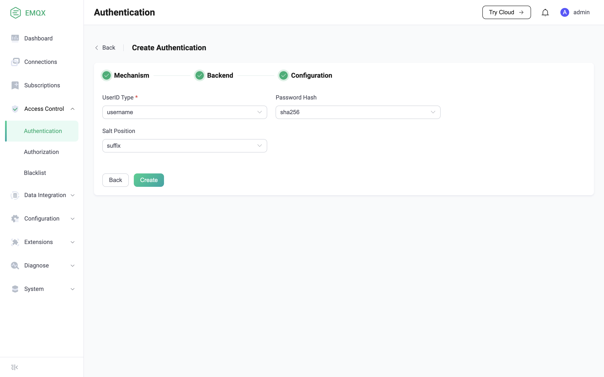

# Password Authentication Using Built-in Database 

EMQX supports the use of the built-in database (Mnesia) as the storage medium for client identity credentials, which does not require users to deploy additional databases, and can be used out of the box. Using the built-in database is also the default recommended solution for EMQX, as it provides the best performance for authentication.

## Authentication principle

Password authentication usually requires the user to provide an identity ID and a corresponding password. The identity ID is used to identify the user's identity, which can be a username, a client identifier, or a certificate common name. The correct combination of identity ID and password is only shared between the user and the authentication system, so the authentication system can verify the authenticity of the user's stated identity by comparing the password provided by the user with the password stored in its own database.

### Avoid storing clear text passwords

In order to complete authentication, some information, such as a password, needs to be shared between the user and the authentication system. But this means that passwords that were supposed to be kept secret are now held by multiple parties, which significantly increases the probability of password leaks, since an attacker could potentially steal the password by attacking either party.

Therefore, we do not recommend storing passwords in clear text in the authentication system's database. Because once the database is dragged, these passwords will be completely exposed to the attacker. We prefer to generate a random salt, and then store this salt in the database along with the hash of the salted password. In this way, even if the attacker steals the data in the database, he can neither use the hash value to login, nor can it be difficult to deduce the real password based on the hash value.

## Create password authentication using built-in database

You can use EMQX Dashboard to create password authentication using the built-in database.

Go to [Dashboard > Access Control > Authentication](http://127.0.0.1:18083/#/authentication), and click **Create**, select **Mechanism** as `Password-Based`, **Backend** as `Built-in Database`, and then enter the specific configuration page:

**UserID Type** is used to specify which field EMQX should use as the client's identity ID for authentication. The optional values are `username` and `clientid`. For the MQTT client, it corresponds to the Username and Client Identifier fields in the CONNECT packet, respectively.

**Password Hash** is used to specify the hash algorithm used when storing passwords, supports md5, sha, bcrypt, pbkdf2, etc. For different hash algorithms, the built-in database password authenticator has different configuration requirements:

1. When configured as a hash algorithm such as md5, sha, etc., the corresponding configuration will be as follows:

   - **Salt Position**, which is used to specify the combination method of salt and password: adding salt at the end of the password or adding salt at the head of the password. This option may need to be changed only when users need to migrate credentials from external storage to EMQX built-in database.
2. When configured as bcrypt algorithm, the corresponding configuration will be as follows:

   - **Salt Rounds**，also known as the cost factor, it is used to specify the number of computations required for hashing (2^Salt Rounds). Every time you add one, the time required for hashing will double. The longer it takes, the higher the difficulty of brute force cracking, but the longer it takes to verify the user accordingly, so you need to do it according to your actual situation. trade-offs.
3. When configured as pkbdf2 algorithm, the corresponding configuration will be as follows:

   - **Pseudorandom Function**, used to specify the hash function used to generate the key.
   - **Iteration Count**, used to specify the number of hashes.
   - **Derived Key Length**, specify the desired key length. If specified, it means that the final key length is determined by **Pseudorandom Function**.

## Migrating from external storage to EMQX built-in database

If you have stored credentials in other databases but want to migrate to EMQX's built-in database, we provide the function of bulk importing credentials from csv or json format files. To learn more, read [Import User](./user_management.md#importing-users).
