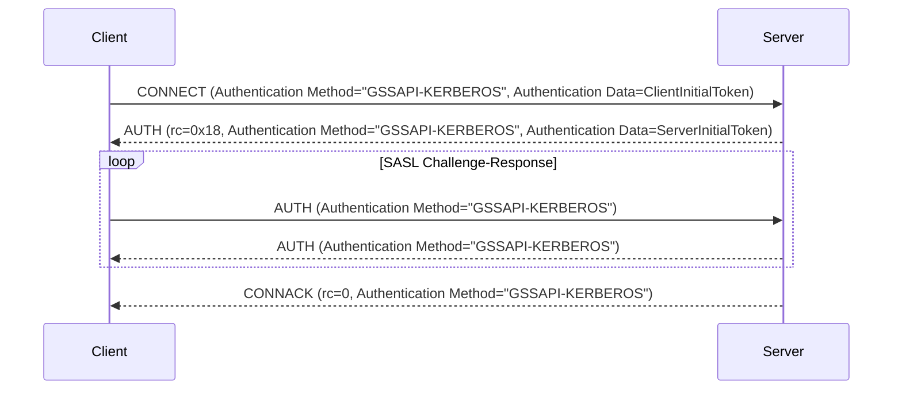

# MQTT 5.0 強化認証 - Kerberos

Kerberosは、「チケット」を使用してノード同士が安全でないネットワーク上で互いの身元を安全に証明できるネットワーク認証プロトコルです。秘密鍵暗号方式を用いてクライアント/サーバーアプリケーションに対して強力な認証を提供するよう設計されています。

EMQXはRFC 4422のSASL/GSSAPIメカニズムに従い、Kerberos認証を統合しています。Generic Security Services Application Program Interface（GSSAPI）はKerberosプロトコルの詳細を抽象化した標準化されたAPIを提供し、MQTTクライアントとサーバー間の安全な通信を実現しつつ、アプリケーションがKerberos認証プロセスの詳細を管理する必要をなくします。

本ページでは、EMQXでのKerberos認証器の設定方法を紹介します。

::: tip
MQTTの強化認証はプロトコルバージョン5以降でのみサポートされています。

メカニズム交渉がないため、クライアントは認証メカニズムとして明示的に `GSSAPI-KERBEROS` を指定する必要があります。

:::

## 設定の前提条件

EMQXでKerberos認証を設定する前に、環境が要件を満たしていることを確認してください。必要なライブラリのインストールやKerberosシステムの適切なセットアップが含まれます。

### Kerberosライブラリのインストール

Kerberos認証器を設定する前に、EMQXノードにMIT Kerberosライブラリをインストールする必要があります。

- Debian/Ubuntuでは、必要なパッケージは `libsasl2-2` と `libsasl2-modules-gssapi-mit` です。

- Redhatでは、必要なパッケージは `krb5-libs` と `cyrus-sasl-gssapi` です。

### Kerberosライブラリの設定

Kerberosライブラリの設定ファイルは `/etc/krb5.conf` です。このファイルにはKerberosライブラリの設定情報（レルムやKey Distribution Center（KDC）など）が含まれています。Kerberosライブラリはこのファイルを参照してKDCやレルムを特定します。

以下は `krb5.conf` ファイルの例です：

```ini
[libdefaults]
    default_realm = EXAMPLE.COM
    default_keytab_name = /var/lib/emqx/emqx.keytab

[realms]
   EXAMPLE.COM = {
      kdc = kdc.example.com
      admin_server = kdc.example.com
   }
```

### Keytabファイル

Kerberos認証器を設定するには、稼働中のKDC（Key Distribution Center）サーバーと、サーバーおよびクライアントの両方に有効なkeytabファイルが必要です。keytabファイルはサーバーのプリンシパルに関連付けられた暗号鍵を格納し、サーバーが手動でパスワードを入力することなくKerberos KDCに認証できるようにします。

EMQXはデフォルトの場所にあるkeytabファイルのみをサポートしています。環境変数 `KRB5_KTNAME` を使用するか、`/etc/krb5.conf` の `default_keytab_name` を設定してシステムのデフォルト値を指定できます。

::: tip 注意

keytabファイルはEMQXノード上に配置し、EMQXサービスを実行するユーザーが読み取り権限を持っている必要があります。

:::

## ダッシュボードからの設定

1. EMQXダッシュボードの左メニューから **アクセス制御** -> **認証** に移動し、**認証**ページを開きます。

2. 右上の **作成** をクリックし、**メカニズム**に **GSSAPI** を、**バックエンド**に **Kerberos** を選択します。

3. **次へ** をクリックして **設定** ステップに進みます。

4. 以下の項目を設定します：

   - **Principal**：サーバーのKerberosプリンシパルを設定します。これはKerberos認証システム内でサーバーの身元を定義します。例：`mqtt/cluster1.example.com@EXAMPLE.COM`。

     注意：使用するレルムはEMQXノードの `/etc/krb5.conf` に設定されている必要があります。
   
   - **Precondition**：このKerberos認証器をクライアント接続に適用するかどうかを制御するための[Variform式](../../configuration/configuration.md#variform-expressions)です。この式はクライアントの属性（`username`、`clientid`、`listener`など）に対して評価され、結果が文字列 `"true"` の場合のみ認証器が呼び出されます。それ以外の場合はスキップされます。詳細は[認証の前提条件](./authn.md#authentication-preconditions)を参照してください。

5. **作成** をクリックして設定を完了します。

## 設定項目による設定

設定例：

```hcl
  {
    mechanism = gssapi
    backend = kerberos
    principal = "mqtt/cluster1.example.com@EXAMPLE.COM"
  }
```

`principal` はサーバープリンシパルであり、システムのデフォルトkeytabファイルに存在している必要があります。

## 認証フロー

以下の図は認証プロセスの流れを示しています。



## よくある問題とトラブルシューティング

EMQXでKerberos認証を設定する際によくある問題の解決方法を以下に示します。

### `Keytab contains no suitable keys for mqtt/cluster1.example.com@EXAMPLE.COM`

**原因:** keytabファイルにプリンシパルに必要な鍵が含まれていません。

**対処法:**

- デフォルトのkeytabファイルが正しく設定されていることを確認してください。

- `klist -k` コマンドでkeytabファイルを確認します。例：`klist -kte /etc/krb5.keytab`。

  現状、EMQXはデフォルトの場所にあるkeytabファイルのみサポートしています。このエラーが発生した場合、エラーメッセージに現在のデフォルトkeytabファイルのパスが表示されます。

- 環境変数 `KRB5_KTNAME` を使用するか、`/etc/krb5.conf` の `default_keytab_name` を設定してシステムのデフォルトkeytabファイルパスを指定してみてください。

### `invalid_server_principal_string`

**原因:** Kerberosプリンシパル文字列の形式が誤っています。

**対処法:** Kerberosプリンシパル文字列が正しい形式であることを確認してください：`service/SERVER-FQDN@REALM.NAME`。

### `Cannot find KDC for realm "EXAMPLE.COM"`

**原因:** 指定されたKerberosレルム（`EXAMPLE.COM`）が `/etc/krb5.conf` の `realms` セクションに記載されていません。

**対処法:** `/etc/krb5.conf` の `realms` セクションに該当レルムの情報を追加してください。

### `Cannot contact any KDC for realm "EXAMPLE.COM"`

**原因:** 指定されたレルムのKDCサービスが稼働していないか、到達できません。

**対処法:** KDCサービスが稼働中でアクセス可能であることを確認してください。ネットワーク接続をチェックし、KDCサーバーの設定が正しいことを確認してください。

### `Resource temporarily unavailable`

**原因:** `/etc/krb5.conf` に設定されたKDCサービスが稼働していないか、到達できません。

**対処法:** KDCサービスが正常に稼働しており、EMQXノードから通信可能であることを確認してください。

### `Preauthentication failed`

**原因:** サーバーチケットが無効です。keytabファイルが古い可能性があります。

**対処法:** keytabファイルが最新で正しい資格情報を含んでいることを確認してください。
