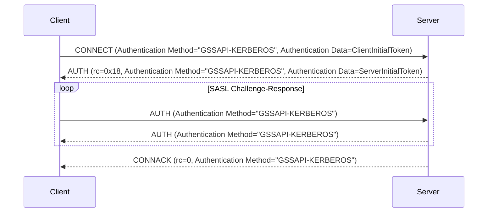

# MQTT 5.0 強化認証 - Kerberos

Kerberosは、「チケット」を使用してノード同士が非安全なネットワーク上で安全に自身の身元を証明できるネットワーク認証プロトコルです。秘密鍵暗号技術を用いてクライアント／サーバーアプリケーションに対して強力な認証を提供することを目的としています。

EMQXはRFC 4422のSASL/GSSAPIメカニズムに従ってKerberos認証を統合しています。Generic Security Services Application Program Interface（GSSAPI）はKerberosプロトコルの詳細を抽象化した標準化されたAPIを提供し、MQTTクライアントとサーバー間の安全な通信を可能にします。これにより、アプリケーションがKerberos認証の具体的な処理を管理する必要がなくなります。

本ページでは、EMQXでKerberos認証器を設定する方法を紹介します。

::: tip
MQTTにおける強化認証はプロトコルバージョン5以降でのみサポートされています。

メカニズム交渉がないため、クライアントは認証メカニズムとして明示的に `GSSAPI-KERBEROS` を指定する必要があります。

:::

## 設定の前提条件

EMQXでKerberos認証を設定する前に、必須ライブラリのインストールやKerberosシステムの適切なセットアップなど、環境が要件を満たしていることを確認してください。

### Kerberosライブラリのインストール

Kerberos認証器を設定する前に、EMQXノードにMIT Kerberosライブラリをインストールする必要があります。

- Debian/Ubuntuでは、必要なパッケージは `libsasl2-2` と `libsasl2-modules-gssapi-mit` です。

- Redhatでは、必要なパッケージは `krb5-libs` と `cyrus-sasl-gssapi` です。

### Kerberosライブラリの設定

Kerberosライブラリの設定ファイルは `/etc/krb5.conf` です。このファイルにはKerberosライブラリの設定情報（レルムやKey Distribution Center（KDC）など）が含まれています。Kerberosライブラリはこのファイルを参照してKDCやレルムの場所を特定します。

以下は `krb5.conf` ファイルの例です。

```ini
[libdefaults]
    default_realm = EXAMPLE.COM
    default_keytab_name = /var/lib/emqx/emqx.keytab

[realms]
   EXAMPLE.COM = {
      kdc = kdc.example.com
      admin_server = kdc.example.com
   }
```

### キータブファイル

Kerberos認証器を設定するには、稼働中のKDC（Key Distribution Center）サーバーと、サーバーおよびクライアント用の有効なキータブファイルが必要です。キータブファイルはサーバープリンシパルに関連付けられた暗号鍵を保存し、サーバーが手動でパスワードを入力せずにKerberos KDCに認証できるようにします。

EMQXはデフォルトの場所にあるキータブファイルのみサポートしています。システムのデフォルト値は環境変数 `KRB5_KTNAME` を使うか、`/etc/krb5.conf` の `default_keytab_name` を設定して指定できます。

::: tip 注意

キータブファイルはEMQXノード上に配置し、EMQXサービスを実行するユーザーが読み取り権限を持っている必要があります。

:::

## ダッシュボードからの設定

1. EMQXダッシュボードの左メニューから **アクセス制御** -> **認証** に移動し、**認証** ページを開きます。

2. 右上の **作成** をクリックし、**メカニズム** に **GSSAPI**、**バックエンド** に **Kerberos** を選択します。

3. **次へ** をクリックして **設定** ステップに進みます。

4. 以下の項目を設定します。

   - **Principal**：Kerberos認証システム内でサーバーの身元を定義するサーバープリンシパルを設定します。例：`mqtt/cluster1.example.com@EXAMPLE.COM`

     ※使用するレルムはEMQXノードの `/etc/krb5.conf` に設定されている必要があります。
   
   - **Precondition**：クライアント接続に対してこのKerberos認証器を適用するかどうかを制御するための[Variform式](../../configuration/configuration.md#variform-expressions)です。式はクライアントの属性（`username`、`clientid`、`listener`など）に対して評価されます。式の評価結果が文字列 `"true"` の場合のみ認証器が呼び出され、それ以外はスキップされます。詳細は[認証の前提条件](./authn.md#authentication-preconditions)をご覧ください。

5. **作成** をクリックして設定を完了します。

## 設定項目による設定

設定例：

```hcl
  {
    mechanism = gssapi
    backend = kerberos
    principal = "mqtt/cluster1.example.com@EXAMPLE.COM"
  }
```

`principal` はサーバープリンシパルであり、システムのデフォルトキータブファイルに存在している必要があります。

## 認証フロー

以下の図は認証プロセスの流れを示しています。



## よくある問題とトラブルシューティング

EMQXでKerberos認証を設定する際によく発生する問題とその解決方法を以下に示します。

### `Keytab contains no suitable keys for mqtt/cluster1.example.com@EXAMPLE.COM`

**原因:** キータブファイルに該当プリンシパルの必要な鍵が含まれていません。

**対処方法:**

- デフォルトのキータブファイルが正しく設定されているか確認してください。

- `klist -k` コマンドでキータブファイルを確認します。例：`klist -kte /etc/krb5.keytab`

  EMQXは現在デフォルトの場所にあるキータブファイルのみサポートしています。このエラーが発生した場合、エラーメッセージに現在のデフォルトキータブファイルのパスが表示されます。

- 環境変数 `KRB5_KTNAME` を使うか、`/etc/krb5.conf` の `default_keytab_name` を設定してシステムのデフォルトキータブファイルパスを指定してください。

### `invalid_server_principal_string`

**原因:** Kerberosプリンシパル文字列の形式が誤っています。

**対処方法:** Kerberosプリンシパル文字列が正しい形式 `service/SERVER-FQDN@REALM.NAME` になっているか確認してください。

### `Cannot find KDC for realm "EXAMPLE.COM"`

**原因:** 指定されたKerberosレルム（`EXAMPLE.COM`）が `/etc/krb5.conf` の `realms` セクションに記載されていません。

**対処方法:** `/etc/krb5.conf` の `realms` セクションに該当レルムの情報を追加してください。

### `Cannot contact any KDC for realm "EXAMPLE.COM"`

**原因:** 指定されたレルムのKDCサービスが稼働していないか、到達できません。

**対処方法:** KDCサービスが稼働中でアクセス可能か確認してください。ネットワーク接続をチェックし、KDCサーバーの設定が正しいことを確認してください。

### `Resource temporarily unavailable`

**原因:** `/etc/krb5.conf` に設定されたKDCサービスが稼働していないか、到達できません。

**対処方法:** KDCサービスが正常に稼働しており、EMQXノードから通信可能であることを確認してください。

### `Preauthentication failed`

**原因:** サーバーチケットが無効である可能性があります。古いキータブファイルを使用している場合などが考えられます。

**対処方法:** キータブファイルが最新で正しい認証情報を含んでいるか確認してください。
