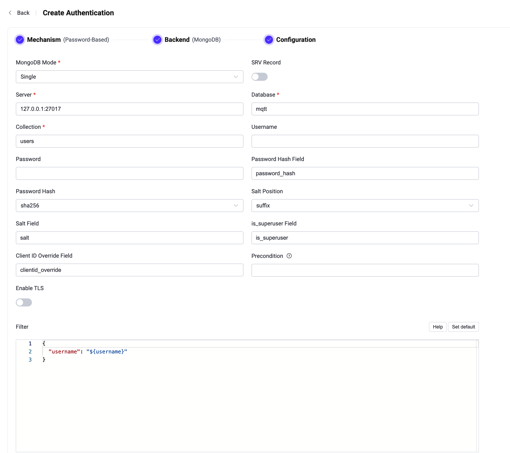

# MongoDBとの連携

EMQXはパスワード認証のためにMongoDBとの連携をサポートしています。EMQXのMongoDB認証機能は、現在、Single、[レプリカセット](https://www.mongodb.com/docs/manual/reference/replica-configuration/)、および[シャーディング](https://www.mongodb.com/docs/manual/sharding/)の3つの異なるモードで動作するMongoDBへの接続をサポートしています。本ページでは、サポートされるデータスキーマの詳細と、EMQXダッシュボードおよび設定ファイルでの設定方法について説明します。

::: tip

[EMQX認証の基本概念](../authn/authn.md)の知識があると理解が深まります。

:::

## データスキーマとクエリ文

EMQXのMongoDB認証機能は、認証データをMongoDBドキュメントとして保存することをサポートしています。ユーザーはクエリ文のテンプレートを提供し、以下のフィールドが含まれていることを確認する必要があります。

- `password_hash`：必須。データベースに保存されるパスワード（プレーンテキストまたはハッシュ化済み）。このフィールドは名前の変更が可能です。
- `salt`：任意。`salt = ""` またはこのフィールドを削除すると、ソルト値が追加されないことを示します。このフィールドも名前の変更が可能です。
- `is_superuser`：任意。現在のクライアントがスーパーユーザーかどうかを示すフラグ。デフォルトは `false`。このフィールドも名前の変更が可能です。

例えば、ユーザー名が `user123`、パスワードが `secret`、ソルトが接尾辞として `salt_foo123`、パスワードハッシュが `sha256` のスーパーユーザー（`is_superuser`: `true`）のドキュメントを追加する場合、クエリ文は以下のようになります。

```
> db.mqtt_user.insertOne(
  {
      "username": "emqx_u",
      "salt": "slat_foo123",
      "is_superuser": true,
      "password_hash": "44edc2d57cde8d79c98145003e105b90a14f1460b79186ea9cfe83942fc5abb5"
  }
);
{
  "acknowledged" : true,
  "insertedId" : ObjectId("631989e20a33e26b05b15abe")
}
```

:::tip

システム内のユーザー数が多い場合は、クエリの応答時間を短縮し、EMQXの負荷を軽減するために、事前にテーブルの最適化およびインデックス作成を行ってください。

:::

このMongoDBデータスキーマに対応するダッシュボードの設定パラメータは以下の通りです。

- **Password Hash**：`sha256`
- **Salt Position**：`suffix`
- **Collection**：`mqtt_user`
- **Filter**：`{ username = "${username}" }`
- **Password Hash field**：`password_hash`
- **Salt Field**：`salt`
- **is_superuser Field**：`is_superuser`

## ダッシュボードでの設定

EMQXダッシュボードを使ってMongoDBをパスワード認証に利用する設定が可能です。

1. EMQXダッシュボードの左側ナビゲーションメニューから **Access Control** -> **Authentication** をクリックします。
2. **Authentication** ページの右上にある **Create** をクリックします。
3. **Mechanism** に **Password-Based** を選択し、**Backend** に **MongoDB** を選択すると、以下のように **Configuration** タブが表示されます。



4. 以下の手順に従って認証バックエンドの設定を行います。

   - MongoDBへの接続情報を入力します：
     - **MongoDB Mode**：MongoDBの展開形態を選択します。`Single`、`Replica Set`、`Sharding` のいずれかです。
     - **Server**：EMQXが接続するMongoDBサーバーのアドレスを指定します。**MongoDB Mode** が `Replica Set` または `Sharding` の場合は、接続するすべてのMongoDBサーバーをカンマ（`,`）区切りで入力する必要があります。
     - **Replica Set Name**：レプリカセット名を指定します。文字列型で、**MongoDB Mode** が `Replica Set` の場合のみ必要です。
     - **Database**：MongoDBのデータベース名。文字列型です。
     - **Collection**：認証ルールが格納されているMongoDBコレクション名。文字列型です。
     - **Username**：MongoDBのユーザー名を指定します。
     - **Password**：MongoDBのユーザーパスワードを指定します。
     - **Read Mode**（任意）：**MongoDB Mode** が `Replica Set` の場合のみ必要です。デフォルトは `master`。選択肢は `master`、`slave_ok` です。
       - **master**：シーケンス内の各クエリは新鮮なデータ（マスター/プライマリサーバーから）を読み取る必要があります。接続先がマスターでない場合、最初の読み取りが失敗し、その後の操作は中止されます。
       - **slave_ok**：セカンダリ/スレーブサーバーからの古いデータまたはマスターからの新鮮なデータの読み取りを許可します。
     - **Write Mode**（任意）：**MongoDB Mode** が `Replica Set` の場合のみ必要です。選択肢は `unsafe`、`safe`。デフォルトは `safe`。

   - 認証に関する設定を行います：
     - **Password Hash Field**：パスワードのフィールド名を指定します。
     - **Password Hash**：プレーンテキストのパスワードに適用され、データベースに保存される前のハッシュアルゴリズムを選択します。利用可能なオプションは `plain`、`md5`、`sha`、`sha256`、`sha512`、`bcrypt`、`pbkdf2` です。選択したアルゴリズムに応じて追加設定があります。
       - `md5`、`sha`、`sha256`、`sha512` の場合：
         - **Salt Position**：ソルト（ランダムデータ）をパスワードにどのように混ぜるかを指定します。`suffix`、`prefix`、`disable` のいずれかです。外部ストレージからユーザー資格情報をEMQX組み込みデータベースに移行する場合を除き、デフォルト値のままで問題ありません。
         - ハッシュ結果は16進数文字列で表現され、大文字小文字を区別せずに保存された資格情報と比較されます。
       - `plain` の場合：
         - **Salt Position** は `disable` に設定してください。
       - `bcrypt` の場合：
         - **Salt Rounds**：ハッシュ関数が適用される回数を定義します。2のべき乗で表される「コストファクター」です。デフォルトは `10`、許容範囲は `5` から `10` です。セキュリティ強化のためには高い値が推奨されます。注意：コストファクターを1増やすと認証に必要な時間が倍増します。
       - `pbkdf2` の場合：
         - **Pseudorandom Function**：キー生成に使用されるハッシュ関数を選択します（例：`sha256`）。
         - **Iteration Count**：ハッシュ関数の実行回数を設定します。デフォルトは `4096`。
         - **Derived Key Length**（任意）：生成されるキーのバイト長を指定します。空欄の場合は選択した疑似乱数関数により決定されます。
         - ハッシュ結果は16進数文字列で表現され、大文字小文字を区別せずに保存された資格情報と比較されます。
     - **Salt Field**：MongoDB内のソルトフィールドを指定します。
     - **is_superuser Field**：ユーザーがスーパーユーザーかどうかを判定するフィールドを指定します。
     - **Client ID Override Field**：MongoDB認証結果内のフィールド名を指定し、接続時にクライアントが提供したClient IDを上書き可能にします。これにより認証データに基づいたユニークなClient IDを割り当て、多テナント環境などでのセッション競合を防止できます。
     - **Precondition**：[Variform式](../../configuration/configuration.md#variform-expressions)で、このMongoDB認証機能をクライアント接続に適用するかどうかを制御します。式はクライアントの属性（`username`、`clientid`、`listener`など）に対して評価され、結果が文字列 `"true"` の場合のみ認証機能が呼び出されます。そうでない場合はスキップされます。詳細は[Authenticator Preconditions](./authn.md#authenticator-preconditions)を参照してください。
     - **Enable TLS**：TLSを有効にする場合はトグルスイッチをオンにします。TLS有効化の詳細は[Network and TLS](../../network/overview.md)を参照してください。
     - **Filter**：MongoDBの認証情報検索に使われるセレクターとして解釈されるマップです。[プレースホルダー](./authn.md#authentication-placeholders)が利用可能です。
     - **Advanced Settings**：同時接続数や接続タイムアウトまでの待機時間を設定します。
       - **Connection Pool size**（任意）：EMQXノードからMongoDBサーバーへの同時接続数を指定します。デフォルトは `8`。
       - **Connect Timeout**（任意）：接続がタイムアウトと見なされるまでの待機時間を定義します。単位はミリ秒、秒、分、時間が利用可能です。デフォルトは `20` 秒。

5. 設定が完了したら、**Create** をクリックしてください。

## 設定ファイルでの設定

EMQXのMongoDB認証機能は設定ファイルでも設定可能です。<!--詳細な操作手順は [authn-mongodb:standalone](../../configuration/configuration-manual.html#authn-mongodb:standalone)、[authn-mongodb:sharded-cluster](../../configuration/configuration-manual.html#authn-mongodb:sharded-cluster)、[authn-mongodb:replica-set](../../configuration/configuration-manual.html#authn-mongodb:replica-set) を参照してください。-->

以下に参考となるコード例を示します。

:::: tabs type:card

::: tab Single mode

```bash
{
  mechanism = password_based
  backend = mongodb

  password_hash_algorithm {
    name = sha256
    salt_position = suffix
  }

  collection = "mqtt_user"
  filter { username = "${username}" }

  mongo_type = single
  server = "127.0.0.1:27017"

  database = "mqtt"
  username = "emqx"
  password = "secret"
}
```

:::

::: tab Replica set

```bash
{
  mechanism = password_based
  backend = mongodb

  password_hash_algorithm {
    name = sha256
    salt_position = suffix
  }

  collection = "mqtt_user"
  filter { username = "${username}" }

  mongo_type = rs
  servers = "10.123.12.10:27017,10.123.12.11:27017,10.123.12.12:27017"
  replica_set_name = "rs0"

  database = "mqtt"
  username = "emqx"
  password = "secret"
}
```

:::

::: tab Sharding

```bash
{
  mechanism = password_based
  backend = mongodb
  enable = true

  password_hash_algorithm {
    name = sha256
    salt_position = suffix
  }

  collection = "mqtt_user"
  filter { username = "${username}" }

  mongo_type = sharded
  servers = "10.123.12.10:27017,10.123.12.11:27017,10.123.12.12:27017"

  database = "mqtt"
  username = "emqx"
  password = "secret"
}
```

:::

::::
