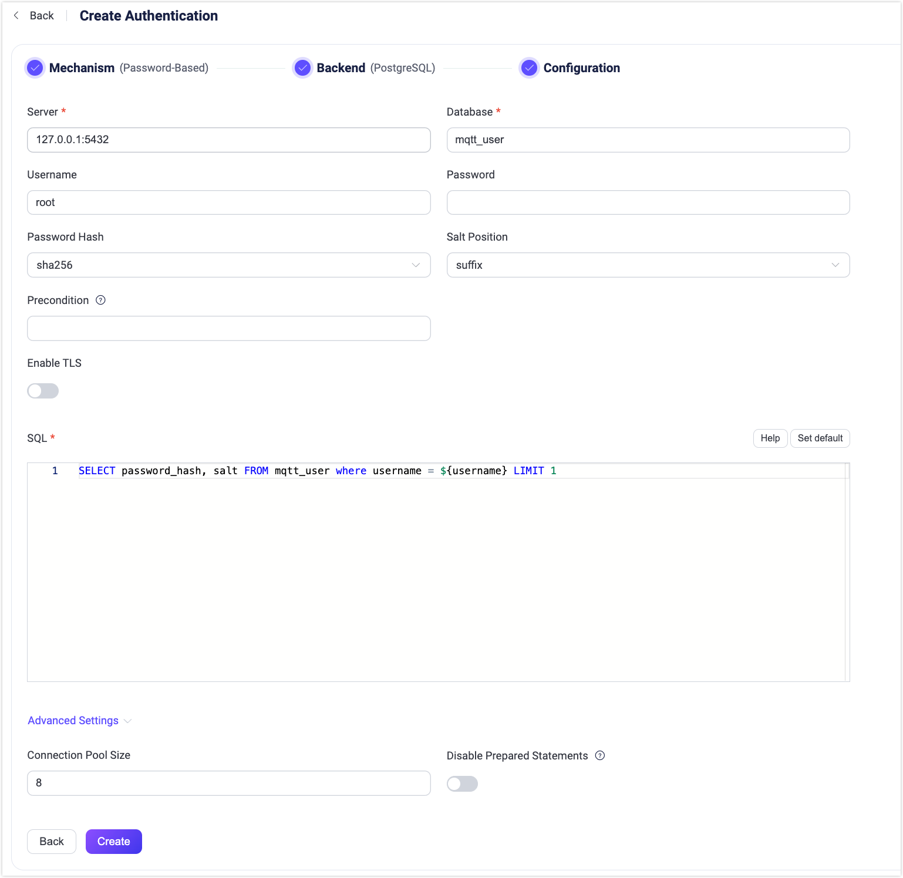

# PostgreSQLとの連携

EMQXは、パスワード認証のためにPostgreSQLとの連携をサポートしています。

::: tip

<<<<<<< HEAD
[EMQX認証の基本概念](../authn/authn.md)についての知識
=======
[基本的なEMQX認証の概念](../authn/authn.md)についての知識
>>>>>>> origin/release-5.10

:::

## データスキーマとクエリ文

<<<<<<< HEAD
EMQXのPostgreSQL認証機能はほぼあらゆるストレージスキーマに対応しています。ビジネスニーズに応じて、認証情報の保存方法やアクセス方法を自由に決めることができます。例えば、1つまたは複数のテーブルやビューを使用することが可能です。

ユーザーはクエリ文のテンプレートを提供し、以下のフィールドが含まれていることを保証する必要があります。

- `password_hash`：必須。データベースに保存されているパスワード（プレーンテキストまたはハッシュ化されたもの）。
- `salt`：任意。`salt = ""` またはこのフィールドを削除するとソルト値が追加されないことを示します。
- `is_superuser`：任意。現在のクライアントがスーパーユーザーかどうかのフラグ。デフォルトは `false`。
=======
EMQXのPostgreSQL認証機能は、ほぼあらゆるストレージスキーマに対応しています。認証情報の保存方法やアクセス方法は、ビジネスニーズに応じて、単一または複数のテーブル、ビューなどを利用して自由に設計できます。

ユーザーはクエリ文のテンプレートを提供し、以下のフィールドが含まれていることを確認する必要があります。

- `password_hash`：必須。データベースに保存されているパスワード（プレーンテキストまたはハッシュ化済み）  
- `salt`：任意。`salt = ""` またはこのフィールドを削除すると、ソルト値が追加されないことを示します  
- `is_superuser`：任意。現在のクライアントがスーパーユーザーかどうかを示すフラグ。デフォルトは `false`
>>>>>>> origin/release-5.10

認証情報を保存するためのテーブル構造の例：

```sql
CREATE TABLE mqtt_user (
    id serial PRIMARY KEY,
    username text NOT NULL UNIQUE,
    password_hash  text NOT NULL,
    salt text NOT NULL,
    is_superuser boolean DEFAULT false,
    created timestamp with time zone DEFAULT NOW()
);
```

::: tip
<<<<<<< HEAD
上記の例では、クエリに役立つ暗黙の`UNIQUE`インデックス（username）が作成されています。
システム内のユーザー数が多い場合は、クエリ応答時間を短縮しEMQXの負荷を軽減するために、事前にテーブルの最適化とインデックス作成を行ってください。
=======
上記の例では、`username`に暗黙の`UNIQUE`インデックスが作成されており、クエリの高速化に役立ちます。  
システム内のユーザー数が多い場合は、クエリ応答時間を短縮しEMQXの負荷を軽減するために、事前にテーブルの最適化とインデックス付けを行ってください。
>>>>>>> origin/release-5.10
:::

このテーブルでは、MQTTユーザーは`username`で識別されます。

<<<<<<< HEAD
例えば、スーパーユーザー（`is_superuser`: `true`）として、ユーザー名が`user123`、パスワードが`secret`、ソルトが`salt`のドキュメントを追加したい場合、クエリ文は以下のようになります。
=======
例えば、スーパーユーザー（`is_superuser`: `true`）でユーザー名が`user123`、パスワードが`secret`、ソルトが`salt`のドキュメントを追加したい場合、クエリ文は以下のようになります。
>>>>>>> origin/release-5.10

```bash
INSERT INTO mqtt_user(username, password_hash, salt, is_superuser) VALUES ('user123', 'f84fa2149dbb62ed4e0cf1f550d2949b33a6513d3a7707e08502511c79ccb0ee', 'salt', true);
INSERT 0 1
```

対応する設定パラメータは以下の通りです。

- password_hash_algorithm: `sha256`
- salt_position: `suffix`

<<<<<<< HEAD
SQL:
=======
SQL例:
>>>>>>> origin/release-5.10

```sql
query = "SELECT password_hash, salt, is_superuser FROM mqtt_user WHERE username = ${username} LIMIT 1"
```

## ダッシュボードでの設定

EMQXダッシュボードを使って、PostgreSQLをパスワード認証に利用する設定が可能です。

1. EMQXダッシュボードの左側ナビゲーションメニューから **アクセス制御** -> **認証** をクリックします。
2. **認証** ページの右上にある **作成** をクリックします。
<<<<<<< HEAD
3. **メカニズム**に **パスワードベース**、**バックエンド**に **PostgreSQL** を選択し、**設定** タブに進みます。以下のように表示されます。



4. 以下の手順で認証バックエンドを設定します。
   - PostgreSQLへの接続情報を入力します。

     - **サーバー**：EMQXが接続するサーバーアドレス（`host:port`）を指定します。
     - **データベース**：PostgreSQLのデータベース名。
     - **ユーザー名**：ユーザー名を指定します。
     - **パスワード**：ユーザーパスワードを指定します。
   - 認証に関連する設定を行います。
     - **パスワードハッシュ**：プレーンテキストのパスワードに適用し、結果をデータベースに保存する際のハッシュアルゴリズムを選択します。利用可能なオプションは `plain`、`md5`、`sha`、`sha256`、`sha512`、`bcrypt`、`pbkdf2` です。選択したアルゴリズムに応じて追加設定があります。
       - `md5`、`sha`、`sha256`、`sha512` の場合：
         - **ソルト位置**：ソルト（ランダムデータ）をパスワードにどのように混ぜるかを指定します。`suffix`、`prefix`、`disable` のいずれかです。外部ストレージからEMQX内蔵データベースにユーザー認証情報を移行しない限り、デフォルト値のままで問題ありません。
         - ハッシュ結果は16進数文字列で表現され、大文字小文字を区別せずに保存された認証情報と比較されます。
       - `plain` の場合：
         - **ソルト位置**は `disable` に設定してください。
       - `bcrypt` の場合：
         - **ソルトラウンド**：ハッシュ関数を適用する回数を定義します。値は _2のソルトラウンド乗_ で表され、「コストファクター」とも呼ばれます。デフォルトは `10`、許容範囲は `5` から `10` です。セキュリティ強化のために高い値が推奨されます。注：コストファクターを1増やすと認証に必要な時間が2倍になります。
       - `pbkdf2` の場合：
         - **疑似乱数関数**：キー生成に使うハッシュ関数を選択します（例：`sha256`）。
         - **イテレーション回数**：ハッシュ関数を実行する回数を設定します。デフォルトは `4096` です。
         - **派生キー長**（任意）：生成されるキーのバイト長を指定します。空欄の場合は選択した疑似乱数関数のデフォルト長になります。
         - ハッシュ結果は16進数文字列で表現され、大文字小文字を区別せずに保存された認証情報と比較されます。
   - **前提条件**：[Variform式](../../configuration/configuration.md#variform-expressions)で記述し、このPostgreSQL認証機能をクライアント接続に適用するかどうかを制御します。式はクライアントの属性（`username`、`clientid`、`listener`など）に対して評価され、結果が文字列 `"true"` の場合にのみ認証機能が呼び出されます。詳細は[認証機能の前提条件](./authn.md#authenticator-preconditions)を参照してください。
   - **TLSを有効にする**：TLSを有効にする場合はトグルスイッチをオンにします。TLSの有効化については[ネットワークとTLS](../../network/overview.md)を参照してください。
   - **詳細設定**：
     - **コネクションプールサイズ**（任意）：EMQXノードからPostgreSQLサーバーへの同時接続数を指定します。デフォルトは `8` です。
     - **プリペアドステートメントを無効化**（任意）：トランザクションモードのPGBouncerやSupabaseなど、プリペアドステートメントをサポートしないPostgreSQLサービスを利用している場合に有効にします。このオプションはEMQX v5.7.1で導入されました。
   - **SQL**：データスキーマに合わせてクエリ文を入力します。詳細は[SQLデータスキーマとクエリ文](#データスキーマとクエリ文)を参照してください。

設定が完了したら、**作成** をクリックします。
=======
3. **メカニズム** に **パスワードベース** を選択し、**バックエンド** に **PostgreSQL** を選択すると、以下のように **設定** タブに移動します。


4. 認証バックエンドの設定を以下の手順に従って行います。  
   - PostgreSQLへの接続情報を入力します。

     - **Server**：EMQXが接続するサーバーアドレス（`host:port`）を指定します。  
     - **Database**：PostgreSQLのデータベース名。  
     - **Username**：ユーザー名を指定します。  
     - **Password**：ユーザーパスワードを指定します。  
   - 認証に関する設定を行います。  
     - **Password Hash**：プレーンテキストのパスワードに対して適用されるハッシュアルゴリズムを選択します。データベースに保存される結果に適用されます。選択肢は `plain`、`md5`、`sha`、`sha256`、`sha512`、`bcrypt`、`pbkdf2` です。選択したアルゴリズムに応じて追加設定が必要です。  
       - `md5`、`sha`、`sha256`、`sha512` の場合：  
         - **Salt Position**：ソルト（ランダムデータ）をパスワードにどのように混ぜるかを指定します。`suffix`、`prefix`、`disable` のいずれかです。外部ストレージからEMQX組み込みデータベースにユーザー認証情報を移行する場合を除き、デフォルト値のままで問題ありません。  
         - ハッシュ結果は16進数文字列で表現され、大文字・小文字を区別せずに保存された認証情報と比較されます。  
       - `plain` の場合：  
         - **Salt Position** は `disable` に設定してください。  
       - `bcrypt` の場合：  
         - **Salt Rounds**：ハッシュ関数の適用回数を指定します。これは _2<sup>Salt Rounds</sup>_ と表現され、「コストファクター」とも呼ばれます。デフォルトは `10`、許容範囲は `5` から `10` です。セキュリティ強化のためにはより高い値を推奨します。注：コストファクターを1増やすごとに認証に必要な時間が倍増します。  
       - `pbkdf2` の場合：  
         - **Pseudorandom Function**：鍵生成に用いるハッシュ関数を選択します（例：`sha256`）。  
         - **Iteration Count**：ハッシュ関数の実行回数を設定します。デフォルトは `4096` です。  
         - **Derived Key Length**（任意）：生成される鍵のバイト長を指定します。未指定の場合は選択した疑似乱数関数により決定される長さが使用されます。  
         - ハッシュ結果は16進数文字列で表現され、大文字・小文字を区別せずに保存された認証情報と比較されます。  
   - **Precondition**：[Variform式](../../configuration/configuration.md#variform-expressions)で記述し、このPostgreSQL認証機能をクライアント接続に適用するかどうかを制御します。式はクライアントの属性（`username`、`clientid`、`listener`など）に対して評価され、結果が文字列 `"true"` の場合のみ認証機能が呼び出されます。それ以外の場合はスキップされます。詳細は[Authenticator Preconditions](./authn.md#authenticator-preconditions)をご参照ください。  
   - **Enable TLS**：TLSを有効にする場合はトグルスイッチをオンにします。TLS有効化の詳細は[Network and TLS](../../network/overview.md)をご覧ください。  
   - **Advanced Settings**：  
     - **Connection Pool size**（任意）：EMQXノードからPostgreSQLサーバーへの同時接続数を指定します。デフォルトは `8` です。  
     - **Disable Prepared Statements**（任意）：PGBouncerのトランザクションモードやSupabaseなど、プリペアドステートメントをサポートしないPostgreSQLサービスを使用している場合に有効にします。このオプションはEMQX v5.7.1で追加されました。  
   - **SQL**：データスキーマに応じたクエリ文を入力します。詳細は[SQLデータスキーマとクエリ文](#データスキーマとクエリ文)をご参照ください。

設定が完了したら、**作成** をクリックしてください。
>>>>>>> origin/release-5.10

## 設定項目による構成

<<<<<<< HEAD
EMQXの設定項目を使ってPostgreSQL認証機能を設定することも可能です。<!-- 詳細な操作手順は[authn-postgresql:authentication](../../configuration/configuration-manual.html#authn-postgresql:authentication)を参照してください。 -->
=======
EMQXの設定項目を使ってPostgreSQL認証機能を構成することも可能です。  
<!-- 詳細な操作手順は[authn-postgresql:authentication](../../configuration/configuration-manual.html#authn-postgresql:authentication)をご覧ください。 -->
>>>>>>> origin/release-5.10

PostgreSQL認証は、`mechanism = password_based` および `backend = postgresql` で識別されます。

設定例：

```bash
{
  mechanism = password_based
  backend = postgresql

  password_hash_algorithm {
    name = sha256
    salt_position = suffix
  }

  database = mqtt
  username = postgres
  password = public
  server = "127.0.0.1:5432"
  query = "SELECT password_hash, salt, is_superuser FROM users where username = ${username} LIMIT 1"
}
```
