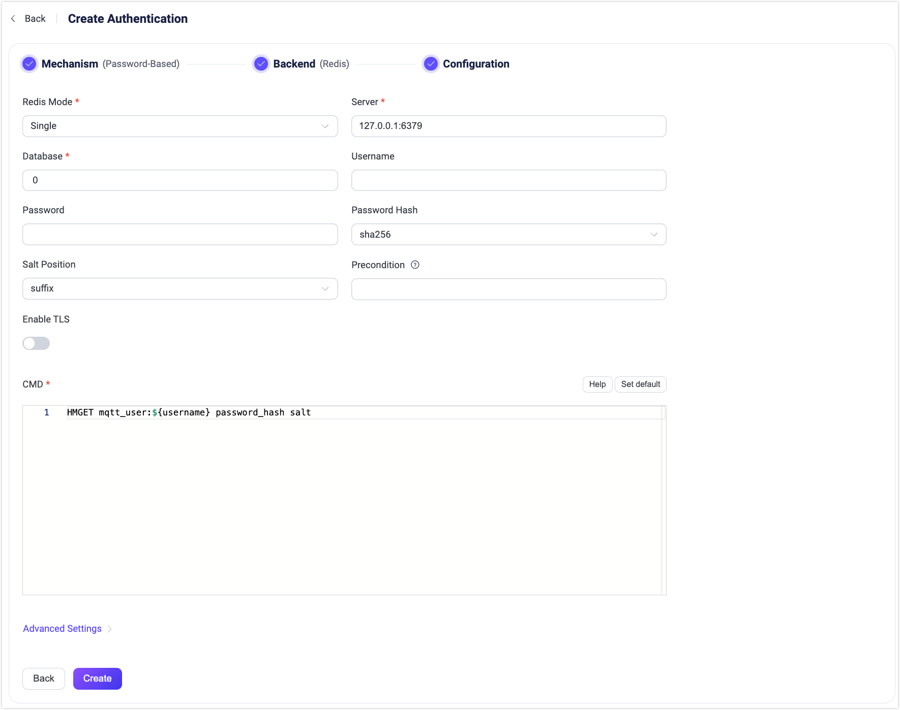

# Redisとの統合

<<<<<<< HEAD
EMQXはパスワード認証のためにRedisとの統合をサポートしています。EMQXのRedis認証機能は、現在、Single、[Redis Sentinel](https://redis.io/docs/latest/operate/oss_and_stack/management/sentinel/)、および[Redis Cluster](https://redis.io/docs/latest/operate/oss_and_stack/management/scaling/)の3つの異なるモードで動作するRedisへの接続をサポートしています。本セクションでは、サポートされるデータスキーマの詳細と、EMQXダッシュボードおよび設定ファイルでの設定方法について説明します。
=======
EMQXはパスワード認証のためにRedisとの統合をサポートしています。EMQXのRedis認証機能は、現在、Single、[Redis Sentinel](https://redis.io/docs/manual/sentinel/)、および[Redis Cluster](https://redis.io/docs/manual/scaling/)の3つの異なるモードで動作するRedisへの接続をサポートしています。本節では、サポートされているデータスキーマの詳細と、EMQXダッシュボードおよび設定ファイルでの設定方法について説明します。
>>>>>>> origin/release-5.10

::: tip 前提条件：

[基本的なEMQX認証の概念](../authn/authn.md)の知識

:::

## データスキーマとクエリ文

Redis認証は、あらかじめ定義されたフィールド名を持つ[Redisハッシュ](https://redis.io/docs/latest/develop/data-types/hashes/)に格納された認証情報を使用します。

- `password_hash`：必須。データベースに保存されるパスワード（プレーンテキストまたはハッシュ化済み）。
- `salt`：任意。`salt = ""` またはこのフィールドを削除すると、ソルト値が追加されないことを示します。
<<<<<<< HEAD
- `is_superuser`：任意。現在のクライアントがスーパーユーザーかどうかのフラグ。デフォルトは `false`。

例えば、ユーザー名 `user123`、パスワード `secret`、プレフィックスとしてのソルト `salt`、パスワードハッシュ `sha256` を持つスーパーユーザー（`is_superuser`: `true`）のドキュメントを追加する場合、クエリ文は以下のようになります。
=======
- `is_superuser`：任意。現在のクライアントがスーパーユーザーかどうかを示すフラグ。デフォルトは `false`。

例えば、ユーザー名 `user123` のスーパーユーザー（`is_superuser`: `true`）、パスワード `secret`、プレフィックスとしてのソルト `salt`、およびパスワードハッシュ `sha256` を追加する場合、クエリ文は以下のようになります。
>>>>>>> origin/release-5.10

```bash
>redis-cli
127.0.0.1:6379> HSET mqtt:user123 is_superuser 1 salt salt password_hash ac63a624e7074776d677dd61a003b8c803eb11db004d0ec6ae032a5d7c9c5caf
(integer) 3
```

対応する設定パラメータは以下の通りです。

```
password_hash_algorithm {
    name = sha256
    salt_position = prefix
}

cmd = "HMGET mqtt:${username} password_hash salt is_superuser"
```

::: tip
<<<<<<< HEAD
`password_hash` という名前はハッシュ化されたパスワードを保存することを示しています。しかし、RedisにはMySQLのような `as` 構文がないため、EMQX 5.0ではEMQX 4.xの互換性を保つために `password` フィールドもサポートしています。
=======
`password_hash` という名前はハッシュ化されたパスワードの保存を推奨する意味合いがあります。しかし、RedisにはMySQLのような `as` 構文がないため、EMQX 5.0ではEMQX 4.xの `password` フィールドとの互換性を維持しています。
>>>>>>> origin/release-5.10

そのため、`cmd` を `HMGET mqtt:${username} password salt is_superuser` と設定することも可能です。
:::

## ダッシュボードでの設定

<<<<<<< HEAD
EMQXダッシュボードを使用して、Redisをパスワード認証に利用する設定が可能です。

1. EMQXダッシュボードの左側ナビゲーションメニューから **アクセス制御** -> **認証** をクリックします。
2. **認証** ページの右上にある **作成** をクリックします。
3. **メカニズム** に **パスワードベース** を、**バックエンド** に **Redis** を選択し、**設定** タブに進みます。以下のように表示されます。



認証の設定方法は以下の通りです。

**接続**：Redisへの接続情報を入力します。

- **Redisモード**：Redisの展開方法を選択します。`Single`、`Sentinel`、`Cluster` のいずれかです。

- **サーバー**：EMQXが接続するRedisサーバーのアドレスを指定します。**Redisモード**が `Sentinel` または `Cluster` の場合は、接続するすべてのRedisサーバーをカンマ（`,`）区切りで入力してください。

- **Sentinel名**：使用する名前を指定します。文字列型で、**Redisモード**が `Sentinel` の場合にのみ必要です。

- **データベース**：Redisのデータベース名。文字列型です。

- **ユーザー名**：Redis接続に使用するユーザー名を指定します。このフィールドは、Redis 6.0で導入された[Redis ACL](https://redis.io/docs/latest/operate/oss_and_stack/management/security/acl/#create-and-edit-user-acls-with-the-acl-setuser-command)を使用している場合に必須です。Redisサーバーがデフォルトユーザー（ACLが無効または適用されていない）を使用している場合は空欄のままで構いません。

  ::: tip

  `username` フィールドはEMQX 5.2.0以降でサポートされています。Redis ACLを利用する場合は、EMQXのバージョンが5.2.0以上であることを確認してください。
=======
EMQXダッシュボードを使って、Redisをパスワード認証に使用する設定ができます。

1. EMQXダッシュボードの左側ナビゲーションメニューから **アクセス制御** -> **認証** をクリックします。
2. **認証** ページの右上にある **作成** をクリックします。
3. **メカニズム** に **パスワードベース** を選択し、**バックエンド** に **Redis** を選択すると、以下のように **設定** タブが表示されます。


以下の指示に従って認証の設定を行ってください。

**接続**：Redisへの接続情報を入力します。

- **Redisモード**：Redisの展開形態を選択します。`Single`、`Sentinel`、`Cluster` から選択可能です。

- **サーバー**：EMQXが接続するRedisサーバーのアドレスを指定します。**Redisモード** が `Sentinel` または `Cluster` の場合は、接続するすべてのRedisサーバーをカンマ（`,`）区切りで入力してください。

- **Sentinel名**：使用する名前を指定します。文字列型です。**Redisモード** を `Sentinel` に設定した場合のみ必要です。

- **データベース**：Redisのデータベース名。文字列型です。

- **ユーザー名**：Redisへの接続に使用するユーザー名を指定します。このフィールドは、Redis 6.0で導入された[Redis ACL](https://redis.io/docs/latest/operate/oss_and_stack/management/security/acl/#create-and-edit-user-acls-with-the-acl-setuser-command)を認証に使用している場合に必須です。Redisサーバーがデフォルトユーザー（ACLが無効または適用されていない）を使用している場合は空欄のままで構いません。

  ::: tip

  `username` フィールドはEMQX 5.2.0以降でサポートされています。Redis ACLを使用する場合は、EMQXのバージョンが5.2.0以上であることを確認してください。
>>>>>>> origin/release-5.10

  :::

- **パスワード**：Redisユーザーのパスワードを指定します。認証が有効なRedisインスタンスに接続する場合は必須です。

<<<<<<< HEAD
  - ユーザー名を入力した場合、このパスワードはRedis ACL設定の認証情報と一致している必要があります。
  - ユーザー名が指定されていない場合、このパスワードは `default` ユーザーとして認証に使用されます（有効な場合）。

**TLS設定**：TLSを有効にする場合はトグルスイッチをオンにします。TLSの有効化については[ネットワークとTLS](../../network/overview.md)を参照してください。
=======
  - ユーザー名を入力した場合は、このパスワードはRedis ACL設定の認証情報と一致する必要があります。
  - ユーザー名がない場合は、このパスワードが `default` ユーザーとして認証に使用されます（有効な場合）。

**TLS設定**：TLSを有効にする場合はトグルスイッチをオンにします。TLS有効化の詳細は[ネットワークとTLS](../../network/overview.md)を参照してください。
>>>>>>> origin/release-5.10

**接続設定**：同時接続数を設定します。

- **プールサイズ**（任意）：EMQXノードからRedisサーバーへの同時接続数を指定します。デフォルトは `8` です。

<<<<<<< HEAD
**認証設定**：認証に関連する設定を行います。

- **パスワードハッシュ**：プレーンテキストのパスワードに適用され、結果がデータベースに保存されるハッシュアルゴリズムを選択します。利用可能なオプションは `plain`、`md5`、`sha`、`sha256`、`sha512`、`bcrypt`、`pbkdf2` です。選択したアルゴリズムに応じて追加設定があります。
  - `md5`、`sha`、`sha256`、`sha512` の場合：
    - **ソルト位置**：ソルト（ランダムデータ）をパスワードにどのように混ぜるかを指定します。`suffix`（後置）、`prefix`（前置）、`disable`（無効）のいずれかです。外部ストレージからユーザー認証情報をEMQX組み込みデータベースに移行しない限り、デフォルト値のままで問題ありません。
    - ハッシュ結果は16進数文字列で表され、大文字小文字を区別せずに保存された認証情報と比較されます。
  - `plain` の場合：
    - **ソルト位置**：`disable` に設定してください。
  - `bcrypt` の場合：
    - **ソルトラウンド**：ハッシュ関数を適用する回数を定義します。2のべき乗で表される「コストファクター」です。デフォルトは `10`、許容範囲は `5` から `10` です。セキュリティ強化のためには高い値が推奨されます。コストファクターを1増やすごとに認証に要する時間が倍増します。
  - `pbkdf2` の場合：
    - **疑似乱数関数**：鍵生成に使用するハッシュ関数を選択します（例：`sha256`）。
    - **反復回数**：ハッシュ関数を実行する回数を設定します。デフォルトは `4096` です。
    - **派生鍵長**（任意）：生成される鍵の長さ（バイト単位）を指定します。空欄の場合は選択した疑似乱数関数に基づく長さが使用されます。
    - ハッシュ結果は16進数文字列で表され、大文字小文字を区別せずに保存された認証情報と比較されます。
=======
**認証設定**：認証に関する設定を行います。

- **パスワードハッシュ**：プレーンテキストのパスワードに適用され、データベースに保存される前のハッシュアルゴリズムを選択します。利用可能なオプションは `plain`、`md5`、`sha`、`sha256`、`sha512`、`bcrypt`、および `pbkdf2` です。選択したアルゴリズムに応じて追加設定があります。
  - `md5`、`sha`、`sha256`、`sha512` の場合：
    - **ソルト位置**：ソルト（ランダムデータ）をパスワードにどのように混ぜるかを指定します。`suffix`（後置）、`prefix`（前置）、`disable`（無効）から選択可能です。外部ストレージからEMQX組み込みデータベースにユーザー認証情報を移行する場合を除き、デフォルト値のままで問題ありません。
    - 結果のハッシュは16進数文字列で表現され、大文字小文字を区別せずに保存された認証情報と比較されます。
  - `plain` の場合：
    - **ソルト位置** は `disable` に設定してください。
  - `bcrypt` の場合：
    - **ソルトラウンド**：ハッシュ関数が適用される回数を定義します。2の累乗（2^ソルトラウンド）で表され、コストファクターとも呼ばれます。デフォルトは `10` で、許容範囲は `5` から `10` です。セキュリティ強化のために高い値を推奨します。コストファクターを1増やすごとに認証に必要な時間が倍増します。
  - `pbkdf2` の場合：
    - **疑似乱数関数**：キー生成に使用するハッシュ関数を選択します（例：`sha256`）。
    - **反復回数**：ハッシュ関数の実行回数を設定します。デフォルトは `4096` です。
    - **派生キー長**（任意）：生成されるキーのバイト長を指定します。空欄の場合は選択した疑似乱数関数により決定されます。
    - 結果のハッシュは16進数文字列で表現され、大文字小文字を区別せずに保存された認証情報と比較されます。
>>>>>>> origin/release-5.10
- **CMD**：Redisクエリコマンド。

設定が完了したら、**作成** をクリックしてください。

<<<<<<< HEAD
## 設定項目での設定

EMQXの設定項目を使用してRedis認証機能を設定することも可能です。 <!--詳細な操作手順は [authn-redis:standalone](../../configuration/configuration-manual.html#authn-redis:standalone)、[authn-redis:sentinel](../../configuration/configuration-manual.html#authn-redis:sentinel)、および [authn-redis:cluster](../../configuration/configuration-manual.html#authn-redis:cluster)を参照してください。-->
=======
## 設定項目による設定

EMQXの設定項目を使ってRedis認証機能を設定できます。<!--詳細な操作手順は [authn-redis:standalone](../../configuration/configuration-manual.html#authn-redis:standalone)、[authn-redis:sentinel](../../configuration/configuration-manual.html#authn-redis:sentinel)、および [authn-redis:cluster](../../configuration/configuration-manual.html#authn-redis:cluster) を参照してください。-->
>>>>>>> origin/release-5.10

Redis認証は `mechanism = password_based` と `backend = redis` で識別されます。

EMQXは3種類のRedisインストール形態に対応しています。

:::: tabs type:card

<<<<<<< HEAD
::: tab Standalone Redis
=======
::: tab スタンドアロンRedis
>>>>>>> origin/release-5.10

```bash
{
  mechanism = password_based
  backend = redis

  redis_type = single
  server = "127.0.0.1:6379"

  password_hash_algorithm {
      name = sha256
      salt_position = suffix
  }

  cmd = "HMGET mqtt_user:${username} password_hash salt is_superuser"
  database = 1
  password = "public"
  auto_reconnect = true
}
```

:::

::: tab Redis Sentinel

```bash
{
  mechanism = password_based
  backend = redis

  redis_type = sentinel
  servers = "10.123.13.11:6379,10.123.13.12:6379"
  sentinel = "mymaster"

  password_hash_algorithm {
      name = sha256
      salt_position = suffix
  }

  cmd = "HMGET mqtt_user:${username} password_hash salt is_superuser"
  database = 1
  password = "public"
  auto_reconnect = true
}
```

:::

::: tab Redis Cluster

```bash
{
  mechanism = password_based
  backend = redis

  redis_type = cluster
  servers = "10.123.13.11:6379,10.123.13.12:6379"

  password_hash_algorithm {
      name = sha256
      salt_position = suffix
  }

  cmd = "HMGET mqtt_user:${username} password_hash salt is_superuser"
  password = "public"
  auto_reconnect = true
}
```

:::

::::
