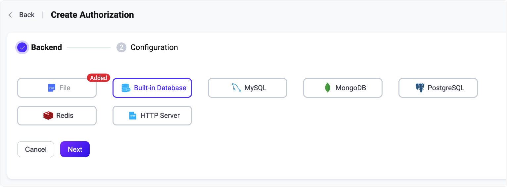

# 認可

EMQXにおける認可とは、MQTTクライアントのパブリッシュ／サブスクライブ操作に対する権限管理を指します。クライアントがパブリッシュ／サブスクライブ操作を行う際、EMQXは特定の手順に従うか、ユーザー指定のクエリ文を用いて設定されたデータソースからクライアントの権限リストを照会します。照会結果に基づき、EMQXは現在の操作を許可または拒否します。

クライアントの単一の権限データは以下の要素で構成されます：

| **権限**       | **クライアント**           | **操作**                           | **操作の詳細**                |
| -------------- | -------------------------- | --------------------------------- | ----------------------------- |
| Allow/Deny     | クライアントID／ユーザー名／IP | Publish／Subscribe／Publish-Subscribe | トピック／QoS／保持メッセージ |

::: tip
EMQX 5.1.1以降、操作の詳細におけるQoSおよび保持メッセージのチェックがサポートされました。
:::

クライアントの権限リストは事前に特定のデータソース（データベース、ファイルなど）に保存しておく必要があります。対応するデータレコードを更新することで、実行時にリストを更新可能です。

EMQXではデフォルトでファイルベースのオーソライザーが設定されており、そのまま利用できます。認可はACLファイルに設定された事前定義ルールに基づいて処理されます。

## データストレージオブジェクトとの統合

EMQXの認可機構は、組み込みデータベース、ファイル、MySQL、PostgreSQL、MongoDB、Redisなど多様なデータストレージオブジェクトとの統合をサポートしています。権限データはREST APIやEMQXダッシュボードを通じて管理可能です。<!-- CSVやJSONファイルによる一括インポートは現在サポートされていません。-->

さらに、EMQXはユーザーが開発したHTTPサービスと接続し、異なる認可要件に対応することも可能です。

バックエンドのデータストレージに応じて、以下のような種類のEMQXオーソライザーがあります。各オーソライザーは独自の設定オプションを持ちます。詳細は表中のリンクを参照してください。

| データベース       | 説明                                                         |
| ----------------- | ------------------------------------------------------------ |
| ACLファイル        | [ファイルに設定された静的ルールによる認可](./file.md)         |
| 組み込みデータベース | [組み込みデータベースをルールストレージとした認可](./mnesia.md) |
| MySQL             | [MySQLをルールストレージとした認可](./mysql.md)               |
| PostgreSQL        | [PostgreSQLをルールストレージとした認可](./postgresql.md)     |
| MongoDB           | [MongoDBをルールストレージとした認可](./mongodb.md)           |
| Redis             | [Redisをルールストレージとした認可](./redis.md)               |
| LDAP              | [LDAPディレクトリをルールストレージとした認可](./ldap.md)      |
| HTTP              | [外部HTTPサービスを利用した認可](./http.md)                   |

以下はEMQXのMySQLオーソライザーの設定例です。

例：

```bash
{

    type = mysql
    database = "mqtt"
    username = "root"
    password = "public"

    query = "SELECT permission, action, topic FROM mqtt_acl WHERE username = ${username}"
    server = "10.12.43.12:3306"
}
```

## 認可チェーン

EMQXは単一のオーソライザーではなく複数のオーソライザーを設定して認可チェーンを作成することができ、認可処理の柔軟性を高めます。EMQXはチェーン内のオーソライザーの順序に従い順番に認可を実行します。認可チェーンが設定されている場合、最初のオーソライザーで一致する認可情報が取得できないと、次のオーソライザーに切り替えて処理を継続します。

オーソライザーには事前条件も設定できます。オーソライザーに `precondition` が設定されている場合、EMQXはそのオーソライザーのデータソースを呼び出す前に事前条件式を評価します。式の結果が `true` の場合のみ、そのオーソライザーを呼び出します。結果が `true` でない場合、または実行時の式評価に失敗した場合、EMQXはそのオーソライザーをスキップし、認可チェーン内の次の有効なオーソライザーへ進みます。

認可チェックの流れは以下の通りです：

1. 現在のオーソライザーに `precondition` が設定されている場合、EMQXはまずその式を評価します。結果が `true` でなければ、現在のオーソライザーをスキップします。
2. EMQXがクライアントの権限情報を正常に取得した場合、クライアントの操作と取得した権限リストを照合します。
   - 一致すれば、権限設定に基づき操作を許可または拒否します。
   - 一致しなければ、次のオーソライザーに切り替えて処理を継続します。

3. EMQXがクライアントの権限情報を取得できなかった場合、他のオーソライザーが設定されているか確認します。
   - 設定されていれば、次のオーソライザーに切り替えて処理を継続します。
   - 最後のオーソライザーであれば、`no_match`の設定に従いクライアントの操作を許可または拒否します。

::: warning 注意

認可の問題を避けるため、ACLファイルオーソライザーは必要に応じて無効化または削除してください。デフォルトで末尾に `{allow, all}` があり、すべての認可リクエストを許可してしまうためです。

:::

オーソライザーの順序調整や稼働状況の確認方法は、[オーソライザー管理](#manage-authorizers)を参照してください。

### オーソライザーの事前条件

`precondition` はオーソライザーに設定する [Variform式](../../configuration/configuration.md#variform式) です。クライアント情報と現在の認可リクエストのコンテキストに基づき、認可データソースを呼び出すかどうかを選択するために使用します。例えば、業務ライン、クライアント属性、パブリッシュ／サブスクライブのアクション、トピック範囲ごとに異なる認可バックエンドへ振り分けることができます。

`precondition` が空の場合、事前条件は設定されず、オーソライザーは認可チェーン内の順序に従って通常通り実行されます。事前条件を設定した場合、式の評価結果がブール値 `true` のときだけEMQXはそのオーソライザーを呼び出します。それ以外の結果では、そのオーソライザーはスキップされます。

`precondition` で使用できるクライアント変数は以下の通りです：

- `username`：クライアントのユーザー名。
- `clientid`：クライアントID。
- `client_attrs.*`：クライアント属性。例：`client_attrs.tenant`。クライアント属性の詳細は [MQTTクライアント属性](../../client-attributes/client-attributes.md) を参照してください。
- `cert_common_name`：クライアントTLS証明書のCommon Name（CN）。
- `cert_subject`：クライアントTLS証明書のSubject。
- `peersni`：TLSクライアントが送信したSNI（Server Name Indication）。
- `listener`：クライアントが接続したリスナーID。例：`tcp:default`。
- `zone`：クライアントに関連付けられた設定Zone。

`precondition` で使用できる認可リクエスト変数は以下の通りです：

- `action`：現在の認可アクション。値は `publish` または `subscribe`。
- `topic`：現在チェック中のパブリッシュトピックまたはサブスクライブトピックフィルター。

以下の例では、`precondition` に関連するフィールドのみを示しています。HTTPオーソライザーは `orders` 業務クライアントのパブリッシュリクエストのみを処理し、Redisオーソライザーは `devices/${clientid}/#` トピック範囲内のリクエストのみを処理します：

```hcl
authorization {
  sources = [
    {
      type = http
      precondition = "iif(str_eq(client_attrs.biz, 'orders'), str_eq(action, 'publish'), false)"
      ...
    },
    {
      type = redis
      precondition = "topic_match(topic, topic_join(['devices', clientid, '#']))"
      ...
    }
  ]
}
```

この例では：

- `iif(str_eq(client_attrs.biz, 'orders'), str_eq(action, 'publish'), false)`：クライアント属性 `client_attrs.biz` が `orders` で、現在の認可アクションが `publish` の場合、式の結果は `true` になります。
- `topic_match(topic, topic_join(['devices', clientid, '#']))`：現在の認可リクエストのトピックが `devices/${clientid}/#` トピックフィルターに一致する場合、式の結果は `true` になります。

## クライアント認可キャッシュ

EMQXはセッションベースの認可データキャッシュ機構を提供しています。このキャッシュはクライアントのセッション状態に認可結果を保存し、同一接続内での繰り返し認可ルール評価を減らします。クライアント認可キャッシュはクライアントのパブリッシュ／サブスクライブ操作の権限チェック効率を向上させ、多数のクライアントリクエストによる認可データバックエンドへのアクセス負荷軽減に寄与します。

### クライアント認可キャッシュの動作

クライアントが接続しパブリッシュ／サブスクライブ操作を行う際：

1. EMQXは現在のセッションに保存された認可キャッシュを確認します。
2. セッションキャッシュに一致するルールがあれば、それを直接使用します。
3. キャッシュが存在しないか期限切れの場合、設定されたオーソライザーで完全な認可チェックを行います。
4. 結果はセッションにキャッシュされ、同一接続内で再利用されます。

::: tip

キャッシュはクライアントセッション固有であり、クライアントの切断または再接続時にクリアされます。

:::

### ダッシュボードでのクライアント認可キャッシュ設定

EMQXダッシュボードでクライアント認可キャッシュを有効化・設定できます：

1. **アクセス制御** -> **認可** -> **設定** に移動します。

2. 以下のオプションを設定します：

   | 項目名                             | 説明                                                         |
   | ---------------------------------- | ------------------------------------------------------------ |
   | **キャッシュを有効にする**         | クライアントセッションごとの認可キャッシュを有効／無効に切り替えます。 |
   | **キャッシュ最大件数**             | クライアントごとのキャッシュ最大エントリ数。デフォルト：`32`。 |
   | **キャッシュ有効期限**             | キャッシュエントリの有効期間。デフォルト：`1分`。            |
   | **除外トピック**                   | キャッシュを無効にするトピックのリスト。                      |
   | **一致しない場合の動作**           | オーソライザーが一致しなかった場合の動作。`allow`（許可）／`deny`（拒否）。デフォルト：`allow`。 |
   | **拒否時の動作**                   | 操作が拒否された場合の動作。`ignore`（操作リクエストを無視）／`disconnect`（クライアント接続を切断）。デフォルト：`ignore`。 |
   | **キャッシュクリア**               | アクティブなセッション認可キャッシュを手動で全てクリアするボタン。 |

これらの設定は設定ファイルからも行えます。詳細は[設定ファイル](../../configuration/configuration.md)を参照してください。

::: tip

適切に設定すればキャッシュはパフォーマンスを大幅に向上させます。システムの状況に応じて設定を調整することを推奨します。

:::

## 外部リソースキャッシュ

セッションベースのキャッシュに加え、EMQXはMySQL、MongoDB、Redisなどの外部バックエンドから取得した認可結果をノードレベルでキャッシュする機能も提供しています。この機能により、リモートデータソースへの繰り返しアクセスを減らしパフォーマンスを向上させます。

::: tip 注意

外部リソースキャッシュは外部データソースにのみ適用されます。組み込みデータベースやファイルベースのオーソライザーには適用されません。

:::

### 外部リソースキャッシュの動作

パブリッシュ／サブスクライブ操作が外部バックエンドへのクエリをトリガーした場合：

1. EMQXは外部リソースキャッシュ（ノード全体で共有）を確認します。
2. キャッシュに有効な結果があれば、**キャッシュヒット**とカウントし外部バックエンドへの呼び出しは行いません。
3. 結果がなければ、**キャッシュミス**とカウントし外部バックエンドにクエリを送ります。
4. バックエンドから返された結果はキャッシュに保存され、**キャッシュ挿入**メトリクスが増加します。

::: tip 注意

セッションベースの認可キャッシュと異なり、外部リソースキャッシュはノード単位で全クライアント間で共有され、クライアントセッションを跨いで持続します。

:::

### 外部リソースキャッシュの有効化と設定

<!--@include: ../config-external-resource-cache.md-->

### 外部リソースキャッシュの状態監視

<!--@include: ../monitor-cache-status.md-->

## 認可プレースホルダー

EMQXのオーソライザー設定ではプレースホルダーを使用可能です。認可処理時にこれらは実際のクライアント情報に置き換えられ、現在のクライアントに合致するクエリやHTTPリクエストを構築します。

有効なプレースホルダーは `${PATH.TO.VALUE}` の形式で、PATH.TO.VALUEはオブジェクト内の値へのドット区切りパスです。使用可能な文字は英数字、ドット（`.`）、アンダースコア（`_`）です。サポートされていない文字を含むプレースホルダーは文字列として扱われます。

### データクエリ内のプレースホルダー

プレースホルダーはクエリ文の構築に使われます。例えば、EMQX MySQLオーソライザーのデフォルトクエリは `${username}` を使っています：

```sql
SELECT action, permission, topic FROM mqtt_acl where username = ${username}
```

クライアント（名前：`emqx_u`）が接続リクエストを送ると、構築されるクエリは以下のようになります：

```sql
SELECT action, permission, topic FROM mqtt_acl where username = 'emqx_u'
```

クエリ文でサポートされるプレースホルダーは以下の通りです：

* `${username}`：実行時にユーザー名に置き換えられます。ユーザー名は`CONNECT`パケットの`Username`フィールドから取得されます。`peer_cert_as_username`が有効な場合は証明書のフィールドや内容で上書きされます。
* `${clientid}`：実行時にクライアントIDに置き換えられます。通常は`CONNECT`パケットでクライアントが明示的に指定します。`use_username_as_clientid`や`peer_cert_as_clientid`が有効な場合はユーザー名や証明書のフィールド・内容で上書きされます。
* `${peerhost}`：実行時にクライアントのIPアドレスに置き換えられます。EMQXは[Proxy Protocol](http://www.haproxy.org/download/1.8/doc/proxy-protocol.txt)をサポートしており、TCPプロキシやロードバランサーの背後にあっても実際のIPアドレスを取得可能です。
* `${peerport}`：実行時にクライアントのIPポートに置き換えられます。
* `${peername}`：実行時にクライアントのIPアドレスとポート（`IP:PORT`形式）に置き換えられます。
* `${cert_common_name}`：実行時にクライアントTLS証明書のCommon Nameに置き換えられます。ロードバランサーがクライアント証明書情報をTCPリスナーに送る場合はProxy Protocol v2を使用してください。
* `${cert_subject}`：実行時にクライアントTLS証明書のSubjectに置き換えられます。ロードバランサーがクライアント証明書情報をTCPリスナーに送る場合はProxy Protocol v2を使用してください。
* `${client_attrs.NAME}`：クライアント属性。`NAME`は事前定義された設定に基づき実行時に置き換えられます。詳細は[MQTTクライアント属性](../../client-attributes/client-attributes.md)を参照してください。
* `${zone}`：実行時にクライアントのゾーンに置き換えられます。`${zone}`プレースホルダーは認可テンプレート内で直接使用可能です。ゾーン設定の詳細は[ゾーンオーバーライド](../../configuration/configuration.md#zone-override)を参照してください。

### トピック内のプレースホルダー

EMQXは動的トピックをサポートするため、トピック内でもプレースホルダーの使用を許可しています。サポートされるプレースホルダーは以下の通りです：

* `${clientid}`
* `${username}`
* `${client_attrs.NAME}`：クライアント属性。`NAME`は`mqtt.client_attrs_init`で設定された属性名抽出ルールにより置き換えられます。

プレースホルダーはトピックのセグメントとして使用可能で、例：`a/b/${username}/c/d` のように記述します。

プレースホルダーの展開を避けたい場合、EMQX 5.4以降は `$` を `${$}` とエスケープできます。例えば、`t/${$}{username}` は展開されず文字通り `t/${username}` と解釈されます。

::: tip

クエリ文で `eq` 構文を使う場合、`eq` の後に続くトピックはプレースホルダー展開をサポートしません。この挙動は将来のバージョンで変更される可能性があります。

`eq` 構文はトピックフィルターと完全一致を判定するもので、フィルターにマッチする任意のトピックを意味しません。例：`eq t/#` は `t/#` にのみマッチし、`t/1` や `t/2` にはマッチしません。

:::

## 認可チェックの優先順位

キャッシュや認可チェッカーに加え、認可結果は認証フェーズの[スーパーユーザーロールと権限セット](../authn/authn.md#super-user)の影響を受けます。

スーパーユーザーの場合、すべての操作は認可チェックをスキップします。[アクセス制御リスト（ACL）](../authn/acl.md)が設定されている場合、EMQXは認可チェッカー実行前にクライアントの権限データを優先して参照します。優先順位は以下の通りです：

```bash
スーパーユーザー > 権限データ > 認可チェック
```

## 認可機構の設定

EMQXは認可設定を以下の3つの方法で行えます：ダッシュボード、設定ファイル、HTTP API。

### ダッシュボードでの認可設定

EMQXダッシュボードは直感的にオーソライザーを設定できるインターフェースです。関連パラメータの設定、稼働状況の確認、認可チェーン内の位置調整が可能です。



### 設定ファイルでの認可設定

設定ファイルの `authorization` フィールドに認可設定を記述できます。一般的な構成例は以下の通りです：

```bash
authorization {
  sources = [
    { ...   },
    { ...   }
  ]
  no_match = deny
  deny_action = ignore
  cache {
    max_size = 32
    excludes = ["t/1", "t/2"]
    ttl = 1m
  }
}
```

各項目の説明：

- `sources`（任意）：順序付き配列。各要素は対応するオーソライザーのデータソースを定義します。詳細は各オーソライザーの設定ファイルを参照してください。
  - `sources[].precondition`：オーソライザーを呼び出す前にスキップするかどうかを判断するための任意のVariform式。空の場合、事前条件は設定されません。

- `no_match`：設定されたオーソライザーのいずれも認可ルールを見つけられなかった場合のデフォルト動作。値は `allow` または `deny`。デフォルトは `deny`。

- `deny_action`：パブリッシュ／サブスクライブ操作が拒否された場合の次の処理。値は `ignore` または `disconnect`。デフォルトは `ignore`。`ignore` は操作を静かに無視し、`disconnect` はクライアント接続を切断します。

- `cache`：クライアント認可キャッシュの設定。以下を含みます：

  * `cache.enable`：クライアント認可キャッシュの有効／無効。デフォルトは `true`。JWTパケットのみで認可を行う場合は `false` に設定することを推奨します。
    
  * `cache.max_size`：キャッシュ内の最大要素数。デフォルトは32。上限を超えた古いレコードは削除されます。
    
  * `cache.excludes`：キャッシュ対象外のトピックリスト。デフォルトは空リスト `[]`。
    
  * `cache.ttl`：キャッシュの有効期間。デフォルトは `1m`（1分）。

### HTTP APIでの認可設定

認可管理用のAPIエンドポイントは以下の通りです：

* `/api/v5/authorization/settings`：一般パラメータ、`no_match`、`deny_action`、`cache`の管理
* `/api/v5/authorization/sources`：オーソライザーの管理と順序調整
* `/api/v5/authorization/cache`：クライアント認可キャッシュのクリア
* `/api/v5/authorization/sources/built_in_database`：`built_in_database`オーソライザーの認可ルール管理

詳細な操作手順は[HTTP API](../../admin/api.md)を参照してください。

## オーソライザー管理

ダッシュボードの **アクセス制御** -> **認可** ページでオーソライザーの閲覧・管理が可能です。

### オーソライザーの順序調整

[認可チェーン](#認可チェーン)で述べた通り、オーソライザーは設定された順序で実行されます。**その他**ドロップダウンから「上へ」「下へ」「先頭へ移動」「末尾へ移動」を選択して順序を変更できます。`authorization.sources`設定項目でも順序を調整可能です。

### オーソライザーの状態確認

**状態**列で接続状態を確認できます：

| 状態           | 意味                                                         | トラブルシューティング                                      |
| -------------- | ------------------------------------------------------------ | ------------------------------------------------------------ |
| Connected      | すべてのノードがデータソースに正常に接続されている。          | -                                                            |
| Disconnected   | 一部または全ノードがデータソース（データベース、ファイル）に接続できていない。 | データソースの稼働状況を確認；<br />問題解決後にオーソライザーを手動で再起動（**無効化**→**有効化**） |
| Connecting     | 一部または全ノードがデータソースに再接続中。                  | データソースの稼働状況を確認；<br />問題解決後にオーソライザーを手動で再起動（**無効化**→**有効化**） |

### 稼働メトリクス

オーソライザーの概要ページで各種統計メトリクスを確認できます。主なメトリクスは以下の通りです：

- **Allow**：許可された認可数
- **Deny**：拒否された認可数
- **No match**：クライアントの認可データが見つからなかった回数
- **Ignored**：無視された認可クエリ数。例えば、オーソライザーの `precondition` の結果が `true` でない場合、または認可ソースが適用できないかエラーで判定できなかった場合。
- **Rate(tps)**：認可処理の実行レート

また、**ノード状態**から各ノードの認可状況や実行状況も確認可能です。

認可全体の稼働メトリクスを確認したい場合は、[メトリクス - 認証＆認可](../../observability/metrics-and-stats.md#Metrics+-+Authentication+%26+Authorization)を参照してください。
