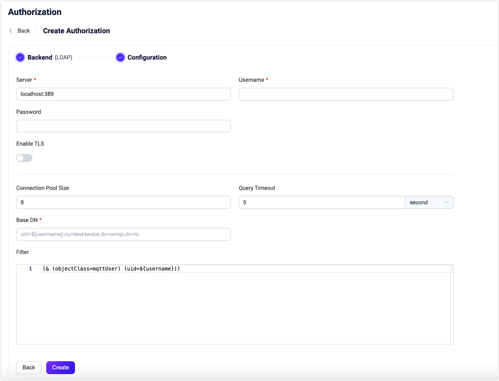

# LDAPとの統合

[Lightweight Directory Access Protocol (LDAP)](https://ldap.com/) はディレクトリ情報にアクセスし管理するためのプロトコルです。EMQXは認可チェックのためにLDAPサーバーとの統合をサポートしています。LDAP認可機能は、パブリッシュ／サブスクリプション要求をLDAPサーバーに格納された属性リストと照合することで認可チェックを実装します。

::: tip 前提条件

- [EMQXの基本的な認可概念](./authz.md)に関する知識

:::

## LDAPデータスキーマとクエリ

LDAP認可機能は、LDAPディレクトリ内に保存された認可データに基づいてクライアントの認可をチェックします。LDAPスキーマは認可データの構造と格納ルールを定義します。LDAP認可機能はほぼすべてのストレージスキーマに対応しています。以下はOpenLDAP用のスキーマ例です。

```sql
attributetype ( 1.3.6.1.4.1.11.2.53.2.2.3.1.2.3.4.1 NAME ( 'mqttPublishTopic' 'mpt' )
	EQUALITY caseIgnoreMatch
	SUBSTR caseIgnoreSubstringsMatch
	SYNTAX 1.3.6.1.4.1.1466.115.121.1.15
	USAGE userApplications )
attributetype ( 1.3.6.1.4.1.11.2.53.2.2.3.1.2.3.4.2 NAME ( 'mqttSubscriptionTopic' 'mst' )
	EQUALITY caseIgnoreMatch
	SUBSTR caseIgnoreSubstringsMatch
	SYNTAX 1.3.6.1.4.1.1466.115.121.1.15
	USAGE userApplications )
attributetype ( 1.3.6.1.4.1.11.2.53.2.2.3.1.2.3.4.3 NAME ( 'mqttPubSubTopic' 'mpst' )
	EQUALITY caseIgnoreMatch
	SUBSTR caseIgnoreSubstringsMatch
	SYNTAX 1.3.6.1.4.1.1466.115.121.1.15
	USAGE userApplications )

objectclass ( 1.3.6.1.4.1.11.2.53.2.2.3.1.2.3.4 NAME 'mqttUser'
    SUP top
	STRUCTURAL
	MAY ( mqttPublishTopic $ mqttSubscriptionTopic $ mqttPubSubTopic  ) )
```

LDAP認可機能は許可リスト方式を採用しています。ユーザーは各アクションに対して許可するトピックのリスト（ワイルドカード対応）を定義する必要があります。アクションはトピックが一致した場合のみ許可され、それ以外はLDAP認可機能によって無視されます。

以下は、OpenLDAP用スキーマに基づいた[LDAP Data Interchange Format (LDIF)](https://ldap.com/ldif-the-ldap-data-interchange-format/)で指定したLDAP認可データの例です。

```sql
## 組織作成: emqx.io
dn:dc=emqx,dc=io
objectclass: top
objectclass: dcobject
objectclass: organization
dc:emqx
o:emqx,Inc.

## 組織単位作成: testdevice.emqx.io
dn:ou=testdevice,dc=emqx,dc=io
objectClass: top
objectclass:organizationalUnit
ou:testdevice

dn:uid=mqttuser0001,ou=testdevice,dc=emqx,dc=io
objectClass: top
objectClass: mqttUser
uid: mqttuser0001
## 以下3つのトピックへのパブリッシュを許可
mqttPublishTopic: mqttuser0001/pub/1
mqttPublishTopic: mqttuser0001/pub/+
mqttPublishTopic: mqttuser0001/pub/#
## 以下3つのトピックへのサブスクライブを許可
mqttSubscriptionTopic: mqttuser0001/sub/1
mqttSubscriptionTopic: mqttuser0001/sub/+
mqttSubscriptionTopic: mqttuser0001/sub/#
## 以下のトピックはパブリッシュ・サブスクライブ両方を許可
mqttPubSubTopic: mqttuser0001/pubsub/1
mqttPubSubTopic: mqttuser0001/pubsub/+
mqttPubSubTopic: mqttuser0001/pubsub/#

dn:uid=mqttuser0002,ou=testdevice,dc=emqx,dc=io
objectClass: top
objectClass: mqttUser
uid: mqttuser0002
mqttPublishTopic: mqttuser0002/pub/#
mqttSubscriptionTopic: mqttuser0002/sub/1
mqttPubSubTopic: mqttuser0002/pubsub/#
```

例では、各アクションに対し複数値属性を定義しています。各属性は、そのアクションで許可されるトピック数に応じて0回以上繰り返すことが可能です。

LDAPサーバー起動時にスキーマとLDIFファイルが読み込まれるよう、LDAP設定ファイル `slapd.conf` にこれらを含めるよう編集します。以下は `slapd.conf` の例です。

::: tip

LDAP認可データの格納方法やアクセス方法は、ビジネス要件に応じて決定してください。

:::

```sh
include         /usr/local/etc/openldap/schema/core.schema
include         /usr/local/etc/openldap/schema/cosine.schema
include         /usr/local/etc/openldap/schema/inetorgperson.schema
include         /usr/local/etc/openldap/schema/emqx.schema

TLSCACertificateFile  /usr/local/etc/openldap/cacert.pem
TLSCertificateFile    /usr/local/etc/openldap/cert.pem
TLSCertificateKeyFile /usr/local/etc/openldap/key.pem

database mdb
suffix "dc=emqx,dc=io"
rootdn "cn=root,dc=emqx,dc=io"
rootpw {SSHA}eoF7NhNrejVYYyGHqnt+MdKNBh4r1w3W

directory       /usr/local/etc/openldap/data
```

## ダッシュボードからLDAP認可機能を設定する

EMQXダッシュボードを使ってLDAPによるユーザー認可の設定が可能です。

1. [EMQXダッシュボード](http://127.0.0.1:18083/#/authentication)にアクセスし、左側ナビゲーションメニューの **Access Control** -> **Authorization** をクリックして **Authorization** ページを開きます。

2. 右上の **Create** をクリックし、**Backend** で **LDAP** を選択してから **Next** をクリックします。以下の **Configuration** タブが表示されます。

   

3. 以下の内容に従い設定を行います。

   **Connect**: LDAP接続に必要な情報を入力します。

   - **Server**: EMQXが接続するLDAPサーバーのアドレス（`host:port`）を指定します。
   - **Username**: LDAPのルートユーザー名を指定します。
   - **Password**: LDAPのルートユーザーパスワードを指定します。

   **TLS Configuration**: TLSを有効にする場合はトグルスイッチをオンにします。

   **Connection Configuration**: 同時接続数と接続タイムアウトまでの待機時間を設定します。

   - **Pool size**（任意）: EMQXノードからLDAPへの同時接続数を整数で指定します。デフォルトは `8` です。
   - **Query Timeout**（任意）: クエリがタイムアウトとみなされるまでの待機時間を指定します。ミリ秒、秒、分、時間の単位が利用可能です。

   **Authorization configuration**: 認可関連の設定を入力します。

   - **Base DN**: 検索を実行する基準となるオブジェクトエントリ名（またはルート）です。詳細は[RFC 4511 Search Request](https://datatracker.ietf.org/doc/html/rfc4511#section-4.5.1)を参照してください。プレースホルダーも利用可能です。

     ::: tip

     DNはDistinguished Nameの略で、各オブジェクトエントリの一意識別子であり、情報ツリー内の位置を示します。

     :::

   - **Filter**: `Search`がエントリにマッチするために満たすべき条件を定義する`filter`です。構文は[RFC 4515](#https://www.rfc-editor.org/rfc/rfc4515)に準拠し、プレースホルダーもサポートします。

4. **Create** をクリックして設定を完了します。

## 設定項目でLDAP認可機能を設定する

EMQXの設定項目を使ってLDAP認可機能を設定することも可能です。

LDAP認可機能はタイプ `ldap` で識別されます。

設定例:

```bash
{
  type = ldap

  server = "127.0.0.1:389"
  publish_attribute = "mqttPublishTopic"
  subscribe_attribute = "mqttSubscriptionTopic"
  all_attribute = "mqttPubSubTopic"
  query_timeout = "5s"
  username = "root"
  password = "root password"
  pool_size = 8
  base_dn = "uid=${username},ou=testdevice,dc=emqx,dc=io"
  filter = "(objectClass=mqttUser)"
}
```
