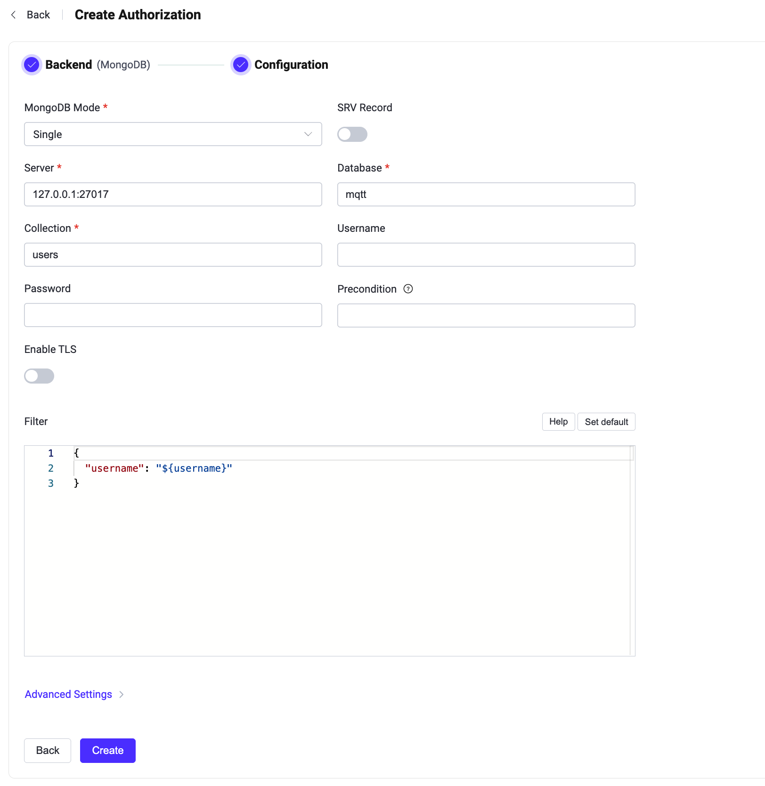

# MongoDBとの統合

このオーソライザーは、MongoDBデータベースに保存されたルールのリストとパブリッシュ／サブスクライブ要求を照合することで認可チェックを実装します。

::: tip 前提条件

[基本的なEMQX認可の概念](./authz.md)の知識が必要です。

:::

## データスキーマとクエリ文

MongoDBオーソライザーは、認可ルールをMongoDBドキュメントとして保存することをサポートしています。ユーザーは、結果に以下のフィールドが含まれることを保証するためにクエリテンプレートを提供する必要があります。

* `permission`：ルールが一致した場合に適用されるアクションを指定します。利用可能な値は `deny` または `allow` です。
* `action`：ルールが関連する要求を指定します。可能な値は `publish`、`subscribe`、または `all` です。
* `topic` / `topics`：ルールが適用される単一または複数のトピックを指定します。トピックフィルターおよび[トピックプレースホルダー](./authz.md#topic-placeholders)をサポートします。
* `qos`（オプション）：現在のルールが適用されるQoSレベルを指定します。値の選択肢は `0`、`1`、`2` です。複数のQoSレベルを指定する場合は数値の配列も可能です。デフォルトはすべてのQoSレベルです。
* `retain`（オプション）：ルールがリテインドメッセージのパブリッシュを許可するかどうかを示します。値の選択肢は `0`、`1`、または `true`、`false` です。デフォルトではリテインドメッセージは許可されています。

ユーザー名 `emqx_u` のクライアントがQoS 1でトピック `t/1` にパブリッシュすることを拒否する例：

```js
> db.mqtt_acl.insertOne(
  {
      "username": "emqx_u",
      "clientid": "emqx_c",
      "ipaddress": "127.0.0.1",
      "permission": "deny",
      "action": "publish",
      "qos": 1,
      "topics": ["t/1"]
  }
);
{
  acknowledged: true,
  insertedId: ObjectId("62b4a1a0e693ae0233bc3e98")
}
```

対応する設定パラメータは以下の通りです：
```bash
collection = "mqtt_acl"
filter { username = "${username}" }
```

::: tip
システム内のユーザー数が多い場合は、クエリ応答時間を短縮しEMQXへの負荷を軽減するために、事前にコレクションの最適化およびインデックス作成を行ってください。
:::

このMongoDBデータスキーマに対するDashboardの対応する設定パラメータは **Filter**：`{ username = "${username}" }` です。

## Dashboardでの設定

EMQX Dashboardを使用してMongoDBをユーザー認可に利用する方法を設定できます。

1. [EMQX Dashboard](http://127.0.0.1:18083/#/authentication)の左側ナビゲーションツリーで **Access Control** -> **Authorization** をクリックし、**Authorization** ページに入ります。

2. 右上の **Create** をクリックし、次に **Backend** で **MongoDB** を選択します。**Next** をクリックすると、以下の **Configuration** タブが表示されます。

   

3. 以下の指示に従って設定を行います。

   **Connect**：MongoDBへの接続に必要な情報を入力します。

   - **MongoDB Mode**：MongoDBのデプロイ方式を選択します。`Single`、`Replica Set`、`Sharding` から選択可能です。
   - **Server**：EMQXが接続するサーバーアドレス（`host:port`）を指定します。
   - **Database**：MongoDBのデータベース名を指定します。
   - **Collection**：認可ルールが保存されているMongoDBコレクション名を指定します。データ型は文字列です。
   - **Username**：MongoDBのユーザー名を指定します。
   - **Password**：MongoDBのユーザーパスワードを指定します。

   **TLS Configuration**：TLSを有効にする場合はトグルスイッチをオンにします。

   **Filter**：認証情報検索のためのMongoDBセレクターとして解釈されるマップです。[プレースホルダー](./authz.md#authorization-placeholders)をサポートします。

   **Advanced Settings**：

   - **Auth Source**：MongoDB接続時に使用する認証ソースを指定します。特定のデータベースやユーザー認証情報を管理するMongoDB認証データベースを指定可能です。
   - **Use Legacy Protocol**：MongoDBとの通信にレガシープロトコルを使用するかどうかを選択します。`auto`、`true`、`false` の選択肢があり、デフォルトは `auto` で新しいプロトコルがサポートされているか自動判別します。
   - **Record Limit**：MongoDBから取得する認可レコードの最大数を制限します。
   - **Skip**：認可レコードのリスト取得時にスキップするレコード数を設定します。

   - **Pool size**（オプション）：EMQXノードからMongoDBへの同時接続数を整数値で指定します。デフォルトは `8` です。
   - **Connect Timeout**（オプション）：EMQXが接続タイムアウトと判断するまでの待機時間を指定します。単位はミリ秒、秒、分、時間が利用可能です。

4. **Create** をクリックして設定を完了します。

## 設定項目による構成

EMQXの設定項目を使ってMongoDBオーソライザーを構成できます。

MongoDBオーソライザーはタイプ `mongodb` で識別されます。オーソライザーは3種類のデプロイモードで動作するMongoDBへの接続をサポートしています。  
<!---詳細な設定情報は以下を参照してください：[authz:mongo_single](../../configuration/configuration-manual.html#authz:mongo_single)、[authz:mongo_sharded](../../configuration/configuration-manual.html#authz:mongo_sharded)、[authz:mongo_rs](../../configuration/configuration-manual.html#authz:mongo_rs)-->

設定例：

:::: tabs type:card

::: tab Single

```bash
{
  type = mongodb

  collection = "mqtt_user"
  filter { username = "${username}" }

  mongo_type = single
  server = "127.0.0.1:27017"

  database = "mqtt"
  username = "emqx"
  password = "secret"
}
```

:::

::: tab Replica set

```bash
{
  type = mongodb

  collection = "mqtt_user"
  filter { username = "${username}" }

  mongo_type = rs
  servers = "10.123.12.10:27017,10.123.12.11:27017,10.123.12.12:27017"
  replica_set_name = "rs0"

  database = "mqtt"
  username = "emqx"
  password = "secret"
}
```

:::

::: tab Sharding

```bash
{
  type = mongodb
  enable = true

  collection = "mqtt_user"
  filter { username = "${username}" }

  mongo_type = sharded
  servers = "10.123.12.10:27017,10.123.12.11:27017,10.123.12.12:27017"

  database = "mqtt"
  username = "emqx"
  password = "secret"
}
```

:::

::::
