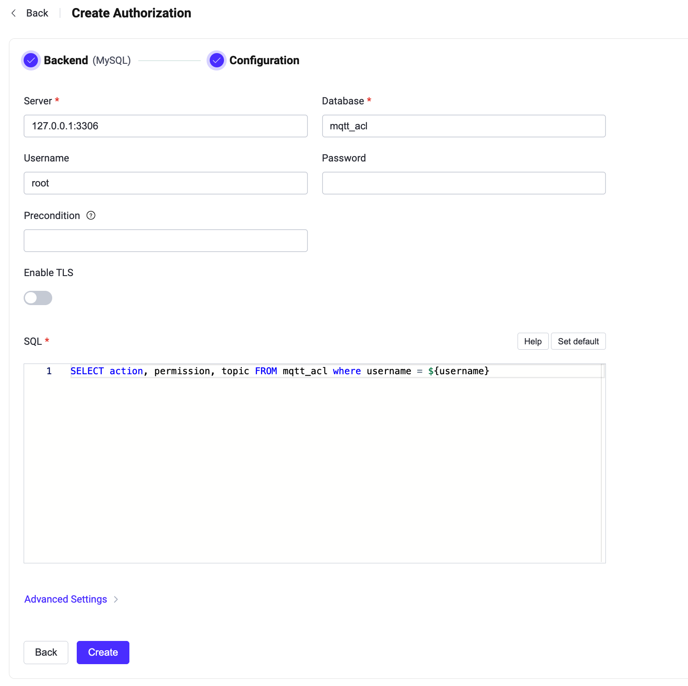

# MySQLとの連携

このオーソライザーは、MySQLデータベースに保存されたルールのリストとパブリッシュ／サブスクリプション要求を照合することで認可チェックを実装しています。

::: tip 前提条件

[EMQXの基本的な認可概念](./authz.md)の知識が必要です。

:::

## データスキーマとクエリ文

MySQLオーソライザーはほぼあらゆるストレージスキーマに対応しています。認証情報の保存方法やアクセス方法はビジネス要件に応じて決定可能で、単一または複数のテーブル、ビューなどを利用できます。

ユーザーはクエリ文のテンプレートを提供し、以下のフィールドが含まれていることを確認する必要があります：
* `permission` はルールがマッチした場合に適用されるアクションを指定します。`deny` または `allow` のいずれかである必要があります。
* `action` はルールが関連するリクエストを指定します。`publish`、`subscribe`、または `all` のいずれかである必要があります。
* `topic` はルールに関連するトピックフィルターを指定します。ワイルドカードおよび[トピックプレースホルダー](./authz.md#topic-placeholders)をサポートする文字列である必要があります。
* `qos`（任意）はルールが適用されるQoSレベルを指定します。値は `0`、`1`、`2` のいずれか、またはカンマ区切りの文字列（例：`0,1`）で複数指定可能です。デフォルトはすべてのQoSレベルです。
* `retain`（任意）は現在のルールがリテインメッセージを許可するかどうかを指定します。値は `0` または `1` で、デフォルトはリテインメッセージを許可します。

認証情報を保存するためのテーブル構造例：

```sql
CREATE TABLE `mqtt_acl` (
  `id` int(11) unsigned NOT NULL AUTO_INCREMENT,
  `ipaddress` VARCHAR(60) NOT NULL DEFAULT '',
  `username` VARCHAR(255) NOT NULL DEFAULT '',
  `clientid` VARCHAR(255) NOT NULL DEFAULT '',
  `action` ENUM('publish', 'subscribe', 'all') NOT NULL,
  `permission` ENUM('allow', 'deny') NOT NULL,
  `topic` VARCHAR(255) NOT NULL DEFAULT '',
  `qos` tinyint(1),
  `retain` tinyint(1),
  PRIMARY KEY (`id`)
) ENGINE=InnoDB DEFAULT CHARSET=utf8mb4;
```

::: tip
システム内のユーザー数が多い場合は、クエリの応答時間短縮とEMQXの負荷軽減のために、事前にテーブルの最適化やインデックス付けを行ってください。
:::

このテーブルでは、MQTTユーザーは `username` によって識別されます。

例えば、ユーザー `user123` に対してトピック `data/user123/#` のパブリッシュを許可する認可ルールを追加したい場合、クエリ文は以下のようになります：

```bash
mysql> INSERT INTO mqtt_acl(username, permission, action, topic, ipaddress) VALUES ('user123', 'allow', 'publish', 'data/user123/#', '127.0.0.1');
Query OK, 1 row affected (0,01 sec)
```

対応する設定パラメータは以下の通りです：

```bash
query = "SELECT action, permission, topic, ipaddress, qos, retain FROM mqtt_acl where username = ${username} and ipaddress = ${peerhost}"
```

## ダッシュボードでの設定

EMQXダッシュボードを使ってMySQLをユーザー認可に利用する設定が可能です。

1. [EMQXダッシュボード](http://127.0.0.1:18083/#/authentication)の左側ナビゲーションツリーで **Access Control** -> **Authorization** をクリックし、**Authorization** ページに入ります。

2. 右上の **Create** をクリックし、次に **Backend** から **MySQL** を選択して **Next** をクリックします。以下の **Configuration** タブが表示されます。

   

3. 以下の指示に従って設定を行います。

   **Connect**：MySQL接続に必要な情報を入力します。

   - **Server**：EMQXが接続するサーバーアドレス（`host:port`）を指定します。
   - **Database**：MySQLのデータベース名。
   - **Username**：ユーザー名を指定します。
   - **Password**：ユーザーパスワードを指定します。

   **TLS Configuration**：TLSを有効にする場合はトグルスイッチをオンにします。

   **Connection Configuration**：同時接続数と接続タイムアウトまでの待機時間を設定します。

   - **Pool size**（任意）：EMQXノードからMySQLへの同時接続数を整数で指定します。デフォルトは **8** です。

   **Authorization configuration**：認可に関する設定を入力します。

   - **SQL**：データスキーマに応じたクエリ文を入力します。詳細は[データスキーマとクエリ文](#データスキーマとクエリ文)を参照してください。

4. **Create** をクリックして設定を完了します。

## 設定項目による設定

EMQXの設定項目を使ってMySQLオーソライザーを設定することも可能です。

MySQLオーソライザーはタイプ `mysql` で識別されます。 <!--詳細な設定は [authz:mysql](../../configuration/configuration-manual.html#authz:mysql) を参照してください。-->

設定例：

```bash
{
  type = mysql

  database = "mqtt"
  username = "root"
  password = "public"
  server = "127.0.0.1:3306"
  query = "SELECT permission, action, topic FROM mqtt_acl WHERE username = ${username}"
}
```
