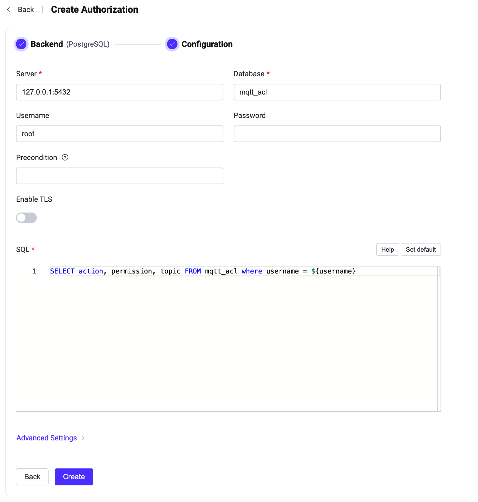

# PostgreSQLとの連携

この認可機能は、PostgreSQLデータベースに格納されたルールリストとパブリッシュ／サブスクリプション要求を照合することで認可チェックを実装しています。

::: tip 前提条件

[EMQX認可の基本概念](./authz.md)の知識が必要です。

:::

## データスキーマとクエリ文

PostgreSQL認可機能はほぼあらゆるストレージスキーマをサポートします。ACLルールの保存方法やアクセス方法は、単一または複数のテーブル、ビューなど、ユーザーの判断に委ねられます。

ユーザーはクエリ文のテンプレートを用意し、以下のフィールドが含まれていることを保証する必要があります：
* `permission` はルールがマッチした場合に適用されるアクションを指定します。`deny` または `allow` のいずれかである必要があります。
* `action` はルールが関連するリクエストを指定します。`publish`、`subscribe`、または `all` のいずれかである必要があります。
* `topic` はルールに関連するトピックフィルターを指定します。ワイルドカードおよび[トピックプレースホルダー](./authz.md#topic-placeholders)をサポートする文字列である必要があります。
* `qos`（オプション）はルールが適用されるQoS（サービス品質）レベルを指定します。値は `0`、`1`、`2` のいずれか、またはカンマ区切りの文字列（例：`0,1`）で複数指定可能です。デフォルトはすべてのQoSレベルです。
* `retain`（オプション）は現在のルールが保持メッセージをサポートするかどうかを指定します。値は `0` または `1` で、デフォルトは保持メッセージを許可します。

認証情報を格納するためのテーブル構造の例：

```sql
CREATE TABLE mqtt_acl(
  id serial PRIMARY KEY,
  username text NOT NULL,
  permission text NOT NULL,
  action text NOT NULL,
  topic text NOT NULL,
  qos smallint,
  retain smallint
);
CREATE INDEX mqtt_acl_username_idx ON mqtt_acl(username);
```

このテーブルでは、MQTTクライアントは `username` によって識別されます。

例えば、ユーザー `user123` に対して `data/user123/#` トピックのパブリッシュを許可する認可ルールを追加したい場合、クエリ文は以下のようになります：

```bash
postgres=# INSERT INTO mqtt_acl(username, permission, action, topic, ipaddress) VALUES ('user123', 'allow', 'publish', 'data/user123/#', '127.0.0.1');
INSERT 0 1
```

対応する設定パラメータは以下の通りです：

```bash
query = "SELECT permission, action, topic, ipaddress, qos, retain FROM mqtt_acl WHERE username = ${username} and ipaddress = ${peerhost}"
```

## ダッシュボードでの設定

EMQXダッシュボードを使って、PostgreSQLをユーザー認可に利用する設定が可能です。

1. [EMQXダッシュボード](http://127.0.0.1:18083/#/authentication)にアクセスし、左側のナビゲーションツリーから **アクセス制御** -> **認可** をクリックして **認可** ページに入ります。

2. 右上の **作成** をクリックし、**バックエンド**として **PostgreSQL** を選択して **次へ** をクリックします。以下のように **設定** タブが表示されます。

   

3. 以下の手順に従い認可バックエンドを設定します：

   - PostgreSQLへの接続情報を入力します。

     - **サーバー**：EMQXが接続するサーバーアドレス（`host:port`）を指定します。
     - **データベース**：PostgreSQLのデータベース名。
     - **ユーザー名**：ユーザー名を指定します。
     - **パスワード**：ユーザーパスワードを指定します。

   - **TLSを有効化**：TLSを有効にする場合はトグルスイッチをオンにします。TLS有効化の詳細は[ネットワークとTLS](../../network/overview.md#tls-for-external-resource-access)を参照してください。

   - **SQL**：データスキーマに合わせてクエリ文を入力します。詳細は[データスキーマとクエリ文](#データスキーマとクエリ文)を参照してください。

   - **詳細設定**：接続プール、タイムアウト、プリペアドステートメントの動作を設定します。
     - **接続プールサイズ**（任意）：EMQXノードからPostgreSQLへの同時接続数を整数で指定します。デフォルトは `8` です。
     - **接続タイムアウト**（任意）：接続試行がタイムアウトとみなされるまでの待機時間を指定します。ミリ秒、秒、分、時間の単位が利用可能です。デフォルトは `15` 秒です。
     - **プリペアドステートメントを無効化**（任意）：データベースクエリでプリペアドステートメントの使用を無効にします。PostgreSQLのプロキシやミドルウェア（例：PGBouncerやSupabaseのトランザクションモード）がセッションレベルの機能（プリペアドステートメントなど）をサポートしない場合に有効にしてください。デフォルトは無効です。

4. **作成** をクリックして設定を完了します。

## 設定ファイルでの設定

EMQXの設定ファイルでPostgreSQL認可機能を設定することも可能です。

PostgreSQL認可機能は `postgresql` タイプで識別されます。設定パラメータの全リストは[EMQX Enterprise設定マニュアル](https://docs.emqx.com/en/enterprise/v@EE_VERSION@/hocon/)を参照してください。

設定例：

```bash
{
  type = postgresql

  database = "mqtt"
  username = "postgres"
  password = "public"
  server = "127.0.0.1:5432"
  query = "SELECT permission, action, topic FROM mqtt_acl WHERE username = ${username}"
  connect_timeout = "15s"
  disable_prepared_statements = false
}
```
