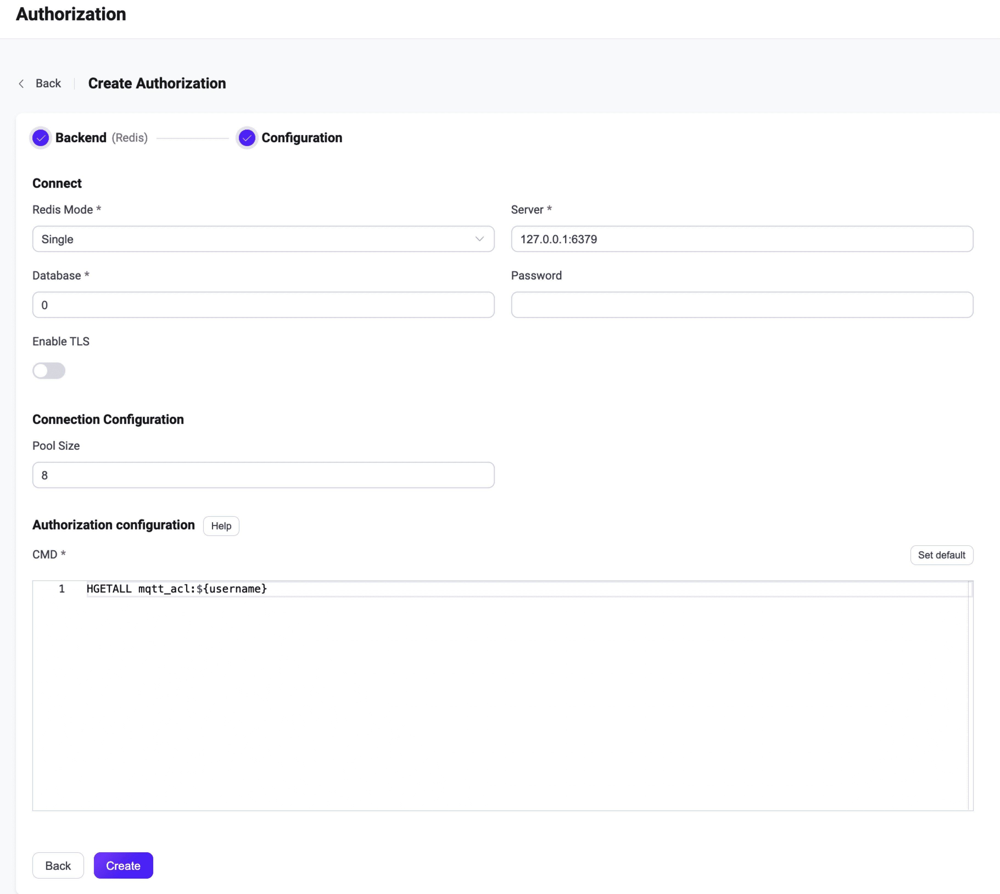

# Redisとの統合

このオーソライザーは、Redisデータベースに保存されたルールのリストとパブリッシュ／サブスクリプション要求を照合することで認可チェックを実装します。

::: tip 前提条件

[EMQXの基本的な認可概念](./authz.md)の知識が必要です。

:::

## データスキーマとクエリ文

ユーザーは以下のデータを返すクエリテンプレートを提供する必要があります。

- `topic`：ルールが適用されるトピックを指定します。トピックフィルターや[トピックプレースホルダー](./authz.md#topic-placeholders)を使用できます。
- `action`：ルールが適用されるアクションを指定します。利用可能な値は `publish`、`subscribe`、`all` です。
- `qos`（オプション）：現在のルールが適用されるQoSレベルを指定します。値は `0`、`1`、`2` のいずれか、または複数のQoSレベルを指定する数値配列です。デフォルトはすべてのQoSレベルです。
- `retain`（オプション）：ルールが保持メッセージをサポートするかどうかを指定します。値は `true` または `false` です。デフォルトは保持メッセージを許可します。

例えば、ルールは[Redisのハッシュ](https://redis.io/docs/latest/develop/data-types/hashes/)として保存できます。

ユーザー `emqx_u` にトピック `t/1` のサブスクライブ権限を追加する例：

```bash
HSET mqtt_acl:emqx_u t/1 subscribe
```

Redisの構造上の制限により、`qos` と `retain` フィールドを使用する場合、トピック以外のフィールドはJSON文字列で格納する必要があります。例えば：

- ユーザー `emqx_u` にトピック `t/2` のQoS 1およびQoS 2でのサブスクライブ権限を追加する例：

```bash
HSET mqtt_acl:emqx_u t/2 '{ "action": "subscribe", "qos": [1, 2] }'
```

- ユーザー `emqx_u` にトピック `t/3` への保持メッセージのパブリッシュを禁止する権限を追加する例：

```bash
HSET mqtt_acl:emqx_u t/3 '{ "action": "publish", "retain": false }'
```

対応する設定パラメータは以下の通りです：

```bash
cmd = "HGETALL mqtt_acl:${username}"
```

取得したルールは許可ルールとして扱われ、トピックフィルターとアクションが一致すればリクエストは許可されます。

:::tip
Redisオーソライザーに追加されたすべてのルールは**許可ルール**であるため、Redisオーソライザーはホワイトリストモードで使用する必要があります。
:::

## ダッシュボードでの設定

EMQXダッシュボードを使って、Redisをユーザー認可に利用する設定ができます。

1. [EMQXダッシュボード](http://127.0.0.1:18083/#/authentication)の左ナビゲーションツリーで **アクセス制御** -> **認可** をクリックし、**認可** ページに入ります。

2. 右上の **作成** をクリックし、**バックエンド**として **Redis** を選択します。次に **次へ** をクリックします。以下のように **設定** タブが表示されます。

   

3. 以下の指示に従って設定を行います。

   **接続**：Redisへの接続に必要な情報を入力します。

   - **Redisモード**：Redisの展開形態を選択します。**Single**、**Sentinel**、**Cluster**があります。
   - **サーバー**：EMQXが接続するサーバーアドレスを指定します（`host:port`）。
   - **データベース**：Redisのデータベース名。
   - **パスワード**：ユーザーパスワードを指定します。

   **TLS設定**：TLSを有効にする場合はトグルスイッチをオンにします。

   **接続設定**：同時接続数と接続タイムアウトまでの待機時間を設定します。

   - **プールサイズ**（任意）：EMQXノードからRedisへの同時接続数を整数で指定します。デフォルトは **8** です。

   **認可設定**：認可に関する設定を入力します。

   - **CMD**：データスキーマに従ったクエリコマンドを入力します。

4. **作成** をクリックして設定を完了します。

## 設定項目による設定

EMQXの設定項目を使ってRedisオーソライザーを設定できます。

Redisオーソライザーは `redis` タイプで識別されます。オーソライザーはRedisの3種類の展開モードに対応しています。<!--詳細な設定情報は以下を参照してください：[redis_single](../../configuration/configuration-manual.html#authz:redis_single)、[authz:redis_sentinel](../../configuration/configuration-manual.html#authz:redis_sentinel)、[authz:redis_cluster](../../configuration/configuration-manual.html#authz:redis_cluster)。-->

設定例：

:::: tabs type: card

::: tab Single

```bash
{
    type = redis

    redis_type = single
    server = "127.0.0.1:6379"

    cmd = "HGETALL mqtt_user:${username}"
    database = 1
    password = public

}
```

:::

::: tab Sentinel

```bash
{
    type = redis

    redis_type = sentinel
    servers = "10.123.13.11:6379,10.123.13.12:6379"
    sentinel = "mymaster"

    cmd = "HGETALL mqtt_user:${username}"
    database = 1
    password = public

}
```

:::

::: tab Cluster

```bash
{
    type = redis

    redis_type = cluster
    servers = "10.123.13.11:6379,10.123.13.12:6379"

    cmd = "HGETALL mqtt_user:${username}"
    password = public
}
```

:::

::::
