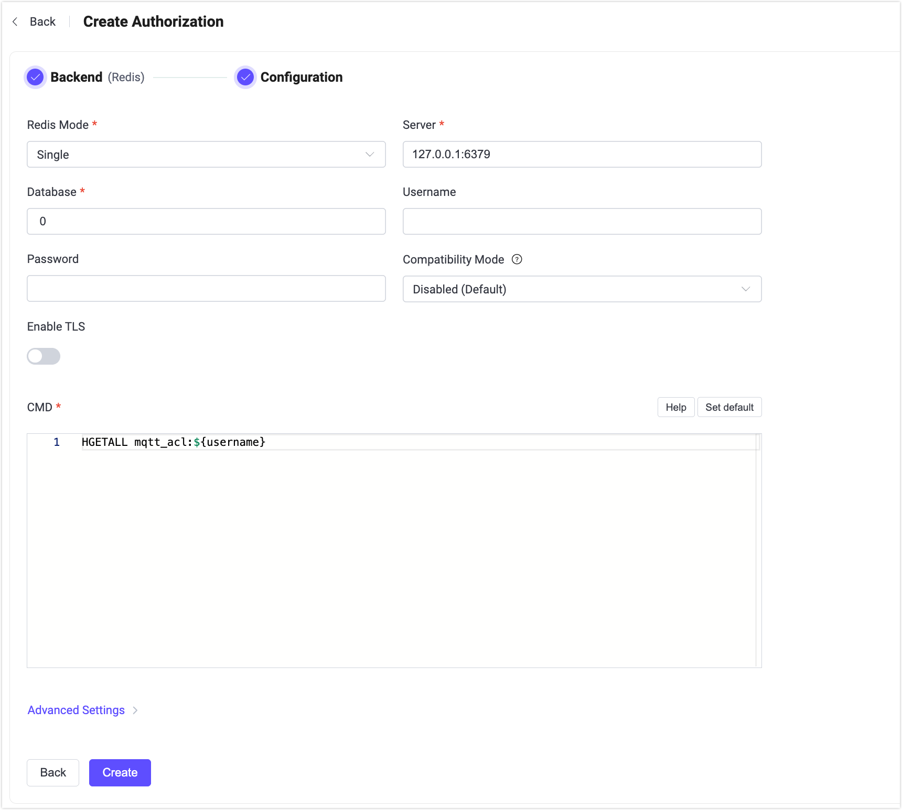

# Redisとの統合

このオーソライザーは、Redisデータベースに格納されたルールリストとパブリッシュ／サブスクリプション要求を照合することで認可チェックを実装しています。

::: tip 前提条件

[基本的なEMQX認可の概念](./authz.md)に関する知識

:::

## データスキーマとクエリ文

ユーザーは以下のデータを返すクエリテンプレートを提供する必要があります。

- `topic`：ルールが適用されるトピックを指定します。トピックフィルターや[トピックプレースホルダー](./authz.md#topic-placeholders)を使用可能です。
- `action`：ルールが適用されるアクションを指定します。利用可能な値は `publish`、`subscribe`、`all` です。
- `qos`（オプション）：現在のルールが適用されるQoSレベルを指定します。値は `0`、`1`、`2` のいずれか、または複数のQoSレベルを指定する数値配列です。デフォルトはすべてのQoSレベルです。
- `retain`（オプション）：ルールがリテインドメッセージをサポートするかどうかを指定します。値は `true`、`false` です。デフォルトはリテインドメッセージを許可します。

例えば、ルールは[Redisハッシュ](https://redis.io/docs/latest/develop/data-types/hashes/)として保存できます。

ユーザー `emqx_u` にトピック `t/1` のサブスクライブ権限を追加する例：

```bash
HSET mqtt_acl:emqx_u t/1 subscribe
```

Redisの構造上の制限により、`qos` と `retain` フィールドを使用する場合、トピック以外のフィールドはJSON文字列として配置する必要があります。例：

- ユーザー `emqx_u` にトピック `t/2` のQoS 1およびQoS 2でのサブスクライブ権限を追加する場合：

```bash
HSET mqtt_acl:emqx_u t/2 '{ "action": "subscribe", "qos": [1, 2] }'
```

- ユーザー `emqx_u` にトピック `t/3` へのリテインドメッセージのパブリッシュを拒否する権限を追加する場合：

```bash
HSET mqtt_acl:emqx_u t/3 '{ "action": "publish", "retain": false }'
```

対応する設定パラメータは以下の通りです：

```bash
cmd = "HGETALL mqtt_acl:${username}"
```

取得したルールは許可ルールとして扱われ、トピックフィルターとアクションが一致すればリクエストは許可されます。

:::tip
Redisオーソライザーに追加されるすべてのルールは**許可**ルールであるため、Redisオーソライザーはホワイトリストモードで使用する必要があります。
:::

## ダッシュボードでの設定

EMQXダッシュボードを使用して、ユーザー認可にRedisを使用する方法を設定できます。

1. EMQXダッシュボードの左側ナビゲーションツリーで **アクセス制御** -> **認可** をクリックし、**認可** ページに入ります。

2. 右上の **作成** をクリックし、**バックエンド**として **Redis** を選択してから **次へ** をクリックします。以下のように **設定** タブが表示されます。

   

3. 以下の指示に従って設定を行います。

   - **Redisモード**：Redisのデプロイ形態を選択します。`Single`、`Sentinel`、`Cluster` があります。

   - **サーバー**：EMQXが接続するRedisサーバーのアドレスを指定します（`host:port`）。

   - **データベース**：Redisのデータベース名。

   - **ユーザー名**：Redisの認証に[Redis ACL](https://redis.io/docs/latest/operate/oss_and_stack/management/security/acl/#create-and-edit-user-acls-with-the-acl-setuser-command)（Redis 6.0以降）を使用している場合に指定します。Redisサーバーがデフォルトユーザー（ACL無効または未適用）を使用している場合は空欄のままで構いません。

     ::: tip

     `username` フィールドはEMQX 5.2.0以降でサポートされています。Redis ACLを使用する場合はこのバージョン以降を利用してください。

     :::

   - **パスワード**：Redisユーザーのパスワードを指定します。認証が有効なRedisインスタンスに接続する際に必須です。

     - ユーザー名を入力した場合、このパスワードはRedis ACL設定の認証情報と一致している必要があります。
     - ユーザー名が未指定の場合、このパスワードは`default`ユーザー（有効な場合）の認証に使用されます。

   - **互換モード**：EMQX 4.xのRedis ACLデータ形式との互換性を有効にするかどうかを制御します。

     - `Disabled (Default)`：現在のルール形式を使用します。
     - `v4`：レガシーなEMQX 4.x Redis ACLデータとの互換性を有効にし、アップグレード時に既存データを変更せずに再利用可能にします。

     ::: tip

     このオプションは、EMQX 4.xで作成された既存のRedis ACLデータを変更せずに再利用するアップグレードシナリオ向けです。新規デプロイでは無効のままにし、現在のルール形式を使用することを推奨します。

     :::

   - **TLSを有効化**：TLSを有効にする場合はトグルスイッチをオンにします。

   - **CMD**：データスキーマに従ってクエリコマンドを入力します。

   - **詳細設定**：同時接続数および接続タイムアウトまでの待機時間を設定します。
     - **プールサイズ**（任意）：EMQXノードからRedisへの同時接続数を整数で指定します。デフォルトは `8` です。

4. **作成** をクリックして設定を完了します。

## 設定項目による設定

EMQXの設定項目を使ってRedisオーソライザーを設定できます。

Redisオーソライザーはタイプ `redis` で識別されます。オーソライザーは3種類のRedisデプロイモードに対応しています。

設定例：

:::: tabs type: card

::: tab Single

```hocon
{
    type = redis

    redis_type = single
    server = "127.0.0.1:6379"

    cmd = "HGETALL mqtt_user:${username}"
    database = 1
    password = public
    
    compatibility_mode = disabled
}
```

:::

::: tab Sentinel

```hocon
{
    type = redis

    redis_type = sentinel
    servers = "10.123.13.11:6379,10.123.13.12:6379"
    sentinel = "mymaster"

    cmd = "HGETALL mqtt_user:${username}"
    database = 1
    password = public
    
    compatibility_mode = disabled
}
```

:::

::: tab Cluster

```hocon
{
    type = redis

    redis_type = cluster
    servers = "10.123.13.11:6379,10.123.13.12:6379"

    cmd = "HGETALL mqtt_user:${username}"
    password = public
    
    compatibility_mode = disabled
}
```

:::

::::

> `compatibility_mode` は、EMQX 4.xからアップグレードしてレガシーなRedis ACLデータを再利用する場合に `v4` に設定できます。
