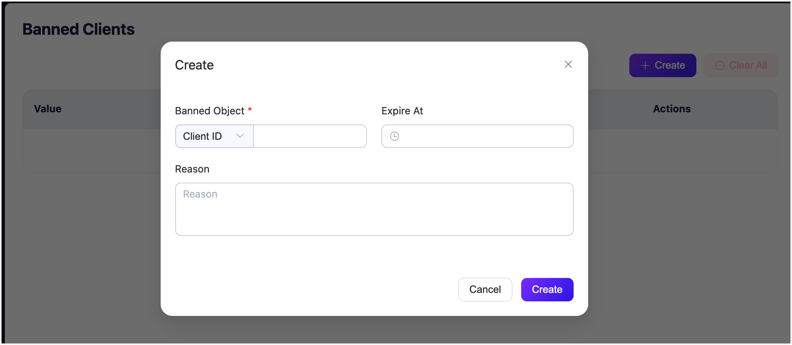

# Banned Clients

EMQXは、特定のクライアントからのアクセスを制限するためのバン機能を提供しています。クライアントは、クライアントID、ユーザー名、または送信元IPアドレスを使用してバンリストに追加できます。

バンは、以下の条件を含むルールを通じても適用できます。

- クライアント識別子やユーザー名にマッチする正規表現パターン。

  ::: tip

  正規表現によるバンは、すでに接続されているクライアントには適用されません。

  :::

- 送信元IPアドレスにマッチするCIDRレンジ。

::: tip
大量のマッチングルールがある場合、パフォーマンスに悪影響を及ぼす可能性があります。これは、直接バンとは異なり、接続を試みる各クライアントに対してすべてのルールをチェックするためです。
:::

本ページでは、EMQXダッシュボードを通じたバンクライアントの管理に焦点を当てています。バン機能は[REST API](https://docs.emqx.com/en/enterprise/v5.2/admin/api-docs.html#tag/Banned)からも利用可能です。

| API                      | 機能                                                         |
| ------------------------ | ------------------------------------------------------------ |
| DEL /banned              | すべてのバンデータをクリアします。                           |
| GET /banned              | 現在バンされているクライアントID、ユーザー名、IPアドレスの一覧を取得します。 |
| POST /banned             | クライアントID、ユーザー名、またはIPアドレスをブラックリストに追加します。 |
| DEL /banned/{as}/{who}   | クライアントID、ユーザー名、またはIPアドレスをブラックリストから削除します。 |

フラッピング検知は、クライアントID、ユーザー名、または送信元IPアドレスが設定された接続閾値に達した際に、自動的に直接バンエントリを作成します。これらのエントリは**Banned Clients**ページおよび`GET /banned`のレスポンスに表示されます。REST APIのレスポンスでは、`as`がバンタイプ（`clientid`、`username`、`peerhost`）を示し、`by`は`flapping detector`となります。期限切れ前にエントリを削除することも可能です。詳細は[Flapping Detect](./flapping-detect.md)をご参照ください。

::: tip
バンリストは少数のクライアントのバンにのみ適用されます。多数のクライアントの認証管理が必要な場合は、[認証](./authn/authn.md)機能の利用を推奨します。
:::

## バンクライアントの作成

1. EMQXダッシュボードにアクセスし、左側のナビゲーションメニューから **Access Control** -> **Banned Clients** をクリックして**Banned Clients**ページに入ります。
2. 右上の **Create** をクリックします。**Create**ダイアログでバン対象のクライアントを指定します。
   - **Banned Object**: ドロップダウンリストから、**Client ID**、**Username**、**IP Address**、**Client ID Pattern**、**Username Pattern**、または**IP Address Range**のいずれかを選択し、該当する値を入力します。
   - **Expire At**（任意）: 時計アイコンをクリックして、このバンの有効期限日時を選択します。
   - **Reason**（任意）: このクライアントをバンする理由を入力します。
3. **Create** をクリックして設定を完了します。

## バンクライアントのクリア

**Actions**列の**Delete**ボタンをクリックすると、単一のバンクライアントレコードを削除できます。ページ上のすべてのレコードを一括でクリアしたい場合は、**Clear All**ボタンをクリックしてください。
