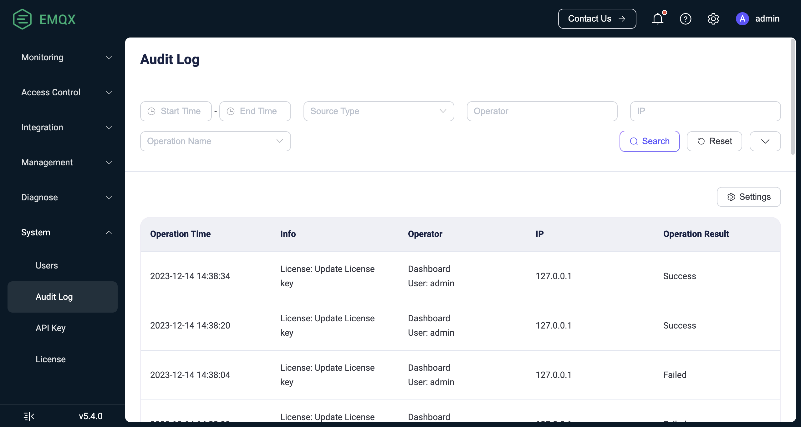

# Audit Log

Audit Log機能は、EMQXクラスターにおける重要な運用変更をリアルタイムで追跡することを可能にします。Audit Logを通じて、エンタープライズユーザーは誰がどの重要な操作を、どのように、いつ実行したかを簡単に把握できます。これは、エンタープライズユーザーが規制要件を遵守し、運用中のデータセキュリティ監査を確実に行うための重要なツールです。

EMQX Audit Logは、[ダッシュボード](../dashboard/introduction.md)、[REST API](../admin/api.md)、および[CLI](../admin/cli.md)からの変更関連操作を記録することをサポートしています。例えば、ダッシュボードのユーザーログインやクライアント、アクセス制御、データ統合の変更などです。ただし、メトリクス取得やクライアントリストの照会などの読み取り専用操作は記録されません。

EMQXは、ダッシュボードビューとログシステムとの統合を提供し、エンタープライズがAudit Logを管理しやすくしています。これらの方法を通じて、EMQXは柔軟かつ包括的なAudit Logのサポートを提供し、エンタープライズユーザーがニーズに応じて最適な管理・閲覧方法を選択できるようにしています。

## Audit Logの有効化

Audit Log機能は、ダッシュボードおよび設定ファイルの両方から有効化および設定パラメータの調整が可能です。

### ダッシュボードからAudit Logを有効化する

ダッシュボードでAudit Logを有効化し、設定パラメータを変更するには、**Management** -> **Logging** -> **Audit Log**、または**System** -> **Audit Log**に移動してください。


Audit Logには以下のオプションを設定できます：

- **Enable Log Handler**：Audit Log処理プロセスの有効化・無効化。デフォルトで有効です。
- **Audit Log File Name**：Audit Logファイルのパスと名前を指定します。デフォルト値は`${EMQX_LOG_DIR}/audit.log`で、`${EMQX_LOG_DIR}`は変数であり、デフォルトは`./log`です。つまり最終的には`./log/audit.log.1`に保存されます。
- **Maximum Log Files Number**：ローテーションされるログファイルの最大数。デフォルトは`10`です。
- **Rotation Size**：ログファイルのサイズを設定し、指定サイズに達するとログファイルがローテーションされます。無効にするとログファイルは無制限に増加します。テキストボックスに値を入力し、ドロップダウンリストから`MB`、`GB`、`KB`などの単位を選択できます。デフォルトは`50MB`です。
- **Cache Size**：データベースに保存される最大レコード数を決定し、ダッシュボードおよび`/audit` APIからアクセス・取得可能です。デフォルトは`5000`です。

  ::: tip 注意
  `log.audit.max_filter_size` は後方互換性のためエイリアスとして保持されています。
  :::

- **Ignore High Frequency Request**：高頻度リクエストを無視するかどうかを制御し、パブリッシュ／サブスクライブやクライアントキックアウトに関連するリクエストでAudit Logの洪水を防ぎます。デフォルトで有効です。
- **Timestamp Format**：ログエントリーのタイムスタンプ形式です。選択肢は以下の通りです。
  - `auto`：ログフォーマッターに基づいて最適な形式を自動選択します。JSON には `epoch`、テキストには `rfc3339` が使用されます。
  - `epoch`：Unix エポックからのマイクロ秒単位の時刻です。
  - `rfc3339`：RFC3339 形式です。
- **Time Offset**：ログエントリーのタイムスタンプをフォーマットする際に使用するタイムオフセットです。選択肢は以下の通りです。
  - `system`：ローカルシステムが使用するタイムオフセット。
  - `utc`：UTC のタイムオフセット。
  - `+-[hh]:[mm]`：ユーザー指定のタイムオフセット。例として `"-02:00"` や `"+00:00"` など。

  デフォルトは `system` です。
- **Payload Encode**：ログエントリーにおけるペイロードデータのエンコード方式です。`text`、`hex`、`hidden` から選択できます。デフォルトは `text` です。

### 設定ファイルからAudit Logを有効化する

`base.hocon`ファイルの`log.audit`セクションでAudit Logを有効化し、設定オプションを変更することも可能です。以下は例です。

```hocon
log.audit {
  path = "./log/audit.log"
  rotation_count = 10
  rotation_size = 50MB
  cache_size = 5000
  ignore_high_frequency_request = true
  timestamp_format = auto
  time_offset = system
  payload_encode = text
}
```

## ダッシュボードでAudit Logを閲覧する

Audit Logを有効化すると、ダッシュボードの**System** -> **Audit Log**でAudit Logの内容を閲覧できます。



### 検索フィルター

ログ操作をフィルターおよび検索できます。サポートされる検索キーワードは以下の通りです：

- **開始時間** - **終了時間**：操作が発生した時間範囲。
- **ソースタイプ**：操作が実行された方法。`Dashboard`、`REST API`、`CLI`、`Erlang Console`が選択肢です。ここで`Erlang Console`はEMQによる現地技術サポート時に使用されるErlang Shellコンソールを指します。
- **オペレーター**：ダッシュボードのユーザー名またはREST API呼び出しに使用されたキー名。操作方法がDashboardまたはREST APIの場合のみ有効です。
- **IP**：ダッシュボードユーザーまたはREST APIを呼び出したクライアントのソースIP。操作方法がDashboardまたはREST APIの場合のみ表示されます。
- **操作名**：Audit Logでサポートされる操作名のドロップダウンリストから選択します。
- **操作結果**：`Success`または`Failure`から選択します。

### リストの説明

表示されるAudit Logリストの各列の説明は以下の通りです：

- **操作時間**：操作が行われた時間。
- **情報**：
  - DashboardまたはREST APIの場合、この列は操作名を表示します。
  - CLIおよびConsoleの場合、この列は実行されたコマンドを記録します。
- **オペレーター**：操作方法と対応するオペレーターを含みます。CLIおよびConsole操作の場合、オペレーターはコマンドが実行されたEMQXノードの名前です。
- **IP**：ダッシュボードユーザーまたはREST APIを呼び出したクライアントのソースIP。操作方法がDashboardまたはREST APIの場合のみ表示されます。
- **操作結果**：`Success`または`Failure`。Failureにはフォーム検証失敗やリソース削除不可などのシナリオが含まれます。DashboardまたはREST APIの場合のみ表示され、CLIおよびConsoleは操作結果を記録できません。

## ログファイルでAudit Logを閲覧する

EMQXでAudit Logを有効化すると、変更関連の操作は`./log/audit.log.1`ファイルにログ形式で保存されます。エンタープライズユーザーはAudit Logの詳細分析を容易に行え、既存のログ管理システムに統合してコンプライアンスやデータセキュリティ要件を満たすことが可能です。

::: warning 注意

コマンドライン操作のAudit Logには機密情報が含まれる場合があるため、ログコレクターに送信する際は注意してください。ログ内容のフィルタリングや暗号化通信の利用など、不正な情報漏洩を防止する対策を推奨します。

:::

Audit Logに含まれるフィールドは、操作記録のソースによって異なります。

### ダッシュボードまたはREST APIからの操作記録

ダッシュボードまたはREST APIの操作を記録するAudit Logには、操作ユーザー、操作対象、操作結果の情報が含まれます。ログメッセージのフォーマット例は以下の通りです。

```bash
{"time":1702604675872987,"level":"info","source_ip":"127.0.0.1","operation_type":"mqtt","operation_result":"success","http_status_code":204,"http_method":"delete","operation_id":"/mqtt/retainer/message/:topic","duration_ms":4,"auth_type":"jwt_token","query_string":{},"from":"dashboard","source":"admin","node":"emqx@127.0.0.1","http_request":{"method":"delete","headers":{"user-agent":"Mozilla/5.0 (Macintosh; Intel Mac OS X 10_15_7) AppleWebKit/537.36 (KHTML, like Gecko) Chrome/119.0.0.0 Safari/537.36","sec-fetch-site":"same-origin","sec-fetch-mode":"cors","sec-fetch-dest":"empty","sec-ch-ua-platform":"\"macOS\"","sec-ch-ua-mobile":"?0","sec-ch-ua":"\"Google Chrome\";v=\"119\", \"Chromium\";v=\"119\", \"Not?A_Brand\";v=\"24\"","referer":"http://localhost:18083/","origin":"http://localhost:18083","host":"localhost:18083","connection":"keep-alive","authorization":"******","accept-language":"zh-CN,zh;q=0.9,zh-TW;q=0.8,en;q=0.7","accept-encoding":"gzip, deflate, br","accept":"*/*"},"body":{},"bindings":{"topic":"$SYS/brokers/emqx@127.0.0.1/version"}}}
```

以下の表は上記ログメッセージサンプルに含まれるフィールドを示しています。

| フィールド名          | 型       | 説明                                                         |
| --------------------- | -------- | ------------------------------------------------------------ |
| time                  | Integer  | ログ記録のタイムスタンプ（マイクロ秒単位）                   |
| level                 | String   | ログレベル                                                   |
| source_ip             | String   | 操作のソースIPアドレス                                       |
| operation_type        | String   | 操作の機能モジュール。REST APIのタグに対応                   |
| operation_result      | String   | 操作結果。`success`は成功、`failure`は失敗を示す             |
| http_status_code      | String   | HTTPレスポンスステータスコード                               |
| http_method           | String   | HTTPリクエストメソッド                                       |
| duration_ms           | Integer  | 操作実行時間（ミリ秒単位）                                   |
| auth_type             | String   | 認証タイプ。認証に使用された方法や仕組みを示し、`jwt_token`（Dashboard）または`api_key`（REST API）で固定 |
| query_string          | Object   | HTTPリクエストのURLクエリパラメータ                          |
| from                  | String   | リクエストの発生元。`dashboard`、`rest_api`はそれぞれダッシュボード、REST APIを示す。`cli`、`erlang_console`の場合はCLIまたはErlang Shellからの操作であり、このログ構造は適用されない。 |
| source                | String   | 操作を行ったダッシュボードのユーザー名またはAPIキー名       |
| node                  | String   | 操作が実行されたノード名（ノードまたはサーバー）             |
| method                | String   | HTTPリクエストメソッド。`post`、`put`、`delete`はそれぞれ作成、更新、削除操作に対応 |
| operate_id            | String   | リクエストのREST APIパス。詳細は[REST API](../admin/api.md)を参照 |

### CLIまたはErlang Consoleからの操作記録

CLIまたはErlang Consoleの操作を記録するAudit Logには、実行されたコマンド、呼び出しパラメータなどの情報が含まれます。ログメッセージのフォーマット例は以下の通りです。

```bash
{"time":1695866030977555,"level":"info","msg":"from_cli","from": "cli","node":"emqx@127.0.0.1","duration_ms":0,"cmd":"retainer","args":["clean", "t/1"]}
```

以下の表は上記ログメッセージサンプルに含まれるフィールドを示しています。

| フィールド名  | 型       | 説明                                                         |
| ------------ | -------- | ------------------------------------------------------------ |
| time         | Integer  | ログ記録のタイムスタンプ（マイクロ秒単位）                   |
| level        | String   | ログレベル                                                   |
| msg          | String   | 操作の説明                                                   |
| from         | String   | リクエストの発生元。`cli`、`erlang_console`はそれぞれCLI、Erlang Shellを示す。`dashboard`、`rest_api`の場合はダッシュボードまたはREST APIからの操作であり、このログ構造は適用されない。 |
| node         | String   | 操作が実行されたノード名（ノードまたはサーバー）             |
| duration_ms  | Integer  | 操作の実行時間（ミリ秒単位）                                 |
| cmd          | String   | 実行された具体的なコマンド操作。対応コマンドは[CLI](../admin/cli.md)を参照 |
| args         | Array    | コマンドに付随する追加パラメータ。複数パラメータは配列で区切られる |
