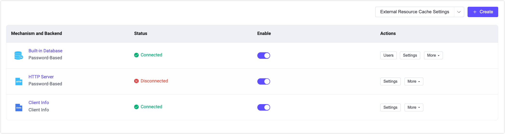
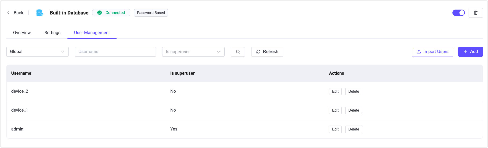

# 認証

<<<<<<< HEAD
EMQX ダッシュボードは、すぐに使える認証およびユーザー管理機能を提供しています。ユーザーはコードを書いたり設定ファイルを手動で編集したりすることなく、ユーザーインターフェースを通じてクライアント認証の仕組みを迅速に設定できます。これにより、さまざまなデータソースや認証サービスと統合して、異なるレベルやシナリオで安全な構成を実現し、開発効率を高めつつセキュリティ保証を強化できます。**認証**ページでは、さまざまな認証リソースを素早く作成・管理できます。
=======
EMQXダッシュボードは、すぐに使える認証およびユーザー管理機能を提供しています。ユーザーはコードを書いたり設定ファイルを手動で編集したりすることなく、ユーザーインターフェースを通じてクライアント認証機構を迅速に設定できます。これにより、さまざまなデータソースや認証サービスと統合して、異なるレベルやシナリオでの安全な構成を実現し、開発効率の向上とセキュリティの強化を両立できます。**認証**ページでは、さまざまな認証リソースを素早く作成・管理できます。
>>>>>>> origin/release-5.9

:::tip
認証バックエンドを設定した後は、デバイスやMQTTクライアントがEMQXに安全に接続できるように、対応する認証情報を設定する必要があります。
:::

## 認証の作成

<<<<<<< HEAD
**作成**ボタンをクリックすると、**認証の作成**ページに移動します。認証を作成するには、まず認証の仕組みを選択し、その後認証データを保存または取得するバックエンドを選択します（JWT認証を除く）。認証データはデータベースやHTTPサーバーなどのバックエンドから取得されます。最後に、バックエンドに接続するための接続情報を設定します。

### 認証の仕組み

EMQXが提供する以下の仕組みから選択できます。

1. パスワードベース：クライアントIDまたはユーザー名とパスワードを使用します。
2. JWT：クライアントがユーザー名またはパスワードにJWTトークンを含める方式です。
3. SCRAM：MQTT 5.0での強化認証で、クライアントとサーバー間の双方向認証を可能にします。
=======
**作成**ボタンをクリックすると、**認証の作成**ページに移動します。認証を作成するには、まず認証機構を選択し、その後認証データを保存または取得するバックエンドを選択します（JWT認証を除く）。データはデータベースやHTTPサーバーなどのバックエンドから取得できます。最後に、バックエンドに接続するための接続情報を設定します。

### 認証機構

EMQXが提供する以下の認証機構から選択できます：

1. パスワードベース：クライアントIDまたはユーザー名とパスワードを使用します。
2. JWT：クライアントがユーザー名またはパスワードにJWTトークンを含める方式です。
3. SCRAM：MQTT 5.0で強化された認証機能で、クライアントとサーバー間の双方向認証を可能にします。
>>>>>>> origin/release-5.9

### バックエンド

<<<<<<< HEAD
このステップでは、前のステップで選択した認証の仕組みに基づいてバックエンドを選択します。
=======
このステップでは、前のステップで選択した認証機構に基づいてバックエンドを選択します。
>>>>>>> origin/release-5.9

:::tip

すでに認証に使用されているバックエンドは再選択できません。

:::

<<<<<<< HEAD
バックエンドの詳細については、[EMQX Authenticators](../access-control/authn/authn.md#emqx-authenticator)を参照してください。

#### パスワードベース

`Password-Based`を選択した場合、認証データを保存するデータベースか認証データを提供するHTTPサーバーのいずれかを選択できます。データベースは以下の2種類があります。
=======
バックエンドの詳細については、[EMQX認証機構](../access-control/authn/authn.md#emqx-authenticator)をご参照ください。

#### パスワードベース

`Password-Based`を選択した場合、データを保存するデータベースか、データを提供するHTTPサーバーのいずれかを選択できます。データベースは以下の2種類があります。
>>>>>>> origin/release-5.9

- EMQX組み込みのデータベース、すなわち`Built-in Database`
- 外部データベースで、`MySQL`、`PostgreSQL`、`MongoDB`、`Redis`などの主要なデータベースを選択・接続可能です。

<<<<<<< HEAD
また、認証データを提供できるHTTPサービス、すなわち`HTTP Server`を直接利用することもできます。
=======
また、認証データを提供できるHTTPサービスである`HTTP Server`を直接利用することもできます。
>>>>>>> origin/release-5.9

#### JWT

JWTを選択した場合、バックエンドの選択は不要です。

#### SCRAM

<<<<<<< HEAD
MQTT 5.0の強化認証機能で、選択した場合は現在のところ`Built-in Database`のみ利用可能です。これはEMQXの組み込みデータベース（Mnesia）を使用してデータを保存します。

強化認証はクライアントとサーバーの双方向認証を実現し、サーバーは接続しているクライアントが正当なクライアントであることを検証でき、クライアントは接続先のサーバーが正当なサーバーであることを検証できるため、より高いセキュリティを提供します。

MQTT 5.0の強化認証の詳細については、[SCRAM Authentication](../access-control/authn/scram.md)および[MQTT 5.0 Enhanced Authentication - Kerberos](../access-control/authn/kerberos.md)を参照してください。

### 設定

最後に選択したバックエンドの設定を行います。各バックエンドには接続や利用に関する設定項目があり、ユーザーが設定する必要があります。設定が完了したら、**作成**をクリックしてください。
=======
MQTT 5.0で強化された認証機能で、選択した場合は現在のところ`Built-in Database`のみ利用可能です。これはEMQXの組み込みデータベース（Mnesia）を使用してデータを保存します。

強化認証はクライアントとサーバーの双方向認証を可能にし、接続されたクライアントが正当なクライアントであることをサーバーが検証し、クライアントも接続されたサーバーが正当なサーバーであることを検証できるため、より高いセキュリティを提供します。

MQTT 5.0の強化認証の詳細は、[SCRAM認証](../access-control/authn/scram.md)および[MQTT 5.0強化認証 - Kerberos](../access-control/authn/kerberos.md)をご参照ください。

### 設定

最後のステップでは、選択したバックエンドの設定を行います。各バックエンドには接続や利用に関する設定項目があり、ユーザーが設定する必要があります。設定が完了したら、**作成**をクリックしてください。
>>>>>>> origin/release-5.9

#### 組み込みデータベース

例えば`Built-in Database`を使用する場合、ユーザー名かクライアントIDのどちらを使用するか、パスワードの暗号化方式などを設定します。MQTT 5.0の強化認証で組み込みデータベースを使用する場合は、暗号化方式のみ設定すればよいです。

<<<<<<< HEAD
組み込みデータベースの詳細は、[Use Built-in Database](../access-control/authn/mnesia.md)を参照してください。

#### 外部データベース

外部データベースを使用する場合は、データベースのサーバーアドレス、データベース名、ユーザー名とパスワード、認証設定、データベースからデータを取得するためのSQL文やその他のクエリ文を設定する必要があります。

MySQLやその他の外部データベースの詳細は、[Integrate with MySQL](../access-control/authn/mysql.md)や各データベースの設定ドキュメントを参照してください。

#### HTTPサーバー

HTTPサーバーを使用する場合は、HTTPサービスのリクエストメソッド（POSTまたはGET）を設定します。リクエストURLはプロトコルを含めてhttpまたはhttpsで記入してください。さらにHTTPリクエストヘッダーの設定があります。認証情報は`Body`フィールドに入力し、例えば`username`や`password`をJSONデータとして記入します。

HTTPサーバーの詳細は、[Use HTTP Service](../access-control/authn/http.md)を参照してください。

#### JWTおよびJWKS

JWTを使用する場合は、バックエンドを選択せずに直接JWTを設定できます。JWTトークンがクライアントの`username`または`password`のどちらから取得されるかを設定します。これにより、クライアントは接続時に対応するフィールドにトークンを入力するだけでJWT認証が行えます。暗号化方式に応じて`Secret`または`Public Key`を設定し、`Secret`がBase64エンコードされているかどうかを指定します。最後に検証すべき情報を`Payload`に入力してJWT認証の設定を完了します。

`JWKS Endpoint`から最新のJWKSを定期的に取得できます。これはRSAまたはECDSAアルゴリズムで署名された認可サーバー発行のJWTを検証するための公開鍵のセットです。JWKSの更新間隔（秒単位）も設定可能です。最後に`Payload`項目を設定してJWKSの設定を完了します。

JWTの詳細は、[JWT Authentication](../access-control/authn/jwt.md)を参照してください。

## 認証器リスト

認証器を作成すると、認証器リストで確認および管理できます。

リストでは各認証器のバックエンドと認証の仕組み、バックエンドの状態が表示されます。例えば外部データベースの接続に失敗した場合は状態が`Disconnected`と表示されます。このフィールドにカーソルを合わせると、EMQXクラスター内のすべてのノードがこのデータソースに接続している状況の詳細が表示されます。**Enable**スイッチを切り替えることで認証設定の有効・無効を素早く切り替えられます。

認証器リストの各エントリは、マウスでドラッグするか**Actions**列の順序調整で並び替え可能です。認証器リストの順序は重要で、EMQXは複数の認証器を認証チェーンとして順次処理します。現在の認証器で認証情報が見つからない場合は、次の認証器に処理が引き継がれます。

**Actions**列では認証器の設定変更や削除も行えます。
=======
組み込みデータベースの詳細は、[組み込みデータベースの利用](../access-control/authn/mnesia.md)をご参照ください。

#### 外部データベース

外部データベースを使用する場合は、データベースのサーバーアドレス、データベース名、ユーザー名とパスワード、認証設定、およびデータベースからデータを取得するためのSQL文やその他のクエリ文を設定します。

MySQLやその他の外部データベースの詳細は、[MySQLとの統合](../access-control/authn/mysql.md)や各データベースの設定ドキュメントをご参照ください。

#### HTTPサーバー

HTTPサーバーを利用する場合は、HTTPサービスのリクエストメソッド（POSTまたはGET）を設定します。リクエストURLは、httpまたはhttpsのプロトコルを含めて指定してください。さらにHTTPリクエストヘッダーの設定があります。認証情報は`Body`フィールドに入力し、例えば`username`や`password`をJSON形式で記述します。

HTTPサーバーの詳細は、[HTTPサービスの利用](../access-control/authn/http.md)をご参照ください。

#### JWTおよびJWKS

JWTを使用する場合は、バックエンドを選択せずにJWTを直接設定できます。クライアントの`username`または`password`のどちらからJWTトークンを取得するかを設定します。これにより、クライアントは接続時に対応するフィールドにトークンを入力するだけでJWT認証が可能になります。暗号化方式に応じて`Secret`または`Public Key`を設定し、`Secret`がBase64エンコードされているかどうかを指定します。最後に検証対象の情報を`Payload`に入力してJWT認証の設定を完了します。

`JWKS Endpoint`から最新のJWKS（JSON Web Key Set）を定期的に取得できます。これはRSAまたはECDSAアルゴリズムで署名された認可サーバー発行のJWTを検証するための公開鍵セットです。JWKSの更新間隔（秒単位）も設定可能です。最後に`Payload`の項目を設定してJWKSの設定を完了します。

JWTの詳細は、[JWT認証](../access-control/authn/jwt.md)をご参照ください。

## 認証機構一覧

認証機構を作成すると、認証機構一覧で確認および管理できます。

一覧では、各認証機構のバックエンドと認証機構の種類、バックエンドの状態が表示されます。例えば、外部データベースの接続に失敗した場合は状態が`Disconnected`と表示されます。このフィールドにマウスを乗せると、EMQXクラスター内のすべてのノードがこのデータソースに接続している状態の詳細が表示されます。**有効**スイッチを切り替えることで認証設定の有効・無効を素早く切り替えられます。

認証機構一覧の各エントリーは、マウスドラッグや**操作**列の順序調整で並び替え可能です。認証機構の順序は重要で、EMQXは複数の認証機構を認証チェーンとして順次処理します。現在の認証機構で認証情報が見つからない場合は、次の認証機構に処理が引き継がれます。

**操作**列では、認証機構の設定変更や削除も行えます。
>>>>>>> origin/release-5.9

:::tip 注意
認証を無効にすると、いかなるクライアントも認証されなくなり、すべてのクライアントがEMQXに接続可能になります。十分に注意して操作してください。
:::

## ユーザー管理

<<<<<<< HEAD
組み込みデータベースを利用しているユーザーは、認証器リストページの**ユーザー管理**をクリックして認証情報を管理できます。ユーザー名とパスワードの追加・削除が可能で、テンプレートをダウンロードして認証情報を記入し、**インポート**をクリックすることで認証関連のユーザー情報を一括作成できます。
=======
組み込みデータベースを使用しているユーザーは、認証機構一覧ページの**ユーザー管理**をクリックして認証情報を管理できます。ユーザー名とパスワードの追加・削除が可能で、テンプレートをダウンロードして認証情報を記入し、**インポート**をクリックすることで認証関連のユーザー情報を一括作成できます。
>>>>>>> origin/release-5.9

## 概要

<<<<<<< HEAD
リストページの**認証の仕組みとバックエンド**一覧で認証器名をクリックすると、概要ページに移動します。このページではEMQXクラスター内の認証器のメトリクス、例えば認証成功数・失敗数、不一致数、現在接続中の認証率などが表示されます。
=======
一覧ページの**認証機構とバックエンド**リストで認証機構名をクリックすると、概要ページに移動します。このページでは、EMQXクラスター内の認証機構に関するメトリクス（認証成功数・失敗数、不一致数、現在接続中の認証率など）を確認できます。
>>>>>>> origin/release-5.9

ページ下部のリストから各ノードのメトリクスデータを監視できます。

## 設定

<<<<<<< HEAD
リストページの**設定**をクリックすると認証設定の変更が可能です。

設定ページでは、外部データベースの接続情報が変更された場合や、組み込みデータベースの`UserID Type`をユーザー名またはクライアントIDに変更したい場合、パスワードの暗号化方式を変更したい場合などに現在の認証器設定を修正できます。

:::tip 注意
組み込みデータベースを使用している場合、**Password Hash**や**Salt Position**を更新すると追加済みの認証データが利用できなくなるため、十分に注意してください。
=======
一覧ページの**設定**をクリックすると、認証設定の変更が可能です。

設定ページでは、外部データベースの接続情報が変更になった場合や、組み込みデータベースの`UserID Type`をユーザー名またはクライアントIDに変更したい場合、パスワードの暗号化方式を変更したい場合などに、現在の認証機構の設定を修正できます。

:::tip 注意
組み込みデータベースを使用している場合、**パスワードハッシュ**や**ソルト位置**を更新すると、既存の認証データが利用できなくなるため、十分に注意してください。
>>>>>>> origin/release-5.9
:::

## さらに詳しく

<<<<<<< HEAD
認証の詳細については、[Authentication](../access-control/authn/authn.md)を参照してください。
=======
認証に関する詳細は、[認証](../access-control/authn/authn.md)をご参照ください。
>>>>>>> origin/release-5.9
