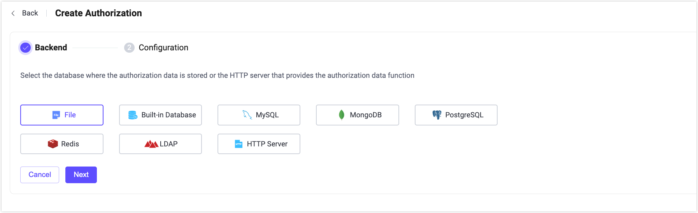
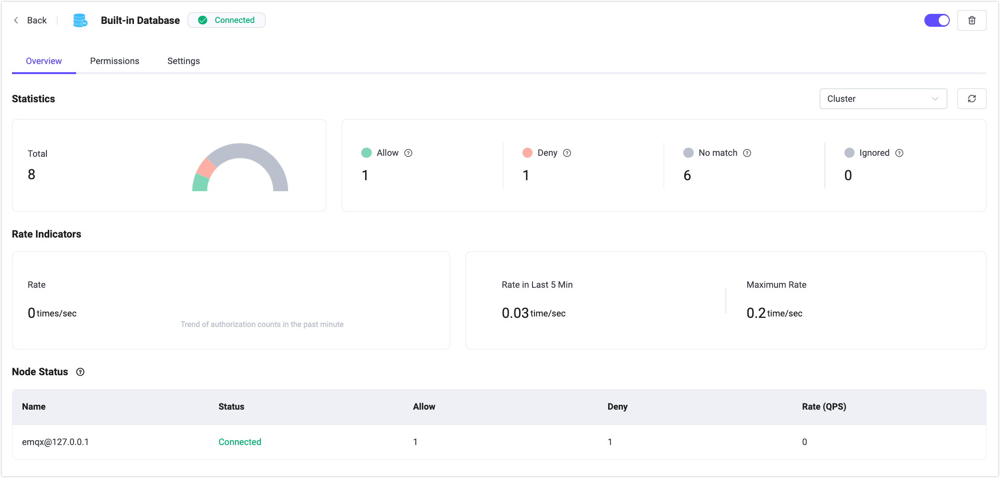
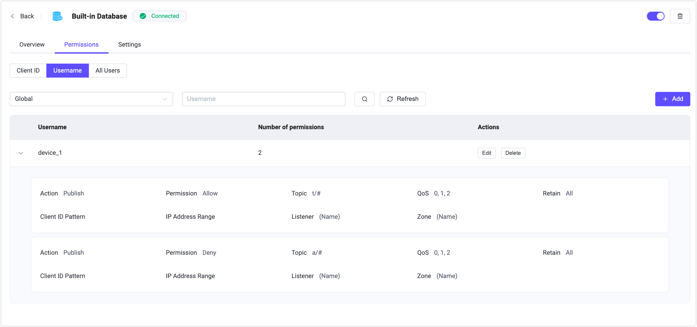

# 認可

EMQXは強力なアクセス制御機能を提供しており、EMQXダッシュボードではすぐに使える認可管理機能を備えています。ビジュアルインターフェースを通じて、コードを書いたり設定ファイルを手動で編集したりすることなく、EMQXの認可メカニズムを素早く構成できます。これにより、接続直後のMQTTクライアントのパブリッシュやサブスクライブなどの操作を制御でき、さまざまなレベルやシナリオに応じた安全な設定が可能です。**認可**ページでは、さまざまな認可リソースの作成と管理を迅速に行えます。

## 認可の作成

認可ページの右上にある**作成**ボタンをクリックすると、**認可の作成**ページに移動します。認可を作成するには、権限データを構成・保存するバックエンドを選択する必要があります。

### バックエンド

バックエンドには、ファイル、組み込みデータベース、外部データベース、HTTPサーバーの利用オプションがあります。

Access Control List（ACL）ファイルを使用すると、ファイル内に定義された一連のルールをスキャンし、各パブリッシュまたはサブスクライブのリクエストが許可されているかを判定して、認可内容を編集・保存できます。

EMQXの組み込みデータベースを使用して認可ルールを構成・保存することも可能です。

外部データベースを使用して認可ルールを保存することもでき、`MySQL`、`PostgreSQL`、`MongoDB`、`Redis`などの主要なデータベースをサポートしています。

あらかじめ定義されたHTTPサービスを使って認可リクエストを外部HTTPサーバーに委任することもできます。外部HTTPサービスは権限の検証機能を含む必要があります。

### 設定

バックエンドを選択した後は、認可の最終ステップとして選択したバックエンドの設定を行います。各バックエンドには接続や利用に関する設定があり、ユーザーが手動で構成する必要があります。または、ACLファイルのルール内容を編集・保存することも可能です。設定が完了したら**作成**をクリックして認可設定を素早く完了します。なお、一度使用した認可バックエンドは再度選択できません。

#### ファイル

ACLファイルを使用する場合、設定パラメータページにテキスト編集ボックスが用意されており、ファイルの認可ルール内容を編集できます。ルールはErlangのタプルデータのリスト形式です。（各ルールの末尾にはドット「.」が必要です）タプルは角括弧で囲まれ、要素はカンマで区切られています。

ファイルルールの編集方法の詳細は、[ACLファイル](../access-control/authz/file.md)を参照してください。

#### 組み込みデータベース

組み込みデータベースを認可に使用する場合、パラメータの設定は不要で、作成完了後にユーザーページで権限ルールを設定します。

#### 外部データベース

外部データベースを使用する場合、アクセス可能なデータベースのアドレス、データベース名、ユーザー名、パスワードを設定し、認可データを取得するためのSQL文やその他のクエリ文を入力します。パブリッシュやサブスクライブ時に、認可データがデータベースから照会され、権限ルールの合否が判断されます。MySQLを例に挙げます。

MySQLやその他外部データベースの設定詳細は、[MySQL連携](../access-control/authz/mysql.md)や各データベースの設定ドキュメントを参照してください。

#### HTTPサーバー

HTTPサーバーを使用する場合、あらかじめ認可データの照合をサポートするHTTPサーバーが必要です。サブスクライブやパブリッシュ時にEMQXがデータをHTTPサービスに転送し、HTTPの返却結果に基づいて操作が権限ルールを通過できるかを判断します。

サービスのアドレスとリクエスト方法（POSTまたはGET）、サービスのヘッダーを設定し、パブリッシュやサブスクライブに必要な認可情報（例：`username`、`topic`、`action`）をJSON形式で`Body`フィールドに設定します。

HTTPサーバー認可の設定方法の詳細は、[HTTPサービスの利用](../access-control/authz/http.md)を参照してください。

## 認可リスト

認可設定が完了すると、認可リストで確認および管理が可能です。このリストではバックエンドとそのステータスを確認できます。たとえば、外部データベースが未展開または接続に失敗している場合、バックエンドのステータスは`Disconnected`と表示されます。このフィールドにカーソルを合わせると、EMQXクラスター内の全ノードにおけるデータソースの接続状況を確認できます。**有効化**スイッチをクリックして認可設定の有効・無効を素早く切り替えられます。

認証リストと同様に、認可リストの各行はマウスでドラッグして順序を調整したり、アクション列から並び替えたりできます。EMQXは複数の認可メカニズムを作成可能で、クライアントがパブリッシュやサブスクライブ操作を行う際に順番にチェックします。たとえば、ある認可設定でクライアントに該当するACLが見つかれば、そのルールに従い許可または拒否を適用します。該当するルールが見つからなければ、次の認可設定を順にチェックします。

**アクション**列では、認可設定の編集、順序調整、削除も行えます。

:::tip 注意
認可を無効にすると、クライアントのパブリッシュ／サブスクライブ時の権限動作に影響を及ぼします。慎重に操作してください。
:::

## グローバル設定

リストページ右上の**設定**ボタンをクリックすると、認可のグローバル設定が可能です。

認可ルールにマッチしなかった場合の動作（許可または拒否）、拒否後にメッセージを無視するかクライアントを切断するかを設定できます。認可データのキャッシュを有効にするとバックエンドへのアクセス負荷を軽減できます。右側の**キャッシュクリア**をクリックすると、現在の認可結果キャッシュをすべて素早くクリアできます。

## 概要

リストページの**バックエンド**列にある認可設定名をクリックすると、その認可設定の概要ページに移動します。このページでは、EMQXクラスターにおける認可に関連する各種メトリクス（成功・失敗した認可数、ミスマッチ数、現在のレートなど）を確認できます。

ページ下部のノードステータスでは、リストにある各ノードの認可メトリクスデータを閲覧可能です。

## 権限

組み込みデータベースを使用している場合、リストページの**アクション**列にある**権限**をクリックすると、認可ルールの管理・設定が行えます。クライアントIDやユーザー名でクライアントを区別したり、すべてのユーザーに対する認可ルールを追加したりできます。

認可ルールを設定するには、認可設定が必要なトピックを入力し、そのトピックに対するメッセージのサブスクライブまたはパブリッシュ時に権限を適用するかを選択し、許可（`allow`）または拒否（`deny`）を設定します。

組み込みデータベースの認可設定方法の詳細は、[組み込みデータベースの利用](../access-control/authz/mnesia.md)を参照してください。

:::tip 注意

認可を無効にすると、クライアントのパブリッシュ／サブスクライブ権限に影響します。慎重に操作してください。

:::

## 設定

認可のバックエンドを変更する必要がある場合は、リストページの**アクション**列にある**設定**をクリックし、設定ページで構成を変更できます。たとえば、ACLファイルの権限ルール内容を修正したり、外部データベースの接続情報やクエリ文が変更された場合などです。

たとえば、認可設定のバックエンドを変更したり、ACLの権限ルールを変更したり、外部データベースの接続情報やクエリ文に変更があった場合、リストページの**アクション**列の**設定**をクリックして設定ページで構成情報を修正できます。

## さらに詳しく

認可の詳細については、[認可の概要](../access-control/authz/authz.md)をご覧ください。
