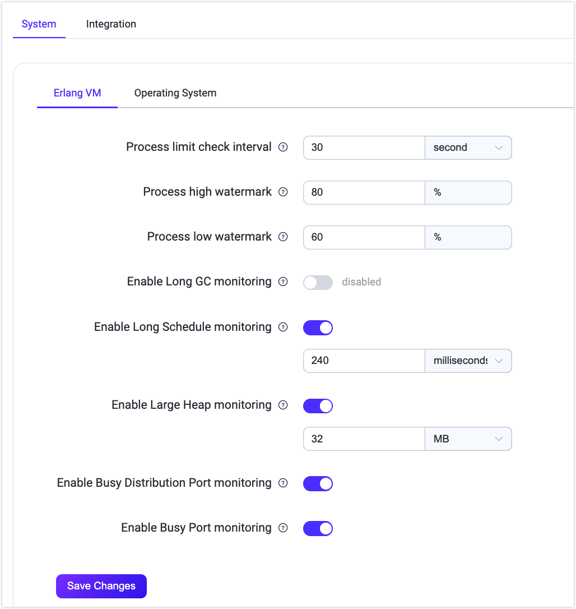
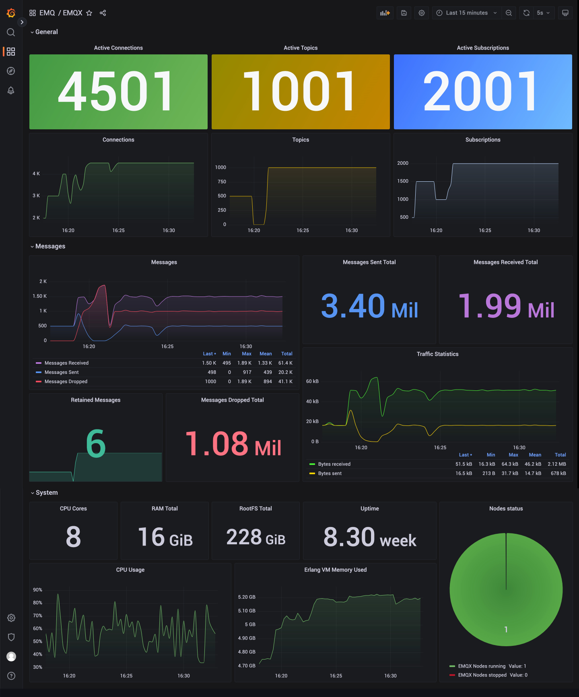

# クラスター設定

EMQXはホットコンフィギュレーション機能を提供しており、EMQXノードの再起動なしに実行時に設定を動的に変更できます。EMQXダッシュボードはホットコンフィギュレーション機能を備えた視覚的な設定ページを提供し、簡単にEMQXの設定を変更できます。

クラスター設定モジュールは以下のサブモジュールを提供します：

- MQTT設定
- クラスター
- ネームスペース
- ルールエンジンセキュリティ
- リスナー
- ロギング
- モニタリング
- クラスターリンク

## MQTT設定

**MQTT設定**ページはMQTTプロトコルに関連する設定機能を提供します。このページでは、以下を含むさまざまなMQTT関連パラメータを設定できます。

### 一般

**一般**タブページには、アイドルタイムアウト、最大パケットサイズ、最大クライアントID長、最大トピックレベル数、許容される最大QoSレベルなど、MQTTプロトコルの基本的な一般設定項目が含まれています。

### セッション

**セッション**タブページには、MQTTセッション管理に関連する設定項目が含まれています。セッション有効期限間隔（MQTT 5.0以外の接続のみサポート。MQTT 5.0接続はクライアント側で設定が必要）、最大サブスクリプション数、最大フライトウィンドウ、QoS 0メッセージの保存有無などです。

### Durable Sessions

**Durable Sessions**タブページには、[MQTT Durable Sessions](../durability/durability_introduction.md)機能に関連する設定項目が含まれています。メッセージ保持期間、メッセージクエリのバッチサイズ、アイドルポーリング間隔、セッションハートビート間隔などがあります。

### Retainer

**Retainer**タブページには、保持メッセージに関するMQTTプロトコル関連の設定項目が含まれています。保持メッセージの有効化、メッセージの保存タイプと方法、保持メッセージの最大数、保持メッセージのペイロードサイズ、メッセージ有効期限間隔などです。詳細は[保持メッセージの設定](./retained.md#retainer-settings)を参照してください。

> 保持メッセージが無効の場合、既存の保持メッセージは削除されません。

### システムトピック

**システムトピック**タブページは、EMQXの組み込みシステムトピックに関する設定項目を提供します。EMQXは定期的に運用状況、使用統計、リアルタイムクライアントイベントを`$SYS/`で始まるシステムトピックにパブリッシュします。クライアントがこれらのトピックをサブスクライブすると、EMQXは関連情報をパブリッシュします。システムトピックの設定項目には、メッセージパブリッシュ間隔、ハートビート間隔などがあります。

### 強制シャットダウン

**強制シャットダウン**タブでは、リソース使用量の閾値に基づく自動シャットダウンの動作を設定できます。この機能は、メッセージキューの長さやヒープサイズなどの過剰なリソース消費によるEMQXの不安定化を防止します。

**強制シャットダウン**タブページで設定可能な項目は以下の通りです：

- **強制シャットダウンを有効にする**：このトグルスイッチは強制シャットダウン機能の有効・無効を切り替えます。有効にすると、指定されたリソース閾値を超えた場合にクライアントプロセスのシャットダウンを自動的にトリガーします。デフォルトで有効です。
- **最大ヒープサイズ**：システムで許容される最大ヒープサイズを指定します。ヒープサイズがこの制限を超えると、システムの安定性を保つために強制シャットダウンが開始されます。デフォルト値は`32 MB`です。
- **最大メールボックスサイズ**：メールボックスのメッセージキューの最大長を定義します。キューがこの長さを超えると、システム過負荷を防ぐために強制シャットダウンがトリガーされます。デフォルト値は`1000`です。

## クラスター

**クラスター**設定ページでは、EMQXクラスターのノード管理が可能で、詳細の表示、新規ノードの招待、既存ノードの削除が行えます。

::: tip 注意

EMQX Community Editionを使用している場合、新規ノードの招待はサポートされていません。クラスタリング機能はトライアル期間中のみ利用可能で、トライアル終了後は商用ライセンスが必要です。ライセンスがない場合、機能は無効になります。

:::

EMQX v6.0.0以降、クラスターの目的や環境を識別するための**クラスター説明**を追加できるようになりました。入力欄に意味のある説明を入力し、**保存**をクリックして適用してください。

保存後、クラスター説明はダッシュボードの上部に表示され、**クラスター**や**クラスター概要**などのページで素早く参照できます。編集アイコンをクリックすると**クラスター**ページに戻り、説明を更新できます。

- ノードの詳細を表示するには、ノード名をクリックしてください。**クラスタービュー**ページにリダイレクトされ、詳細情報が表示されます。

- ノードを招待するには、**招待**をクリックし、**ノード名**欄にノードのIPアドレスまたはホスト名を入力し、**確認**をクリックします。

- ノードを削除するには、**削除**をクリックします。削除前に確認ダイアログが表示されます。

EMQXはコマンドラインインターフェース（CLI）を使ったクラスターの作成および管理もサポートしています。詳細は[クラスターの作成と管理](../deploy/cluster/create-cluster.md)を参照してください。

## ネームスペース

EMQXのネームスペース機能は、単一クラスター内で異なるクライアントグループを論理的に分離します。ネームスペースは**ネームスペース**ページで管理できます。ネームスペースの管理および設定方法の詳細は[ネームスペース](../multi-tenancy/namespace-overview.md)を参照してください。

## ルールエンジンセキュリティ

EMQXのコネクター、ブリッジ、アクションは外部サービスへのアウトバウンドネットワーク接続を開きます。制御がなければ、誤設定や悪意のあるターゲットにより、EMQXが内部または機密宛先に意図しないリクエストを行う可能性があり、これはサーバーサイドリクエストフォージェリ（SSRF）と呼ばれる脆弱性の一種です。

EMQX 6.0.3以降、**ルールエンジンセキュリティ**ページからダッシュボードで組み込みのSSRF保護ポリシーを設定できます。EMQX 6.0.4以降、このポリシーはHTTPコネクターの`url`フィールドとMQTTコネクターの`server`フィールドのみを、設定のテスト、作成、更新時に検証します。ブロックされたターゲットはその時点で拒否されます。

::: warning 重要なお知らせ
SSRFポリシーは他のコネクタータイプ、コネクターの有効化・無効化操作、コネクター削除、実行時のアウトバウンド接続は検証しません。保存済みのHTTPまたはMQTTコネクターは、作成後にターゲットがブロックされても有効化できます。その他のコネクタータイプ、保存済みコネクター設定に適用すべきポリシー変更、DNSリバインディング、実行時のアドレス変更に対しては、`iptables`や`nftables`などのホストレベルのイグレス制御を使用してください。詳細は[ルールエンジンポリシーとファイアウォールルールによるSSRF緩和](../deploy/cluster/security.md#mitigate-ssrf-with-rule-engine-policy-and-firewall-rules)を参照してください。
:::

### SSRF保護の有効化

**SSRF保護を有効にする**を切り替えてポリシーをオンまたはオフにします。有効時、EMQXはHTTPコネクターの`url`とMQTTコネクターの`server`を、設定のテスト、作成、更新時に評価します。評価順序は以下の通りです：

1. **拒否ホスト名**に対する完全一致（大文字・小文字区別なし）：一致した場合は即座に拒否。
2. 解決されたIPが**許可CIDR範囲**に含まれるかチェック：含まれる場合は許可。
3. 解決されたIPが**拒否CIDR範囲**に含まれるかチェック：含まれる場合は拒否。

このポリシーは既存設定との互換性のためデフォルトで無効です。HTTPおよびMQTTコネクターの設定でブロック対象への接続を防止したい場合に有効化してください。これらのコネクターが内部サービスに接続する必要がある場合は、ポリシーを有効化する前に許可および拒否CIDR範囲を見直し調整してください。

### 許可CIDR範囲

解決されたIPアドレスが常に許可されるCIDR範囲のリストです。拒否CIDR範囲にかかわらず許可されます。HTTPまたはMQTTコネクターが到達すべき特定の内部サブネットを明示的に許可するために使用します。

解決されたIPがこのリストに一致する場合、拒否CIDRチェックはスキップされます。

### 拒否CIDR範囲

HTTPまたはMQTTコネクターの設定のテスト、作成、更新時にEMQXが拒否するCIDR範囲のリストです。デフォルトではSSRF攻撃で悪用されやすいアドレスをカバーしています：

| CIDR | 説明 |
|---|---|
| `127.0.0.0/8` | IPv4ループバック |
| `::1/128` | IPv6ループバック |
| `169.254.0.0/16` | IPv4リンクローカル（AWS/Azureメタデータ含む） |
| `fe80::/10` | IPv6リンクローカル |
| `10.0.0.0/8` | プライベートネットワーク（RFC 1918） |
| `172.16.0.0/12` | プライベートネットワーク（RFC 1918） |
| `192.168.0.0/16` | プライベートネットワーク（RFC 1918） |
| `fc00::/7` | IPv6ユニークローカル |
| `0.0.0.0/32` | 未指定アドレス |
| `224.0.0.0/4` | IPv4マルチキャスト |
| `ff00::/8` | IPv6マルチキャスト |
| `100.100.100.200/32` | Alibaba Cloudメタデータサービス |

::: warning 重要なお知らせ
デフォルトの拒否CIDRリストからエントリを削除すると、EMQXがSSRF攻撃にさらされる可能性があります。特定の運用要件があり、かつセキュリティ影響を理解している場合のみ削除してください。
:::

HTTPまたはMQTTコネクターがデフォルト拒否リスト内のアドレスに到達する必要がある場合は、拒否リストから削除するのではなく、**許可CIDR範囲**に追加してください。許可リストが優先されます。

### 拒否ホスト名

HTTPまたはMQTTコネクターの設定のテスト、作成、更新時にEMQXが拒否するホスト名のリストです。解決されたIPアドレスにかかわらず拒否されます。ホスト名のマッチングは完全一致かつ大文字・小文字を区別しません。既知のクラウドメタデータエンドポイントを名前でブロックするのに便利です。

変更を適用するには**変更を保存**をクリックしてください。

## リスナー

**リスナー**はデフォルトでリスナーの一覧を表示します。EMQXは以下の4つの一般的なリスナーを提供しています：

- ポート1883を使用するTCPリスナー
- ポート8883を使用するSSL/TLSセキュア接続リスナー
- ポート8083を使用するWebSocketリスナー
- ポート8084を使用するWebSocketセキュアリスナー

<!-- XXX: Listener Address Information and Screenshot Replacement
ダッシュボードはまだ`resolved_address`や`resolved_address_from`を表示しません。UI実装後に、リスナーリストが設定されたバインドおよび各ノードのアドレス情報をどのように表示するかを文書化してください。`./assets/config-listener-list.png`をポートのみのバインドと実装済みのアドレス情報ビューを示すスクリーンショットに置き換えてください。置き換えが可能になるまでは既存のスクリーンショットを維持し、この注記を削除してください。
-->

通常、これらのデフォルトリスナーは対応するポートとプロトコルタイプを指定して使用します。別のタイプのリスナーを追加するには、右上の**+リスナー追加**ボタンをクリックして新規リスナーを作成します。

### リスナー追加

**リスナー追加**ポップアップパネルには、リスナー追加用のフォームが表示され、基本設定項目が含まれています。リスナーを識別するための名前を入力し、リスナータイプ（TCP、SSL、WS、WSS）を選択し、リスナーアドレス（IPアドレスとポート番号）を入力します。IPアドレスを指定するとリスナーのアクセス範囲を制限できますし、ポート番号のみを直接指定することも可能です。

EMQX 6.3.0以降、ポートのみのバインドに使用されるアドレスはノード設定およびセキュリティプロファイルに依存するため、リスナーは他ホストからの接続を受け付けない場合があります。ダッシュボードは設定されたバインド値を表示し、各ノードで解決されたアドレスは表示しません。アドレス選択ルールの詳細は[EMQXがリスナーアドレスを決定する方法](../configuration/listener.md#how-emqx-determines-the-listener-address)を参照してください。

#### レート制限

**リスナー追加**フォームの**リミッター**セクションでは、以下のレートおよびバースト制限を設定できます：

- **最大接続レート（リスナー）**および**最大接続バースト（リスナー）**
- **最大メッセージパブリッシュレート（クライアント単位）**および**最大メッセージパブリッシュバースト（クライアント単位）**
- **サブスクライブレート**および**サブスクライブバースト**
- **最大メッセージパブリッシュトラフィック（クライアント単位）**および**最大メッセージパブリッシュトラフィックバースト（クライアント単位）**
- **最大メッセージ配信レート（クライアント単位）**および**最大メッセージ配信バースト（クライアント単位）**
- **最大メッセージ配信トラフィック（クライアント単位）**および**最大メッセージ配信トラフィックバースト（クライアント単位）**

レート制限を設定することで、メッセージデータの過負荷や過剰なクライアント要求が発生した際のシステムおよびネットワークの安定性を確保できます。

レート制限の詳細な設定については[レート制限](../rate-limit/rate-limit.md)を参照してください。

リスナー設定の詳細は[EMQX Enterprise設定マニュアル](https://docs.emqx.com/en/enterprise/v@EE_VERSION@/hocon/)をご覧ください。

### リスナー管理

リスナーを追加するとリストに表示されます。リスナー名をクリックすると編集ページに入り、設定の変更や削除が可能です。リスナーアドレスは変更可能ですが、リスナー名とタイプは変更できません。

<!-- XXX: Edit Form Address Information and Screenshot Pending
アドレス情報UIが実装されたら、編集フォームでの挙動を文書化し、`./assets/config-listener-edit-bind-info.png`を追加してください。ポートのみのバインドと実装済みのアドレス情報ビューを示してください。実際のUIを使用し、設計議論の赤い注釈ボックスは使用しないでください。公開前にこの注記を指示とスクリーンショットに置き換えてください。
-->

編集ページの**削除**ボタンをクリックするとリスナーを削除できます。削除時には確認のためリスナー名の入力が必要です。リスナーの有効・無効はトグルスイッチで切り替えられます。リストには各リスナーの接続数も表示されます。

::: tip 警告

リスナーの変更や削除はリスクの高い操作です。慎重に行ってください。リスナーが更新または削除されると、そのリスナー上のクライアント接続は切断されます。

:::

## ロギング

**ロギング**ページには、**コンソールログ**、**ファイルログ**、**ログスロットリング**、**監査ログ**のタブがあります。

EMQXはコンソールログとファイルログの2種類のログ出力をサポートしており、必要に応じていずれかまたは両方を選択できます。対応する設定ページでログ出力の有効・無効、ログレベル、ログフォーマットタイプを設定でき、ファイルログの場合はログファイルのパスと名前を指定できます。ログの詳細な設定方法は[ダッシュボードによるロギング設定](../observability/log.md#configure-logging-via-dashboard)を参照してください。

**ログスロットリング**タブページでは、ログスロットリングの時間ウィンドウを設定できます。ログスロットリングの詳細は[ログレート制限](../observability/log.md#log-throttling)を参照してください。

**監査ログ**ページでは、EMQXの監査ログ機能を有効または無効にし、設定できます。詳細な設定方法は[監査ログ](./audit-log.md)を参照してください。

## モニタリング

::: tip 注意

モニタリング機能はEMQX Enterpriseエディションのみで利用可能です。

:::

**モニタリング**ページには以下の2つのタブがあります：

- **システム**：ユーザーのニーズに応じて、[アラーム](./alarm_dashboard.md)機能のアラーム閾値やチェック間隔などの設定をある程度調整できます。
- **統合**：サードパーティのモニタリングプラットフォームとの統合設定を提供します。

### システム

現在のアラームトリガー閾値やアラーム監視チェック間隔のデフォルト値が実際のニーズに合わない場合、このページで設定を調整できます。現在の設定は**Erlang VM**と**オペレーティングシステム**の2つのモジュールに分かれており、各設定項目のデフォルト値と説明は[アラーム](../observability/alarms.md)に記載されています。

### 統合

このページは主にサードパーティのモニタリングプラットフォームとの統合設定を提供します。EMQXは**Prometheus**、**OpenTelemetry**、**Datadog**との統合をサポートしています。

Prometheusを使用する場合、このページでPullモードまたはPushモードを設定できます。Pullモードでは、Prometheusが`/api/v5/prometheus/*`以下のAPIからメトリクスをスクレイプします。EMQX 6.3.0以降、これらのAPIはデフォルトで認証が必要です。`monitoring`スコープを持つ専用APIキーでスクレイパーを設定してください。設定の詳細は[Prometheusとの統合](../observability/prometheus.md)を参照してください。

通常、EMQXのメトリクスデータを監視するために`Pushgateway`を使用する必要はありません。`Pushgateway`サービスのアドレスを設定して監視データを`Pushgateway`にプッシュし、`Pushgateway`が`Prometheus`サービスにデータをプッシュする方法も選択可能です。[Pushgatewayの利用タイミング](https://prometheus.io/docs/practices/pushing/)を参照してください。

ページ下部の**ヘルプ**ボタンをクリックし、デフォルトまたは`Pushgateway`方式を選択し、提供される手順に従って関連サービスのアドレスやAPI情報を設定すると、対応する`Prometheus`設定ファイルを素早く生成できます。最後にこの設定ファイルを使って`Prometheus`サービスを起動します。

ユーザーは`Grafana`で監視データをカスタマイズ・修正できます。`Prometheus`サービス起動後、ヘルプページの末尾にある`Grafanaテンプレートをダウンロード`ボタンをクリックして、弊社が提供するデフォルトダッシュボードの設定ファイルをダウンロードできます。ファイルを`Grafana`にインポートすると、可視化パネルでEMQXの監視データを閲覧できます。テンプレートは[Grafana公式サイト](https://grafana.com/grafana/dashboards/17446-emqx/)からもダウンロード可能です。

OpenTelemetryの設定では、**OpenTelemetryタイプ**で**Generic**または**Dynatrace**を選択できます。**Generic**は標準的なOpenTelemetry設定を通じてメトリクス、トレース、ログをサポートします。**Dynatrace**はトレースとログをサポートし、OAuth2認証を使用します。

OpenTelemetry、Dynatrace、Datadog統合の詳細設定は[OpenTelemetryとの統合](../observability/opentelemetry/opentelemetry.md)、[DynatraceとのOpenTelemetry統合](../observability/opentelemetry/dynatrace.md)、[Datadogとの統合](../observability/datadog.md)を参照してください。

## クラスターリンク

クラスターリンク機能は、複数の独立したEMQXクラスターを接続し、地理的に分散したクラスター間でクライアント同士の通信を可能にします。このページでクラスターリンクの作成および設定ができます。作成と設定の詳細は[EMQXクラスターリンク](../cluster-linking/introduction.md)を参照してください。
