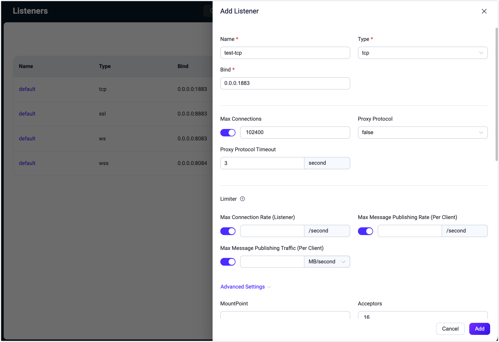

# クラスター設定

EMQXはホットコンフィギュレーション機能を提供しており、EMQXノードを再起動することなく、実行時に動的に設定を変更できます。EMQXダッシュボードはホットコンフィギュレーション機能を備えた視覚的な設定ページを提供しており、簡単にEMQXの設定を変更できます。

クラスター設定モジュールは以下のサブモジュールを提供します：

- MQTT設定
- クラスター
- ネームスペース
- ルールエンジンセキュリティ
- リスナー
- ロギング
- モニタリング
- クラスターリンク

## MQTT設定

**MQTT設定**ページはMQTTプロトコルに関連する設定機能を提供します。このページでは、以下を含むさまざまなMQTT関連パラメータを設定できます。

### 一般

**一般**タブページには、アイドルタイムアウト、最大パケットサイズ、最大クライアントID長、最大トピックレベル数、最大許容QoSレベルなど、MQTTプロトコルの基本的な一般設定項目が含まれています。

### セッション

**セッション**タブページには、MQTTセッション管理に関連する設定項目が含まれており、セッション有効期限間隔（MQTT 5.0以外の接続のみサポート、MQTT 5.0接続はクライアント側で設定が必要）、最大サブスクリプション数、最大フライトウィンドウ、QoS 0メッセージの保存有無などがあります。

### Durable Sessions

**Durable Sessions**タブページには、[MQTT Durable Sessions](../durability/durability_introduction.md)機能に関連する設定項目が含まれており、メッセージ保持期間、メッセージクエリバッチサイズ、アイドルポーリング間隔、セッションハートビート間隔などがあります。

### Retainer

**Retainer**タブページには、保持メッセージに関するMQTTプロトコル関連の設定項目が含まれており、保持メッセージの有効化、メッセージ保存タイプと方法、最大保持メッセージ数、保持メッセージのペイロードサイズ、メッセージ有効期限間隔などがあります。詳細は[保持メッセージの設定](./retained.md#retainer-settings)を参照してください。

> 保持メッセージが無効化されている場合、既存の保持メッセージは削除されません。

### システムトピック

**システムトピック**タブページでは、EMQXの組み込みシステムトピックに関する設定項目を提供します。EMQXは`$SYS/`で始まるシステムトピックに対して、運用状況、使用統計、リアルタイムクライアントイベントを定期的にパブリッシュします。クライアントがこれらのトピックをサブスクライブすると、関連情報がパブリッシュされます。システムトピックの設定項目には、メッセージパブリッシュ間隔、ハートビート間隔などがあります。

### 強制シャットダウン

**強制シャットダウン**タブでは、リソース使用率の閾値に基づく自動シャットダウン動作を設定できます。この機能は、メッセージキュー長やヒープサイズなどの過剰なリソース消費によるEMQXの不安定化を防止します。

**強制シャットダウン**タブページで設定可能な項目は以下の通りです：

- **強制シャットダウンを有効化**：このトグルスイッチで強制シャットダウン機能を有効または無効にします。有効時は指定されたリソース閾値を超えた場合にクライアントプロセスのシャットダウンを自動的にトリガーします。デフォルトで有効です。
- **最大ヒープサイズ**：システムの最大許容ヒープサイズを指定します。ヒープサイズがこの制限を超えると、システムの安定性を保つために強制シャットダウンが開始されます。デフォルト値は`32 MB`です。
- **最大メールボックスサイズ**：メールボックスのメッセージキューの最大許容長を定義します。この長さを超えるとシステム過負荷を防ぐために強制シャットダウンがトリガーされます。デフォルト値は`1000`です。

## クラスター

**クラスター**設定ページでは、EMQXクラスターのノード管理が可能で、ノードの詳細表示、新規ノードの招待、既存ノードの削除が行えます。

::: tip 注意

EMQX Community Editionを使用している場合、新規ノードの招待はサポートされていません。クラスタリング機能はトライアル期間中のみ利用可能で、トライアル終了後は商用ライセンスが必要です。ライセンスがない場合、機能は無効化されます。

:::

EMQX v6.0.0以降、**クラスター説明**を追加できるようになりました。これはクラスターの目的や環境を識別するためのものです。入力欄に意味のある説明を入力し、**保存**をクリックして適用してください。

保存後、クラスター説明はダッシュボードの上部に表示され、**クラスター**や**クラスター概要**などのページで素早く参照できます。編集アイコンをクリックすると**クラスター**ページに戻り、説明を更新できます。

- ノードの詳細を確認するには、ノード名をクリックしてください。**クラスタービュー**ページにリダイレクトされ、詳細情報が表示されます。

- ノードを招待するには、**招待**をクリックし、**ノード名**欄にノードのIPアドレスまたはホスト名を入力して、**確認**をクリックします。

- ノードを削除するには、**削除**をクリックします。削除前に確認ダイアログが表示されます。

EMQXはコマンドラインインターフェース（CLI）を使ったクラスターの作成および管理もサポートしています。詳細は[クラスターの作成と管理](../deploy/cluster/create-cluster.md)を参照してください。

## ネームスペース

EMQXのネームスペース機能は、単一クラスター内で異なるクライアントグループを論理的に分離します。ネームスペースは**ネームスペース**ページで管理できます。ネームスペースの管理と設定に関する詳細なガイドは[ネームスペース](../multi-tenancy/namespace-overview.md)を参照してください。

## ルールエンジンセキュリティ

EMQXのコネクター、ブリッジ、アクションは外部サービスへのアウトバウンドネットワーク接続を開きます。制御がなければ、誤設定や悪意のあるターゲットにより、EMQXが内部または機密の宛先へ意図しないリクエストを送る可能性があり、これはサーバーサイドリクエストフォージェリ（SSRF）と呼ばれる脆弱性の一種です。

EMQX 6.0.3以降、**ルールエンジンセキュリティ**ページでダッシュボードから組み込みのSSRF保護ポリシーを設定できます。有効化すると、EMQXはコネクター、ブリッジ、アクションの作成・更新時にアウトバウンドターゲットを検証します。ブロックされたアドレスに解決されるターゲットはその時点で拒否されます。このチェックは接続時には行われないため、DNSリバインディングや検証後のアドレス変更はカバーされません。

::: tip
ランタイムのネットワーク制御や委任管理者がいる環境では、ダッシュボードレベルのSSRFポリシーに加え、`iptables`や`nftables`などのホストレベルのイグレス制御を併用してください。詳細は[ルールエンジンポリシーとファイアウォールルールによるSSRF緩和](../deploy/cluster/security.md#mitigate-ssrf-with-rule-engine-policy-and-firewall-rules)を参照してください。
:::

### SSRF保護の有効化

**SSRF保護を有効化**をトグルしてポリシーをオン／オフします。有効時、EMQXはコネクター、ブリッジ、アクションの作成・更新時にアウトバウンドターゲットを検証します。評価順序は以下の通りです：

1. **拒否ホスト名**との完全一致（大文字小文字を区別しない）：一致した場合は即座に拒否。
2. 解決されたIPが**許可CIDRレンジ**に含まれるか確認：含まれる場合は許可。
3. 解決されたIPが**拒否CIDRレンジ**に含まれるか確認：含まれる場合は拒否。

このポリシーは既存の導入との互換性のためデフォルトで無効です。コネクターやアクションが内部サービスにアクセスする必要がない限り、すべての導入で有効化してください。その場合は有効化前に許可・拒否CIDRレンジを見直し調整してください。

### 許可CIDRレンジ

解決されたIPアドレスが常に許可されるCIDRレンジのリストです。拒否CIDRレンジに含まれていても、このリストに含まれる場合は許可されます。コネクターがアクセスしなければならない特定の内部サブネットを明示的に許可するために使用します。

### 拒否CIDRレンジ

EMQXが接続を拒否するCIDRレンジのリストです。デフォルトではSSRF攻撃で悪用されやすいアドレスが含まれています：

| CIDR | 説明 |
|---|---|
| `127.0.0.0/8` | IPv4ループバック |
| `::1/128` | IPv6ループバック |
| `169.254.0.0/16` | IPv4リンクローカル（AWS/Azureメタデータ含む） |
| `fe80::/10` | IPv6リンクローカル |
| `10.0.0.0/8` | プライベートネットワーク（RFC 1918） |
| `172.16.0.0/12` | プライベートネットワーク（RFC 1918） |
| `192.168.0.0/16` | プライベートネットワーク（RFC 1918） |
| `fc00::/7` | IPv6ユニークローカル |
| `0.0.0.0/32` | 未指定アドレス |
| `224.0.0.0/4` | IPv4マルチキャスト |
| `ff00::/8` | IPv6マルチキャスト |
| `100.100.100.200/32` | アリババクラウドメタデータサービス |

::: warning 重要なお知らせ
デフォルトの拒否CIDRリストからエントリを削除すると、EMQXがSSRF攻撃にさらされる可能性があります。特定の運用要件があり、かつセキュリティ上の影響を理解している場合のみ削除してください。
:::

コネクターがデフォルト拒否リスト内のアドレスにアクセスする必要がある場合（例：AWSコネクターがインスタンスメタデータサービスの`169.254.169.254`から認証情報を取得する場合）、拒否リストから削除するのではなく、**許可CIDRレンジ**に追加してください。許可リストが優先されます。

### 拒否ホスト名

解決されたIPアドレスに関係なく、EMQXが接続を拒否するホスト名のリストです。ホスト名の一致は完全一致かつ大文字小文字を区別しません。このフィールドは既知のクラウドメタデータエンドポイントを名前でブロックするのに便利です。

変更を適用するには**変更を保存**をクリックしてください。

## リスナー

**リスナー**ページはデフォルトでリスナーの一覧を表示します。EMQXは以下の4つの一般的なリスナーを提供しています：

- ポート1883を使用するTCPリスナー
- ポート8883を使用するSSL/TLSセキュア接続リスナー
- ポート8083を使用するWebSocketリスナー
- ポート8084を使用するWebSocketセキュアリスナー

通常は、対応するポートとプロトコルタイプを指定してこれらのデフォルトリスナーを使用できます。別のタイプのリスナーを追加するには、右上の**+リスナー追加**ボタンをクリックして新しいリスナーを作成します。

### リスナー追加

**リスナー追加**ポップアップパネルにはリスナー追加用のフォームが表示され、基本設定項目が含まれています。リスナーの識別用に名前を入力し、リスナータイプ（TCP、SSL、WS、WSS）を選択し、リスナーアドレス（IPアドレスとポート番号）を入力します。IPアドレスを指定するとリスナーのアクセス範囲を制限できます。ポート番号のみ指定も可能です。

#### レート制限

**リスナー追加**フォームの**リミッター**セクションでは、EMQX稼働中のメッセージ受信およびパブリッシュレートを制限できます。例えば：

- 最大接続レート（リスナー単位）
- 最大メッセージパブリッシュレート（クライアント単位）
- 最大メッセージパブリッシュトラフィック（クライアント単位）

レート制限を設定することで、メッセージデータの過負荷やクライアントからの過剰なリクエスト発生時にシステムおよびネットワークの安定性を確保します。

レート制限の詳細設定は[レート制限](../rate-limit/rate-limit.md)を参照してください。

リスナー設定の詳細は[EMQX Enterprise設定マニュアル](https://docs.emqx.com/en/enterprise/v@EE_VERSION@/hocon/)を参照してください。

### リスナー管理

リスナーを追加すると一覧に表示されます。リスナー名をクリックすると編集ページに入り、設定の変更や削除が可能です。リスナー名、タイプ、リスナーアドレスは設定画面で変更できません。

編集ページの**削除**ボタンでリスナーを削除できます。削除時はリスナー名の入力による確認が必要です。リスナーの有効・無効はトグルスイッチで切り替えられます。リストには各リスナーの接続数も表示されます。

::: tip 警告

リスナーの変更や削除はリスクの高い操作です。慎重に行ってください。リスナーが更新または削除されると、そのリスナー上のクライアント接続は切断されます。

:::

## ロギング

**ロギング**ページには**コンソールログ**、**ファイルログ**、**ログスロットリング**、**監査ログ**のタブがあります。

EMQXはコンソールログとファイルログの2種類のログ出力をサポートしており、必要に応じていずれかまたは両方を選択できます。対応する設定ページでログハンドラーの有効化／無効化、ログレベル、ログフォーマットタイプの設定、ファイルログの場合はログファイルパスやログ名の指定が可能です。ログの詳細設定は[ダッシュボードからのロギング設定](../observability/log.md#configure-logging-via-dashboard)を参照してください。

**ログスロットリング**タブページでは、ログスロットリングの時間ウィンドウを設定できます。ログスロットリングの詳細は[ログレート制限](../observability/log.md#log-throttling)を参照してください。

**監査ログ**ページでは、EMQXの監査ログ機能を有効化または無効化し、設定できます。詳細な設定方法は[監査ログ](./audit-log.md)を参照してください。

## モニタリング

::: tip 注意

モニタリング機能はEMQX Enterpriseエディションのみ利用可能です。

:::

**モニタリング**ページには以下の2つのタブがあります：

- **システム**：ユーザーのニーズに応じて、[アラーム](./alarm_dashboard.md)機能の閾値やチェック間隔などの設定をある程度調整できます。
- **統合**：サードパーティのモニタリングプラットフォームとの統合設定を提供します。

### システム

現在のアラームトリガー閾値やアラーム監視チェック間隔のデフォルト値が実際のニーズに合わない場合、このページで調整可能です。設定は**Erlang VM**と**オペレーティングシステム**の2つのモジュールに分かれており、各設定項目のデフォルト値と説明は[アラーム](../observability/alarms.md)に記載されています。

### 統合

このページは主にサードパーティのモニタリングプラットフォームとの統合設定を提供します。現在、EMQXは**Prometheus**、**OpenTelemetry**、**Datadog**との統合をサポートしています。

`Prometheus`を利用する場合、このページで設定を素早く有効化でき、プッシュデータのアドレスやデータ報告間隔などのパラメータを設定できます。EMQXが提供するAPI `/prometheus/stats` を使って監視データを取得可能で、このAPI利用時は認証情報は不要です。詳細は[Prometheus](../observability/prometheus.md)を参照してください。

多くの場合、EMQXのメトリクスデータを監視するために`Pushgateway`は必要ありませんが、`Pushgateway`サービスアドレスを設定して監視データを`Pushgateway`にプッシュし、`Pushgateway`が`Prometheus`にデータを転送する構成も選択可能です。詳細は[Pushgatewayの利用タイミング](https://prometheus.io/docs/practices/pushing/)を参照してください。

ページ下部の**ヘルプ**ボタンをクリックし、デフォルトまたは`Pushgateway`方式を選択し、提供される手順に従って関連サービスのアドレスやAPI情報を設定すると、対応する`Prometheus`設定ファイルが素早く生成されます。最後にこの設定ファイルを使って`Prometheus`サービスを起動してください。

ユーザーは`Grafana`で監視データをニーズに合わせてカスタマイズ・修正できます。`Prometheus`サービス起動後、ヘルプページの最後にある**Grafanaテンプレートをダウンロード**ボタンをクリックして、当社が提供するデフォルトダッシュボードの設定ファイルをダウンロードし、`Grafana`にインポートすることで、可視化パネルからEMQXの監視データを閲覧できます。テンプレートは[Grafana公式サイト](https://grafana.com/grafana/dashboards/17446-emqx/)からも入手可能です。

OpenTelemetryおよびDatadog統合の詳細設定は[OpenTelemetryとの統合](../observability/opentelemetry/opentelemetry.md)および[Datadogとの統合](../observability/datadog.md)を参照してください。

## クラスターリンク

クラスターリンク機能は複数の独立したEMQXクラスターを接続し、地理的に分散したクラスター間でクライアント同士の通信を可能にします。ユーザーはこのページでクラスターリンクの作成および設定ができます。作成と設定の詳細なガイドは[EMQXクラスターリンク](../cluster-linking/introduction.md)を参照してください。
