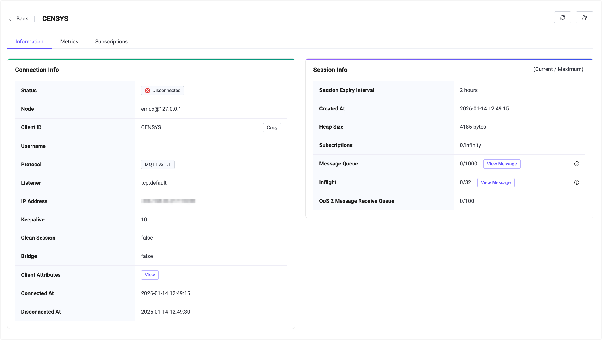

# クライアント

EMQXに接続してパブリッシュおよびサブスクライブするために、[MQTTX](https://mqttx.app) をクライアントとして使用できます。あるいは、[さまざまな言語で提供されているクライアントライブラリ](../../connect-emqx/introduction.md) を利用して、EMQXへのクライアント接続を迅速に実装することも可能です。**クライアント**ページでは、現在サーバーに接続しているクライアントや期限切れでないセッションの詳細およびメトリクス統計を確認できます。

## クライアント一覧

クライアント一覧では、現在接続中のクライアントに関する基本情報を以下のように確認できます。

- EMQXに接続する際に設定されたクライアントIDおよびユーザー名
- 現在の接続状態
- クライアントのIPアドレス
- 接続に設定されたハートビート間隔および最大アイドル時間
- セッションがクリアされているかどうか、セッションの有効期限間隔を含む接続セッション情報
- クライアントがEMQXに接続した時刻

クライアントのIPアドレス情報は、クライアントのIPアドレスとEMQXに接続する際に使用されたポート番号を連結したものです。

上部のフィルター条件欄にはデフォルトでクライアントID、ユーザー名、IPアドレスのみが表示されます。クライアントIDやユーザー名を使ったあいまい検索で接続リストを絞り込むことが可能です。検索バー横の右向き矢印ボタンをクリックすると、利用可能なすべてのフィルター条件欄が表示されます。接続状態や接続時間範囲を選択してリストを絞り込んだり、クライアントのIPアドレスを入力して対象IPでフィルターすることもできます。

リスト上部の**列選択**ボタンから表示する列を選択できます。**更新**ボタンをクリックすると、すべてのフィルター条件がリセットされ、接続リストが再読み込みされます。また、クライアントを選択して**強制切断**をクリックすると、そのクライアントを手動で切断できます。

## クライアント詳細

クライアント一覧のクライアントIDをクリックすると、クライアント詳細ページが開きます。このページでは、選択したクライアントの接続情報、セッションデータ、ランタイムメトリクスの詳細を確認できます。ページ上部の操作でデータを手動更新したり、クライアントセッションをクリアしたりできます。

クライアント一覧に表示されている基本項目に加え、**情報**タブではMQTTプロトコルバージョンやクリーンセッション設定、（切断済みクライアントの場合は）最後の切断時刻などの拡張接続情報が表示されます。**セッション情報**パネルでは、セッション有効期限間隔、作成時刻、ヒープサイズ、サブスクリプション数、メッセージキュー使用状況、インフライトウィンドウサイズ、QoS 2受信キュー長などのセッション関連データが確認できます。

**メトリクス**タブでは、クライアント接続のランタイム統計情報として、送受信バイト数やパケット数、QoSレベル別のメッセージ数、ドロップされたメッセージ統計などが表示されます。

**サブスクリプション**タブには、クライアントが現在サブスクライブしているすべてのトピックが一覧表示されます。**新規サブスクリプション**から新しいサブスクリプションを追加したり、特定のトピックの**サブスクリプション解除**をクリックして削除したりできます。

