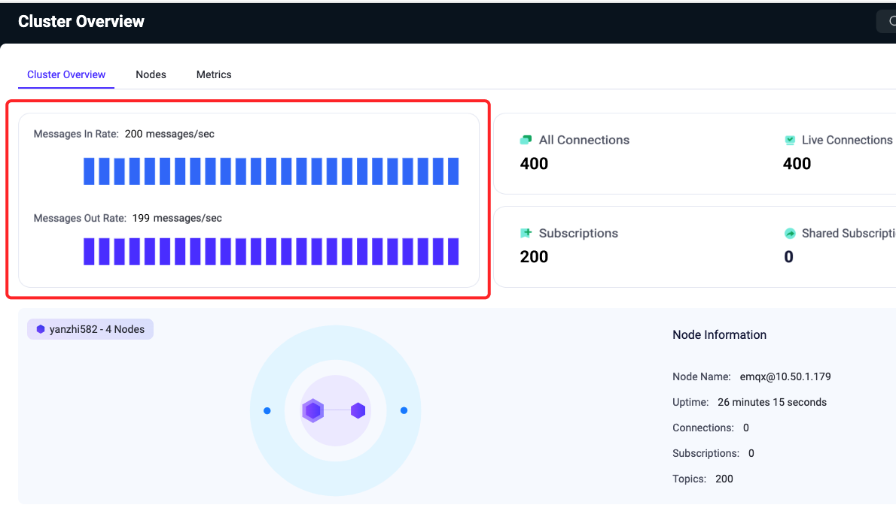
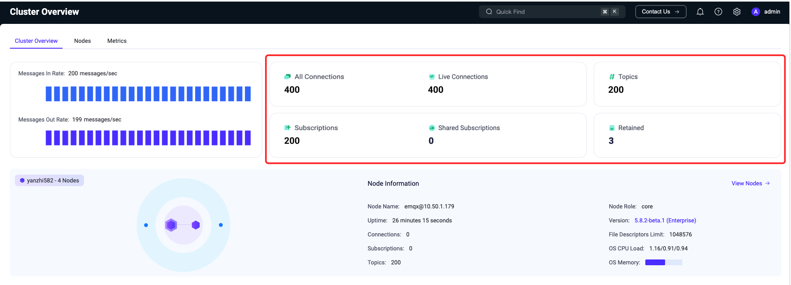
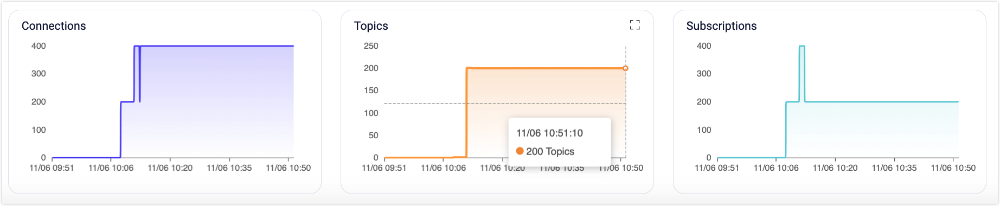
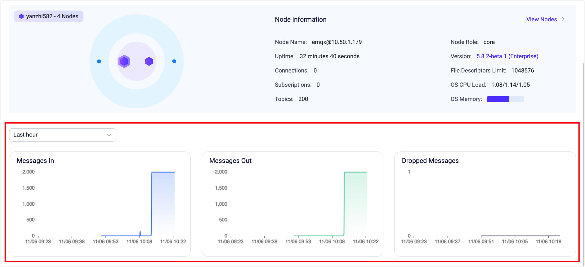
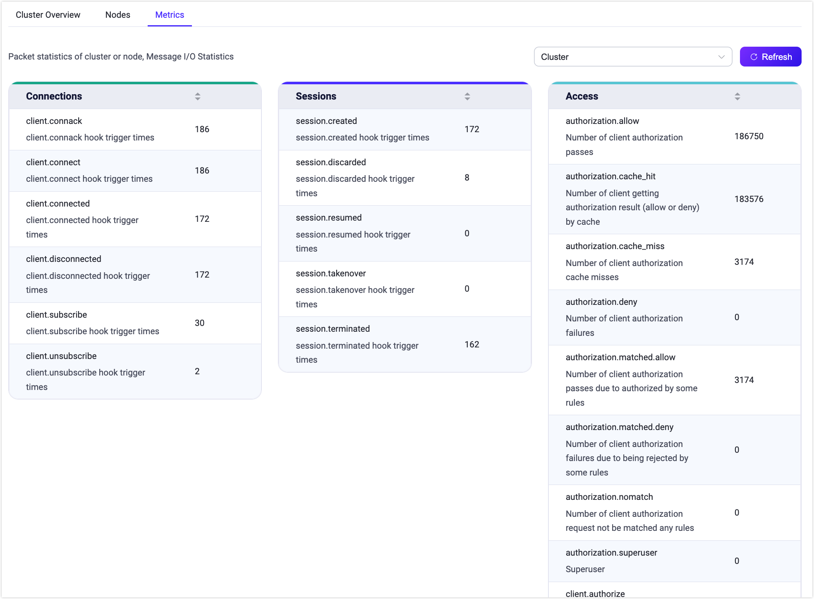
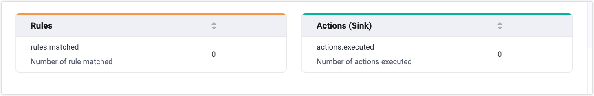

# ダッシュボード ホームページ

ログインに成功すると、EMQX ダッシュボードのホームページ、具体的には **クラスター概要** ページにアクセスできます。このページには以下のタブが含まれています。

- **クラスター概要**：クラスター全体のデータ概要を表示します。
- **ノード**：クラスター内のノード一覧およびノード固有の情報を表示します。
- **メトリクス**：クラスター全体または個別ノードのすべてのデータメトリクスを表示します。

## クラスター概要

このページでは、稼働中の EMQX クラスター全体のデータ概要を以下の情報とともに提供します。

### メッセージレート

EMQX において、メッセージはすべての接続された MQTT クライアントや実デバイスが送受信する重要なデータを表します。クライアントやデバイスはトピックを介してメッセージを送受信し、相互にデータ通信を行います。

概要ページの左上にあるカードは、システム内の現在のメッセージの入出力量の変化率（メッセージレートは1秒あたりのメッセージ数で測定）をリアルタイムのレート値で可視化し、変化をより分かりやすく監視できるようにしています。

### 接続数とサブスクリプション数

MQTT ブローカーとして、EMQX に接続されている接続数およびサブスクライブされているトピック数は最も重要なメトリクスの一つです。接続数は現在 EMQX に接続されている MQTT クライアントや実デバイスの数を示し、サブスクリプション数は各クライアントが現在サブスクライブしているトピックの合計数、トピックはユニークなサブスクリプションを表します。

概要ページの右上のカードでは、クラスター内の接続数、サブスクリプション数、トピック数を素早く確認できます。接続やサブスクリプショントピックが更新されるとカード内の統計はリアルタイムで更新されます。

::: tip

サブスクリプションはクライアントごとに区別されますが、トピックはユニークなサブスクリプションであり、同じトピックが異なるクライアントに含まれる場合があります。

:::

リアルタイム統計の提供に加え、ページ下部には接続数とサブスクリプション数の時間ごとの過去および現在の変化を視覚的に表示するチャートがあり（時間フォーマット：YYYY/MM/DD HH:mm）、EMQX クラスター全体の接続数とサブスクリプション数の推移をより明確かつ直感的に監視できます。チャート上にカーソルを合わせ、右上のアイコンをクリックするとチャートを拡大表示できます。

### メッセージ数

メッセージ数はクライアントやデバイス間で転送されたデータ数の統計であり、ページには受信、送信、およびドロップされたメッセージ数が含まれます。

概要ページの下部では、メッセージ数の視覚的なチャートを確認でき、時間ごとの過去および現在のメッセージ数の変化（時間フォーマット：YYYY/MM/DD HH:mm）を閲覧できます。これにより、ユーザーは現在の EMQX クラスター内のすべてのメッセージのリアルタイム変化を動的に把握しやすくなります。チャート上にカーソルを合わせ、右上のアイコンをクリックするとチャートを拡大表示できます。

「モニタリングデータをリセット」ボタンをページ右側でクリックすると、クラスター概要ページのチャートデータがクリアされ、現在時刻から新しいモニタリングデータの表示が開始されます。

::: tip

上記のすべての時間変化チャートは、左上の時間範囲選択で閲覧可能です：過去1時間、過去6時間、過去12時間、過去1日、過去3日、過去7日のデータ変化を統計できます。

:::

## ノード

IoT 向けで最もスケーラブルな MQTT ブローカーである EMQX はクラスター展開をサポートしており、クラスター内の各 EMQX インスタンスはノードとして機能します。

### ノードデータ

概要ページ中央のカードで EMQX クラスター全体を監視でき、クラスター内のすべてのノードの関連性と分布を可視化するトポロジーダイアグラムが表示されます。

トポロジーダイアグラム上のノードにカーソルを合わせると、その基本情報と稼働状況を確認できます。情報にはノード名、ノードの役割、接続数、サブスクリプション数、トピック数、現在の EMQX バージョンが含まれます。バージョン番号をクリックすると、現在のバージョンの更新内容を素早く確認できる変更履歴が開きます。さらに、ノードがデプロイされているオペレーティングシステムの CPU 負荷とメモリ使用量も確認可能です（メモリメトリクスは Linux にデプロイされたノードのみ利用可能です）。

::: tip

トポロジーダイアグラム上のノードが灰色になっている場合、そのノードは現在停止しています。

:::

### ノード一覧

ノードカードの右上にある **ノードを表示** をクリックするか、上部の **ノード** タブを選択するとノードページに移動します。このページでは、現在 EMQX クラスターに存在するすべてのノードが一覧表示され、各ノードの名前、ステータス、アップタイム、バージョン、接続数、Erlang プロセス数、メモリ使用量、CPU 負荷などの主要なメトリクスを素早く確認できます。右上の **更新** ボタンをクリックすると、最新のノード情報にリアルタイムでリストが更新されます。

### ノード詳細

ノード一覧ではノードの基本情報の一部のみ表示されます。ノードの詳細情報を確認するには、**名前** 列のノード名をクリックしてノード詳細ページにアクセスしてください。詳細ページでは以下のカードが表示されます。

- **ノード情報**カードでは、基本的なノード情報に加え、現在のノードの最大ファイルハンドル数、システムパス、ログパスなどの詳細も確認できます（ログパスの表示には設定でファイルログ処理を有効にする必要があります）。
- **ノード統計**カードでは、現在のノードに関するさまざまな統計情報を確認できます。接続数、サブスクリプション数、トピック数、保持メッセージ数、セッション数、共有サブスクリプション数などが含まれます。統計値はスラッシュ（"/"）で区切られた2つの部分に分かれており、左側がリアルタイムデータ、右側がハイウォーターマークデータ（現在のデータが到達したピーク値）を示します。

## メトリクス

上部の **メトリクス** タブをクリックするとメトリクスページにアクセスでき、EMQX クラスター全体または特定のノードの稼働中に生成されるすべてのデータメトリクスを閲覧できます。これにはメッセージ情報、メッセージ統計、トラフィック送受信統計が含まれ、現在のサービ ス状況を把握するのに役立ちます。

右上のドロップダウンメニューからクラスター全体のデータか単一ノードのデータかを選択でき、隣の **更新** ボタンをクリックすると現在のページでメトリクスデータのリアルタイム監視が可能です。

メトリクスデータの詳細な説明や包括的な情報については、[メトリクス](../observability/metrics-and-stats.md) をご参照ください。

### 接続、セッション、アクセス

メトリクスデータはバイト数、パケット数、メッセージ数、イベントの4つの側面をカバーしています。カードでは接続セッションや認証・認可イベントなどのイベントに関連するメトリクスデータを確認できます。

### ルールとアクション（シンク）

このセクションではデータ統合に関連するメトリクスを提供し、ルールがマッチした回数やアクション（シンク）が実行された回数を把握できます。

### メッセージング

以下の4つのカードは、メッセージ送信時に生成されるデータの統計を提供します。送受信トラフィック（バイト単位）、パケット数、メッセージ数、配信済みメッセージ数の統計が含まれます。

