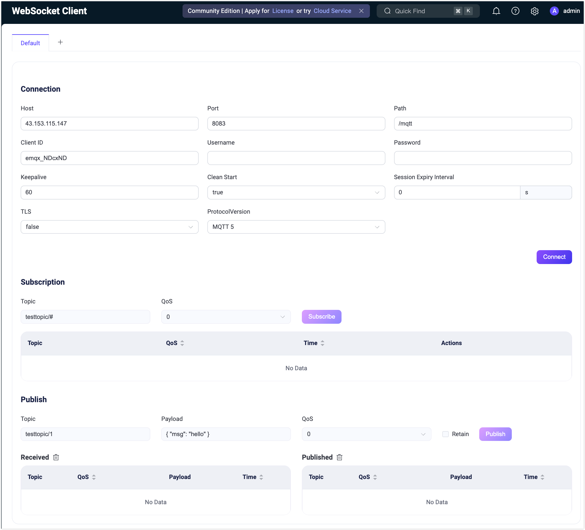
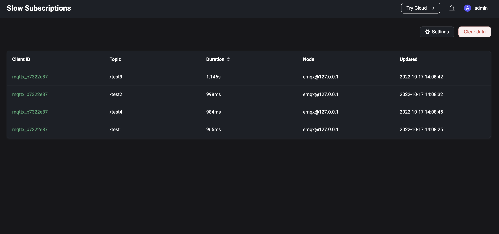
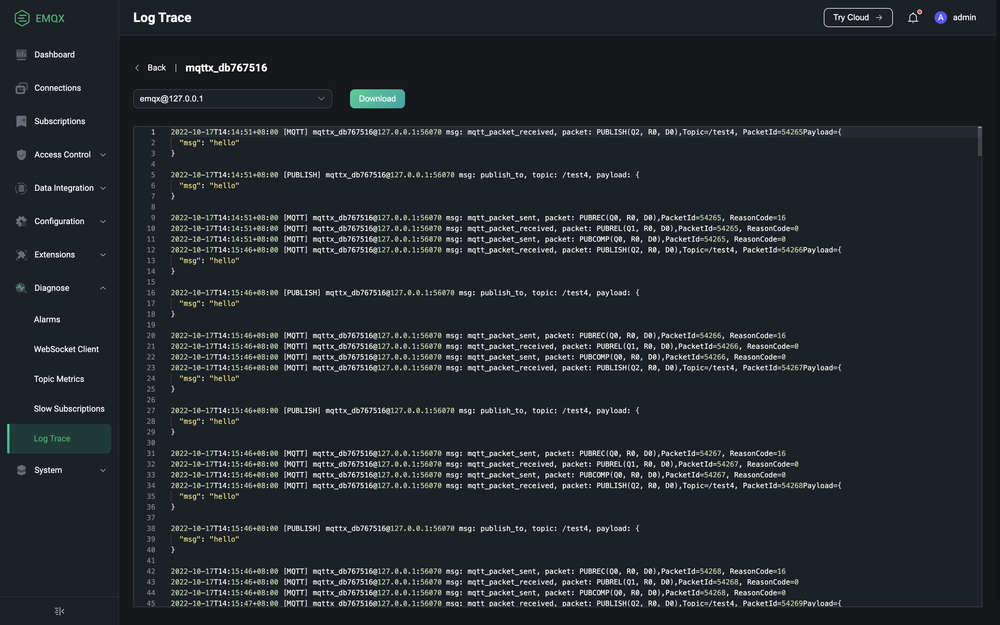

# Diagnose

Diagnoseモジュールは、ユーザーが使用中のエラーや問題をデバッグおよび特定するのに役立ついくつかのデバッグツールを提供します。

- **WebSocketクライアント**：ページ上のWebSocketクライアントを使用して、迅速な接続およびパブリッシュ・サブスクライブのデバッグを行います。
- **トピックモニタリング**：トピックに基づくメッセージの受信、送信、およびドロップされたデータを監視・表示します。
- **スローサブスクリプション**：スローサブスクリプション統計を有効にすると、クライアントIDに基づきメッセージ送信の全フローで設定した閾値を超える時間を消費するサブスクリプションをページ上で確認できます。
- **ログトレース**：特定のクライアント、トピック、またはIPに対するログをリアルタイムでフィルタリングし、ページ上で閲覧またはダウンロードできます。

## WebSocket Client

左側の**Diagnose**メニューの**WebSocket Client**をクリックすると、WebSocket Clientページに移動します。WebSocket Clientページは、接続、サブスクライブ、パブリッシュ機能を備えたシンプルながら効果的なMQTTテストツールを提供し、クライアントの接続、パブリッシュ、サブスクライブ機能の迅速なデバッグや、自身が送受信したメッセージデータの確認が可能です。ページ上部の**+**ボタンをクリックすると複数のWebSocket接続を追加でき、ページをリフレッシュするとすべての接続の状態および送受信データがクリアされます。

## Topic Metrics

左側の**Diagnose**メニューの**Topic Monitoring**をクリックすると、Topic Metricsページに移動します。Topic Monitoringでは、ページ右上の`Create`ボタンをクリックし、監視したいトピックを入力して`Add`をクリックすることで、新しいトピックメトリクス統計を作成できます。作成に成功すると、そのトピックごとにメッセージの受信数、送信数、ドロップ数およびそれらのレートを確認でき、詳細では各QoSごとのデータも閲覧可能です。`Reset`ボタンをクリックすると、既存のトピック統計をリセットできます。テーブルのヘッダーにある統計指標をクリックすると、昇順または降順で監視リストを並べ替えて表示できます。

> ダッシュボードは特定のトピック名のみをサポートしています。EMQX 6.3以降、ワイルドカードトピックメトリクスの収集は[Topic Metrics REST API](../observability/topic-metrics.md#manage-topic-metric-collections-with-the-rest-api)を通じてのみ作成・管理可能であり、ダッシュボードには表示されません。

## Slow Subscriptions

左側の**Diagnose**メニューの**Slow Subscriptions**をクリックすると、Slow Subscriptionsページに移動します。スローサブスクリプション統計を使用するには、まずスローサブスクリプションの基本設定を行い、この機能を有効にする必要があります。各設定項目の詳細は[slow subscriptions](../observability/slow-subscribers-statistics.md#configure-and-enable-slow-subscriptions)をご参照ください。有効化すると、メッセージ送信の全フローにかかる時間が設定した`time delay threshold`を超えたメッセージが統計に参加します。デフォルトでは、統計リストはレイテンシの降順でサブスクライバーとトピック情報を表示します。`Client ID`をクリックすると、該当サブスクライバーの接続詳細ページに遷移し、接続情報を確認してスローサブスクリプションの原因を調査できます。

## Log Trace

左側の**Diagnose**メニューの**Log Trace**をクリックすると、Log Traceページに移動します。特定のクライアント、トピック、またはIPのログをリアルタイムでフィルタリングし、デバッグやトラブルシューティングに利用したい場合は、Log Trace機能を使用します。ページ右上の`Create`ボタンをクリックし、トレース対象を選択します。クライアントIDとIPは正確に入力する必要があり、トピックは完全一致に加えワイルドカードマッチングもサポートします。進行中のトレースはリストから手動で停止でき、停止済みのトレースはリストから削除可能です。

現在のすべてのトレースはリストで確認でき、特定のトレースのログを閲覧またはダウンロードできます。クラスター環境では、リストの`Download`ボタンをクリックするとダッシュボードに対応するノードのログがダウンロードされ、`View`ボタンをクリックするとログの閲覧およびダウンロードのためにノードを選択できます。

