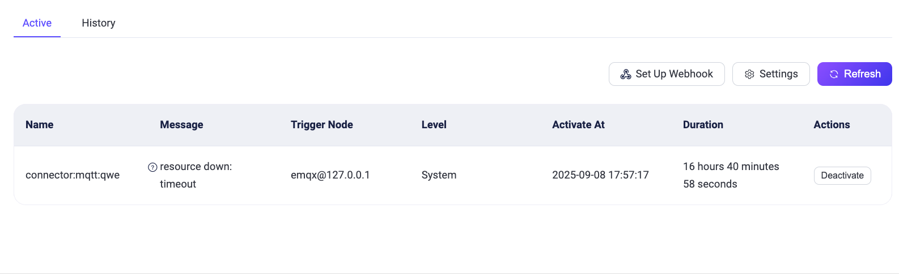

# Diagnose

<<<<<<< HEAD
Diagnoseモジュールは、ユーザーがエラーや問題のデバッグおよび特定を行うためのいくつかのデバッグツールを提供します。

- **アラーム**：システムの現在および過去のアラームを表示します。
- **WebSocketクライアント**：ページ上のWebSocketクライアントを使用して、迅速な接続およびパブリッシュ・サブスクライブのデバッグを行います。
- **トピック監視**：トピックに基づくメッセージの受信、送信、およびドロップされたデータを監視・表示します。
=======
Diagnoseモジュールは、ユーザーがエラーや問題の原因を特定しデバッグするためのツールを提供します。

- **アラーム**：システムの現在および過去のアラームを表示します。
- **WebSocketクライアント**：ページ上のWebSocketクライアントを使用して、クイックな接続およびパブリッシュ・サブスクライブのデバッグを行います。
- **トピックモニタリング**：トピックに基づくメッセージの受信、送信、ドロップデータを監視・表示します。
>>>>>>> origin/release-5.9
- **スローサブスクリプション**：スローサブスクリプション統計を有効にし、クライアントIDに基づくメッセージ伝送全体の処理時間が設定した閾値を超えるサブスクリプションをページ上で確認します。
- **ログトレース**：特定のクライアント、トピック、またはIPに対するログをリアルタイムでフィルタリングし、ページ上で閲覧またはダウンロードできます。

## アラーム

<<<<<<< HEAD
左側のDiagnoseメニューから「Alerts」をクリックすると、アラームページに移動します。アラームページでは、サーバーの現在のアラームおよび過去のアラーム（非アクティブ化されたアラーム）を確認できます。アラーム情報には、アラーム名、アラームメッセージの内容、アラームをトリガーしたノード、アラームレベル、アラームの発生時間、およびアラームの継続時間が含まれます。

現在のアラームページでは、右上の`Refresh`ボタンをクリックしてリストを更新し、新しいアラームが発生しているか確認できます。現在のアラームトリガー閾値やアラーム監視間隔のデフォルト値が実際のニーズに合わない場合は、右上の`Settings`ボタンをクリックして[Monitoring](./configuration.md#monitoring)ページに移動し設定を行えます。アラーム履歴ページでは、右上の`Clear History Alarms`ボタンをクリックしてアラーム履歴をクリアできます。

現在サポートされているアラームの情報や詳細は、[alarms](../observability/alarms.md)をご参照ください。
=======
左側のDiagnoseメニューの「Alerts」をクリックすると、アラームページに移動します。アラームページでは、サーバーの現在のアラームおよび過去のアラーム（非アクティブなアラーム）を確認できます。アラーム情報には、アラーム名、アラームメッセージの内容、アラームを発生させたノード、アラームレベル、アラームの発生時間、アラームの継続時間が含まれます。

現在のアラームページでは、右上の`Refresh`ボタンをクリックしてリストを更新し、新しいアラームが発生しているか確認できます。現在のアラームトリガー閾値やアラーム監視間隔のデフォルト値が実際の要件に合わない場合は、右上の`Settings`ボタンをクリックして[Monitoring](./configuration.md#monitoring)ページに移動し設定を変更できます。アラーム履歴ページでは、右上の`Clear History Alarms`ボタンをクリックしてアラーム履歴をクリアできます。

現在サポートされているアラームの情報や詳細は[alarms](../observability/alarms.md)をご参照ください。
>>>>>>> origin/release-5.9

## WebSocketクライアント

<<<<<<< HEAD
左側の**Diagnose**メニューから**WebSocket Client**をクリックすると、WebSocketクライアントページに移動します。WebSocketクライアントページは、接続、サブスクライブ、パブリッシュ機能を備えたシンプルながら効果的なMQTTテストツールを提供し、クライアントの接続、パブリッシュ、サブスクライブ機能の迅速なデバッグや、自身が送受信したメッセージデータの確認が可能です。ページ上部の**+**ボタンをクリックすると複数のWebSocket接続を追加でき、ページをリフレッシュするとすべての接続状態および送受信データはクリアされます。
=======
左側の**Diagnose**メニューの**WebSocket Client**をクリックすると、WebSocketクライアントページに移動します。WebSocketクライアントページは、接続、サブスクライブ、パブリッシュ機能を備えたシンプルかつ効果的なMQTTテストツールを提供し、クライアントの接続、パブリッシュ、サブスクライブ機能のクイックなデバッグや、自身が送受信したメッセージデータの確認が可能です。ページ上部の**+**ボタンをクリックすると複数のWebSocket接続を追加でき、ページをリフレッシュするとすべての接続状態および送受信データがクリアされます。
>>>>>>> origin/release-5.9

## トピック監視

<<<<<<< HEAD
左側の**Diagnose**メニューから**Topic Monitoring**をクリックすると、トピック監視ページに移動します。トピック監視では、ページ右上の`Create`ボタンをクリックし、監視したいトピックを入力して`Add`をクリックすることで、新しいトピックメトリクス統計を作成できます。作成に成功すると、そのトピックごとにメッセージの受信数、送信数、ドロップ数およびそのレートを確認でき、詳細では各QoSごとのデータも閲覧可能です。`Reset`ボタンをクリックすると、既存の統計をリセットできます。テーブルのヘッダーにある統計指標をクリックすると、昇順または降順で監視リストを並べ替えられます。
=======
左側の**Diagnose**メニューの**Topic Monitoring**をクリックすると、トピックメトリクスページに移動します。トピックモニタリングでは、ページ右上の`Create`ボタンをクリックし、監視したいトピックを入力して`Add`をクリックすることで、新しいトピックメトリクス統計を作成できます。作成に成功すると、そのトピックごとにメッセージの受信数、送信数、ドロップ数およびそれらのレートを確認でき、詳細では各QoSごとのデータも閲覧可能です。`Reset`ボタンをクリックすると、既存の統計をリセットできます。テーブルヘッダーの統計指標をクリックすると、昇順または降順で監視リストを並べ替えられます。
>>>>>>> origin/release-5.9

<<<<<<< HEAD
> 全体的なパフォーマンスの観点から、現在トピック統計はトピック名のみ対応しており、`+`や`#`のワイルドカードを含むトピックフィルター（例：a/+など）はサポートしていません。

## スローサブスクリプション

左側の**Diagnose**メニューから**Slow Subscriptions**をクリックすると、スローサブスクリプションページに移動します。スローサブスクリプション統計を利用するには、まず基本設定を行いこの機能を有効にする必要があります。各設定項目の説明は[slow subscriptions](../observability/slow-subscribers-statistics.md#configure-and-enable-slow-subscriptions)をご参照ください。有効化すると、メッセージ伝送の全フローにかかる時間が設定された`time delay threshold`を超えたメッセージが統計対象となります。統計リストはデフォルトでレイテンシの降順にサブスクライバーおよびトピック情報を表示します。`Client ID`をクリックすると、該当サブスクライバーの接続詳細ページに遷移し、接続情報を確認してスローサブスクリプションの原因調査が可能です。
=======
> 全体的なパフォーマンスの観点から、現在トピック統計ではトピック名のみがサポートされており、`+`や`#`のワイルドカードを含むトピックフィルター（例：a/+など）はサポートされていません。

## スローサブスクリプション

左側の**Diagnose**メニューの**Slow Subscriptions**をクリックすると、スローサブスクリプションページに移動します。スローサブスクリプション統計を利用するには、まずスローサブスクリプションの基本設定を行い、この機能を有効化する必要があります。各設定項目の説明は[slow subscriptions](../observability/slow-subscribers-statistics.md#configure-and-enable-slow-subscriptions)をご参照ください。有効化すると、メッセージ伝送の全フローにかかる時間が設定した`time delay threshold`を超えたメッセージが統計対象となります。統計リストはデフォルトでレイテンシの降順でサブスクライバーとトピック情報を表示します。`Client ID`をクリックすると、該当サブスクライバーの接続詳細ページに遷移し、接続情報を確認してスローサブスクリプションの原因を調査できます。
>>>>>>> origin/release-5.9

## ログトレース

<<<<<<< HEAD
左側の**Diagnose**メニューから**Log Trace**をクリックすると、ログトレースページに移動します。特定のクライアント、トピック、またはIPのログをリアルタイムでフィルタリングし、デバッグやトラブルシューティングに役立てることができます。ページ右上の`Create`ボタンをクリックし、トレース対象を選択します。クライアントIDおよびIPは完全一致で入力する必要があり、トピックは完全一致に加えワイルドカードマッチングもサポートします。進行中のトレースはリスト上で手動で停止可能で、停止したトレースはリストから削除できます。
=======
左側の**Diagnose**メニューの**Log Trace**をクリックすると、ログトレースページに移動します。特定のクライアント、トピック、またはIPのログをリアルタイムでフィルタリングしてデバッグやトラブルシューティングを行いたい場合にログトレース機能を使用します。ページ右上の`Create`ボタンをクリックし、トレースしたい対象を選択します。クライアントIDおよびIPは完全一致で入力が必要で、トピックは完全一致に加えワイルドカードマッチングもサポートしています。進行中のトレースはリスト上で手動停止でき、停止したトレースはリストから削除可能です。
>>>>>>> origin/release-5.9

現在のすべてのトレースはリストで確認でき、特定のトレースのログを閲覧またはダウンロードできます。クラスター環境では、リストの`Download`ボタンをクリックするとダッシュボードに対応するノードのログがダウンロードされ、`View`ボタンをクリックするとノードを選択してログの閲覧およびダウンロードが可能です。

