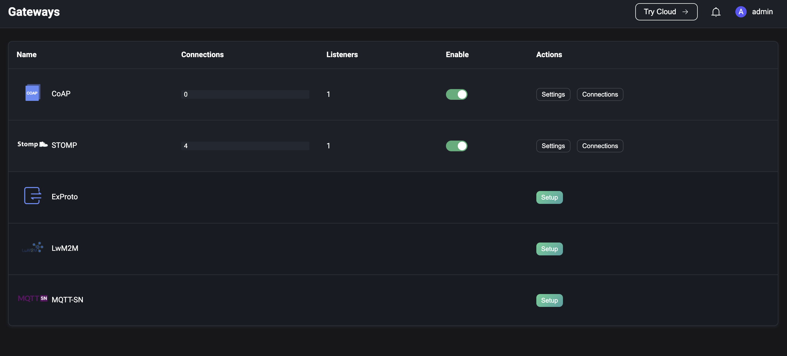
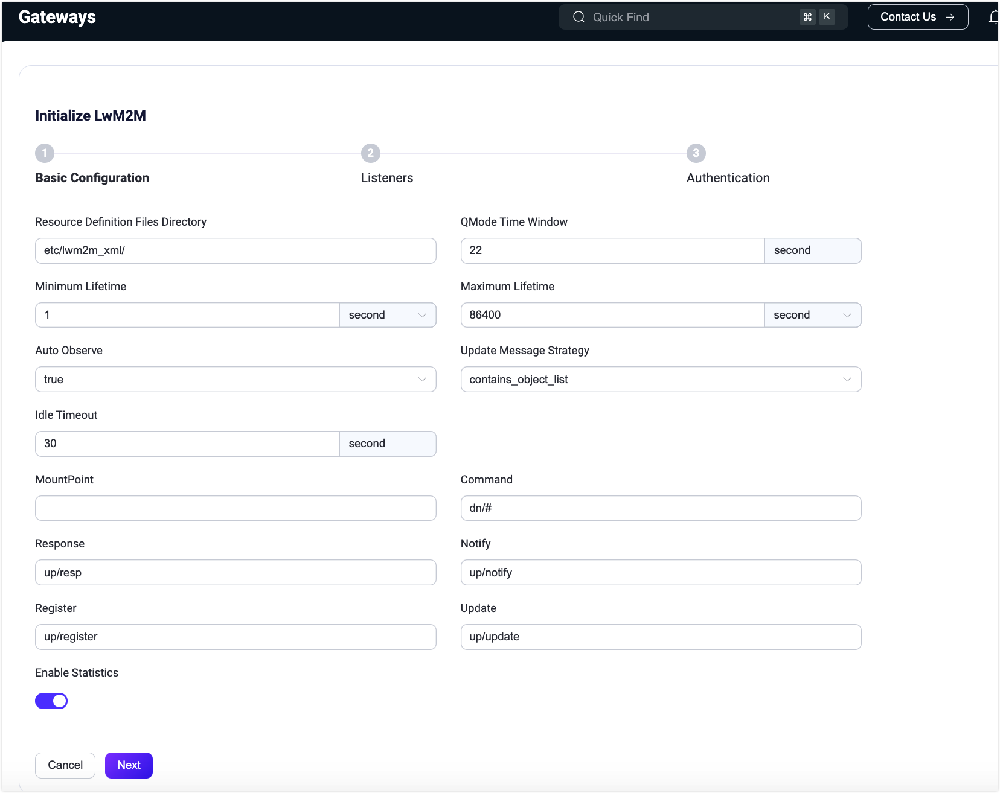
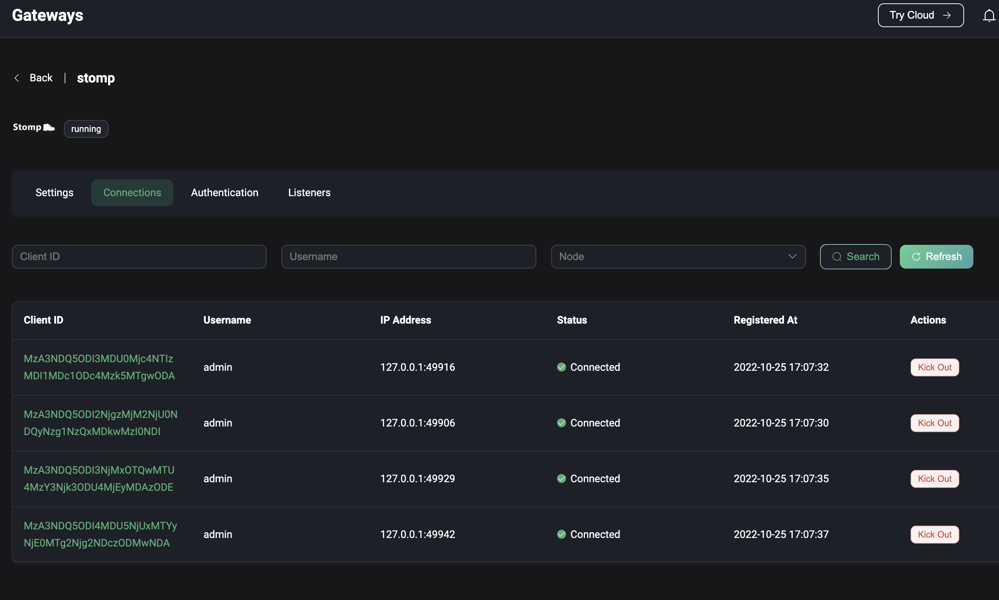
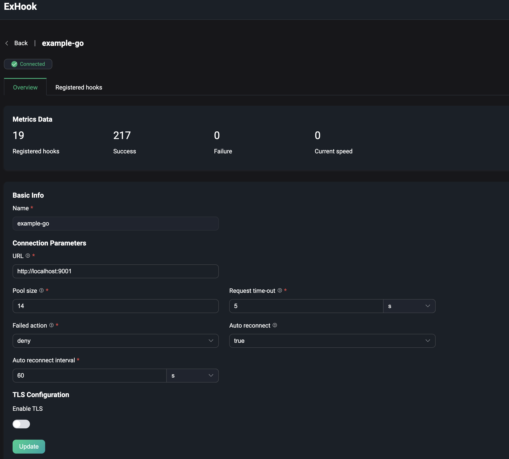
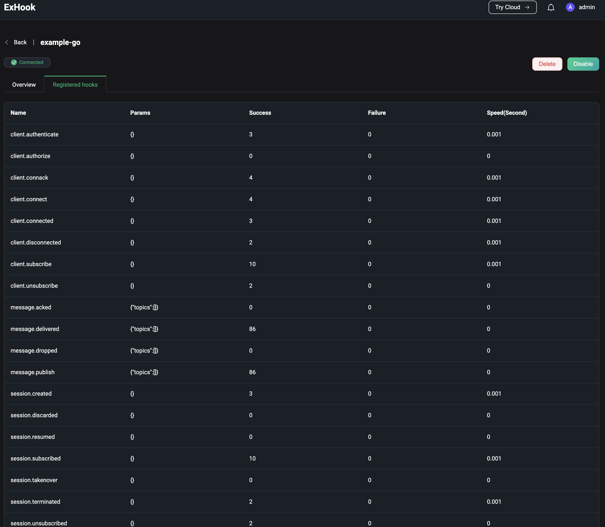
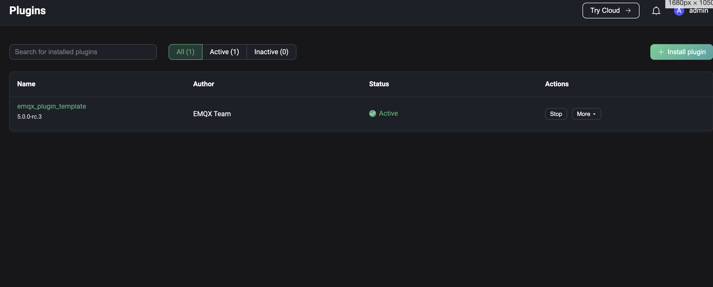
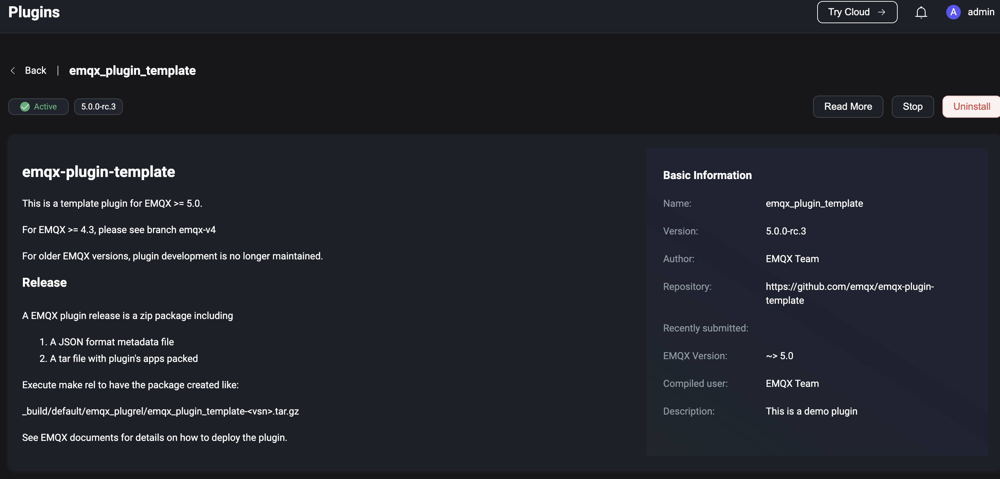

# Extensions

Extensions機能により、ユーザーはゲートウェイを使って非MQTTプロトコルの接続やメッセージのパブリッシュおよび受信を行うことができ、PluginやExHookを利用してシステムの修正や拡張が可能です。**Management**をクリックし、下にスクロールして**Extensions**セクションを表示すると、以下が確認できます。

- **Gateways**: 非MQTTプロトコルの接続、認証、メッセージ送受信を処理し、それらに対して統一されたユーザーレイヤーのインターフェースと概念を提供します。
- **ExHook**: 他の言語を使ってEMQXのシステム機能を修正または拡張する機能を提供します。
- **Plugins**: Erlangで書かれたプラグインをインストールすることでシステム機能を修正または拡張します。

## Gateways

EMQXのマルチプロトコルゲートウェイは、すべての非MQTTプロトコルの接続、認証、メッセージ送受信を処理します。さまざまなプロトコルに対して統一された概念モデルを提供します。

ゲートウェイページでは、ゲートウェイを有効化し、リスナー設定などの基本設定を行うことができます。EMQXはカスタム設定オプションも提供しています。詳細な設定手順については、以下の一般的なゲートウェイのクイックスタートドキュメントを参照してください。

- [MQTT-SN](../gateway/mqttsn.md)
- [STOMP](../gateway/stomp.md)
- [CoAP](../gateway/coap.md)
- [LwM2M](../gateway/lwm2m.md)
- [ExProto](../gateway/exproto.md)

- [OCPP](../gateway/ocpp.md)
- [GB/T 32960](../gateway/gbt32960.md)
- [JT/T 808](../gateway/jt808.md)

ゲートウェイを有効にする前に、正しくセットアップされている必要があります。セットアップ後は、各有効化されたプロトコルゲートウェイの接続数を監視し、**Gateways**ページでゲートウェイの状態（有効／無効）を管理できます。

::: tip
ゲートウェイを無効にすると、そのゲートウェイに属するすべての接続が切断され、再接続が必要になります。ご注意ください。
:::

### Gateway Setup

Gatewaysページで有効化したいプロトコルゲートウェイを選択し、**Action**列の**Setup**ボタンをクリックします。プロトコルゲートウェイの初期化ページは以下の3ステップで構成されています。

1. 基本設定の構成
2. リスナーの設定
3. 認証の設定

設定項目はプロトコルゲートウェイごとに異なる場合があります。初期化完了後は、[Gateway Details](#gateway-details)ページで設定項目の更新が可能です。

> Dashboard経由で設定されたゲートウェイはクラスター全体に反映されます。

#### 基本設定

設定項目はプロトコルゲートウェイによって異なります。詳細な設定手順は各ゲートウェイのドキュメントを参照してください。

#### リスナー

基本設定完了後、ゲートウェイのリスナー設定に進みます。プロトコルに応じて複数のリスナーを有効化できます。以下の表は各プロトコルゲートウェイでサポートされているリスナー種別を示しています。

|            | TCP  | UDP  | SSL  | DTLS | Websocket | Websocket over TLS |
| ---------- | ---- | ---- | ---- | ---- | --------- | ------------------ |
| STOMP      | ✔︎    |      | ✔︎    |      |           |                    |
| CoAP       |      | ✔︎    |      | ✔︎    |           |                    |
| ExProto    | ✔︎    | ✔︎    | ✔︎    | ✔︎    |           |                    |
| MQTT-SN    |      | ✔︎    |      | ✔︎    |           |                    |
| LwM2M      |      | ✔︎    |      | ✔︎    |           |                    |
| OCPP       |      |      |      |      | ✔︎         | ✔︎                  |
| JT/T 808   | ✔︎    |      | ✔︎    |      |           |                    |
| GB/T 32960 | ✔︎    |      | ✔︎    |      |           |                    |

#### 認証

リスナー設定後、必要に応じてプロトコルゲートウェイのアクセス認証を設定できます。認証設定がない場合は任意のクライアントが接続可能です。各プロトコルゲートウェイがサポートする認証タイプは以下の通りです。

|            | HTTP Server | Built-in Database | MySQL | MongoDB | PostgreSQL | Redis | DTLS | JWT  | Scram | LDAP |
| ---------- | ----------- | ----------------- | ----- | ------- | ---------- | ----- | ---- | ---- | ----- | ---- |
| STOMP      | ✔︎           | ✔︎                 | ✔︎     | ✔︎       | ✔︎          | ✔︎     | ✔︎    | ✔︎    |       |      |
| CoAP       | ✔︎           | ✔︎                 | ✔︎     | ✔︎       | ✔︎          | ✔︎     | ✔︎    | ✔︎    |       |      |
| MQTT-SN    | ✔︎           |                   |       |         |            |       |      |      |       |      |
| LwM2M      | ✔︎           |                   |       |         |            |       |      |      |       |      |
| ExProto    | ✔︎           | ✔︎                 | ✔︎     | ✔︎       | ✔︎          | ✔︎     |      | ✔︎    |       | ✔︎    |
| OCPP       | ✔︎           | ✔︎                 | ✔︎     | ✔︎       | ✔︎          | ✔︎     |      | ✔︎    |       | ✔︎    |
| GB/T 32960 | ✔︎           |                   |       |         |            |       |      |      |       |      |

### Gateway Details

プロトコルゲートウェイを有効化すると、**Gateways**ページにリダイレクトされます。ここでゲートウェイの管理やカスタマイズが可能です。

- **設定のカスタマイズ**: **Actions**列の**Settings**ボタンをクリックし、基本設定、リスナー設定、認証設定を必要に応じて更新できます。
- **接続クライアントの表示**: **Actions**列の**Clients**ボタンをクリックすると、プロトコルゲートウェイ経由でサーバーに接続しているクライアント一覧が表示されます。クライアントID、ユーザー名、IPアドレス（Clientsページと同様）、ステータス、接続または登録時間などの詳細が確認できます。クライアントを切断するには、**Actions**列の**Kick Out**ボタンをクリックします。
- **クライアント検索**: クライアントID、ユーザー名、ノードでフィルターをかけて特定のクライアントを素早く検索できます。

## ExHook

Hookは特定のイベントポイントでカスタムコードを実行できる一般的な拡張機構です。ExHookは他のプログラミング言語を使ってシステム機能を修正・拡張する機能を提供します。EMQXでサポートされるHook機構により、モジュール関数呼び出し、メッセージ送受信、イベント配信をインターセプトして柔軟にシステム機能を修正・拡張できます。

ExHookページでは、現在追加されているHookの基本情報や状態を確認でき、追加や設定が行えます。

ExHookの定義や開発ガイドラインは[hooks](../extensions/hooks.md)をご参照ください。

### ExHookの追加

ページ右上の**+ Add**ボタンをクリックするとExHook追加ページに移動します。追加するExHookの基本情報や接続パラメータを設定し、**Create**をクリックしてデータを送信します。作成が成功するとExHook一覧ページにリダイレクトされます。

### 詳細の表示

作成成功後は、ExHook一覧ページのExHook名をクリックすると詳細ページにアクセスできます。詳細ページでは、登録済みHookの総数、成功実行数、失敗実行数、現在の実行率などのメトリクスを確認できます。基本情報の編集も可能で、編集後は**Update**ボタンで保存します。

**Registered hooks**タブをクリックすると、現在ExHookで実装されているHookの一覧と、それぞれのパラメータや実行メトリクスを確認できます。

## Plugins

EMQXはプラグインを通じてカスタムビジネスロジックを拡張したり、プラグインのプロトコル拡張インターフェースを使って他のプロトコル対応を実装したりできます。Pluginsページでは開発済みのプラグインパッケージをインストール・起動し、メンテナンスや設定が可能です。詳細な使い方は[Plugins](../extensions/plugins.md)を参照してください。

システムプラグインの管理は、左メニューの**Extensions**内の**Plugins**から行います。

### プラグイン一覧

**Plugins**ページにはインストール済みプラグインの一覧が表示され、プラグイン名、バージョン、作者、稼働状況などの詳細が確認できます。特定のプラグインを探す場合は、ページ上部のフィルターで名前や稼働状況で検索可能です。

### プラグインのインストール

詳細な手順は[Install Plugins via Dashboard](../extensions/plugins.md#install-plugins-via-dashboard)を参照してください。

パッケージのインストールが成功するとプラグイン一覧ページにリダイレクトされます。新規インストールされたプラグインはデフォルトで停止状態です。プラグインを有効化するには、該当プラグインの**Start**ボタンをクリックします。

### プラグイン実行順序の管理

複数プラグインがあるシステムでは、有効化順に実行順序が決まります。順序は以下の方法で調整可能です。

- ページ上でプラグインをドラッグ＆ドロップする
- **Actions**列の**More**メニュー内の並び替えオプションを使用する

変更した実行順序は次回ノード再起動後に反映されます。

### プラグインのアンインストール

プラグインを削除するには、**Actions**列の**More**メニュー内の**Uninstall**ボタンをクリックします。

### プラグイン詳細

プラグイン名をクリックすると詳細ページにアクセスできます。このページでは以下を確認できます。

- **ドキュメント**: 左ペインにプラグインインストールパッケージ内の`README.md`ファイルが表示されます。
- **プラグイン情報**: 右ペインに`release.json`ファイルからのメタデータ（バージョン、作者、その他情報）が表示されます。

プラグインのドキュメントに開発者のウェブサイトリンクが含まれている場合は、右上の**Read More**をクリックしてアクセスできます。

