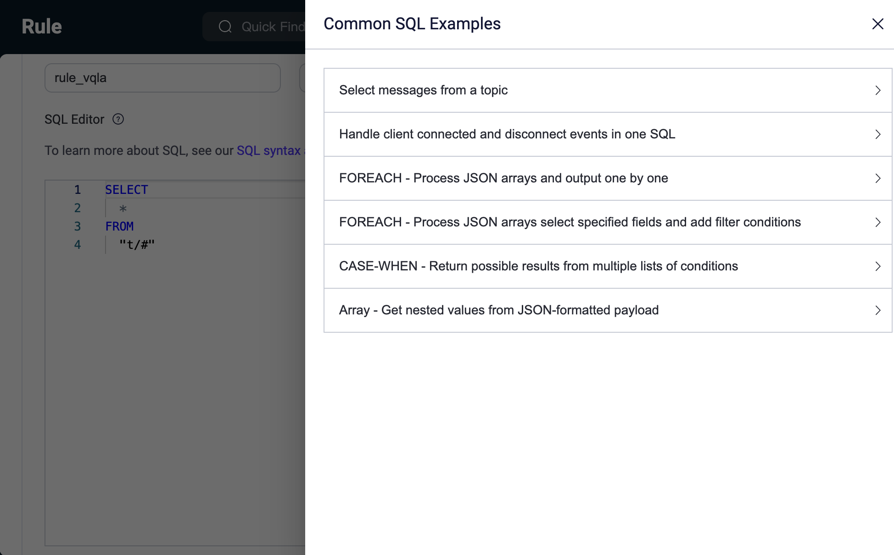
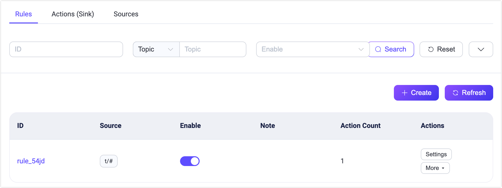
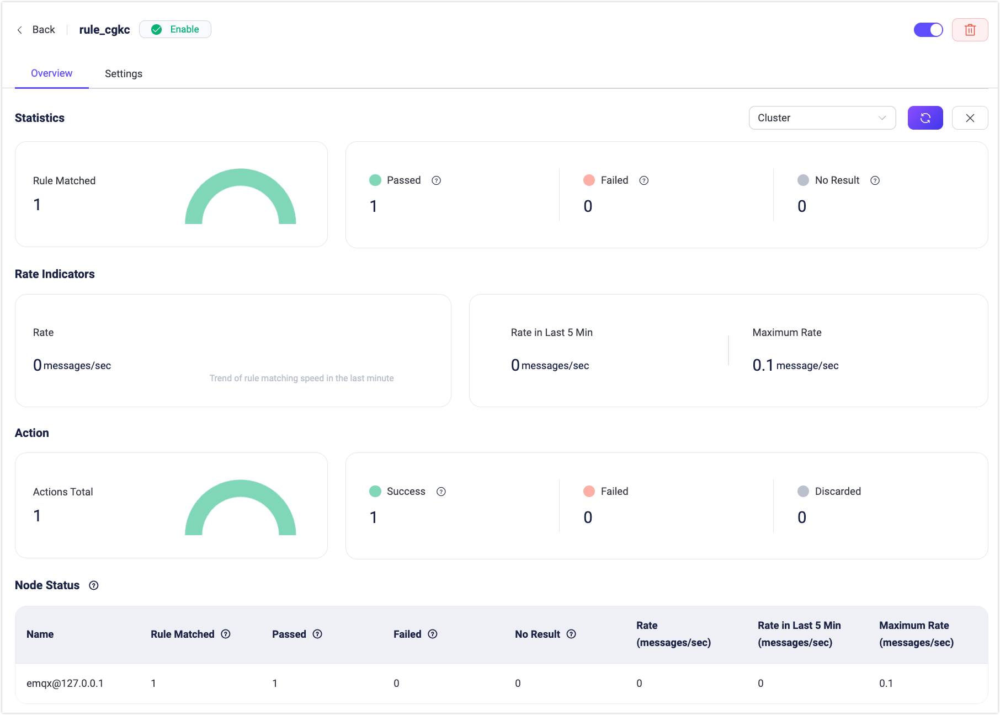

# ルール

EMQX は強力で効率的な組み込みデータ処理機能であるルールエンジンを提供します。SQL ライクな構文を活用することで、ユーザーはさまざまなソースからデータを簡単に抽出、変換、拡張できます。処理されたデータは、ルールによってトリガーされるアクション（組み込みアクションや Sink/Source を含む）を通じて外部システムに配布または統合できます。また、処理済みのデータを MQTT クライアントやデバイスに再パブリッシュすることも可能です。

ルールエンジンは EMQX のデータ統合機能の中核コンポーネントです。データ統合を用いた柔軟なビジネス統合ソリューションを提供し、ビジネス開発プロセスを簡素化し、ユーザーの利便性を向上させ、ビジネスシステムと EMQX 間の結合度を低減します。詳細は [ルールエンジン](../data-integration/rules.md) をご参照ください。

ルールの作成および管理は、左側メニューの **Integration** -> **Rules** をクリックして **Rules** ページにアクセスします。

## ルールの作成

ルールを作成するには、Rules ページ右上の **Create** をクリックします。また、Connector ページの既存コネクターの **Action** 列にある **Create Rule** をクリックして、素早くルールを作成することも可能です。

### SQL エディター

Create Rule ページには SQL エディターがあり、SQL 文を用いてルールロジックを定義できます。これにより、クライアントやシステム間で交換されるデータのリアルタイムな操作（クエリ、フィルタリング、変換、拡張）が可能です。

ルールの識別と整理のために、ルール ID と任意のノートを入力します。ルール ID は自動的に一意のものが生成されますが、任意で指定することもできます。ノート欄はルールの目的を簡潔に説明するために使用します。

SQL エディター下の **SQL Examples** をクリックすると、右側に一般的な SQL 例が表示されます。以下の例を参考にして素早くルールを作成できます。

デフォルトの SQL 文は `SELECT * FROM "t/#"` で、これはクライアントがトピック `t/#` にメッセージをパブリッシュした際に、ルールエンジンがそのイベントのすべてのデータを取得することを意味します。

`SELECT` キーワードはメッセージ内のすべてのフィールドを取得できます。例えば、現在のメッセージの `Payload` を取得したい場合は、`SELECT payload from "t/#"` のように変更します。データは [組み込み関数](../data-integration/rule-sql-builtin-functions.md) を使って処理・変換可能です。

`FROM` キーワードの後には1つ以上のデータソースが続きます。利用可能なイベントトピックを確認するには、SQL エディター下の **Try It Out** エリアでオプションのデータソースイベントを確認できます。`WHERE` キーワードを使うことで条件付きフィルタリングを追加できます。SQL 文法の詳細は [SQL syntax and examples](./../data-integration/rule-sql-syntax.md) をご覧ください。

### Try It Out

SQL 文が完成したら、ページ下部の **Try It Out** トグルスイッチをクリックして、このエリアでルールのテストを実行できます。

SQL テストでは、**Data Source** ドロップダウンからイベントやデータソースを選択し、シミュレーション用のテストデータを入力して **Run Test** をクリックすると、右側の **Output Result** に実行結果が表示されます。

SQL 文を変更するたびにこのテストでルールの出力データを確認し、ルールの正確性を確保できます。

::: tip

SQL 実行時に `412` エラーコードが表示された場合、テストデータとの不一致が原因の可能性があります。データソースが SQL 文と一致しない場合、対応するイベントやデータソースの選択を促されます。更新されたデータソースイベントに応じてテストデータも自動的に更新されます。

:::

シミュレーション用データソースは実際のシナリオと同様で、いくつかの MQTT イベントを含みます。メッセージ部分では、以下の異なるメッセージイベントを選択してデータをシミュレートできます。

- メッセージパブリッシュ（mqtt トピック）
- メッセージ配信済み（$events/message/delivered）
- メッセージアック済み（$events/message/acked）
- メッセージドロップ（$events/message/dropped）

その他のイベントでは、以下のクライアントおよびセッションイベントを選択してデータをシミュレート可能です。

- クライアント接続済み（$events/client/connected）
- クライアント切断済み（$events/client/disconnected）
- クライアント connack（$events/client/connack）
- クライアント認可チェック完了（$events/auth/check_authz_complete）
- クライアント認証チェック完了（$events/auth/check_authn_complete）
- サブスクライブ済み（$events/session/subscribed）
- サブスクライブ解除済み（$events/session/unsubscribed）

対応するデータソースはエディター内の SQL 文と一致している必要があります。メッセージイベントを使ってデータを取得する場合は、`FROM` キーワードの後に対応するイベントトピック（括弧内の内容）を SQL 文に記述してください。ルールは複数イベントの使用もサポートしています。データソースやイベントの詳細は [SQL Data Source and Fields](../data-integration/rule-sql-events-and-fields.md) をご覧ください。

テストエリアでルールを検証することも可能です。詳細なテスト手順は [Test Rule](../data-integration/rule-get-started.md#test-rule) をご参照ください。

### アクション出力

SQL 文の編集とルールのデバッグが完了し、要件に合った出力データが得られたら、ページ右側の **Action Outputs** タブでルールトリガー後に実行するアクションを選択できます。**Add Action** ボタンをクリックすると、2つの組み込みアクションや各種 Sink/Source からアクションタイプを選択し、ルールの出力データをさらに処理できます。アクション作成の詳細は [Add Action](../data-integration/rule-get-started.md#add-action) をご覧ください。

## ルールの閲覧

ルール作成後は、ルール一覧でルールの基本情報を確認できます。ルール ID、ルールがアクセスするデータのソース（イベント、トピック、データブリッジなど）、ルールノート、有効状態、作成日時が表示されます。ルールの設定、削除、有効化、無効化などの操作が可能です。ルールの複製と修正もアクションバーから行え、ルールの再利用性を高められます。

一覧上部には検索バーがあり、ルール ID、トピック、有効状態、ノートの複数条件でルールを検索できます。これにより条件に合うルールを素早く見つけて閲覧・設定できます。なお、ルール ID とノートはあいまい検索に対応し、トピックはワイルドカード検索に対応しています。

## ルール実行統計

ルール一覧ページでルール ID をクリックすると、ルール概要ページに素早く移動できます。ルール概要ページにはルールの基本的なデータ統計が含まれ、ルールの実行統計や当該ルール下のアクション実行統計が表示されます。例えば、マッチ数、通過数、失敗数、ルールの実行率、アクションの成功・失敗回数などです。右上の **Refresh** ボタンをクリックすると、現在のルールのリアルタイム実行データ統計を確認できます。

## 設定

ルール一覧の **Action** 列にある **Settings** タブまたは **Settings** ボタンをクリックすると、設定ページに入れます。ここにはルールの基本情報が表示され、ルール作成ページと同様です。このページでルールの修正やデバッグが可能です。例えば、現在のルール下の実行アクションの変更、ルールノートの修正、SQL 文の再編集などが行えます。

