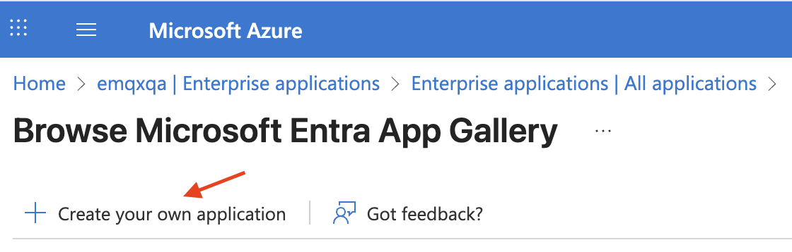
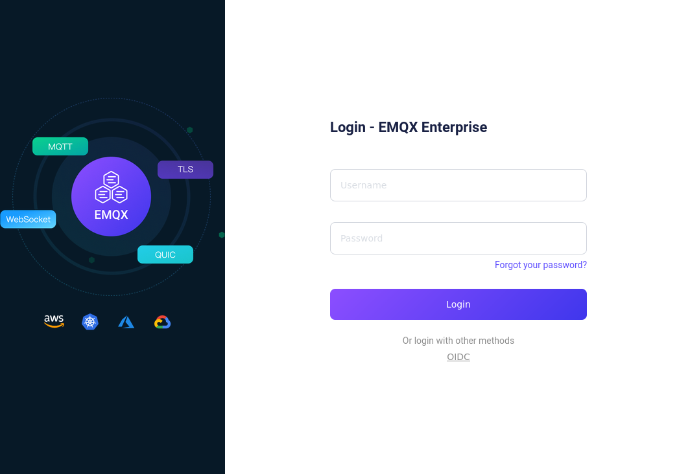

# OIDCベースのSSO設定

このページでは、OpenID Connect（OIDC）プロトコルに基づくシングルサインオン（SSO）の設定と利用方法について説明します。

::: tip 前提条件

[シングルサインオン（SSO）](./sso.md)の基本概念に慣れていることを推奨します。

:::

## 対応するOIDCプロバイダー

EMQXダッシュボードは、OIDCプロトコルをサポートするアイデンティティサービスと連携してOIDCベースのSSOを実現できます。例として以下があります：

- [Microsoft Entra ID](https://www.microsoft.com/en-us/security/business/identity-access/microsoft-entra-id)
- [Okta](https://www.okta.com/)

## Microsoft Entra IDとの連携によるSSO設定

このセクションでは、Microsoft Entra IDをアイデンティティプロバイダー（IdP）として使用し、SSOを設定する方法を案内します。Microsoft側とEMQXダッシュボード側の両方で設定を完了する必要があります。

### ステップ1：EMQXダッシュボードでOIDCを有効化

1. EMQXダッシュボードで、**System** -> **SSO** に移動します。
2. **OIDC**カードの**Enable**ボタンをクリックします。

### ステップ2：Microsoft Entra IDにアプリケーションを登録

1. 管理者として[MS Azureポータル](https://portal.azure.com/)にログインします。

2. **Microsoft Entra ID** -> **Enterprise Applications** -> **New Application** に進み、**Create your own application**をクリックします。

   

3. アプリケーション名（例：`EMQX Dashboard`）を入力し、**Register an application to integrate with Microsoft Entra ID (App you're developing)** を選択して、**Create**をクリックします。

   

4. **Register an application**ページで、サポートするアカウントの種類を選択し、EMQXダッシュボードの**ステップ1**で提供された情報を使って**Redirect URL**を設定します：

   - **Redirect URL**：`Web`を選択し、ダッシュボードで提供された**Sign-in Redirect URI**（例：`http://localhost:18083/api/v5/sso/oidc/callback`）を入力します。

5. **Certificates and Secrets** -> **Client secrets**タブに移動し、**New client secret**をクリックします。説明を入力し、有効期限を選択して**Add**をクリックします。生成されたシークレット値をコピーしてください。これは**ステップ3**で使用します。

### ステップ3：EMQXダッシュボード設定の完了

1. 設定ページで以下の情報を入力します：

   - **Provider**：`Generic`のままにします。

   - **Issuer URL**：これは**OpenID Connect metadata document**に対応し、**ステップ2**のアプリケーション概要ページの**Endpoints**タブで確認できます。ただし、`/.well-known/openid-configuration`部分はEMQXが自動で付加するため除きます。例：`https://login.microsoftonline.com/<tenant_id>/v2.0`（`<tenant_id>`はディレクトリ（テナント）ID）。

   - **Client ID**：**ステップ2**のアプリケーション概要ページにある**Application (client) ID**に対応します。

     

   - **Client Secret**：**ステップ2**で生成したシークレット値を使用します。

   - **Dashboard Address**：ユーザーがダッシュボードにアクセスするためのベースURLを入力します（例：`http://localhost:18083`）。このアドレスはIdP側の設定用に**SSO Address**および**Metadata Address**の生成に自動で組み合わされます。

     

2. **Update**をクリックして設定を完了します。

## Oktaとの連携によるSSO設定

このセクションでは、Oktaをアイデンティティプロバイダー（IdP）として使用し、SSOを設定する方法を案内します。Okta側とEMQXダッシュボード側の両方で設定を完了する必要があります。

### ステップ1：EMQXダッシュボードでOIDCを有効化

1. EMQXダッシュボードで、**System** -> **SSO** に移動します。
2. **OIDC**カードの**Enable**ボタンをクリックします。

### ステップ2：OktaのアプリケーションカタログにOIDCアプリケーションを追加

1. 管理者としてOktaにログインし、**Okta Admin Console**にアクセスします。

2. **Applications** -> **Applications**ページに移動し、**Create App integration**ボタンをクリックします。ポップアップでサインイン方法として`OIDC - OpenID Connect`を選択します。

3. **Application type**として`Web Application`を選択し、**Next**をクリックします。

4. **General Settings**タブでアプリケーション名（例：`EMQX Dashboard`）を入力し、**Next**をクリックします。

5. **LOGIN**タブで、EMQXダッシュボードから提供された情報を使って設定します：

   - **Sign-in redirect URIs**：ダッシュボードの**OIDC Settings**ページで提供される**Sign-in Redirect URI**（例：`http://localhost:18083/api/v5/sso/oidc/callback`）を入力します。
   - その他の設定は任意で、要件に応じて構成可能です。

6. 設定内容を確認し、**Save**をクリックします。

詳細は[Oktaドキュメント](https://help.okta.com/en-us/content/topics/apps/apps_app_integration_wizard_oidc.htm)を参照してください。

### ステップ3：EMQXダッシュボード設定の完了

1. **OIDC Settings**ページで以下の情報を入力します：

   - **Provider**：`Okta`を選択、または他のプロバイダーの場合は`Generic`を選択します。
   - **Issuer URL**：Okta認可サーバーのURL（例：`https://example-org.okta.com`）。
   - **Client ID**：**ステップ2**で作成したアプリケーションからコピーします。
   - **Client Secret**：**ステップ2**で作成したアプリケーションからコピーします。
   - **Dashboard Address**：ユーザーがダッシュボードにアクセスするためのベースURL（例：`http://localhost:18083`）。IdP側の設定用に**SSO Address**および**Metadata Address**の生成に自動で組み合わされます。

2. **Update**をクリックして設定を完了します。

## 詳細設定

**Advanced Settings**セクションでは、EMQXがOIDCプロバイダーからユーザー情報を取得する方法や認証動作を細かく調整できます。

| フィールド名                         | 説明                                                         | デフォルト値                                         |
| ------------------------------------ | ------------------------------------------------------------ | --------------------------------------------------- |
| **Scopes**                           | 認証時に要求するOIDCスコープ。これらのスコープはIdPが返すユーザー情報を決定します。OIDC認証には最低限`openid`スコープが必要です。 | `openid`                                            |
| **Name Variable**                    | OIDCユーザー属性をEMQXダッシュボードのユーザー名にマッピングするテンプレート。IdPが返すクレームを参照可能です。 | `${sub}`                                            |
| **Name Variable Source**             | ダッシュボードのユーザー名を構築するためにユーザー情報を抽出するソースを指定します。利用可能なオプション： **User Info Endpoint**：`/userinfo`エンドポイントから返されるユーザー情報を使用 **ID Token**：認証時に返されるIDトークン内のクレームを使用 | `User Info Endpoint`                                |
| **Role Source**                     | ダッシュボードユーザーのロールを構築するためにユーザー情報を抽出するソースを指定します。利用可能なオプションは上記と同様です。 | `User Info Endpoint`                                |
| **Role Expression**                  | [`jq`](https://jqlang.org/manual/)式で、OIDCユーザー属性をEMQXダッシュボードのユーザーロールにマッピングします。プログラムはIdPが返すクレームを参照可能です。式は有効なロールを表す文字列を1つだけ返す必要があります。サポートされるロールは：  `"viewer"`   `"administrator"`  結果がこれ以外の場合、ユーザーは作成されません。このフィールドが未設定の場合、EMQXはユーザーをviewerロールで作成するか、既存ユーザーの場合は既存のロールを維持します。 | 未設定                                              |
| **Namespace Source**                | ダッシュボードユーザーのマルチテナンシーネームスペースを構築するためにユーザー情報を抽出するソースを指定します。利用可能なオプションは上記と同様です。 | `User Info Endpoint`                                |
| **Namespace Expression**             | [jq](https://jqlang.org/manual/)式で、OIDCユーザー属性をEMQXダッシュボードのユーザーネームスペースにマッピングします。式はIdPが返すクレームを参照可能で、既存のネームスペース名の文字列またはグローバルネームスペースを示すnullを1つだけ返す必要があります。それ以外の結果の場合、ユーザーは作成されません。このフィールドが未設定の場合、EMQXはユーザーをグローバルネームスペースに配置するか、既存ユーザーの場合は既存のネームスペースを維持します。 | 未設定                                              |
| **Session Expiry**                  | ユーザーがOIDCでログイン後、ダッシュボードのセッションが有効な期間（秒単位）です。 | `30`秒                                             |
| **Enable PKCE**                    | 認可コードフローのセキュリティを強化するためにProof Key for Code Exchange（PKCE）を有効化します。 | 無効                                                |
| **Preferred Authentication Methods** | トークンエンドポイントと通信する際のクライアント認証方法を定義します。複数の方法を設定でき、順番に試行されます。 | `client_secret_post`, `client_secret_basic`, `none` |
| **Fallback Methods**               | プロバイダーのメタデータに明示的な署名アルゴリズムがない場合にIDトークンの検証に使用するフォールバック署名アルゴリズムを指定します。 | `RS256`                                             |
| **JSON Web Key (JWK)**             | IdPがJWKSエンドポイントを提供しない場合にトークン署名の検証に使用するオプションの静的JSON Web Key設定です。 | `None`                                              |

## ログインとユーザー管理

OIDC SSOを有効化すると、EMQXダッシュボードのログインページにSSOオプションが表示されます。**OIDC**ボタンをクリックすると、OIDCプロバイダーのログインページに遷移し、ユーザーに割り当てられた認証情報でログインできます。

認証が成功すると、EMQXは自動的にダッシュボードユーザーを追加します。ユーザーは[Users](./system.md#users)で管理でき、ロールや権限の割り当てが可能です。

## ログアウト

ユーザーはダッシュボードの上部ナビゲーションバーにあるユーザー名をクリックし、ドロップダウンメニューの**Logout**ボタンをクリックしてログアウトできます。なお、これはダッシュボードからのログアウトのみであることにご注意ください。
