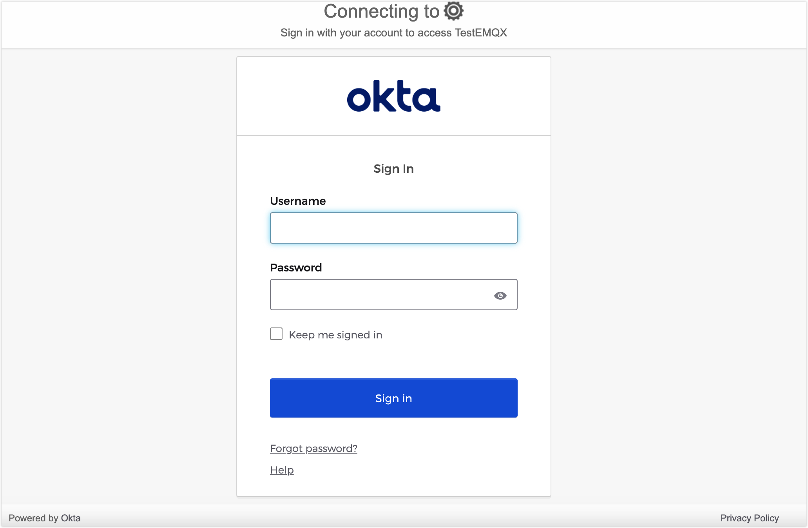

# SAMLベースのSSOの設定

このページでは、Security Assertion Markup Language（SAML）2.0標準プロトコルに基づくシングルサインオン（SSO）の設定および利用方法について説明します。

::: tip 前提条件

[シングルサインオン（SSO）](./sso.md)の基本概念に慣れていることを推奨します。

:::

## 対応しているSAMLサービス

EMQXダッシュボードは、SAML 2.0プロトコルをサポートするアイデンティティサービスと連携して、SAMLベースのSSOを実現できます。対応例は以下の通りです。

- [Okta](https://www.okta.com/)
- [OneLogin](https://www.onelogin.com/)

その他のアイデンティティプロバイダーも統合対応中で、今後のバージョンでサポート予定です。

## Oktaとの連携によるSSOの設定

このセクションでは、Oktaをアイデンティティプロバイダー（IdP）として使用し、SSOを設定する手順を案内します。Okta側とEMQXダッシュボード側の両方で設定を完了する必要があります。

### ステップ1：EMQXダッシュボードでOktaを有効化

1. ダッシュボードの **System** -> **SSO** に移動します。
2. **SAML 2.0**カードの **Enable** ボタンをクリックします。
3. 設定画面で以下の情報を入力します：
   - **Force MFA**：必要に応じて有効化すると、このバックエンドのすべてのユーザーにログイン時のTOTP検証を強制します。デフォルトは無効です。詳細は[SSOユーザーの強制MFA](../multi-factor-authn/multi-factor-authentication.md#forced-mfa-for-sso-users)を参照してください。
   - **Dashboard Address**：ユーザーがダッシュボードの実際のアクセスアドレスにアクセスできるようにします。特定のパスは指定しません。例：`http://localhost:18083`。このアドレスは自動的に連結され、IdP側設定用の**SSO Address**と**Metadata Address**が生成されます。
   - **SAML Metadata URL**：一時的に空欄のままにしておき、ステップ2の設定を待ちます。
4. **Update** をクリックして設定を完了します。

### ステップ2：OktaのアプリケーションカタログにSAML 2.0アプリケーションを追加

1. Oktaに管理者としてログインし、**Okta Admin Console**にアクセスします。

2. **Applications -> Applications** ページに移動し、**Create App integration** ボタンをクリックします。ポップアップでサインイン方法として `SAML 2.0` を選択し、**Next** をクリックします。

3. **General Settings** タブでアプリケーション名（例：`EMQX Dashboard`）を入力し、**Next** をクリックします。

4. **Configure SAML** タブで、ステップ1のダッシュボードで提供された情報を設定します：

   - **Single sign-on URL**：ダッシュボードで提供された**SSO Address**を入力します。例：`http://localhost:18083/api/v5/sso/saml/acs`
   - **Audience URI (SP Entity ID)**：ダッシュボードで提供された**Metadata Address**を入力します。例：`http://localhost:18083/api/v5/sso/saml/metadata`

   その他の情報は任意で、実際の要件に応じて設定してください。

5. 設定内容を確認し、**Next** をクリックします。

6. **Feedback** タブで **I'm an Okta customer adding an internal app** を選択し、必要に応じてその他の情報を入力して、**Finish** をクリックしアプリケーション作成を完了します。

### ステップ3：Oktaでの設定完了とユーザー・グループの割り当て

1. Oktaの **Sign On** タブに移動し、**Metadata URL** をコピーします。
2. ダッシュボードのステップ1に戻り、コピーした**Metadata URL**を**SAML Metadata URL**に貼り付けて、**Update** をクリックします。
3. **Okta > Assignments** タブで、EMQXダッシュボードアプリケーションにユーザーとグループを割り当てます。ここで割り当てられたユーザーのみがこのアプリケーションにログイン可能です。

## ログインとユーザー管理

SAMLシングルサインオンを有効化すると、EMQXダッシュボードのログインページにSSOオプションが表示されます。**SAML**ボタンをクリックすると、IdPの事前設定されたログインページに遷移し、割り当てられたユーザー資格情報でログインできます。

SAML認証に成功すると、EMQXは自動的にダッシュボードユーザーを追加します。追加されたユーザーは[Users](./system.md#users)で管理でき、役割や権限の割り当てが可能です。SAMLユーザーにログイン時のTOTP二要素認証を必須にする場合は、[SSOユーザーの強制MFA](../multi-factor-authn/multi-factor-authentication.md#forced-mfa-for-sso-users)を参照してください。

## ログアウト

ユーザーはダッシュボードの上部ナビゲーションバーにあるユーザー名をクリックし、ドロップダウンメニューの**Logout**ボタンをクリックしてログアウトできます。なお、これはダッシュボードからのログアウトのみであり、SAMLは現時点でシングルサインアウトをサポートしていません。
