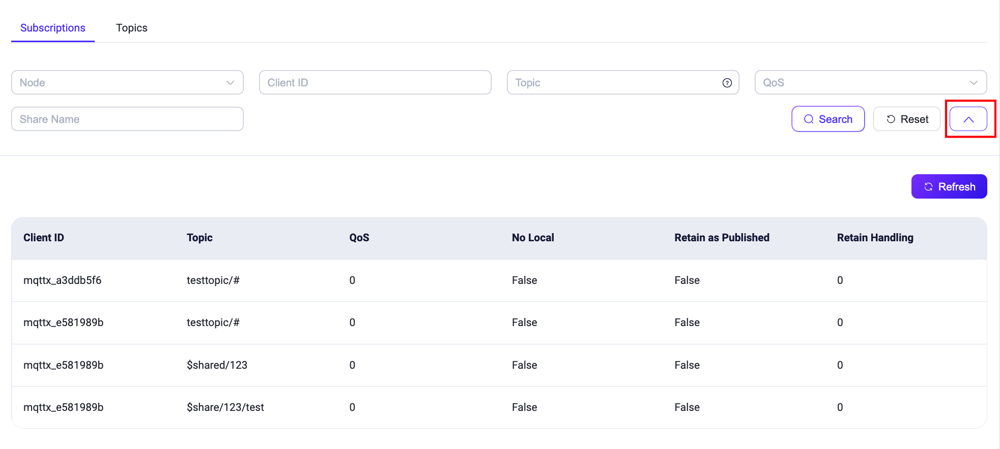
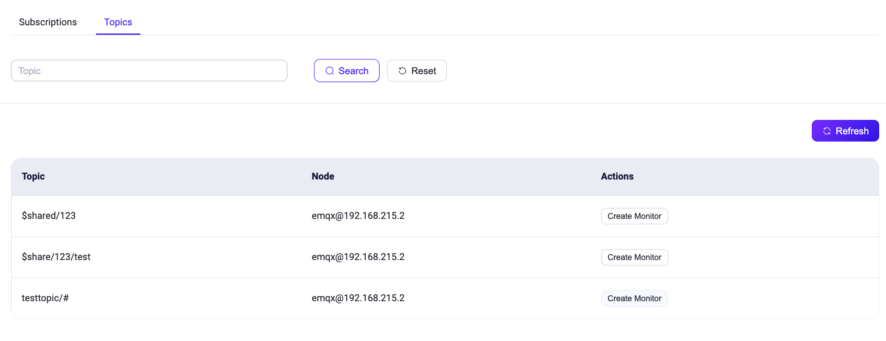

# サブスクリプション管理

このページでは、EMQX ダッシュボードでクライアントのサブスクリプションおよび接続されているトピックの確認方法について説明します。

## サブスクリプション

サブスクリプションページでは、クライアントIDとトピックごとにマッピングされた接続がサブスクライブしているすべてのトピックを表示します。各サブスクリプションの基本情報として、クライアントID、トピック、QoS（サービス品質）を提供します。さらに、MQTT v5でサポートされている新しいサブスクリプション機能もリストに含まれています。

- **No Local**: MQTT v3.1.1では、自分がパブリッシュするトピックをサブスクライブすると、自分自身のメッセージもすべて受信します。MQTT v5では、このオプションを `1` に設定すると、サーバーが自分自身のパブリッシュしたメッセージをクライアントに転送しないようにできます。
- **Retain as Published**: このオプションは、メッセージをクライアントに転送する際にサーバーがRETAINフラグを保持するかどうかを指定します。なお、これは保持メッセージのRETAINフラグには影響しません。したがって、Retain As Publishが`0`に設定されている場合、クライアントはメッセージ内のRETAINフラグのみを参照して、通常のパブリッシュメッセージか保持メッセージかを判断します。
- **Retain Handling**: このオプションは、クライアントがサブスクライブした際にサーバーが保持メッセージを送信するタイミングを指定します。
  - Retain Handlingが0の場合：クライアントがサブスクライブに成功するとすぐに保持メッセージを送信します。
  - Retain Handlingが1の場合：このサブスクリプションが以前に存在しなかった場合のみ保持メッセージを送信します。
  - Retain Handlingが2の場合：サブスクリプションの状態にかかわらず、クライアントに保持メッセージを送信しません。

上部の検索バーにはデフォルトで3つのフィルター項目が表示されます：ノード、クライアントID、トピック。ノードはドロップダウン選択ボックスで、特定のノードに接続しているクライアントでサブスクリプションを絞り込むことができます。クライアントIDとトピックはサブスクリプションリスト内のあいまい検索に使用できます。検索バー横の右矢印ボタンをクリックすると、QoS（サービス品質）および共有名のフィルター入力ボックスが表示され、[共有名](../../messaging/mqtt-shared-subscription.md)の精密検索に対応しています。

## トピック

トピックページでは、複数のノードにまたがる接続がサブスクライブしているすべてのトピックを表示します。同一ノード内で異なる接続が同じトピックをサブスクライブしている場合は重複排除を行います。ユーザーはトピックを対象にあいまい検索を行い、リストを絞り込むことができます。

> 注意：サブスクリプションリストはクライアント単位の情報ですが、トピックリストは現在サブスクライブされているすべてのトピックを表示します。同じトピックが複数のクライアントによってサブスクライブされている場合があります。

「アクション」列の **Create Monitor** をクリックすると、**診断** -> **トピックメトリクス** ページに遷移します。ここで、特定トピックのメッセージ数やレートなどの指標を追跡するための[トピックメトリクス](../../observability/topic-metrics.md)を作成できます。

