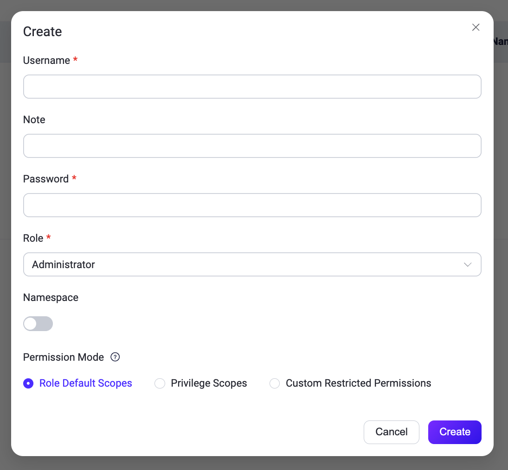

# システム

EMQXダッシュボードの**システム**メニューでは、ユーザーおよびロール管理、監査ログ、APIキー、ライセンス、SSO、データのバックアップと復元、ホットアップグレード、一般設定などのシステム管理オプションにアクセスできます。

## ユーザー

**ユーザー**ページでは、[CLI](../admin/cli.md)で生成されたユーザーを含む、すべてのアクティブなダッシュボードユーザーの概要を確認できます。

新しいユーザーを追加するには、ページ右上の**+ 作成**ボタンをクリックします。ポップアップダイアログが表示され、必要なユーザー情報の入力を求められます。入力後、**作成**ボタンをクリックしてユーザーアカウントを生成します。ユーザー管理のために、編集、パスワード更新、ユーザー情報の削除などの操作は、アクション列から簡単にアクセスできます。

> セキュリティ上の理由から、EMQX 5.0.0以降、ダッシュボードユーザーはREST API認証には使用できません。


### ロールベースアクセス制御

EMQX 5.3以降、ダッシュボードにEMQX Enterpriseユーザー向けのロールベースアクセス制御（RBAC）機能が導入されました。

RBACにより、組織内の役割に基づいてユーザーに権限を割り当てることができます。この機能は認可管理を簡素化し、アクセス制限によるセキュリティ強化と組織のコンプライアンス向上に寄与し、ダッシュボードの重要なアクセス制御メカニズムとなっています。

現在、ユーザーには以下のいずれかの事前定義されたロールを設定できます。ユーザー作成時に**ロール**ドロップダウンから選択可能です。

+ **管理者（Administrator）**

    管理者はクライアント管理、システム設定、APIキー、ユーザー管理など、すべてのEMQX機能とリソースを完全に管理できます。

+ **閲覧者（Viewer）**

    閲覧者はすべてのEMQXデータと設定にアクセスでき、REST APIのすべての`GET`リクエストに相当します。ただし、データの作成、変更、削除はできません。

### ログインユーザースコープ

EMQX 5.10以降、ダッシュボードログインユーザーに対して、ロール内でアクセス可能なAPIの範囲をさらに制限するスコープを割り当てられます。[10のAPIキー組み込みスコープ](../admin/api.md#built-in-scopes)に加え、ダッシュボードユーザーにはブラウザセッションにのみ適用される4つの追加スコープがあります。

| スコープ | 必要なロール | 用途 |
| --- | --- | --- |
| `user_management` | 管理者 | ダッシュボードユーザーの管理（作成／更新／削除）。 |
| `sso_management` | 管理者 | SSOバックエンドおよびSSOユーザー記録の管理。 |
| `api_key_management` | 管理者 | APIキーの管理。 |
| `mfa_management` | すべて | 自身のMFA管理。管理者は他ユーザーのMFAも管理可能。 |

このうち、`user_management`、`sso_management`、`api_key_management`は管理者ロールが必要で、閲覧者には割り当てられません。例外は`mfa_management`で、閲覧者も保持可能ですが、自身のMFA管理のみ許可され、他ユーザーのMFA設定にはアクセスできません。これは閲覧者が追加権限なしに自身の認証器を再登録または回復できるようにするために有用です。

ユーザー作成または編集時の**スコープ**欄は任意です。空欄の場合、ロールに基づくデフォルトのスコープセットが割り当てられます。

- **管理者**：上記4つのログイン専用スコープを含むすべてのスコープ。
- **閲覧者**：一般的なAPIキーのスコープすべて。`mfa_management`は明示的に割り当てた場合のみ付与。



#### ロール変更とスコープ互換性

ユーザーのロールを変更すると、EMQXは現在のスコープが新しいロールに適合するか検証します。適合しない場合、HTTP 400でリクエストは拒否されます。解決するには、新しいロールに適合する`scopes`リストを同時に含めてリクエストしてください。

例として、管理者から閲覧者に降格する場合、`user_management`、`sso_management`、`api_key_management`を保持していると拒否されます。閲覧者に適合するスコープのみを含む`scopes`リストを指定して変更を完了してください。（`mfa_management`は管理者専用ではないため拒否の対象外です。）

### デフォルト管理者保護

`dashboard.default_username`アカウント（`dashboard.default_password`で設定されたパスワードで作成）は緊急用アカウントです。システムが他の管理者の誤設定やアクセス喪失時に必ず復旧可能となるよう、以下の保護が適用されます。

- ダッシュボードやREST APIから**削除できません**。削除ボタンは無効化されています。
- ロールは`administrator`から**変更できません**。
- スコープセットは**カスタマイズ不可**で、常に完全な管理者スコープを保持します。
- 説明とパスワードは通常通り編集可能です。

他の管理者は影響を受けず、システムに管理者が1人以上残っていれば削除可能です。

### セルフサービスの範囲

すべてのダッシュボードユーザーはスコープに関係なく、以下のセルフサービス操作が許可されています。

- 自身のパスワード変更。
- 自身のTOTP／MFAの登録または再登録。MFAの無効化も可能ですが、管理者がユーザーにMFA必須を設定している場合は`mfa_management`スコープが必要です。

その他のプロフィール更新（説明、ロール、管理者によるスコープ割当）は、操作ユーザーに適切なスコープが必要であり、対象が操作ユーザー自身でも例外はありません。

### ネームスペース付きロール

EMQX 6.0以降、ダッシュボードはネームスペース付きロールをサポートしています。この機能はロールベースアクセス制御を拡張し、マルチテナンシーを実現します。各ユーザーは特定のネームスペース内でのみ操作を制限できます。

::: warning 信頼されたデプロイメントのみ

ネームスペース付き管理者アクセスは、組織内のチームや事業部門を分離し、誤ったクロスチーム設定変更のリスクを減らすための信頼された内部デプロイメント向け機能です。強力な分離保証は提供せず、公開または信頼されていないマルチテナント環境のセキュリティ境界としては不適切です。

委任管理者にネームスペーススコープのリソース管理を許可する場合は、**管理** > **クラスター設定** > **[ルールエンジンセキュリティ](./cluster_settings.md#rule-engine-security)**でSSRF保護を有効にし、ルールエンジン管理のアウトバウンドターゲットを検証してください。ランタイムのネットワーク制御には`iptables`や`nftables`などのホストレベルのイグレス制御を追加してください。[ルールエンジンポリシーとファイアウォールルールによるSSRF緩和](../deploy/cluster/security.md#mitigate-ssrf-with-rule-engine-policy-and-firewall-rules)を参照してください。

:::

::: tip

ネームスペースの詳細は[ネームスペース](../multi-tenancy/namespace-overview.md)をご覧ください。

:::

#### ネームスペース付きロールでユーザーを作成する

ダッシュボードで新規ユーザーを作成すると、**ネームスペース**オプションが表示されます。

::: tip 前提条件

1. ダッシュボードで管理対象ネームスペース（例：`namespace_01`）を作成済みであること。[ネームスペースの作成](../multi-tenancy/create-namespace.md)を参照してください。
2. EMQXライセンスおよびクラスターがEMQX 6.0以降で稼働していること。

:::

1. **システム** -> **ユーザー**に移動し、**+ 作成**をクリックします。
2. 必須項目を入力します：
   - **ユーザー名**：ユーザーの一意識別子。
   - **メモ**：任意の説明。
   - **パスワード**：ユーザーのログインパスワード。
   - **ロール**：**管理者**または**閲覧者**を選択。
3. **ネームスペース**オプションを切り替え、既存のネームスペース（例：`namespace_01`）を選択します。
4. **作成**をクリックして完了します。

CLIやAPIでユーザーを作成する場合、ロールは以下の形式で明示的に指定する必要があります。

```
ns:<NAMESPACE>::<ROLE>
```

例：

- `ns:namespace_01::administrator`
- `ns:namespace_01::viewer`

#### ネームスペース付きユーザーの挙動

- **スコープ付きリソース**：ネームスペース付きユーザーは割り当てられたネームスペース内のリソース（コネクター、アクション、ソース、ルール、その他ネームスペース対応モジュール）だけを閲覧・管理可能です。
- **クラスター設定**：まだネームスペース対応していない設定はネームスペース付きユーザーには読み取り専用です。変更できるのはグローバル管理者のみです。
- **デフォルトのランディングページ**：ネームスペース付きユーザーは通常通りダッシュボードにログインし、**概要**ページから開始します。メニュー項目はすべて表示されますが、リソースデータは自動的に割り当てネームスペースでフィルタリングされます。
- **ライセンス管理**：ネームスペース付きユーザーはライセンス通知を表示しません。ライセンス管理はシステム管理者の責任です。

#### ネームスペース内のロール意味

- **管理者**：割り当てられたネームスペース内のリソースを作成、更新、削除、閲覧する完全な権限。
- **閲覧者**：割り当てられたネームスペース内のリソースを読み取り専用でアクセス（`GET`リクエスト相当）。

## 監査ログ

**監査ログ**ページでは、管理者がEMQXクラスター内の重要な運用変更をリアルタイムで監視するための監査ログ設定を行えます。

監査ログ機能の詳細は[監査ログ](../dashboard/audit-log.md)をご覧ください。

## APIキー

**APIキー**ページでは、[HTTP API](../admin/api.md)へのアクセス用APIキーの作成と管理が可能です。APIキーの作成・管理方法やロール・スコープの割り当てについては[APIキーの作成](../admin/api.md#create-api-keys)を参照してください。

## ライセンス

左側の**システム**メニューから**ライセンス**をクリックすると、ライセンスページにアクセスできます。このページでは、現在のライセンスの基本情報（接続クォータ使用状況、EMQXバージョン、顧客情報、発行情報など）を確認できます。

**ライセンス更新**をクリックするとライセンスキーをアップロードできます。**ライセンス設定**セクションでは、接続クォータ使用状況の高水位・低水位の閾値を設定可能です。ライセンスの詳細は[EMQX Enterpriseライセンスの利用](../deploy/license.md)をご覧ください。

## SSO

**SSO**ページでは、管理者がユーザーログイン管理のためのSSO機能を設定できます。SSO機能の詳細は[シングルサインオン（SSO）](./sso.md)をご覧ください。

## バックアップと復元

**バックアップと復元**ページでは、運用データと設定ファイルのバックアップ設定を行えます。このページでデータのインポートおよびエクスポート操作が可能です。バックアップと復元機能の詳細は[バックアップと復元](../operations/backup-restore.md)をご覧ください。

## 設定

ダッシュボード右上の歯車アイコンをクリックすると設定にアクセスできます。

**設定**メニューでは、ダッシュボードの言語とテーマをカスタマイズできます。

- **言語**：表示言語を選択します。
- **テーマ**：ライトテーマ、ダークテーマ、またはOSのテーマに自動同期を選択できます。同期を有効にすると、テーマはOS設定に従い、手動選択は無効化されます。

さらに、設定メニューには**ルール**ページの[AI SQLジェネレーター](../data-integration/rule-get-started.md#sql-generator)機能の有効化／無効化トグルも含まれています。


