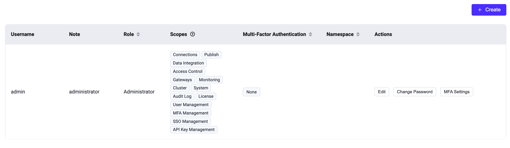

# システム

EMQX ダッシュボードの **システム** メニューでは、ユーザーおよびロール管理、監査ログ、APIキー、ライセンス、SSO、データのバックアップとリストア、ホットアップグレード、一般設定などのシステム管理オプションにアクセスできます。

## ユーザー

**ユーザー** ページでは、[CLI](../admin/cli.md) で生成されたユーザーを含む、すべてのアクティブなダッシュボードユーザーの概要を確認できます。

新しいユーザーを追加するには、ページ右上の **+ 作成** ボタンをクリックします。ポップアップダイアログが表示され、必要なユーザー情報の入力を求められます。入力後、**作成** ボタンをクリックしてユーザーアカウントを生成します。ユーザー管理のために、アクション列から編集、パスワード更新、ユーザー情報の削除などのオプションに簡単にアクセスできます。

> セキュリティ上の理由から、EMQX 5.0.0 以降、ダッシュボードユーザーは REST API 認証には使用できません。



### ロールベースアクセス制御

EMQX 5.3 から、ダッシュボードに EMQX Enterprise ユーザー向けのロールベースアクセス制御（RBAC）機能が導入されました。

RBAC により、組織内のユーザーの役割に基づいて権限を割り当てられます。この機能は認可管理を簡素化し、アクセス制限によるセキュリティ強化と組織のコンプライアンス向上を実現し、ダッシュボードにおける重要なアクセス制御機構となっています。

現在、ユーザーには以下の2つの事前定義ロールのいずれかを設定できます。ユーザー作成時に **ロール** ドロップダウンから選択可能です。

+ 管理者（Administrator）

    管理者はクライアント管理、システム設定、APIキー、ユーザー管理を含むすべての EMQX 機能とリソースを完全に管理できます。

+ 閲覧者（Viewer）

    閲覧者はすべての EMQX データと設定にアクセス可能で、REST API のすべての `GET` リクエストに相当します。ただし、データの作成、変更、削除権限はありません。

### ネームスペース付きロール

EMQX 6.0 から、ダッシュボードはネームスペース付きロールをサポートしています。この機能はロールベースアクセス制御を拡張し、マルチテナンシーを実現します。各ユーザーは特定のネームスペース内でのみ操作を制限できます。

::: warning 信頼されたデプロイメントのみ

ネームスペース付き管理者アクセスは、組織内のチームや事業部門を分離するなど、信頼できる内部デプロイメント向けに設計されています。誤って他チームの設定を変更するリスクを減らすための機能であり、強固な分離保証はありません。パブリックまたは信頼できないマルチテナント環境のセキュリティ境界としては適しません。

委任管理者にネームスペーススコープのリソース管理を許可する場合は、利用可能な場合 `rule_engine.ssrf` を有効にしてルールエンジン管理のアウトバウンドターゲットを検証してください。ランタイムのネットワーク制御には `iptables` や `nftables` などのホストレベルのイグレス制御を追加してください。詳細は [ルールエンジンポリシーとファイアウォールルールによる SSRF 軽減](../deploy/cluster/security.md#mitigate-ssrf-with-rule-engine-policy-and-firewall-rules) を参照してください。

:::

::: tip

ネームスペースの詳細については、[ネームスペース](../multi-tenancy/namespace-overview.md) をご覧ください。

:::

#### ネームスペース付きロールでユーザーを作成する

ダッシュボードで新規ユーザーを作成する際に、**ネームスペース** オプションが表示されます。

::: tip 前提条件

1. ダッシュボードで管理対象ネームスペース（例：`namespace_01`）を作成します。手順は [ネームスペースの作成](../multi-tenancy/create-namespace.md) を参照してください。
2. EMQX ライセンスおよびクラスターが EMQX 6.0 以降で稼働していることを確認してください。

:::

1. **システム** -> **ユーザー** に移動し、**+ 作成** をクリックします。
2. 必須項目を入力します：
   - **ユーザー名**：ユーザーの一意識別子
   - **メモ**：任意の説明
   - **パスワード**：ユーザーのログインパスワード
   - **ロール**：**管理者** または **閲覧者** を選択
3. **ネームスペース** オプションを有効にし、既存のネームスペース（例：`namespace_01`）を選択します。
4. **作成** をクリックして完了します。

CLI または API でユーザーを作成する場合、ロールは以下の形式で明示的に指定する必要があります。

```
ns:<NAMESPACE>::<ROLE>
```

例：

- `ns:namespace_01::administrator`
- `ns:namespace_01::viewer`

#### ネームスペース付きユーザーの動作

- **スコープ付きリソース**：ネームスペース付きユーザーは、割り当てられたネームスペース内のコネクター、アクション、ソース、ルールなどのリソースのみ閲覧・管理できます。
- **クラスター全体設定**：まだネームスペース対応していない設定は読み取り専用で、変更できるのはグローバル管理者のみです。
- **デフォルトのランディングページ**：ネームスペース付きユーザーは通常通りダッシュボードにログインし、**概要** ページから開始します。メニュー項目はすべて表示されますが、リソースデータは自動的にネームスペースでフィルタリングされます。
- **ライセンス管理**：ネームスペース付きユーザーはライセンス通知を表示しません。ライセンス管理はシステム管理者の責任です。

#### ネームスペース内のロールの意味

- **管理者**：割り当てられたネームスペース内のリソースに対して、作成・更新・削除・読み取りのすべての操作が可能です。
- **閲覧者**：割り当てられたネームスペース内で読み取り専用アクセス（`GET` リクエスト相当）を持ちます。

## 監査ログ

**監査ログ** ページでは、管理者が EMQX クラスター内の重要な運用変更をリアルタイムで監視するための監査ログ設定を行えます。

監査ログ機能の詳細は [監査ログ](../dashboard/audit-log.md) を参照してください。

## API キー

**API キー** ページでは、[HTTP API](../admin/api.md) へのアクセス用に API キーとシークレットキーを生成できます。手順は以下の通りです。

1. ページ右上の **+ 作成** ボタンをクリックし、API キー作成ダイアログを表示します。

2. API キー作成ダイアログで詳細情報を設定します。

   - 「Expire At」欄を空欄にすると、API キーは期限切れになりません。
   - API キーのロールを選択できます（任意）。ロールの詳細は [ロールと権限](../admin/api.md#roles-and-permissions) を参照してください。

3. **確認** ボタンをクリックすると、API キーとシークレットキーが生成され、**作成成功** ダイアログに表示されます。

   ::: warning 注意

   シークレットキーは再表示されないため、安全な場所に必ず保存してください。

   :::

    **閉じる** ボタンでダイアログを閉じます。


API キーの詳細は、**名前** 列のキー名をクリックして確認できます。**アクション** 列の **編集** ボタンで有効期限のリセット、ステータス変更、メモ編集が可能です。不要になった API キーは **削除** ボタンで削除できます。


## ライセンス

左側の **システム** メニューから **ライセンス** をクリックすると、ライセンスページにアクセスできます。このページでは、現在のライセンスの基本情報（接続クォータ使用状況、EMQX バージョン、顧客情報、発行情報など）を確認できます。

**ライセンス更新** をクリックしてライセンスキーをアップロードします。**ライセンス設定** セクションでは、接続クォータ使用量の高水位・低水位の制限値を設定できます。ライセンスの詳細は [EMQX Enterprise ライセンスの利用](../deploy/license.md) を参照してください。

## SSO

**SSO** ページでは、管理者がユーザーログイン管理のための SSO 機能を設定できます。SSO 機能の詳細は [シングルサインオン（SSO）](./sso.md) をご覧ください。

## バックアップとリストア

**バックアップとリストア** ページでは、運用データおよび設定ファイルのバックアップ設定を行えます。このページでデータのインポート・エクスポート操作が可能です。バックアップとリストア機能の詳細は [バックアップとリストア](../operations/backup-restore.md) を参照してください。

## ホットアップグレード

**ホットアップグレード** ページでは、サービスを中断せずにホットアップグレードパッケージをアップロードして EMQX をアップグレードできます。アップグレードパッケージの入手については、[EMQX チーム](https://www.emqx.com/en/contact) にお問い合わせください。

## 設定

ダッシュボード右上の歯車アイコンをクリックすると設定にアクセスできます。

**設定** メニューでは、ダッシュボードの言語とテーマをカスタマイズできます。

- **言語**：表示言語を選択します。
- **テーマ**：ライトテーマとダークテーマの切り替え、または OS のテーマに自動同期を有効にできます。同期を有効にすると、テーマは OS 設定に従い、手動選択は無効になります。

さらに、設定メニューには **ルール** ページの [AI SQL ジェネレーター](../data-integration/rule-get-started.md#sql-generator) 機能の有効化・無効化トグルも含まれています。


