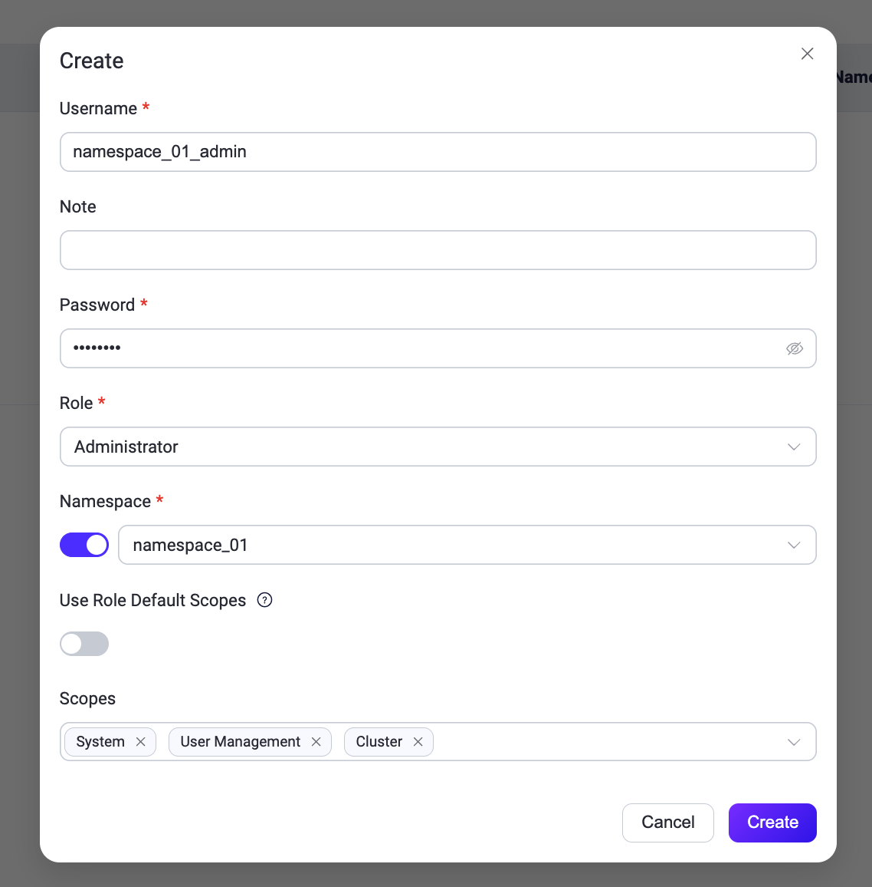

# システム

EMQXダッシュボードの**システム**メニューでは、ユーザーおよびロール管理、監査ログ、APIキー、ライセンス、SSO、データのバックアップと復元、ホットアップグレード、一般設定などのシステム管理オプションにアクセスできます。

## ユーザー

**ユーザー**ページでは、[CLI](../admin/cli.md)で生成されたものを含む、すべてのアクティブなダッシュボードユーザーの概要を確認できます。

新しいユーザーを追加するには、ページ右上の**+ 作成**ボタンをクリックします。ポップアップダイアログが表示され、必要なユーザー情報の入力を求められます。入力後、**作成**ボタンをクリックしてユーザーアカウントを生成します。ユーザー管理のために、アクション列から編集、パスワード更新、ユーザー情報の削除などの操作に簡単にアクセスできます。

> セキュリティ上の理由から、EMQX 5.0.0以降、ダッシュボードユーザーはREST API認証には使用できません。


### ロールベースアクセス制御

EMQX 5.3以降、ダッシュボードにEMQX Enterpriseユーザー向けのロールベースアクセス制御（RBAC）機能が導入されました。

RBACにより、組織内の役割に基づいてユーザーに権限を割り当てることができます。この機能は認可管理を簡素化し、アクセス制限によるセキュリティ強化と組織のコンプライアンス向上を実現し、ダッシュボードの重要なアクセス制御メカニズムとなっています。

現在、ユーザーには以下のいずれかの事前定義されたロールを設定できます。ユーザー作成時に**ロール**のドロップダウンから選択可能です。

+ **Administrator（管理者）**

    管理者はクライアント管理、システム設定、APIキー、ユーザー管理など、すべてのEMQX機能とリソースの管理にフルアクセスできます。

+ **Viewer（閲覧者）**

    閲覧者はすべてのEMQXデータと設定にアクセスでき、REST APIのすべての`GET`リクエストに対応しています。ただし、データの作成、変更、削除はできません。

### ログインユーザースコープ

ダッシュボードのログインユーザーには、ロール内でアクセス可能なAPIの範囲をさらに制限するためにスコープを割り当てることができます。[10のAPIキー用スコープ](../admin/api.md#built-in-api-key-scopes)に加え、ダッシュボードユーザーにはブラウザセッション専用の4つの追加スコープがあります。

| スコープ | 必要なロール | 用途 |
| --- | --- | --- |
| `user_management` | Administrator | ダッシュボードユーザーの管理（作成／更新／削除）。 |
| `sso_management` | Administrator | SSOバックエンドおよびSSOユーザー記録の管理。 |
| `api_key_management` | Administrator | APIキーの管理。 |
| `mfa_management` | 任意 | 自身のMFA管理。管理者は他ユーザーのMFA管理も可能。 |

これらのうち3つのスコープ（`user_management`、`sso_management`、`api_key_management`）はAdministratorロールが必要で、Viewerには割り当てられません。例外は`mfa_management`で、Viewerも保持可能ですが、自身のMFA管理のみ許可され、他ユーザーのMFA設定にはアクセスできません。これにより、Viewerアカウントが追加権限なしに自身の認証器を再登録または回復できるようになります。

ダッシュボードでグローバルユーザーを作成すると、**Namespace**オプションはオフ、**Permission Mode**はデフォルトで**Role Default Scopes**に設定されています。以下のモードから選択します。

- **Role Default Scopes**：選択したロールのデフォルトスコープを使用。ロールデフォルトの変更は自動的に反映されます。
- **Privilege Scopes**：`system`、`user_management`、`api_key_management`、`sso_management`から選択。これらは管理者相当の権限を提供します。
- **Custom Restricted Permissions**：管理者相当グループ外のロールに許可されたスコープ（例：`connections`、`publish`、`data_integration`、`monitoring`、`mfa_management`）から選択。空欄の場合、スコープ保護されたAPIにアクセスできません。


ネームスペースユーザーは別のスコープ割り当てフローを使用し、利用可能なスコープはロールとネームスペースによって制限されます。設定手順は[ネームスペースロールのユーザー作成](#create-a-user-with-a-namespaced-role)を参照してください。

| ユーザータイプ | デフォルト権限 |
| --- | --- |
| グローバル管理者 | 14スコープすべて：10のAPIキー用スコープと4つのログイン専用スコープ。 |
| グローバル閲覧者 | 10のAPIキー用スコープ。`mfa_management`は明示的に割り当てた場合のみ付与。 |
| ネームスペース管理者 | Connections、Monitoring、Data Integration、Access Control、System、Cluster、License、User Management、API Key Management。 |
| ネームスペース閲覧者 | グローバル閲覧者と同じ10のAPIキー用スコープ。`mfa_management`は明示的に割り当てた場合のみ付与。 |

::: warning 管理者相当スコープは単独で割り当てる必要があります

ダッシュボードの**Privilege Scopes**に含まれ、検証メッセージで`privilege scopes`と呼ばれる管理者相当スコープは以下の通りです。

- `system`：設定管理(`/configs*`, `/data/*`など)。`system`スコープ保持者は任意の設定サブツリーを更新したり、ユーザーおよびAPIキー記録を含むバックアップアーカイブを復元できます。
- `user_management`：他のダッシュボードユーザーの作成・変更が可能。任意のスコープ設定を含みます。
- `api_key_management`：APIキーの作成・変更が可能。任意のスコープ設定を含みます。
- `sso_management`：SSOバックエンドのローテーションや再設定が可能で、管理者認証方法を変更できます。

これらのスコープは管理者相当の権限を付与します。これらのいずれかと管理者相当グループ外のスコープを組み合わせても、ユーザーの実効権限は減少しません。

EMQX 6.0.4以降、グローバルダッシュボードユーザーの明示的なスコープリストは、上記の管理者相当スコープとそれ以外のスコープを混在させることができません。作成または更新リクエストはHTTP 400で拒否され、スコープ変更は適用されません。必要に応じて管理者相当スコープのみ、またはそれ以外のスコープのみを割り当ててください。`mfa_management`は管理者相当グループ外です。

EMQX 6.0.4以前に混在スコープリストで作成されたユーザーは引き続き動作し、管理者相当スコープは有効です。ダッシュボードでそのようなグローバルユーザーを編集すると、互換性警告が表示され、保存前に**Privilege Scopes**、**Custom Restricted Permissions**、**Role Default Scopes**のいずれかを選択する必要があります。明示的なスコープリストは管理者相当スコープのみか、それ以外のスコープのみを含む必要があります。ロールデフォルトの使用やスコープ未割当はこの制限を引き起こしません。

この排他ルールはネームスペースダッシュボード管理者には適用されません。彼らは許可されたスコープ組み合わせを使用できますが、自分のネームスペース内の操作とリソースにのみアクセス可能です。

:::

#### ロール変更とスコープ互換性

ダッシュボードでユーザーのロールやネームスペースを変更すると、フォームはそのロールやネームスペースでサポートされないスコープを削除し、警告を表示します。REST API利用時は、EMQXがユーザーのスコープが新しいロールと互換性があるかを検証し、互換性がない場合はHTTP 400で拒否します。エラーを解決するには、新しいロールに有効な`scopes`リストを同じリクエストに含めてください。

たとえば、管理者を閲覧者に降格し、そのユーザーが`user_management`、`sso_management`、`api_key_management`を保持している場合、これらのスコープは管理者ロールが必要なためリクエストは拒否されます。閲覧者に対応するスコープのみを含む`scopes`リストを指定して変更を完了してください。(`mfa_management`は管理者専用でなく、拒否の原因にはなりません。)

### デフォルト管理者保護

`dashboard.default_username`アカウント（`dashboard.default_password`で設定されたパスワードで作成）はブレイクグラスアカウントです。ほかの管理者が誤設定やアクセス不能になった場合にシステムを常に復旧できるよう、デフォルトユーザーは誤ってロックアウトされないよう保護されています。

- ダッシュボードやREST APIから**削除できません**。削除ボタンは無効化されています。
- ロールは`administrator`から**変更できません**。
- スコープセットは**カスタマイズできず**、常にフル管理者権限を使用します。
- 説明とパスワードは通常通り編集可能です。

他の管理者は影響を受けず、システムに管理者が1人以上いれば削除可能です。

### セルフサービスの範囲

すべてのダッシュボードユーザーは、スコープに関係なく以下の2つのセルフサービス操作を実行できます。

- 自身のパスワード変更。
- 自身のTOTP／MFAの登録または再登録。MFAの無効化も可能ですが、管理者がMFAを必須に設定している場合は`mfa_management`スコープが必要です。

その他のプロフィール更新（説明、ロール、管理者によるスコープ割り当て）は、操作ユーザーに適切なスコープが必要であり、対象が自身であっても例外はありません。

### ネームスペースロール

EMQX 6.0以降、ダッシュボードはネームスペースロールをサポートしています。この機能により、ロールベースアクセス制御が拡張され、各ユーザーが特定のネームスペース内でのみ操作を制限されるマルチテナンシーが可能になります。

::: warning 信頼できるデプロイメントのみ

ネームスペース管理者アクセスは、組織内のチームや事業部門を分離し、誤ったクロスチーム設定変更のリスクを減らすための信頼できる内部デプロイメント向けです。この機能は強力な分離保証を提供せず、公開または信頼できないマルチテナント環境のセキュリティ境界には適しません。

委任管理者にネームスペーススコープリソースの管理を許可する場合は、**管理** -> **クラスター設定** -> **[ルールエンジンセキュリティ](./cluster_settings.md#rule-engine-security)**でSSRF保護を有効にしてください。EMQX 6.0.4以降、このポリシーはコネクター設定のテスト、作成、更新時にHTTPおよびMQTTコネクターのターゲットを検証しますが、他のコネクタータイプやランタイム接続は対象外です。完全なアウトバウンドネットワーク境界を強制するには、`iptables`や`nftables`などのホストレベルのイグレス制御を追加してください。[ルールエンジンポリシーとファイアウォールルールによるSSRF緩和](../deploy/cluster/security.md#mitigate-ssrf-with-rule-engine-policy-and-firewall-rules)を参照してください。

:::

::: tip

ネームスペースの詳細は[Namespace](../multi-tenancy/namespace-overview.md)をご覧ください。

:::

#### ネームスペースロールのユーザー作成

ダッシュボードで新規ユーザーを作成する際、**Namespace**オプションはデフォルトでオフです。有効にしてネームスペースを選択すると、ネームスペースロールのユーザーを作成できます。

::: tip 前提条件

1. ダッシュボードで管理対象ネームスペース（例：`namespace_01`）を作成します。手順は[ネームスペースの作成](../multi-tenancy/create-namespace.md)を参照してください。
2. EMQXライセンスとクラスターがEMQX 6.0以降で稼働していることを確認してください。

:::

1. **システム** -> **ユーザー**に移動し、**+ 作成**をクリックします。
2. ユーザーを設定します：
   - **ユーザー名**：ユーザーの一意識別子。
   - **メモ**：任意の説明。
   - **パスワード**：ログインパスワード。
   - **ロール**：**Administrator**または**Viewer**を選択。
   - **Namespace**：デフォルトはオフ。オンにして既存のネームスペース（例：`namespace_01`）を選択。
   - **Use Role Default Scopes**：**Namespace**をオンにすると表示される項目で、デフォルトで有効。選択したネームスペースロールのデフォルトスコープを使用するか、明示的にスコープを割り当てるかを切り替えます。
   - **Scopes**：**Use Role Default Scopes**をオフにすると表示。選択したロールがネームスペース内で保持可能なスコープから選択。空欄の場合はスコープなし。

   

3. **作成**をクリックして完了します。

CLIやAPIでユーザーを作成する場合、ロールは以下の形式で明示的に指定する必要があります。

```
ns:<NAMESPACE>::<ROLE>
```

例：

- `ns:namespace_01::administrator`
- `ns:namespace_01::viewer`

#### ネームスペースユーザーの挙動

- **スコープ付きリソース**：ネームスペースユーザーは割り当てられたネームスペース内のリソース（コネクター、アクション、ソース、ルール、その他ネームスペース対応モジュール）の閲覧・管理のみ可能です。
- **クラスター設定**：ネームスペース非対応の設定は読み取り専用で、グローバル管理者のみ変更可能です。
- **メッセージコンテンツ関連エンドポイントの制限**：生のMQTTメッセージコンテンツにアクセスまたは操作するREST APIエンドポイントはネームスペースユーザーには利用不可で、`403 Forbidden`を返します。これらはグローバル管理者のみアクセス可能です。
  - Mqueueメッセージ：`GET /clients/:clientid/mqueue_messages`
  - Inflightメッセージ：`GET /clients/:clientid/inflight_messages`
  - Retainedメッセージ：`GET /mqtt/retainer/messages`、`GET /mqtt/retainer/message/:topic`、`DELETE /mqtt/retainer/message/:topic`、`DELETE /mqtt/retainer/messages`
  - Delayedメッセージ：`GET /mqtt/delayed/messages`、`GET /mqtt/delayed/messages/:node/:msgid`、`DELETE /mqtt/delayed/messages/:node/:msgid`、`DELETE /mqtt/delayed/messages/:topic`
- **トレースのスコープ制御**：トレースエンドポイントにアクセスする際、ネームスペースユーザーは自身のネームスペースに属するトレースのみ閲覧可能です。異なるネームスペースのトレースを停止、ダウンロード、ログストリーム、削除しようとすると`404 Not Found`を返し、存在が漏れません。一括削除エンドポイント（`DELETE /trace`）は`403 Forbidden`を返し、全トレースのクリアはグローバル管理者のみ可能です。
- **APIキー管理**：ネームスペース管理者は自身のネームスペース内のAPIキーを作成、一覧表示、読み取り、更新、削除できます。グローバルAPIキーや他ネームスペースのキーは作成不可で、表示もされません。詳細は[ネームスペース管理者によるAPIキー管理](../admin/api.md#manage-api-keys-as-a-namespaced-administrator)を参照してください。
- **デフォルトのランディングページ**：ネームスペースユーザーは通常通りダッシュボードにログインし、**概要**ページから開始します。メニュー項目はすべて表示されますが、リソースデータは自動的に自身のネームスペースにフィルターされます。
- **ライセンス管理**：ネームスペースユーザーはライセンス通知を表示しません。ライセンス管理はシステム管理者の責任です。

#### ネームスペース内のロールの意味

- **Administrator**：割り当てられたネームスペース内のリソースに対し、作成、更新、削除、閲覧のフルコントロール。
- **Viewer**：割り当てられたネームスペース内のリソースに対する読み取り専用アクセス（`GET`リクエスト相当）。

## 監査ログ

**監査ログ**ページでは、EMQXクラスター内の重要な運用変更をリアルタイムで監視するための監査ログ設定を管理者が行えます。

監査ログ機能の詳細は[監査ログ](../dashboard/audit-log.md)をご覧ください。

## APIキー

**APIキー**ページでは、[HTTP API](../admin/api.md)へのアクセス用APIキーの作成と管理が可能です。ロールやスコープの割り当てを含むAPIキーの作成・管理手順は[APIキーの作成](../admin/api.md#create-api-keys)を参照してください。

## ライセンス

左側の**システム**メニューから**ライセンス**をクリックすると、ライセンスページにアクセスできます。このページでは、現在のライセンスの基本情報（ライセンス接続数の使用状況、EMQXバージョン、顧客情報、発行情報など）を確認できます。

**ライセンス更新**をクリックしてライセンスキーをアップロードします。**ライセンス設定**セクションでは、ライセンス接続数の使用状況に対する高水位・低水位の制限値を設定可能です。ライセンスの詳細は[EMQX Enterpriseライセンスの利用](../deploy/license.md)をご覧ください。

## SSO

**SSO**ページでは、管理者がユーザーログイン管理のためのSSO機能を設定できます。SSO機能の詳細は[シングルサインオン（SSO）](./sso.md)をご覧ください。

## バックアップと復元

**バックアップ＆復元**ページでは、運用データと設定ファイルのバックアップ設定を行えます。グローバル管理者は**グローバル**と特定のネームスペースを切り替えて、そのスコープ内のバックアップファイルを管理可能です。ネームスペース選択時は、バックアップファイルのアップロード、ダウンロード、削除、復元が可能ですが、バックアップの作成はできません。詳細は[バックアップと復元](../operations/backup-restore.md)をご覧ください。

## 設定

設定にアクセスするには、ダッシュボード右上の歯車アイコンをクリックします。

**設定**メニューでは、ダッシュボードの言語とテーマをカスタマイズできます。

- **言語**：表示言語を選択します。
- **テーマ**：ライトテーマ、ダークテーマ、またはOSのテーマに自動同期を選択可能です。同期を有効にすると、テーマはOS設定に従い、手動選択は無効になります。

さらに、設定メニューには**ルール**ページの[AI SQLジェネレーター](../data-integration/rule-get-started.md#sql-generator)機能の有効化／無効化トグルが含まれています。


