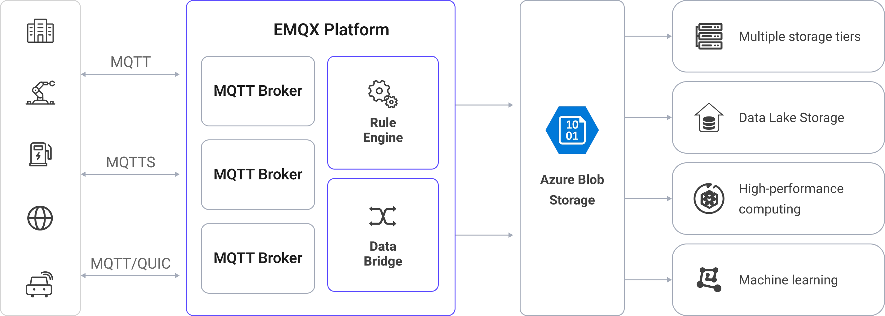
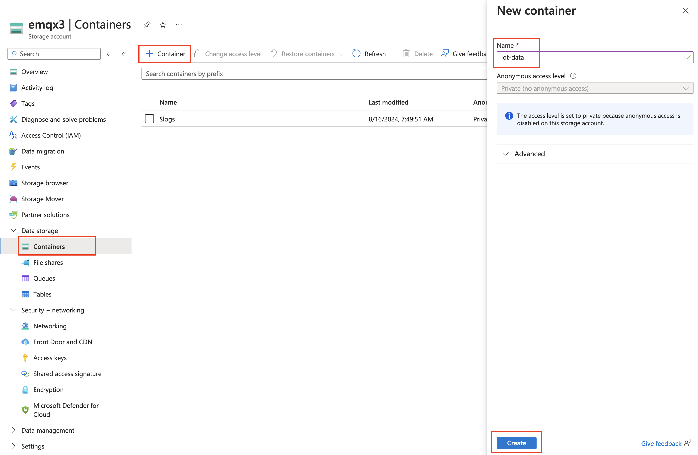
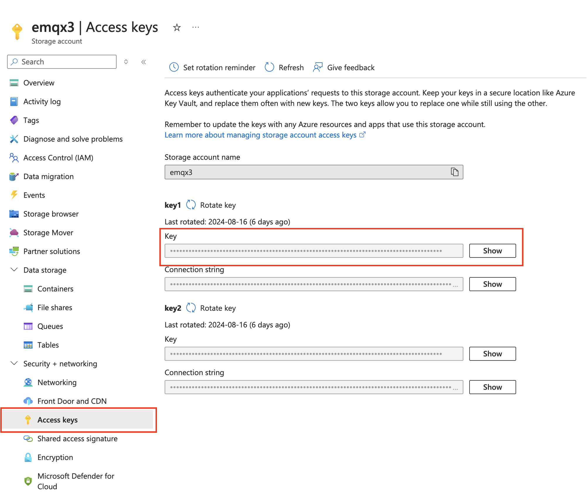

# Azure Blob StorageへのMQTTデータ取り込み

[Azure Blob Storage](https://azure.microsoft.com/en-us/products/storage/blobs/)は、Microsoftのクラウドベースのオブジェクトストレージソリューションで、大量の非構造化データの取り扱いに特化しています。非構造化データとは、特定のデータモデルやフォーマットに従わないデータタイプ（テキストファイルやバイナリデータなど）を指します。EMQXはMQTTメッセージをBlob Storageコンテナに効率的に保存でき、IoTデータの保存に柔軟なソリューションを提供します。

本ページでは、EMQXとAzure Blob Storage間のデータ統合について詳しく解説し、ルールおよびSinkの作成方法を実践的に案内します。

## 動作概要

EMQXのAzure Blob Storageデータ統合はすぐに使える機能で、複雑なビジネス開発にも簡単に設定可能です。典型的なIoTアプリケーションでは、EMQXがデバイス接続とメッセージ送受信を担うIoTプラットフォームとして機能し、Azure Blob Storageがメッセージデータの保存を担当するデータストレージプラットフォームとなります。



EMQXはルールエンジンとSinkを利用してデバイスイベントやデータをAzure Blob Storageに転送します。アプリケーションはAzure Blob Storageからデータを読み取り、さらなるデータ活用を行います。具体的なワークフローは以下の通りです。

1. **デバイスのEMQXへの接続**：IoTデバイスはMQTTプロトコルで正常に接続するとオンラインイベントを発生させます。このイベントにはデバイスID、送信元IPアドレスなどのプロパティ情報が含まれます。
2. **デバイスメッセージのパブリッシュと受信**：デバイスは特定のトピックを通じてテレメトリやステータスデータをパブリッシュします。EMQXはこれらのメッセージを受信し、ルールエンジン内で比較処理を行います。
3. **ルールエンジンによるメッセージ処理**：組み込みのルールエンジンはトピックマッチングに基づき特定のソースからのメッセージやイベントを処理します。対応するルールにマッチしたメッセージやイベントを、データフォーマット変換、特定情報のフィルタリング、コンテキスト情報の付加などの処理を行います。
4. **Azure Blob Storageへの書き込み**：ルールはメッセージをStorage Containerに書き込むアクションをトリガーします。Azure Blob Storage Sinkを使うことで、処理結果からデータを抽出しBlob Storageに送信可能です。メッセージはテキストまたはバイナリ形式で保存でき、複数行の構造化データはCSV、JSON Lines、Parquetファイルなどにまとめて保存できます。これはメッセージ内容やSinkの設定によります。

イベントやメッセージデータがStorage Containerに書き込まれた後は、Azure Blob Storageに接続してデータを読み取り、以下のような柔軟なアプリケーション開発が可能です。

- データアーカイブ：デバイスメッセージをAzure Blob Storageのオブジェクトとして長期保存し、コンプライアンス要件やビジネスニーズに対応。
- データ分析：Storage ContainerのデータをSnowflakeなどの分析サービスに取り込み、予知保全やデバイス効率評価などのデータ分析に活用。

## 特長と利点

EMQXのAzure Blob Storageデータ統合を利用することで、以下の特長と利点をビジネスにもたらします。

- **メッセージ変換**：メッセージはEMQXのルール内で高度な処理・変換が可能で、Azure Blob Storageへの書き込み前にデータ整形が行え、後続の保存や利用を容易にします。
- **柔軟なデータ操作**：Azure Blob Storage Sinkにより、特定フィールドのデータをAzure Blob Storageコンテナに簡単に書き込め、コンテナ名やオブジェクトキーを動的に設定して柔軟なデータ保存が可能です。
- **統合されたビジネスプロセス**：Azure Blob Storage Sinkを使うことで、デバイスデータをAzure Blob Storageの豊富なエコシステムアプリケーションと組み合わせ、データ分析やアーカイブなど多様なビジネスシナリオを実現できます。
- **低コストな長期保存**：データベースと比較して、Azure Blob Storageは高可用性かつ信頼性の高いコスト効率の良いオブジェクトストレージサービスを提供し、長期保存に適しています。

これらの特長により、効率的で信頼性の高いスケーラブルなIoTアプリケーションを構築し、ビジネスの意思決定や最適化に役立てられます。

## はじめる前に

本節では、EMQXでAzure Blob Storage Sinkを作成する前の準備事項を紹介します。

### 前提条件

- [ルール](./rules.md)の理解
- [データ統合](./data-bridges.md)の理解

### Azure Storageでコンテナを作成する

1. Azure StorageにアクセスするにはAzureサブスクリプションが必要です。まだお持ちでない場合は、[無料アカウント](https://azure.microsoft.com/free/)を作成してください。

2. Azure Storageへのアクセスはすべてストレージアカウントを通じて行われます。このクイックスタートでは、[Azureポータル](https://portal.azure.com/)、Azure PowerShell、またはAzure CLIを使ってストレージアカウントを作成します。ストレージアカウントの作成方法については[ストレージアカウントの作成](https://learn.microsoft.com/en-us/azure/storage/common/storage-account-create)を参照してください。

3. Azureポータルでコンテナを作成するには、作成したストレージアカウントに移動し、左メニューの「データストレージ」セクションから「コンテナ」を選択します。+ **コンテナ**ボタンを押し、新しいコンテナ名に`iot-data`を入力し、**作成**をクリックしてコンテナを作成します。

   

4. ストレージアカウントの**セキュリティ+ネットワーク** -> **アクセスキー**に移動し、**キー**をコピーします。このキーはEMQXでSinkを設定する際に必要です。

   

## コネクターの作成

Azure Blob Storage Sinkを追加する前に、対応するコネクターを作成する必要があります。

1. ダッシュボードの**Integration** -> **Connector**ページに移動します。
2. 右上の**作成**ボタンをクリックします。
3. コネクタータイプとして**Azure Blob Storage**を選択し、次へ進みます。
4. コネクター名を入力します。英数字の組み合わせで、ここでは`my-azure`と入力します。
5. 接続情報を入力します。
   - **Account Name**：ストレージアカウント名
   - **Account Key**：前ステップで取得したストレージアカウントキー
6. **作成**をクリックする前に、**接続テスト**をクリックしてAzure Storageへの接続確認ができます。
7. 画面下部の**作成**ボタンをクリックしてコネクター作成を完了します。

これでコネクター作成が完了し、次にAzure Storageに書き込むデータを指定するルールとSinkの作成に進みます。

## Azure Blob Storage Sinkを使ったルールの作成

本節では、EMQXでソースMQTTトピック`t/#`からのメッセージを処理し、処理結果をAzure Storageの`iot-data`コンテナに書き込むルールの作成方法を示します。

1. ダッシュボードの**Integration** -> **Rules**ページに移動します。

2. 右上の**作成**ボタンをクリックします。

3. ルールIDに`my_rule`を入力し、SQLエディターに以下のルールSQLを入力します。

   ```sql
   SELECT
     *
   FROM
       "t/#"
   ```

   ::: tip

   SQLに不慣れな場合は、**SQL Examples**や**Enable Debug**をクリックしてルールSQLの学習や結果のテストが可能です。

   :::

4. アクションを追加し、**Action Type**のドロップダウンから`Azure Blob Storage`を選択します。アクションのドロップダウンはデフォルトの`create action`のままにするか、既存のAzure Blob Storageアクションを選択します。ここでは新しいSinkを作成してルールに追加します。

5. Sinkの名前と説明を入力します。

6. コネクターのドロップダウンから先ほど作成した`my-azure`を選択します。ドロップダウン横の作成ボタンを押すとポップアップで新規コネクターを素早く作成可能です。必要な設定パラメータは[コネクターの作成](#コネクターの作成)を参照してください。

7. **Container**に`iot-data`を入力します。

8. **Upload Method**を選択します。2つの方法の違いは以下の通りです。

   - **Direct Upload**：ルールがトリガーされるたびに、プリセットされたオブジェクトキーと内容に従ってデータを直接Azure Blob Storageにアップロードします。バイナリや大きなテキストデータの保存に適していますが、多数のファイルが生成される可能性があります。
   - **Aggregated Upload**：複数のルールトリガー結果を1つのファイル（CSVなど）にまとめてAzure Blob Storageにアップロードします。構造化データの保存に適し、ファイル数削減や書き込み効率向上が期待できます。

   選択した方法により設定パラメータが異なります。以下を参照して設定してください。

   :::: tabs type

   ::: tab Direct Upload

   Direct Uploadでは以下の項目を設定します。

   - **Blob Name**：コンテナ内のアップロード先オブジェクトの場所を定義します。`${var}`形式のプレースホルダーをサポートし、`/`でディレクトリ指定可能です。管理や区別のためオブジェクトのサフィックスも設定します。ここでは`msgs/${clientid}_${timestamp}.json`と入力します。`${clientid}`はクライアントID、`${timestamp}`はメッセージのタイムスタンプで、各デバイスのメッセージを別々のオブジェクトに書き込みます。
   - **Object Content**：デフォルトはすべてのフィールドを含むJSONテキスト形式です。`${var}`形式のプレースホルダーをサポートします。ここでは`${payload}`を入力し、メッセージ本文をオブジェクト内容として使用します。オブジェクトの保存形式はメッセージ本文の形式に依存し、圧縮ファイル、画像、その他バイナリ形式もサポートします。

   :::

   ::: tab Aggregate Upload

   Aggregate Uploadでは以下のパラメータを設定します。

   - **Blob Name**：オブジェクトの保存パスを指定します。以下の変数が使用可能です。

     - **`${action}`**：アクション名（必須）
     - **`${node}`**：アップロードを実行するEMQXノード名（必須）
     - **`${datetime.{format}}`**：集約開始日時。`{format}`でフォーマット指定（必須）
       - **`${datetime.rfc3339utc}`**：UTC形式のRFC3339日時
       - **`${datetime.rfc3339}`**：ローカルタイムゾーン形式のRFC3339日時
       - **`${datetime.unix}`**：Unixタイムスタンプ
     - **`${datetime_until.{format}}`**：集約終了日時。フォーマットは上記と同様
     - **`${sequence}`**：同一時間間隔内の集約アップロードのシーケンス番号（必須）

     必須とマークされたプレースホルダーがテンプレートに含まれない場合、自動的にBlob Nameのパスサフィックスとして追加され重複を避けます。その他のプレースホルダーは無効とみなされます。

   - **Aggregation Type**：Azure Storageに保存するバッチ化されたMQTTメッセージのデータファイル形式を定義します。サポート値：

      - `CSV`：カンマ区切りのCSV形式で書き込み
      - `JSON Lines`：[JSON Lines](https://jsonlines.org/)形式で書き込み
      - `parquet`：[Apache Parquet](https://parquet.apache.org/)形式で書き込み。列指向で大規模データ分析に最適化されています。

        > スキーマ定義、圧縮、行グループ設定など詳細は[Parquet Format Options](#parquet-format-options)を参照してください。

   - **Column Order**（`CSV`用）：ルール結果のカラム順序をドロップダウンで調整可能。生成されるCSVは選択されたカラム順に並び、未選択カラムはアルファベット順で続きます。

   - **Max Records**：最大レコード数に達すると、1ファイルの集約が完了しアップロードされ、時間間隔がリセットされます。

   - **Time Interval**：時間間隔に達すると、最大レコード数に達していなくても1ファイルの集約が完了しアップロードされ、最大レコード数がリセットされます。

   :::

   ::::

10. **フォールバックアクション（任意）**：メッセージ配信失敗時の信頼性向上のため、1つ以上のフォールバックアクションを定義可能です。プライマリSinkがメッセージ処理に失敗した場合にトリガーされます。詳細は[フォールバックアクション](./data-bridges.md#fallback-actions)を参照してください。

11. **詳細設定**を展開し、必要に応じて高度な設定オプションを構成します（任意）。詳細は[詳細設定](#advanced-settings)を参照してください。

12. 残りの設定はデフォルト値のままにし、**作成**ボタンをクリックしてSink作成を完了します。作成成功後、ルール作成画面に戻り、新しいSinkがルールアクションに追加されます。

13. ルール作成画面に戻り、**作成**ボタンをクリックしてルール作成全体を完了します。

これでルールの作成が完了しました。**Rules**ページで新規作成したルールを確認でき、**Actions (Sink)**タブで新しいAzure Blob Storage Sinkが表示されます。

また、**Integration** -> **Flow Designer**をクリックするとトポロジーが表示されます。トポロジーはトピック`t/#`のメッセージがルール`my_rule`で解析され、Azure Storageコンテナに書き込まれる流れを視覚的に示します。

### Parquetフォーマットオプション

**Aggregation Type**が`parquet`に設定されている場合、EMQXは集約されたルール結果をApache Parquet形式で保存します。Parquetは列指向かつ圧縮されたファイル形式で、分析処理に最適化されています。

本節ではParquet出力フォーマットの設定可能なオプションを説明します。

#### Parquetスキーマ（Avro）

このオプションはMQTTメッセージのフィールドをParquetファイルのカラムにどのようにマッピングするかを定義します。EMQXはApache Avroスキーマ仕様を用いてParquetデータの構造を記述します。

以下のいずれかを選択可能です。

- **スキーマレジストリに存在するAvroスキーマ**：EMQXの[スキーマレジストリ](./schema-registry.md)で管理されている既存の[Avroスキーマ](./schema-registry-example-avro.md)を使用します。

  この場合、シリアライズに使用するスキーマを特定するために**スキーマ名**を指定する必要があります。

  ::: tip

  スキーマを中央管理し、複数システム間で一貫したスキーマ進化を行いたい場合に推奨します。

  :::

- **Avroスキーマを直接定義**：EMQX内でスキーマJSON構造を**スキーマ定義**欄に直接入力して定義します。

  例：

  ```json
  {
    "type": "record",
    "name": "MessageRecord",
    "fields": [
      {"name": "clientid", "type": "string"},
      {"name": "timestamp", "type": "long"},
      {"name": "payload", "type": "string"}
    ]
  }
  ```

::: tip

フィールド名やデータ型はルールSQLの戻り値と一致させてください。不正確または不足があるとParquet書き込み時にシリアライズエラーが発生する可能性があります。

:::

#### Parquetデフォルト圧縮

このオプションは各行グループ内のParquetデータページに適用される圧縮アルゴリズムを指定します。圧縮によりストレージ容量を削減し、データクエリ時のI/O効率を向上させます。

サポート値：

| 値                 | 説明                                                         |
| ------------------ | ------------------------------------------------------------ |
| `snappy`（デフォルト） | 高速な圧縮・解凍と良好な圧縮率のバランスを持つ一般的な選択肢。ほとんどの場合に推奨。 |
| `zstd`             | 中程度のCPU使用で高い圧縮率を提供。大規模分析データや長期保存に最適。       |
| `None`             | 圧縮を無効化。デバッグ時や圧縮不要な場合に適する。                   |

#### Parquet最大行グループバイト数

Parquetの行グループはデータ読み書きの基本単位です。このオプションは各行グループの最大サイズ（バイト単位）を指定します。バッファされたデータサイズがこの閾値を超えると、EMQXは現在の行グループをフラッシュし新しい行グループを開始します。

- **デフォルト値**：`128 MB`

ガイドライン：

- 値を大きくすると、AthenaやSparkなどの分析クエリで読み取り性能が向上します。
- 値を小さくすると、書き込み時のメモリ使用量を抑えられ、小規模データセットに適します。

::: tip

Parquetリーダーは行グループ単位でデータを読み込みます。大きな行グループはメタデータのオーバーヘッドを減らし、分析クエリ性能を向上させます。

:::

## ルールのテスト

本節では、Direct Upload方式で設定したルールのテスト方法を示します。

MQTTXを使い、トピック`t/1`にメッセージをパブリッシュします。

```bash
mqttx pub -i emqx_c -t t/1 -m '{ "msg": "Hello Azure" }'
```

数件メッセージを送信した後、Azureポータルにアクセスし、`iot-data`コンテナ内のアップロードされたオブジェクトを確認します。

[Azureポータル](https://portal.azure.com/)にログインし、ストレージアカウントに移動して`iot-data`コンテナを開くと、アップロード済みのオブジェクトが表示されます。

## 詳細設定

本節ではAzure Blob Storage Sinkの詳細設定オプションを説明します。ダッシュボードのSink設定画面で**詳細設定**を展開し、必要に応じて以下のパラメータを調整できます。

| フィールド名               | 説明                                                         | デフォルト値  |
| ------------------------- | ------------------------------------------------------------ | ------------ |
| **Buffer Pool Size**      | EMQXとAzure Storage間のデータフローを管理するバッファワーカープロセスの数を指定します。これらのワーカーはデータを一時的に保持・処理し、ターゲットサービスへの送信を最適化しスムーズなデータ伝送を保証します。 | `16`         |
| **Request TTL**           | バッファに入ったリクエストが有効とみなされる最大時間（秒）を指定します。リクエストがこのTTLを超えてバッファ内に留まるか、送信後にAzure Storageからの応答やアックがタイムリーに得られない場合、リクエストは期限切れと見なされます。 | `45`         |
| **Health Check Interval** | SinkがAzure Storageとの接続状態を自動的にヘルスチェックする間隔（秒）を指定します。 | `15`         |
| **Max Buffer Queue Size** | Azure Blob Storage Sinkの各バッファワーカーがバッファリング可能な最大バイト数を指定します。バッファワーカーはデータを一時保持し、効率的にデータストリームを処理します。システム性能やデータ伝送要件に応じて調整してください。 | `256`        |
| **Query Mode**            | メッセージ送信を最適化するため、`synchronous`（同期）または`asynchronous`（非同期）のリクエストモードを選択可能です。非同期モードではAzure Storageへの書き込みがMQTTメッセージのパブリッシュ処理をブロックしませんが、クライアントがメッセージを受信するタイミングがAzure Storageへの到達より先になる可能性があります。 | `Asynchronous` |
| **Batch Size**            | EMQXからAzure Storageへ一度に転送するデータバッチの最大サイズを指定します。サイズ調整によりデータ転送の効率や性能を微調整可能です。<br />「Batch Size」が「1」の場合、データレコードは個別に送信され、バッチ化されません。 | `1`          |
| **Inflight Window**       | 「インフライトキューリクエスト」とは、送信済みで応答やアックをまだ受け取っていないリクエストを指します。この設定はSinkとAzure Storage間の通信中に同時に存在可能なインフライトリクエストの最大数を制御します。<br/>**Request Mode**が`asynchronous`の場合、同一MQTTクライアントからのメッセージを厳密に順序処理したい場合は、この値を`1`に設定してください。 | `100`        |
