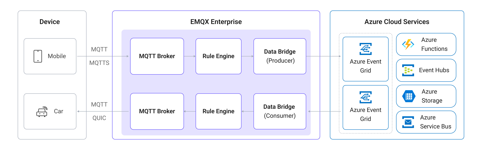

# Azure Event Grid MQTTとのブリッジ

[Azure Event Grid](https://azure.microsoft.com/en-us/products/event-grid)は、Azure上のフルマネージドなイベントルーティングサービスです。そのMQTTブローカー機能により、IoTデバイスとクラウドアプリケーション間で標準ベースの双方向MQTT通信を大規模に実現できます。EMQXはAzure Event Grid向けの組み込みコネクターを提供しており、EMQXとAzure Event Grid間でMQTTデータをブリッジし、Azureのクラウドサービスエコシステムとのシームレスな統合を可能にします。

本ページでは、EMQXとAzure Event Grid MQTTの連携について、SinkおよびSourceの作成と検証を含む実践的な手順を詳しく解説します。

## 動作概要

Azure Event Gridとのデータ統合は、EMQXの標準機能であり、EMQXのデバイス接続およびメッセージ送信機能とAzure Event GridのクラウドネイティブMQTTブローカーを組み合わせたものです。EMQXはMQTTクライアントとしてAzure Event Grid MQTTブローカーに接続し、双方向のメッセージ送受信を実現します。

- **送信メッセージ（Sink）**：EMQXはローカルのMQTTトピックからAzure Event Grid上の指定トピックへメッセージをパブリッシュします。
- **受信メッセージ（Source）**：EMQXはAzure Event Gridのトピックをサブスクライブし、受信したメッセージをローカルのEMQXトピックに転送します。

以下の図は典型的な連携アーキテクチャを示しています。



## 特長とメリット

Azure Event Gridとのデータ統合は次の特長とメリットを提供します。

- **標準ベースのMQTTブリッジ**：Azure Event GridはMQTT 3.1.1およびMQTT 5.0をサポートし、EMQXは標準MQTTプロトコルでブリッジ接続でき、MQTT互換のクライアントやサービスと相互運用可能です。
- **双方向データフロー**：EMQXからAzure Event Gridへのメッセージパブリッシュ（Sink）と、Azure Event GridのトピックサブスクライブおよびEMQXへの転送（Source）の両方をサポートし、柔軟なIoTデータルーティングを実現します。
- **安全な接続**：Azure Event GridはTLSを必須とし、コネクターはデフォルトでTLSを有効にし、クライアント証明書認証もサポートします。これは本番環境で推奨される認証方式です。
- **柔軟なトピックマッピング**：EMQXのルールエンジンを使い、メッセージのフィルタリング、変換、動的トピックマッピングによる特定のAzure Event Gridトピックスペースへのルーティングが可能です。
- **豊富なAzureエコシステム連携**：データがAzure Event Gridに到達すると、Azure Functions、Azure Event Hubs、Azure Storageなど他のAzureサービスへルーティングし、さらなる処理や分析が可能です。

## はじめる前に

### 前提条件

- EMQXのデータ統合[ルール](./rules.md)の知識
- [データ統合](./data-bridges.md)の知識

### Azure Event Gridのセットアップ

EMQXでデータ統合を作成する前に、MQTTブローカーサポートが有効なAzure Event Gridネームスペースをセットアップしてください。以下のMicrosoftドキュメントに手順が記載されています。

- [クイックスタート：Azure Event Gridネームスペースを使ったMQTTメッセージのパブリッシュとサブスクライブ](https://learn.microsoft.com/en-us/azure/event-grid/mqtt-publish-and-subscribe-portal)
- [Azure Event Grid MQTTブローカー概要](https://learn.microsoft.com/en-us/azure/event-grid/mqtt-overview)
- [証明書チェーンを使ったMQTTクライアント認証方法](https://learn.microsoft.com/en-us/azure/event-grid/mqtt-certificate-chain-client-authentication)

セットアップ完了後、EMQXでコネクター作成時に必要となる以下の接続情報を控えてください。

- **ホスト名**：Event GridネームスペースのMQTTブローカーホスト名。形式は `<namespace>.ts.<region>.eventgrid.azure.net`。ポートは`8883`です。
- **クライアント証明書と秘密鍵**：Azure Event Gridはクライアント証明書認証を要求します。ネームスペースから証明書と秘密鍵をエクスポートし、コネクターのTLS設定時に使用します。
- **トピックスペース**：Azure Event Gridで設定したトピックスペースと権限バインディング。

::: tip

サポートされている認証方式やTLS要件については、[Azure Event Gridドキュメント](https://learn.microsoft.com/en-us/azure/event-grid/mqtt-client-authentication)を参照してください。

:::

## コネクターの作成

ここでは、EMQXとAzure Event Gridを接続するコネクターの作成方法を説明します。

1. EMQXダッシュボードで **Integration** -> **Connectors** をクリックします。

2. ページ右上の **Create** をクリックします。

3. **Create Connector** ページで **Azure Event Grid** を選択し、**Next** をクリックします。

4. コネクター名を入力します。大文字・小文字の英数字の組み合わせで、例として `my_azure_event_grid` などを指定します。

5. 接続情報を設定します：

   - **Server Host**：Event GridネームスペースのMQTTブローカーエンドポイントを入力します。例：`myns.northeurope-1.ts.eventgrid.azure.net:8883`。デフォルトポートは`8883`です。
   - **ClientID Prefix**：（任意）EMQXが生成するクライアントIDのプレフィックスを指定します。EMQXは `[prefix]:{connector name}{random string}:{pool index}` の形式で一意のクライアントIDを自動生成します。詳細は[接続プールとクライアントID生成ルール](./data-bridge-mqtt.md#connection-pool-and-client-id-generation-rules)を参照してください。
   - **Username** と **Password**：空欄のままにします。Azure Event Grid MQTTはユーザー名/パスワード認証を使用しません。
   - **Keepalive**：キープアライブ間隔（秒）を指定します。デフォルトは`160`秒です。
   - **MQTT Version**：MQTTプロトコルバージョンを選択します。Azure Event GridはMQTT 3.1.1（`v4`）とMQTT 5.0（`v5`）の両方をサポートします。
   - **Static ClientId Entries**：（任意）特定のEMQXノード向けに静的クライアントIDを設定します。Azure Event Gridで事前登録されたクライアントIDが必要な場合に有効です。詳細は[静的クライアントIDの設定](./data-bridge-mqtt.md#configure-static-client-ids)を参照してください。

     ::: tip

     静的クライアントIDが定義されている場合、静的クライアントIDが割り当てられたEMQXノードのみがMQTT接続を開始します。

     :::

   - **Clean Start**：デフォルトで有効です。有効時はEMQXがAzure Event Gridに接続するたびに新しいセッションを開始します。
   - **Enable TLS**：必ず有効にしてください。Azure Event GridはTLSを必須とします。クライアント証明書認証を使用する場合は、ここで証明書と秘密鍵を設定します。TLSの詳細設定は[外部リソースアクセスのTLS設定](../network/overview.md#enable-tls-encryption-for-accessing-external-resources)を参照してください。

6. **詳細設定（任意）**：詳細は[コネクターの詳細設定](#connector-advanced-settings)を参照してください。

7. **Create**をクリックする前に、**Test Connectivity**をクリックしてEMQXがAzure Event Gridに接続できるか確認できます。

8. **Create**をクリックしてコネクター設定を完了します。作成成功ダイアログが表示され、ルールを今すぐ作成するか尋ねられます。**Create Rule**をクリックするとコネクターが選択された状態でルール作成画面に進みます。後で作成する場合は**Back To Connector List**をクリックしてください。

## Azure Event Grid Sinkを使ったルールの作成

ここでは、ローカルのEMQXトピック `t/#` からAzure Event GridへMQTTメッセージを転送するルールの作成方法を説明します。

1. 前のステップで**Create Rule**をクリックした場合、**Add Action**パネルが自動で開き、**Type of Action**が`Azure Event Grid`、コネクターが選択済みの状態です。ステップ5に進んでください。

   そうでない場合は、EMQXダッシュボードで **Integration** -> **Rules** を開き、右上の **Create** をクリックし、次に **+ Add Action** をクリックします。

2. 左側の**SQL Editor**にルールIDと以下のSQLを入力し、トピック `t/#` のメッセージをマッチさせます。

   注意：独自のSQL構文を指定する場合は、Sinkで必要なすべてのフィールドが`SELECT`句に含まれていることを確認してください。

   ```sql
   SELECT
     *
   FROM
     "t/#"
   ```

   ::: tip

   初心者の方は、**SQL Examples**をクリックし、**Enable Test**を有効にしてSQLルールの学習とテストを行うことをおすすめします。

   :::

3. 右側の**Add Action**パネルで、**Type of Action**ドロップダウンから`Azure Event Grid`を選択します。**Action**ドロップダウンはデフォルトの`Create Action`のままにします。

4. **Connectors**ドロップダウンから先ほど作成した`my_azure_event_grid`コネクターを選択します。新しいコネクターを作成する場合はドロップダウン横のボタンをクリックしてください。設定パラメータは[コネクターの作成](#create-a-connector)を参照してください。

5. Sinkの名前と任意の説明を入力します。

6. Azure Event GridへメッセージをパブリッシュするためのSinkパラメータを設定します：

   - **Topic**：Azure Event Gridでパブリッシュするトピック。`${var}`プレースホルダーをサポートします。例：`devices/${clientid}/messages` と入力すると、クライアントIDに基づいて動的にトピックを設定できます。
   - **QoS**：パブリッシュメッセージのQoSレベル。`0`、`1`、`2`のいずれか、または`${qos}`のようなプレースホルダーを指定して元のメッセージのQoSに従うことも可能です。
   - **Retain**：`true`、`false`、または`${flags.retain}`のようなプレースホルダーを選択してリテインフラグを設定します。
   - **Payload**：メッセージペイロードのテンプレート。空欄にするとルール出力全体を転送し、`${payload}`などを指定するとペイロードのみを転送します。

7. **フォールバックアクション（任意）**：メッセージ配信失敗時の信頼性向上のために1つ以上のフォールバックアクションを定義できます。詳細は[フォールバックアクション](./data-bridges.md#fallback-actions)を参照してください。

8. **詳細設定（任意）**：詳細は[Sinkの詳細設定](#sink-advanced-settings)を参照してください。

9. **Create**をクリックする前に、**Test Connectivity**をクリックしてSinkがAzure Event Gridに接続できるかテストできます。

10. **Create**をクリックしてSinkの設定を完了します。新しいSinkが**Action Outputs**に追加されます。

11. **Create Rule**ページに戻り、設定内容を確認して**Save**をクリックしルールを生成します。

これでルールが正常に作成されました。**Integration** -> **Rules**ページで新規ルールを確認できます。**Actions(Sink)**タブをクリックすると新しいAzure Event Grid Sinkが表示されます。

また、**Integration** -> **Flow Designer**を開くとトポロジーが表示され、トピック `t/#` のメッセージがルール `my_rule` によって処理されAzure Event Gridに転送されていることを確認できます。

## Azure Event Grid Sourceを使ったルールの作成

ここでは、Azure Event Gridからのメッセージをサブスクライブし、ローカルのEMQXトピックに転送するルールの作成方法を説明します。

### Azure Event Grid Sourceの作成とルールへの追加

1. EMQXダッシュボードで **Integration** -> **Rules** を開き、右上の **Create** をクリックします。

2. ルールIDに `my_rule_source` を入力します。

3. ルールのトリガーソースを設定します。ページ右側の**Data Inputs**タブでデフォルトの**Message**入力を削除し、**Add Input**をクリックしてAzure Event Grid Sourceを作成します。

4. **Add Input**ダイアログで、**Input Type**ドロップダウンから`Azure Event Grid`を選択します。**Source**ドロップダウンはデフォルトの`Create Source`のままにします。

5. Sourceの名前と説明を入力します。

6. ドロップダウンから`my_azure_event_grid`コネクターを選択します。

7. Azure Event Gridのサブスクライブ設定を行います：

   - **Topic**：Azure Event Gridでサブスクライブするトピック。`+`および`#`のワイルドカードをサポートします。

     ::: tip

     EMQXがクラスター構成で稼働している場合や、コネクターが接続プール設定されている場合は、重複メッセージを避けるために共有サブスクリプションを使用してください。例：`$share/group/devices/#`

     :::

   - **QoS**：サブスクライブのQoS。`0`または`1`を選択します。

8. **Create**をクリックしてSourceの作成を完了します。ルールのSQLは自動的に以下のように更新されます。

   ```sql
   SELECT
     *
   FROM
     "$bridges/azure_event_grid:<source_name>"
   ```

### Republishアクションの作成

Azure Event Gridからサブスクライブしたメッセージは自動的にローカルEMQXトピックに転送されません。Republishアクションを作成してメッセージをルーティングします。

1. ルール作成画面右側の**Action Outputs**タブに切り替え、**Add Action**をクリックします。

2. **Type of Action**ドロップダウンから`Republish`を選択します。

3. Republishパラメータを設定します：

   - **Topic**：転送先のローカルトピックを入力します。例：`azure/${topic}` と入力すると元のトピックに`azure/`プレフィックスが付与されます。
   - **QoS**：`${qos}`を選択して元のメッセージQoSに従うか、固定値を設定します。
   - **Retain**：`false`を選択するかプレースホルダーを使用します。
   - **Payload**：`${payload}`を入力してペイロードのみ転送するか、空欄にしてルール出力全体を転送します。

4. **Add**をクリックしてアクションを追加し、**Save**をクリックしてルールを生成します。

## ルールのテスト

### Sinkのテスト

[MQTTX](https://mqttx.app/)を使ってEMQXのトピック `t/1` にメッセージをパブリッシュします。

```bash
mqttx pub -i emqx_c -t t/1 -m '{ "msg": "Hello Azure Event Grid" }'
```

Azure Event Grid Sinkの稼働統計を確認し、新しいマッチ数と送信数がそれぞれ1件増えていることを確認してください。AzureポータルやAzure Event Grid MQTTクライアントでメッセージが受信されていることを検証します。

### Sourceのテスト

1. ローカルEMQXトピック `azure/#` をサブスクライブします。

   ```bash
   mqttx sub -t azure/# -q 1 -v
   ```

2. Azure Event Gridの認証情報で設定したMQTTクライアントを使い、Azure Event Gridにメッセージをパブリッシュします。

   ```bash
   mqttx pub -t devices/device1/messages -m "hello from azure" \
     -h myns.northeurope-1.ts.eventgrid.azure.net -p 8883 \
     --tls --cert /path/to/client.crt --key /path/to/client.key
   ```

3. EMQXのトピック `azure/devices/device1/messages` にメッセージが転送されていることを確認します。

   ```bash
   topic: azure/devices/device1/messages
   payload: hello from azure
   ```

## 詳細設定

本節では、Azure Event GridコネクターおよびSinkの詳細設定オプションについて説明します。ダッシュボードで設定する際は、**Advanced Settings**を展開して必要に応じて調整してください。

### コネクター詳細設定

| フィールド名 | 説明 | デフォルト値 |
| --- | --- | --- |
| Message Retry Interval | メッセージ配信失敗時の再試行間隔時間 | `15`秒 |
| Bridge Mode | 有効にすると、コネクターはMQTTブリッジモードを使用し、リモートブローカーに接続がブリッジであることを通知します | 無効 |
| Max Inflight | 1接続あたり同時に未アックのメッセージ最大数 | `32` |
| Connection Pool Size | Azure Event Gridへの同時MQTT接続数。値を増やすとスループットが向上します | `8` |
| Connect Timeout | Azure Event GridへのTCP接続確立時の最大待機時間 | `10`秒 |
| Start Timeout | 自動起動リソースが正常になるまでの最大待機時間 | `5`秒 |
| Health Check Interval | コネクターが接続の自動ヘルスチェックを実行する間隔 | `15`秒 |
| Health Check Timeout | 各ヘルスチェックの最大実行時間 | `60`秒 |

### Sink詳細設定

| フィールド名 | 説明 | デフォルト値 |
| --- | --- | --- |
| Buffer Pool Size | EMQXとAzure Event Grid間のデータフローを処理するバッファワーカープロセス数。負荷が高い場合は増やしてスループットを改善可能 | `16` |
| Request TTL | バッファ内でリクエストが有効な最大時間。超過したリクエストはキュー内・未アック問わず破棄されます | `45`秒 |
| Health Check Interval | Sinkが接続の自動ヘルスチェックを実行する間隔 | `15`秒 |
| Health Check Interval Jitter | 複数ノードが同時にヘルスチェックを行わないように間隔にランダム遅延を加える。複数のActionやSourceが同一コネクターを共有する場合に有効 | `0`ミリ秒 |
| Health Check Timeout | 各Sinkヘルスチェックの最大実行時間 | `60`秒 |
| Max Buffer Queue Size | 各バッファワーカーが保持可能な最大バイト数。バーストが多い場合は増やすとよい | `256`MB |
| Query Mode | `async`はAzure Event Gridの書き込み確認を待たずにパブリッシュを継続。`sync`は確認後に進行。asyncはスループットが高いが順序が前後する可能性あり | `Async` |
| Inflight Window | 同時に未アックのリクエスト最大数。**Query Mode**が`async`の場合はクライアントごとのメッセージ順序保証のため`1`に設定推奨 | `100` |

### Source詳細設定

| フィールド名 | 説明 | デフォルト値 |
| --- | --- | --- |
| Health Check Interval | Sourceが接続の自動ヘルスチェックを実行する間隔 | `15`秒 |
| Health Check Interval Jitter | 複数ノードが同時にヘルスチェックを行わないように間隔にランダム遅延を加える。複数のActionやSourceが同一コネクターを共有する場合に有効 | `0`ミリ秒 |
| Health Check Timeout | 各Sourceヘルスチェックの最大実行時間 | `60`秒 |
