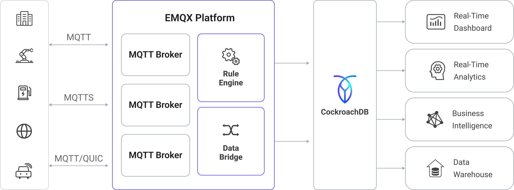

# CockroachDBへのMQTTデータ取り込み

[CockroachDB](https://www.cockroachlabs.com/product/overview/)は、分散型でPostgreSQL互換のデータベースであり、フルマネージドクラウドサービス（CockroachDB Cloud）またはセルフホスト型のデプロイメントとして利用可能です。高いレジリエンス、水平スケーラビリティ、および完全なSQL互換性を必要とするグローバルアプリケーション向けに設計されています。EMQXはCockroachDBとスムーズに統合し、IoTデバイスからのMQTTデータをリアルタイムでキャプチャして保存します。これにより、グローバル展開における高速かつ信頼性の高い取り込み、Raftベースのレプリケーションによる一貫したデータ保証、そして運用および分析向けの低レイテンシな読み取りを実現します。

本ページでは、EMQXとCockroachDB間のデータ統合について包括的に紹介し、データ統合の作成および検証に関する実践的な手順を提供します。

## 動作概要

EMQXにおけるCockroachDBデータ統合は、MQTTベースのIoTデータストリームをCockroachDBの分散型PostgreSQL互換データベースに直接取り込む組み込み機能です。EMQXの組み込み[ルールエンジン](./rules.md)を利用することで、複雑なカスタムコードを書くことなく、CockroachDBへ直接データを取り込み、グローバルに一貫した保存とリアルタイムクエリを実現できます。

CockroachDBの共有なし（shared-nothing）分散アーキテクチャは、Raftベースのコンセンサスを用いて複数のノードやリージョンにデータを自動的にレプリケートし、障害時でも強い一貫性を維持します。これにより、IoTデータは常に安全かつ同期され、利用可能な状態が保たれます。

以下の図は、EMQXとCockroachDB間のデータ統合の典型的なアーキテクチャを示しています。



CockroachDBへのMQTTデータ取り込みは以下のように動作します。

1. **IoTデバイスがEMQXに接続**：IoTデバイスがMQTTプロトコルを通じて正常に接続されると、オンラインイベントがトリガーされます。イベントにはデバイスID、送信元IPアドレスなどの情報が含まれます。
2. **メッセージのパブリッシュと受信**：デバイスは特定のトピックにテレメトリやステータスデータをパブリッシュします。EMQXはこれらのメッセージを受信すると、ルールエンジン内でマッチング処理を開始します。
3. **ルールエンジンによるメッセージ処理**：EMQXのルールエンジンは、トピックやメッセージ内容に基づいて定義されたルールにマッチさせてイベントやメッセージを処理します。処理内容には、データ変換（例：JSONからSQL用フォーマットへの変換）、フィルタリング、コンテキスト情報によるデータ強化などが含まれ、データベース挿入前に行われます。
4. **CockroachDBへの書き込み**：マッチしたルールはCockroachDBに対するSQL実行をトリガーします。SQLテンプレートを使い、処理済みデータのフィールドをCockroachDBのテーブルやカラムにマッピングします。CockroachDBの分散SQL実行とベクトル化クエリエンジンにより、高スループットな書き込みと低レイテンシな分析クエリを両立します。マルチリージョン展開ではジオパーティショニングも可能です。

イベントおよびメッセージデータがCockroachDBに書き込まれた後は、

- CockroachDBをGrafanaなどのツールに接続し、ライブのIoTメトリクスを表示するダッシュボードやチャートを作成できます。
- デバイス管理プラットフォームやAI/MLモデルと連携し、ヘルスチェック、異常検知、アラートトリガーが可能です。
- CockroachDBの分散クエリエンジンを活用し、ライブのIoTデータに対して集計、結合、時系列分析を行いながら、新しいテレメトリの処理を並行して継続できます。

## 特長とメリット

CockroachDBとのデータ統合は、以下のような特長と利点をビジネスにもたらします。

- **柔軟なイベント処理**：EMQXのルールエンジンを用いて、CockroachDBはデバイスのライフサイクルイベント（接続、切断、ステータス変化）を低レイテンシで保存・処理可能です。CockroachDBの分散実行と自動リバランス機能と組み合わせることで、イベントデータは高可用性を保ち、障害や異常、トレンドのリアルタイム検知に活用できます。
- **メッセージ変換**：メッセージはEMQXルールを通じて広範な処理・変換が可能で、CockroachDBに書き込まれるデータは初めから分析に適した形となります。これによりクエリの複雑さが軽減され、下流処理が最適化されます。
- **SQLテンプレートによる柔軟なデータ操作**：EMQXのSQLテンプレートマッピングを使い、構造化されたIoTデータをCockroachDBのテーブルやカラムに挿入・更新できます。PostgreSQL互換のCockroachDBは標準SQL、JSONBストレージ、インデックスをサポートし、ベクトル化実行エンジンによる高速分析やフォロワーリードによる低レイテンシなリージョンローカルアクセスが可能です。
- **業務プロセスの統合**：CockroachDBのPostgreSQL互換性により、ERP、CRM、GISなどの業務システムとの統合が容易です。EMQXと組み合わせることで、複雑なETLパイプラインを構築せずにイベント駆動の自動化やクロスシステムオーケストレーションを実現できます。
- **高度な地理空間機能**：PostGISなどのPostgreSQL拡張を通じて、CockroachDBは地理空間データの保存、インデックス作成、クエリをサポートします。これにより、ジオフェンシング、位置ベースのアラート、ルート追跡、リアルタイム資産監視がEMQXの信頼性の高いIoTデータ取り込みと連携して可能になります。
- **組み込みのメトリクスと監視**：EMQXは各CockroachDBシンクの実行時メトリクス（メッセージ数、成功／失敗率、スループット）を提供し、CockroachDBは組み込みの可観測性ツールを備え、PrometheusやGrafanaと連携して詳細なパフォーマンスおよびヘルス監視を実現します。

## はじめる前に

このセクションでは、CockroachDB統合を作成する前に必要な準備、CockroachDBのデプロイやデータベース・テーブルの作成方法について説明します。

### 前提条件

- EMQXデータ統合の[ルール](./rules.md)に関する知識
- [データ統合](./data-bridges.md)に関する知識

### CockroachDBでのデータベースとテーブルの作成

EMQXでCockroachDBコネクターを作成する前に、CockroachDBクラスターが稼働しており、IoTデータを保存するためのデータベースとテーブルが準備されていることを確認してください。

1. CockroachDBクラスターを作成します。

   - CockroachDB Cloudの場合は、[CockroachDB Cloudドキュメント](https://www.cockroachlabs.com/docs/cockroachcloud)に従ってクラスターをプロビジョニングしてください。
   - セルフホスト型の場合は、[インストールガイド](https://www.cockroachlabs.com/docs/stable/install-cockroachdb-linux.html)に従ってください。

2. EMQX用の専用SQLユーザーを作成します。詳細は[CockroachDBユーザー管理ガイド](https://www.cockroachlabs.com/docs/cockroachcloud/managing-access#manage-sql-users-on-a-cluster)を参照してください。本例ではSQLユーザー名を`emqx_user`とし、後でCockroachDBコネクターの設定時に使用します。このユーザーには以下の権限が必要です。

   - 対象データベースへの接続権限
   - テーブル作成権限
   - EMQXデータテーブルへの読み書き権限

3. [データベースの作成](https://www.cockroachlabs.com/docs/cockroachcloud/managing-access#manage-sql-users-on-a-cluster)手順に従い、データベースを作成します。本例ではデータベース名を`emqx_data`とします。

4. `emqx_data`データベースに接続し、MQTTメッセージとクライアントイベントデータを保存するための2つのテーブルを作成します。[テーブルの作成](https://www.cockroachlabs.com/docs/v25.3/schema-design-table#create-a-table)手順に従ってください。

   - 以下のSQL文を使用して、クライアントID、トピック、QoS、ペイロード、到着時刻などのメタデータを含むMQTTメッセージを保存する`t_mqtt_msg`テーブルを作成します。

     ```sql
     CREATE TABLE t_mqtt_msg (
       id SERIAL primary key,
       msgid character varying(64),
       sender character varying(64),
       topic character varying(255),
       qos integer,
       retain integer,
       payload text,
       arrived timestamp without time zone
     );
     ```

   - 以下のSQL文を使用して、クライアントのオンライン／オフラインイベントをタイムスタンプ付きで保存する`emqx_client_events`テーブルを作成します。

     ```sql
     CREATE TABLE emqx_client_events (
       id SERIAL primary key,
       clientid VARCHAR(255),
       event VARCHAR(255),
       created_at TIMESTAMP DEFAULT CURRENT_TIMESTAMP
     );
     ```

## CockroachDBコネクターの作成

CockroachDBシンクを追加する前に、EMQXでCockroachDBコネクターを作成する必要があります。コネクターは、EMQXがセルフホスト型またはCockroachDB Cloud上のCockroachDBクラスターに接続する方法を定義します。

1. EMQXダッシュボードで、**Integration** -> **Connector** に移動します。
2. ページ右上の **Create** をクリックします。
3. **Create Connector** ページで **CockroachDB** を選択し、**Next** をクリックします。
4. コネクター名を入力します。名前は英数字で始まり、英数字、ハイフン、アンダースコアを含めることができます。例：`my_cockroachdb`
5. 接続情報を入力します。

   - **Server Host**：CockroachDBクラスターのホスト名またはIPアドレス
     - **CockroachDB Cloud**：CockroachDB Cloudコンソールの接続文字列にあるホスト値を使用（例：`free-tier.gcp-us-central1.cockroachlabs.cloud`）
     - **セルフホスト型**：CockroachDBが稼働しているアドレス（例：ローカルなら`127.0.0.1`、またはサーバーのパブリック／プライベートIP）
   - **Database Name**：EMQXがデータを保存する対象データベース名（本例では`emqx_data`）
   - **Username**：認証および識別に使用するCockroachDBのSQLユーザー名（本例では`emqx_user`）
   - **Password**：`emqx_user`のパスワード
   - **Enable TLS**：暗号化接続を確立する場合はトグルをオンにします。TLS接続の詳細は[外部リソースアクセスのTLS](../network/overview.md/#tls-for-external-resource-access)を参照してください。
6. 高度な設定（任意）：接続プールサイズ、アイドルタイムアウト、リクエストタイムアウトなどの追加接続プロパティを設定できます。詳細は[シンクの機能](./data-bridges.md#features-of-sink)を参照してください。
7. **Test Connectivity** をクリックして、EMQXが指定した設定でCockroachDBクラスターに正常に接続できるか確認します。
8. **Create** をクリックしてコネクターを保存します。
9. 作成後は以下のいずれかを選択できます。

   - **Back to Connector List** をクリックして全コネクター一覧に戻る
   - **Create Rule** をクリックして、このコネクターを使ったルールをすぐに作成する

   詳細な例は以下を参照してください。

   - [メッセージ保存用CockroachDBシンクのルール作成](#create-a-rule-with-cockroachdb-sink-for-message-storage)
   - [イベント記録用CockroachDBシンクのルール作成](#create-a-rule-with-cockroachdb-sink-for-events-recording)

## メッセージ保存用CockroachDBシンクのルール作成

このセクションでは、ダッシュボードでソースMQTTトピック`t/#`からのメッセージを処理し、処理済みデータを設定済みのCockroachDBシンクを介して`t_mqtt_msg`テーブルに保存するルールの作成方法を示します。

1. ダッシュボードの **Integration** -> **Rules** ページに移動します。
2. ページ右上の **Create** をクリックします。
3. ルールIDに`my_rule`を入力し、SQLエディターにルールを入力します。ここでは`t/#`トピックのMQTTメッセージをCockroachDBに保存するため、ルールのSELECT句でSQLテンプレートで使用するすべての変数が含まれていることを確認してください。ルールSQLは以下の通りです。

   ```sql
   SELECT
   *
   FROM
   "t/#"
   ```

   ::: tip

   初心者の方は、**SQL Examples** と **Enable Test** をクリックしてSQLルールの学習とテストを行うことができます。

   :::

4. **+ Add Action** ボタンをクリックして、ルールでトリガーされるアクションを定義します。このアクションにより、EMQXはルールで処理したデータをCockroachDBに送信します。
5. **Type of Action** のドロップダウンからCockroachDBを選択し、**Action** ドロップダウンはデフォルトの `Create Action` のままにするか、既存のCockroachDBアクションを選択します。本例では新規シンクを作成してルールに追加します。
6. シンクの名前と説明を入力します。
7. **Connector** ドロップダウンから先ほど作成した`my_cockroachdb`を選択します。新規コネクターを作成する場合はドロップダウン横のボタンをクリックしてください。設定パラメーターの詳細は[CockroachDBコネクターの作成](#create-a-cockroachdb-connector)を参照してください。
8. **SQL Template** を設定します。以下のSQL文を使ってデータを挿入します。

   注意：これは[プリプロセス済みSQL](./data-bridges.md#prepared-statement)なので、フィールドは引用符で囲まず、文末にセミコロンを書かないでください。

   ```sql
   INSERT INTO t_mqtt_msg(msgid, sender, topic, qos, payload, arrived) VALUES(
     ${id},
     ${clientid},
     ${topic},
     ${qos},
     ${payload},
     TO_TIMESTAMP((${timestamp} :: bigint)/1000)
   )
   ```

9. **フォールバックアクション（任意）**：メッセージ配信失敗時の信頼性向上のため、1つ以上のフォールバックアクションを定義できます。これらはプライマリシンクがメッセージ処理に失敗した場合にトリガーされます。詳細は[フォールバックアクション](./data-bridges.md#fallback-actions)を参照してください。
10. **高度な設定（任意）**：詳細は[シンクの機能](./data-bridges.md#features-of-sink)を参照してください。
11. **Create** をクリックする前に、**Test Connectivity** をクリックしてシンクがCockroachDBクラスターに接続できるかテストできます。
12. **Create** ボタンをクリックしてシンク設定を完了します。新しいシンクが**Action Outputs**に追加されます。
13. **Create Rule** ページで設定内容を確認し、**Save** ボタンをクリックしてルールを生成します。

ルール作成が完了すると、**Integration** -> **Rules** ページで新規作成したルールを確認でき、**Action (Sink)** タブで新規CockroachDBシンクも確認できます。

また、**Integration** -> **Flow Designer** をクリックするとトポロジーが表示され、`t/#`トピックのメッセージがルール`my_rule`で解析されてCockroachDBに書き込まれている様子を可視化できます。

## イベント記録用CockroachDBシンクのルール作成

このセクションでは、クライアントのオンライン／オフライン状態を記録し、イベントデータを設定済みのCockroachDBシンクを介して`emqx_client_events`テーブルに保存するルールの作成方法を示します。

手順は[メッセージ保存用CockroachDBシンクのルール作成](#create-a-rule-with-cockroachdb-sink-for-message-storage)とほぼ同様ですが、SQLテンプレートとSQLルールが異なります。

オンライン／オフライン状態記録用のSQLルール文は以下の通りです。

```sql
SELECT
  *
FROM
  "$events/client_connected", "$events/client_disconnected"
```

イベント記録用のSQLテンプレートは以下の通りです。

注意：これは[プリプロセス済みSQL](./data-bridges.md#prepared-statement)なので、フィールドは引用符で囲まず、文末にセミコロンを書かないでください。

```sql
INSERT INTO emqx_client_events(clientid, event, created_at) VALUES (
  ${clientid},
  ${event},
  TO_TIMESTAMP((${timestamp} :: bigint)/1000)
)
```

## ルールのテスト

MQTTXを使ってトピック`t/1`にメッセージを送信し、オンライン／オフラインイベントをトリガーします。

```bash
mqttx pub -i emqx_c -t t/1 -m '{ "msg": "hello CockroachDB" }'
```

2つのシンクの稼働状況を確認します。メッセージ保存用シンクでは新規の受信メッセージ1件と送信メッセージ1件があるはずです。イベント記録用シンクでは2件のイベントレコードが存在します。

`t_mqtt_msg`データテーブルにデータが書き込まれているか確認します。

```bash
emqx_data=# select * from t_mqtt_msg;
 id |              msgid               | sender | topic | qos | retain |            payload
        |       arrived
----+----------------------------------+--------+-------+-----+--------+-------------------------------+---------------------
  1 | 0005F298A0F0AEE2F443000012DC0002 | emqx_c | t/1   |   0 |        | { "msg": "hello CockroachDB" } | 2023-01-19 07:10:32
(1 row)
```

`emqx_client_events`テーブルにデータが書き込まれているか確認します。

```bash
emqx_data=# select * from emqx_client_events;
 id | clientid |        event        |     created_at
----+----------+---------------------+---------------------
  3 | emqx_c   | client.connected    | 2023-01-19 07:10:32
  4 | emqx_c   | client.disconnected | 2023-01-19 07:10:32
(2 rows)
```
