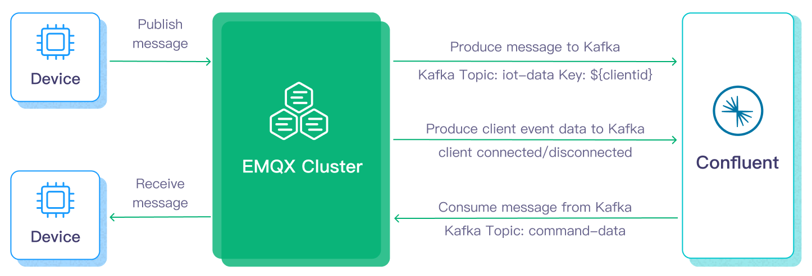
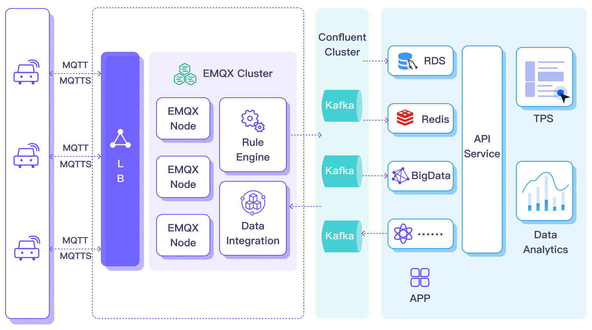
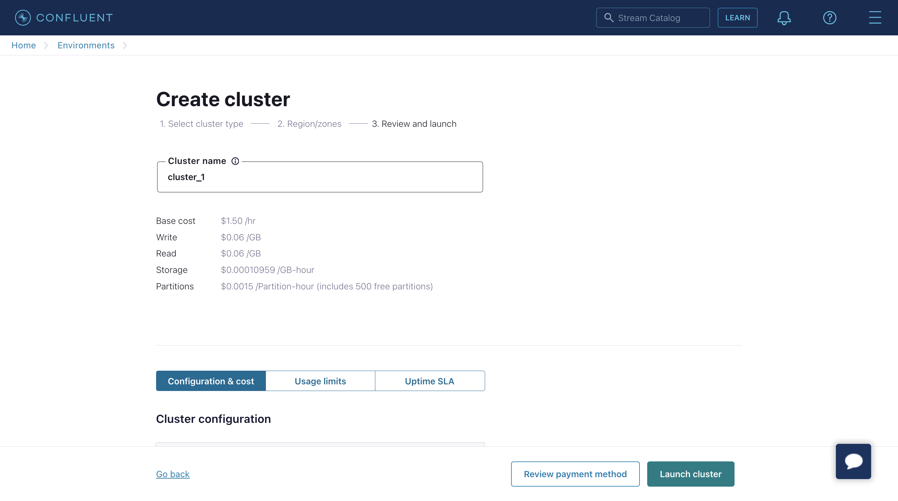
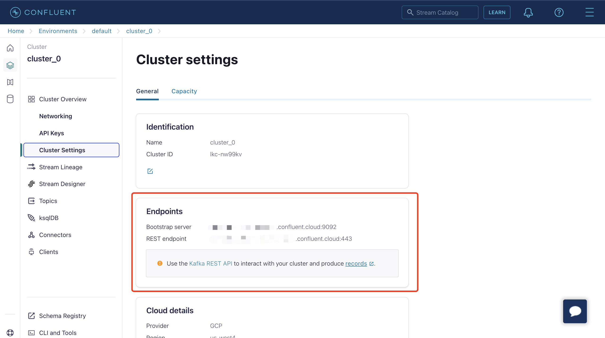

# Confluent への MQTT データストリーミング

[Confluent Cloud](https://www.confluent.io/) は Apache Kafka を基盤とした、レジリエントでスケーラブルかつフルマネージドのストリーミングデータサービスです。EMQX はルールエンジンとSinkを通じて Confluent とのデータ統合をサポートし、MQTT データをリアルタイム処理、保存、分析のために簡単に Confluent にストリーミングできます。



本ページでは主に Confluent 統合の機能と利点を紹介し、Confluent Cloud の設定および EMQX における Confluent Producer Sink の作成方法を案内します。

## 動作概要

Confluent データ統合は EMQX の即利用可能な機能であり、MQTT ベースの IoT データと Confluent の強力なデータ処理機能を橋渡しします。組み込みの[ルールエンジン](./rules.md)コンポーネントを利用することで、両プラットフォーム間のデータフローと処理を簡素化し、複雑なコーディングを不要にします。

以下の図は自動車 IoT における EMQX と Confluent データ統合の典型的なアーキテクチャを示しています。



Confluent へのデータの入出力は Confluent Sink（Confluent へのメッセージ送信）と Confluent Source（Confluent からのメッセージ受信）を介して行われます。Confluent Sink を作成した場合、そのワークフローは以下の通りです。

1. **メッセージのパブリッシュと受信**：車両に接続された IoT デバイスは MQTT プロトコルで EMQX に正常に接続し、定期的に状態データを含むメッセージをパブリッシュします。EMQX がこれらのメッセージを受信すると、ルールエンジン内でマッチング処理を開始します。
2. **メッセージデータの処理**：これらの MQTT メッセージは、組み込みルールエンジンとメッセージサーバーの協調により、トピックマッチングルールに従って処理されます。メッセージが到着しルールエンジンを通過すると、事前定義された処理ルールが評価されます。ペイロード変換を指定するルールがあれば、データ形式の変換、特定情報のフィルタリング、追加コンテキストによるペイロードの強化などの変換が適用されます。
3. **Confluent へのブリッジ**：ルールエンジンで定義されたルールが Confluent へのメッセージ転送アクションをトリガーします。Confluent Sink 機能を利用して、MQTT トピックは Confluent の事前定義 Kafka トピックにマッピングされ、処理済みのすべてのメッセージとデータがこれらのトピックに書き込まれます。

車両データが Confluent に入力されると、以下のように柔軟にデータを活用できます。

- サービスは直接 Confluent と連携し、特定トピックのリアルタイムデータストリームを消費してカスタマイズされた業務処理を行えます。
- Kafka Streams を利用したストリーム処理や、車両状態のメモリ内集約・相関によるリアルタイム監視が可能です。
- Confluent Stream Designer コンポーネントを使い、MySQL や ElasticSearch など外部システムへのデータ出力用コネクターを選択して保存できます。

## 機能と利点

Confluent とのデータ統合は以下の機能と利点をもたらします。

- **大規模メッセージ伝送の信頼性**：EMQX と Confluent Cloud は共に高信頼のクラスター機構を用い、安定かつ信頼性の高いメッセージ伝送チャネルを確立し、大規模 IoT デバイスからのメッセージのロスゼロを保証します。両者ともノード追加による水平スケールが可能で、突発的な大規模メッセージにも動的にリソースを調整し、メッセージ伝送の可用性を確保します。
- **強力なデータ処理能力**：EMQX のローカルルールエンジンと Confluent Cloud は、デバイスからアプリケーションまでの異なる段階で信頼性の高いストリーミングデータ処理を提供します。リアルタイムのデータフィルタリング、形式変換、集約分析などシナリオに応じた処理が可能で、より複雑な IoT メッセージ処理ワークフローを実現し、データ分析アプリケーションのニーズに応えます。
- **強力な統合機能**：Confluent Cloud が提供する多様なコネクターを通じて、EMQX は他のデータベース、データウェアハウス、データストリーム処理システムと容易に統合でき、柔軟なデータ分析アプリケーション向けの完全な IoT データワークフローを構築します。
- **高スループット処理能力**：同期・非同期両方の書き込みモードをサポートし、リアルタイム優先や性能優先などシナリオに応じたデータ書き込み戦略を使い分け、レイテンシとスループットのバランスを柔軟に調整できます。
- **効果的なトピックマッピング**：ブリッジ設定を通じて多数の IoT 業務トピックを Kafka トピックにマッピング可能です。EMQX は MQTT ユーザープロパティを Kafka ヘッダーにマッピングでき、1対1、1対多、多対多など多様なトピックマッピング方法を採用し、MQTT トピックフィルター（ワイルドカード）にも対応します。

これらの機能は統合能力と柔軟性を高め、効果的かつ堅牢な IoT プラットフォームアーキテクチャの構築を支援します。増大する IoT データは安定したネットワーク接続を介して伝送され、さらに効果的に保存・管理されます。

## はじめる前に

このセクションでは、EMQX ダッシュボードで Confluent データ統合を設定するための準備作業について説明します。

### 前提条件

- [ルールエンジン](./rules.md)の理解
- [Sink](./data-bridges.md)の理解

### Confluent Cloud の設定

Confluent データ統合を作成する前に、Confluent Cloud コンソールで Confluent クラスターを作成し、Confluent Cloud CLI を使ってトピックと API キーを作成する必要があります。

#### クラスターの作成

1. Confluent Cloud コンソールにログインし、クラスターを作成します。例として Standard クラスターを選択し、**Begin configuration** をクリックします。


2. リージョン／ゾーンを選択します。デプロイリージョンが Confluent Cloud のリージョンと一致していることを確認し、**Continue** をクリックします。


3. クラスター名を入力し、**Launch cluster** をクリックします。



#### Confluent Cloud CLI を使ったトピックと API キーの作成

Confluent Cloud でクラスターが稼働したら、**Cluster Overview** -> **Cluster Settings** ページから **Bootstrap server** の URL を取得できます。



Confluent Cloud CLI を使ってクラスターを管理できます。以下は基本的な CLI コマンドです。

##### Confluent Cloud CLI のインストール

```bash
curl -sL --http1.1 https://cnfl.io/cli | sh -s -- -b /usr/local/bin
```

既にインストール済みの場合は、以下のコマンドでアップデートできます。

```bash
confluent update
```

##### アカウントにログイン

```bash
confluent login --save
```

##### 環境を選択

```bash
# 環境一覧
confluent environment list
# 環境を使用
confluent environment use <environment_id>
```

##### クラスターを選択

```bash
# Kafka クラスター一覧
confluent kafka cluster list
# Kafka クラスターを使用
confluent kafka cluster use <kafka_cluster_id>
```

##### API キーとシークレットの使用

既存の API キーを使う場合は、以下のコマンドで CLI に登録します。

```bash
confluent api-key store --resource <kafka_cluster_id>
Key: <API_KEY>
Secret: <API_SECRET>
```

API キーとシークレットを持っていない場合は、以下のコマンドで作成できます。

```bash
$ confluent api-key create --resource <kafka_cluster_id>

API キーの準備には数分かかる場合があります。
API キーとシークレットを保存してください。シークレットは後で取得できません。
+------------+------------------------------------------------------------------+
| API Key    | YZ6R7YO6Q2WK35X7                                                 |
| API Secret | ****************************************                         |
+------------+------------------------------------------------------------------+
```

登録後、以下のコマンドで API キーとシークレットを使用できます。

```bash
confluent api-key use <API_Key> --resource <kafka_cluster_id>
```

##### トピックの作成

`testtopic-in` という名前のトピックを作成するには以下のコマンドを実行します。

```bash
confluent kafka topic create testtopic-in
```

トピック一覧は以下のコマンドで確認できます。

```bash
confluent kafka topic list
```

##### トピックへのメッセージ送信（Producer）

以下のコマンドでプロデューサーを作成します。起動後、メッセージを入力して Enter を押すと、そのトピックにメッセージが送信されます。

```bash
confluent kafka topic produce testtopic-in
```

##### トピックからのメッセージ受信（Consumer）

以下のコマンドでコンシューマーを作成します。指定したトピックのすべてのメッセージが出力されます。

```bash
confluent kafka topic consume -b testtopic-in
```

## コネクターの作成

Confluent Sink アクションを追加する前に、EMQX と Confluent Cloud の接続を確立するために Confluent Producer コネクターを作成する必要があります。

1. EMQX ダッシュボードで **Integration** -> **Connectors** をクリックします。

2. ページ右上の **Create** をクリックし、コネクター選択画面で **Confluent Producer** を選択して **Next** をクリックします。

3. 名前と説明を入力します（例：`my-confluent`）。名前は Confluent Sink とコネクターを関連付けるために使用され、クラスター内で一意である必要があります。

4. Confluent Cloud への接続に必要なパラメータを設定します：
   - **Bootstrap Hosts**：Confluent Cloud クラスター設定ページの **Endpoints** セクションからエンドポイント情報を入力します。
   
   - **Authentication**：Confluent Cloud クラスターで必要な認証方式を選択します。
     - **Basic auth**：Confluent Cloud で作成した API Key と API Secret に対応する **Username** と **Password** を入力します。
     
     - **OAuth**：Confluent Cloud の OAuth/OIDC 設定に従い、トークンエンドポイント、クライアントID、クライアントシークレットなどの OAuth パラメータを設定します。
     
       OAuth 設定は Kafka コネクターと同様です。詳細は[認証方式](./data-bridge-kafka.md#authentication-method)を参照してください。

   - **Request Timeout**：EMQX が Confluent からの応答を待つ最大時間（秒）を指定します。デフォルトは `30` 秒です。タイムアウトを超えると EMQX は接続を古いものと見なし再接続します。この値が小さすぎると、Confluent はリクエストを受け入れても応答を遅延させることがあり、EMQX は再接続後にバッチを再送して重複メッセージや過剰な下流データ量を招く可能性があります。
   - 他のオプションはデフォルトのままか、業務要件に応じて設定してください。
   
5. **Create** ボタンをクリックしてコネクターの作成を完了します。

作成後、コネクターは自動的に Confluent Cloud に接続します。次に、このコネクターを基にルールを作成し、コネクターで設定した Confluent クラスターにデータを転送します。

## Confluent Sink を使ったルールの作成

このセクションでは、MQTT トピック `t/#` のメッセージを処理し、処理結果を Confluent の `testtopic-in` トピックに送信するルールを EMQX で作成する方法を示します。

1. EMQX ダッシュボードに入り、**Integration** -> **Rules** をクリックします。

2. 右上の **Create** をクリックします。

3. ルール ID を入力します（例：`my_rule`）。

4. MQTT メッセージをトピック `t/#` から Confluent に転送する場合、**SQL Editor** に以下の文を入力します。

   注意：独自の SQL 構文を指定する場合、`SELECT` 部分に Sink が必要とするすべてのフィールドを含めてください。

   ```sql
   SELECT
     *
   FROM
     "t/#"
   ```

   注意：初心者の場合は **SQL Example** と **Enable Test** をクリックして SQL ルールの学習とテストができます。

5. + **Add Action** ボタンをクリックしてルールでトリガーされるアクションを定義します。**Type of Action** ドロップダウンリストから `Confluent Producer` を選択し、**Action** はデフォルトの `Create Action` のままか、既存の Confluent Producer アクションを選択します。この例では新規ルール作成とアクション追加を行います。

6. Sink の名前と説明を対応するテキストボックスに入力します。

7. **Connector** ドロップダウンから先ほど作成した `my-confluent` コネクターを選択します。ドロップダウン横のボタンをクリックするとポップアップで新規コネクターを素早く作成でき、必要な設定パラメータは[コネクターの作成](#コネクターの作成)を参照してください。

8. Sink のデータ送信方法を設定します。

   - **Kafka Topic**：`testtopic-in` を入力します。EMQX v5.7.2 以降、このフィールドは動的トピック設定にも対応しています。詳細は[Kafka 動的トピックの設定](./data-bridge-kafka.md#configure-kafka-dynamic-topics)を参照してください。
   - **Kafka Headers**：Kafka メッセージに関連するメタデータやコンテキスト情報を入力します（任意）。プレースホルダーの値はオブジェクトである必要があります。ヘッダー値のエンコードタイプは **Kafka Header Value Encod Type** ドロップダウンから選択できます。**Add** をクリックしてキー・バリューのペアを追加可能です。
   - **Message Key**：Kafka メッセージのキーを入力します。純粋な文字列か `${var}` を含む文字列が指定可能です。
   - **Message Value**：Kafka メッセージの値を入力します。純粋な文字列か `${var}` を含む文字列が指定可能です。
   - **Partition Strategy**：プロデューサーがメッセージを Kafka のパーティションに分配する方法を選択します。
   - **Compression**：Kafka メッセージ内のレコードを圧縮／解凍する圧縮アルゴリズムを指定します。

9. **フォールバックアクション（任意）**：メッセージ配信失敗時の信頼性向上のため、1つ以上のフォールバックアクションを定義できます。プライマリ Sink がメッセージ処理に失敗した場合にトリガーされます。詳細は[フォールバックアクション](./data-bridges.md#fallback-actions)を参照してください。

10. **詳細設定（任意）**：[詳細設定](#advanced-configuration)を参照してください。

11. **Create** ボタンをクリックして Sink の作成を完了します。作成後、ページは **Create Rule** に戻り、新しい Sink がルールアクションに追加されます。

12. **Create** ボタンをクリックしてルール作成全体を完了します。

これでルールが正常に作成され、**Integration** -> **Rules** ページで新規ルールを確認でき、**Actions(Sink)** タブには新規 Confluent Producer Sink が表示されます。

また、**Integration** -> **Flow Designer** をクリックするとトポロジーを確認できます。トポロジー上で、トピック `t/#` のメッセージがルール `my_rule` によって解析され、Confluent に送信・保存されている様子を直感的に把握できます。

## Confluent Producer ルールのテスト

Confluent Producer ルールが期待通りに動作するかテストするには、[MQTTX](https://mqttx.app/en) を使ってクライアントが EMQX に MQTT メッセージをパブリッシュする動作をシミュレートします。

1. MQTTX を使ってトピック `t/1` にメッセージを送信します。

   ```bash
   mqttx pub -i emqx_c -t t/1 -m '{ "msg": "Hello Confluent" }'
   ```

2. **Actions(Sink)** ページで Sink 名をクリックし、統計情報を確認します。Sink の稼働状況をチェックし、新規受信メッセージと送信メッセージがそれぞれ 1 件ずつあることを確認してください。

3. 以下の Confluent コマンドで `testtopic-in` トピックにメッセージが書き込まれているか確認します。

   ```bash
   confluent kafka topic consume -b testtopic-in
   ```

## 詳細設定

このセクションでは、コネクターや Sink/Source のパフォーマンス最適化やシナリオに応じたカスタマイズ操作のための詳細設定オプションを説明します。該当オブジェクト作成時に **Advanced Settings** を展開し、業務要件に応じて以下の設定を行えます。

### コネクター設定

| 項目                             | 説明                                                         | 推奨値             |
| -------------------------------- | ------------------------------------------------------------ | ------------------ |
| Allow Auto Topic Creation         | （Producer のみ）有効にすると、クライアントがメタデータ取得要求を送信した際に Kafka トピックが存在しなければ自動作成を許可します。 | `Disabled`         |
| Connect Timeout                   | TCP 接続確立の最大待機時間（認証時間含む）                    | `5` 秒             |
| Start Timeout                     | コネクターが自動起動したリソースの正常状態到達を待つ最大秒数。Sink が接続先リソース（例：Confluent クラスター）が完全に稼働しデータ処理可能になるまで処理を進めないようにします。 | `5` 秒             |
| Health Check Interval             | コネクターの稼働状況チェック間隔                              | `15` 秒            |
| Min Metadata Refresh Interval     | Kafka ブローカー・トピックメタデータの最小更新間隔。小さすぎると Kafka サーバー負荷増加の恐れあり。 | `3` 秒             |
| Metadata Request Timeout          | Kafka からメタデータ取得要求の最大待機時間                    | `5` 秒             |
| Socket Send / Receive Buffer Size | ソケットバッファサイズを管理しネットワーク伝送性能を最適化    | `1` MB             |
| No Delay                          | TCP ソケットを即時送信するか遅延送信するかを選択。オンで即時送信。オフの場合、送信内容が少ないと約 40ms の遅延が発生。 | `Enabled`          |
| TCP Keepalive                     | Kafka ブリッジ接続の TCP キープアライブ設定。接続の長時間アイドルによる切断防止。`Idle, Interval, Probes` の形式でカンマ区切りの3つの数値を指定。例：`240,30,5` は 240 秒アイドル後にプローブ開始、30 秒間隔で最大 5 回試行。 | `none`             |

### Confluent Producer Sink 設定

| 項目                             | 説明                                                         | 推奨値             |
| -------------------------------- | ------------------------------------------------------------ | ------------------ |
| Health Check Interval            | Sink の稼働状況チェック間隔                                  | `15` 秒            |
| Max Batch Bytes                  | Kafka バッチ内で収集するメッセージの最大サイズ（バイト）。Kafka ブローカーのデフォルトは 1MB だが、EMQX はエンコードオーバーヘッドを考慮しやや小さめに設定。単一メッセージがこのサイズを超える場合は別バッチで送信。 | `896` KB           |
| Required Acks                    | Kafka パーティションリーダーがフォロワーから待つ確認応答の種類：<br />`all_isr`: 全てのインシンクレプリカからの応答を要求。<br />`leader_only`: リーダーのみ応答を要求。<br />`none`: Kafka からの応答不要。 | `all_isr`          |
| Partition Count Refresh Interval | Kafka プロデューサーがパーティション数増加を検知する間隔。増加検知後、EMQX は指定の `partition_strategy` に基づき新パーティションにメッセージを送信。 | `60` 秒            |
| Max Inflight                     | Kafka プロデューサーが応答を待たずに送信可能なバッチ最大数（パーティション毎）。値が大きいほどスループット向上。ただし 1 を超えるとメッセージ順序が入れ替わるリスクあり。 | `10`               |
| Query Mode (Producer)            | 非同期または同期のクエリモードを選択し、要件に応じてメッセージ送信を最適化。非同期モードでは Kafka 書き込みが MQTT パブリッシュをブロックしないが、クライアントが Kafka 到着前にメッセージを受信する可能性あり。 | `Async`            |
| Synchronous Query Timeout        | 同期モード時の最大待機時間。メッセージ送信完了を待つ時間制限。`Sync` モード時のみ有効。 | `5` 秒             |
| Buffer Mode                      | メッセージを送信前にバッファリングするか設定。<br />`memory`: メモリにバッファ。EMQX ノード再起動で消失。<br />`disk`: ディスクにバッファ。ノード再起動後も保持。<br />`hybrid`: 初めはメモリにバッファし、一定サイズ超過後にディスクへオフロード。メモリモード同様、ノード再起動で消失。 | `memory`           |
| Per-partition Buffer Limit       | Kafka パーティション毎の最大バッファサイズ（バイト）。上限到達時は古いメッセージを破棄しバッファ空間を確保。メモリ使用量と性能のバランス調整に有効。 | `2` GB             |
| Segment File Bytes               | バッファモードが `disk` または `hybrid` の場合に適用。メッセージ保存用の分割ファイルサイズを制御し、ディスクストレージの最適化に影響。 | `100` MB           |
| Memory Overload Protection       | バッファモードが `memory` の場合に適用。メモリ圧迫時に古いバッファメッセージを自動破棄し、システム安定性を確保。Linux システムのみ有効。 | Disabled           |
| Max Batch Age                    | プロデューサーバッファ内でメッセージが送信されずに保持される最大期間。期限切れのバッチは破棄され、破棄されたメッセージは `dropped.expired` メトリクスにカウント。デフォルトは `infinity`（期限切れなし）。バッファオーバーフロー時は期限切れに関係なく破棄される可能性あり。 | `infinity`         |
| Max Retries                      | Confluent がリトライ可能なエラーで応答した場合の最大再試行回数。初回と全リトライ失敗時はバッチ破棄され、失敗メッセージは `failed` メトリクスにカウント。接続喪失による再送はリトライ回数に含まれず、`max_batch_age` によって制限。デフォルトは `infinity`（無制限）。 | `infinity`         |
| Reconnect Delay                  | 接続喪失後に再接続を試みるまでの待機時間。切断中もメッセージはバッファに蓄積されるが、バッファ制限と `max_batch_age` の影響を受ける。デフォルトは `2` 秒。 | `2` 秒             |
| Max Linger Time                  | パーティション毎のプロデューサーがバッチを大きくするためにメッセージを待機する最大時間。すべてのバッファモードに適用。デフォルト `0` は待機なしでレイテンシ最適化。小さな遅延を許容すると Confluent へのリクエスト数削減可能。ディスクバッファ時はバッファ書き込み前に待機し、IOPS 削減のため最低 `5ms` 推奨。 | `0` ミリ秒         |
| Max Linger Bytes                 | パーティション毎のプロデューサーがバッチ送信前に蓄積する最大バイト数。 | `10` MB            |

### <!-- Confluent Consumer Source 設定 -->

## 追加情報

EMQX は Confluent/Kafka とのデータ統合に関する豊富な学習リソースを提供しています。以下のリンクもご参照ください。

**ブログ：**

- [MQTT と Kafka を使ったコネクテッドビークルのストリーミングデータパイプライン構築](https://www.emqx.com/en/blog/building-connected-vehicle-streaming-data-pipelines-with-mqtt-and-kafka)
- [MQTT と Kafka | IoT メッセージングとストリームデータ統合の実践](https://www.emqx.com/en/blog/mqtt-and-kafka)
- [MQTT パフォーマンスベンチマークテスト：EMQX-Kafka 統合](https://www.emqx.com/en/resources/emqx-enterprise-performance-benchmark-testing-kafka-integration)

**ベンチマークレポート：**

- [EMQX Enterprise パフォーマンスベンチマークテスト：Kafka 統合](https://www.emqx.com/en/resources/emqx-enterprise-performance-benchmark-testing-kafka-integration)
