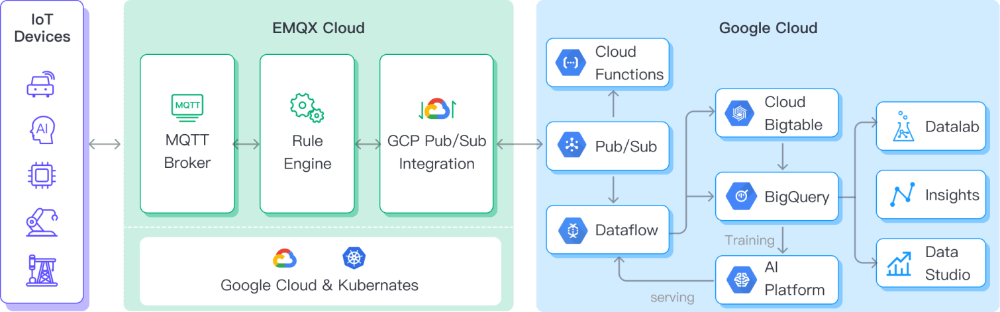
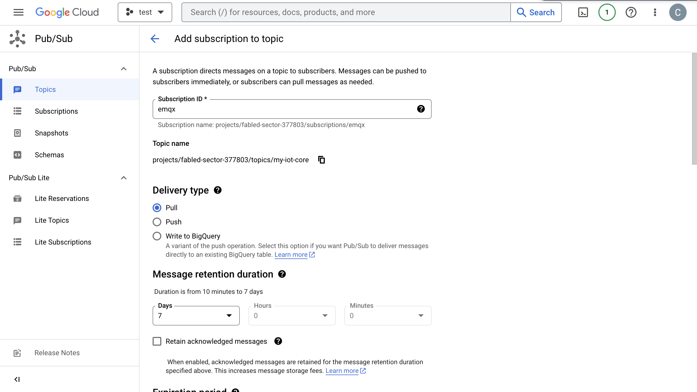
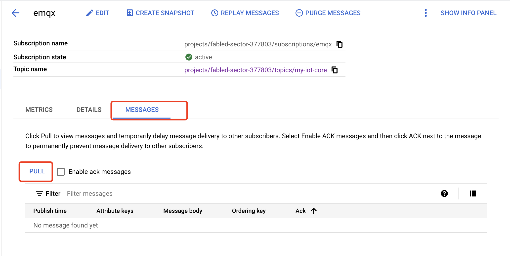

# GCP Pub/Sub に MQTT データを取り込む

<<<<<<< HEAD
[Google Cloud Pub/Sub](https://cloud.google.com/pubsub?hl=en-us) は、非常に高い信頼性とスケーラビリティを実現するために設計された非同期メッセージングサービスです。EMQX は、MQTT データのリアルタイム抽出、処理、分析のために Google Cloud Pub/Sub とのシームレスな統合をサポートしています。Cloud Functions、App Engine、Cloud Run、Kubernetes Engine、Compute Engine などのさまざまな Google Cloud サービスにデータをプッシュすることができます。また、Google Cloud から MQTT へのデータ配信も可能で、ユーザーが GCP 上で迅速に IoT アプリケーションを構築できるよう支援します。

本ページでは、EMQX と GCP Pub/Sub 間のデータ統合について、作成および検証の実践的な手順を含めて包括的に紹介します。

## 動作の仕組み

GCP Pub/Sub データ統合は、EMQX の標準機能として提供されており、MQTT データストリームを Google Cloud とシームレスに連携させ、IoT アプリケーション開発における豊富なサービスと機能を活用できるよう支援します。



EMQX は、ルールエンジンと Sink を介して MQTT データを GCP Pub/Sub に転送します。GCP Pub/Sub のプロデューサー役割の例を挙げると、全体の流れは以下の通りです。

1. **IoT デバイスがメッセージをパブリッシュ**：デバイスは特定のトピックを通じてテレメトリや状態データをパブリッシュし、ルールエンジンをトリガーします。
2. **ルールエンジンがメッセージを処理**：組み込みのルールエンジンを使い、特定のトピックにマッチする MQTT メッセージを処理します。ルールエンジンは対応するルールに基づき、データ形式の変換、特定情報のフィルタリング、コンテキスト情報の付加などの処理を実行します。
3. **GCP Pub/Sub へのブリッジ**：ルールがトリガーされると、メッセージを GCP Pub/Sub に転送するアクションが実行されます。データプロパティ、オーダーキー、MQTT トピックと GCP Pub/Sub トピックのマッピングを簡単に設定でき、より豊富なコンテキスト情報と順序保証を提供し、柔軟な IoT データ処理を実現します。
=======
[Google Cloud Pub/Sub](https://cloud.google.com/pubsub?hl=en-us) は、非常に高い信頼性とスケーラビリティを実現するために設計された非同期メッセージングサービスです。EMQX は、MQTT データのリアルタイム抽出、処理、分析のために Google Cloud Pub/Sub とのシームレスな統合をサポートしています。Cloud Functions、App Engine、Cloud Run、Kubernetes Engine、Compute Engine などのさまざまな Google Cloud サービスへデータをプッシュできます。あるいは、Google Cloud から MQTT へのデータ配信も可能で、ユーザーが GCP 上で迅速に IoT アプリケーションを構築するのに役立ちます。

本ページでは、EMQX と GCP Pub/Sub 間のデータ統合について包括的に紹介し、データ統合の作成および検証方法を実践的に説明します。

## 動作の仕組み

GCP Pub/Sub データ統合は、EMQX の標準機能として提供されており、MQTT データストリームを Google Cloud とシームレスに統合し、IoT アプリケーション開発における豊富なサービスと機能を活用できるよう設計されています。


EMQX はルールエンジンと Sink を通じて MQTT データを GCP Pub/Sub に転送します。GCP Pub/Sub のプロデューサー役割の例を挙げると、全体の流れは以下の通りです。

1. **IoT デバイスがメッセージをパブリッシュ**: デバイスは特定のトピックを通じてテレメトリや状態データをパブリッシュし、ルールエンジンをトリガーします。
2. **ルールエンジンがメッセージを処理**: 組み込みのルールエンジンは、トピックマッチングに基づき特定のソースからの MQTT メッセージを処理します。ルールエンジンは対応するルールをマッチさせ、データ形式の変換、特定情報のフィルタリング、コンテキスト情報の付加などの処理を行います。
3. **GCP Pub/Sub へのブリッジング**: ルールはメッセージを GCP Pub/Sub に転送するアクションをトリガーし、データプロパティ、オーダーキー、MQTT トピックと GCP Pub/Sub トピックのマッピングを簡単に設定できます。これにより、より豊富なコンテキスト情報と順序保証を持つデータ統合が可能となり、柔軟な IoT データ処理を実現します。
>>>>>>> origin/release-6.1

MQTT メッセージデータが GCP Pub/Sub に書き込まれた後、以下のような柔軟なアプリケーション開発が可能です。

<<<<<<< HEAD
- リアルタイムデータ処理と分析：Dataflow、BigQuery、Pub/Sub のストリーミング機能など強力な Google Cloud のデータ処理・分析ツールを活用し、メッセージデータのリアルタイム処理と分析を行い、有益なインサイトや意思決定支援を得られます。
- イベント駆動型機能：Cloud Functions や Cloud Run などの Google Cloud のイベント処理をトリガーし、動的かつ柔軟な関数トリガーと処理を実現します。
- データ保存と共有：Cloud Storage や Firestore などの Google Cloud ストレージサービスにメッセージデータを送信し、大量データの安全な保存と管理を行います。これにより、他の Google Cloud サービスと連携してデータの共有や分析が可能となり、多様なビジネスニーズに対応できます。
=======
- リアルタイムデータ処理と分析: Dataflow、BigQuery、Pub/Sub のストリーミング機能など強力な Google Cloud のデータ処理・分析ツールを活用し、メッセージデータのリアルタイム処理と分析を行い、価値あるインサイトや意思決定支援を得られます。
- イベント駆動型機能: Cloud Functions や Cloud Run などの Google Cloud イベント処理をトリガーし、動的かつ柔軟な機能トリガーと処理を実現します。
- データ保存と共有: Cloud Storage や Firestore などの Google Cloud ストレージサービスにメッセージデータを送信し、大量データの安全な保存と管理を行います。これにより、他の Google Cloud サービスと連携してデータの共有や分析を行い、多様なビジネスニーズに対応できます。
>>>>>>> origin/release-6.1

## 特長と利点

GCP Pub/Sub とのデータ統合は、以下のような特長と利点を提供します。

<<<<<<< HEAD
- **堅牢なメッセージングサービス**：EMQX と GCP Pub/Sub は共に高可用性とスケーラビリティを備えており、大規模なメッセージストリームの確実な受信、配信、処理を保証します。IoT データの順序付け、メッセージの品質保証、パーシステンスをサポートし、信頼性の高いメッセージ伝送と処理を実現します。
- **柔軟なルールエンジン**：組み込みのルールエンジンにより、特定の送信元メッセージやイベントをトピックマッチングに基づいて処理可能です。データ形式の変換、特定情報のフィルタリング、コンテキスト情報の付加などが行え、GCP Pub/Sub と組み合わせてさらに高度な処理と分析が可能です。
- **豊富なコンテキスト情報**：GCP Pub/Sub データ統合により、メッセージに対してクライアント属性の Pub/Sub 属性へのマッピングやソートキーの設定など、より豊かなコンテキスト情報を付加できます。これにより、後続のアプリケーション開発やデータ処理でより精密な分析や処理が可能となります。

まとめると、EMQX と GCP Pub/Sub の統合により、高信頼性かつスケーラブルなメッセージ配信と、データ分析・統合のための豊富なツールやサービスを活用できます。これにより、堅牢な IoT アプリケーション構築とイベント駆動型の柔軟なビジネスロジックの実装が可能となります。
=======
- **堅牢なメッセージングサービス**: EMQX と GCP Pub/Sub は共に高可用性とスケーラビリティを備え、大規模なメッセージストリームの信頼性の高い受信、配信、処理を保証します。IoT データの順序付け、メッセージの QoS（サービス品質）保証、パーシステンス（永続化）をサポートし、メッセージの確実な伝送と処理を実現します。
- **柔軟なルールエンジン**: 組み込みのルールエンジンにより、トピックマッチングに基づいて特定のソースメッセージやイベントを処理できます。データ形式変換、特定情報のフィルタリング、コンテキスト情報の付加など、メッセージやイベントの操作が可能です。これと GCP Pub/Sub を組み合わせることで、さらなる処理や分析が可能になります。
- **豊富なコンテキスト情報**: GCP Pub/Sub データ統合を通じて、メッセージにより豊かなコンテキスト情報を付加できます。クライアント属性を Pub/Sub 属性やソートキーにマッピングすることができ、後続のアプリケーション開発やデータ処理においてより精緻な分析や処理を支援します。

まとめると、EMQX と GCP Pub/Sub の統合により、高信頼性かつスケーラブルなメッセージ配信と、データ分析・統合のための豊富なツールやサービスを活用できます。これにより堅牢な IoT アプリケーションの構築や、イベント駆動型の柔軟なビジネスロジックの実装が可能となります。
>>>>>>> origin/release-6.1

## はじめる前に

ここでは、GCP Pub/Sub データ統合の作成を開始する前に必要な準備について説明します。

### 前提条件

- EMQX データ統合の [ルール](./rules.md) に関する知識
- [データ統合](./data-bridges.md) に関する知識

### GCP でサービスアカウントキーを作成する

GCP Pub/Sub サービスを利用するには、サービスアカウントとサービスアカウントキーを作成する必要があります。

1. GCP アカウントで [サービスアカウント](https://developers.google.com/identity/protocols/oauth2/service-account#creatinganaccount) を作成します。サービスアカウントには、対象トピックへのメッセージの検査/読み取りおよびパブリッシュ権限（例：Pub/Sub Editor ロール）が付与されていることを確認してください。

<<<<<<< HEAD
2. 作成したサービスアカウントのメールアドレスをクリックし、**Key** タブを選択します。**Add key** のドロップダウンリストから **Create new key** を選択し、そのアカウントのサービスアカウントキーを JSON 形式で作成しダウンロードします。
=======
2. 作成したサービスアカウントのメールアドレスをクリックし、**Key** タブを選択します。**Add key** のドロップダウンリストから **Create new key** を選択し、そのアカウント用のサービスアカウントキーを作成して JSON 形式でダウンロードします。
>>>>>>> origin/release-6.1

   ::: tip

   サービスアカウントキーは後で使用するため、安全に保管してください。

   :::

   

<<<<<<< HEAD
### GCP で Workload Identity Federation を設定する
=======
### GCP でトピックを作成・管理する
>>>>>>> origin/release-6.1

Workload Identity Federation（WIF）を使用すると、EMQX は長期間有効なサービスアカウントキーのファイルなしで GCP リソースにアクセスできます。代わりに、EMQX は外部 ID プロバイダー（例：Microsoft Azure）からのトークンを GCP の Security Token Service を介して一時的な GCP トークンに交換し、そのトークンを使って GCP サービスアカウントを代行します。トークンの更新は自動で行われます。

<<<<<<< HEAD
WIF を利用するには、コネクター作成前に GCP プロジェクトで以下を完了してください。

1. Google Cloud コンソールで **IAM & Admin** -> **Workload Identity Federation** に移動し、Workload Identity Pool を作成し、**Pool ID** と **Project Number** を控えます。

2. プールにプロバイダーを追加し、**Provider ID** を控えます。OIDC ベースの認証の場合は、外部 ID プロバイダーから OAuth 2.0 クライアント認証情報（クライアント ID、クライアントシークレット、トークンエンドポイント URI）を取得します。

3. Workload Identity Pool に対して、Pub/Sub トピックにアクセス可能な GCP サービスアカウントの代行権限を付与します。コネクター設定時にサービスアカウントのメールアドレスが必要です。

   ::: tip

   詳細な手順は [Workload Identity Federation の設定](https://cloud.google.com/iam/docs/workload-identity-federation-with-other-providers) を参照してください。

   :::

**例：Microsoft Azure (Entra ID)**

[Microsoft Entra ID](https://portal.azure.com/) で API を公開するアプリケーションを登録し、クライアントシークレットを作成します。コネクター設定時に以下の値を使用します。

| コネクター項目 | 値 |
|---|---|
| **Endpoint URI** | `https://login.microsoftonline.com/<tenant-id>/oauth2/v2.0/token` |
| **OAuth Client ID** | アプリケーション（クライアント）ID、形式は `api://<application-id>` |
| **OAuth Client Secret** | アプリケーション用に生成したクライアントシークレット |
| **OAuth Request Scope** | `api://<application-id>/.default` |

::: tip 注意

`scope` はアプリケーションのオーディエンス（`aud`）と完全に一致する必要があります。そうでないと GCP STS とのトークン交換に失敗します。詳細は Microsoft のドキュメント [OAuth 2.0 クライアント認証フロー](https://learn.microsoft.com/en-us/entra/identity-platform/v2-oauth2-client-creds-grant-flow) を参照してください。

サービスアカウントに WIF プールへのアクセス権を付与する際は、**Application ID ではなく Object ID** を Subject 値として使用してください。Object ID は Azure ポータルのアプリケーションの概要ページの **Enterprise applications** セクションで確認できます。

:::

### GCP でトピックを作成・管理する

EMQX で GCP Pub/Sub データ統合を設定する前に、トピックを作成し、GCP における基本的な管理操作に慣れておく必要があります。

1. Google Cloud コンソールで **Pub/Sub** -> **Topics** ページに移動します。詳細は [トピックの作成と管理](https://cloud.google.com/pubsub/docs/create-topic) を参照してください。

   ::: tip

   サービスアカウントには該当トピックへのパブリッシュ権限が必要です。
=======
1. Google Cloud コンソールで、**Pub/Sub** -> **Topics** ページに移動します。詳細な手順は [トピックの作成と管理](https://cloud.google.com/pubsub/docs/create-topic) を参照してください。

   ::: tip

   サービスアカウントには、そのトピックに対するパブリッシュ権限が必要です。
>>>>>>> origin/release-6.1

   :::

2. **トピック ID** フィールドにトピックの ID を入力し、**トピックを作成** をクリックします。

   

<<<<<<< HEAD
3. **Subscriptions** ページに移動し、リストの **Topic ID** をクリックします。トピックに対してサブスクリプションを作成します。

   - **Delivery type** で **Pull** を選択します。
   - **Message retention duration** は `7` 日を選択します。
=======
3. **Subscriptions** ページに移動し、リストの中から作成したトピックの **Topic ID** をクリックします。トピックに対するサブスクリプションを作成します。

   - **配信タイプ** で **Pull** を選択します。
   - **メッセージ保持期間** に `7` 日を選択します。
>>>>>>> origin/release-6.1

   詳細は[GCP Pub/Sub サブスクリプション](https://cloud.google.com/pubsub/docs/subscriber)を参照してください。

   

4. **Subscription ID** -> **Messages** -> **Pull** をクリックすると、そのトピックに送信されたメッセージを確認できます。

   

<<<<<<< HEAD
   
=======
   
>>>>>>> origin/release-6.1

## GCP Pub/Sub プロデューサーコネクターを作成する

GCP Pub/Sub プロデューサー Sink アクションを追加する前に、EMQX と GCP Pub/Sub 間の接続を確立するための GCP Pub/Sub プロデューサーコネクターを作成する必要があります。

1. EMQX ダッシュボードで **Integration** -> **Connector** をクリックします。
<<<<<<< HEAD
2. 画面右上の **Create** をクリックし、コネクター選択画面で **Google PubSub Producer** を選択して **Next** をクリックします。
3. 名前と説明を入力します（例：`my-pubsubproducer`）。名前は GCP Pub/Sub プロデューサー Sink とコネクターを関連付けるために使用され、クラスター内で一意である必要があります。
4. **Authentication** ドロップダウンから以下の認証方法のいずれかを選択し、対応する項目を入力します。
   - **Service Account JSON**：前述の [GCP でサービスアカウントキーを作成する](#gcp-でサービスアカウントキーを作成する) でエクスポートした JSON 形式のサービスアカウント認証情報をアップロードします。
   - **Workload Identity Federation (WIF)**：以下の項目を入力します。前提条件は [GCP で Workload Identity Federation を設定する](#gcp-で-workload-identity-federation-を設定する) を参照してください。
     - **GCP Project ID**：コネクターがアクセスするリソースのプロジェクト ID。
     - **GCP Project Number**：コネクターがアクセスするリソースのプロジェクト番号。
     - **Service Account Email**：代行するサービスアカウントのメールアドレス。
     - **Workload Identity Pool ID**：WIF トークン交換に使用する Workload Identity Pool の ID。
     - **Workload Identity Provider ID**：WIF トークン交換に使用する Workload Identity Provider の ID。
     - **Initial Token Configuration** で認証情報の種類を選択し、対応する項目を入力します。現在は **OIDC with Client Credentials Grant Type** のみサポートされています。
       - **Endpoint URI**：OIDC プロバイダーの OAuth トークンエンドポイント URI。
       - **OAuth Client ID**：OAuth サーバーからトークンを取得するためのクライアント ID。
       - **OAuth Client Secret**：OAuth サーバーからトークンを取得するためのクライアントシークレット。
       - **OAuth Request Scope**：OAuth アクセストークン取得時に指定する `scope`（プロバイダーによって必要な場合）。
5. **Create** をクリックする前に、**Test Connectivity** をクリックしてコネクターが GCP Pub/Sub サーバーに接続できるかテストできます。
6. 画面下部の **Create** ボタンをクリックしてコネクターの作成を完了します。ポップアップダイアログで **Back to Connector List** をクリックするか、**Create Rule** をクリックして GCP Pub/Sub Producer Sink を使ったルール作成に進めます。詳細は [GCP Pub/Sub Producer Sink を使ったルール作成](#create-a-rule-with-gcp-pub-sub-producer-sink) を参照してください。
=======
2. ページ右上の **Create** をクリックし、コネクター選択ページで **Google PubSub Producer** を選択して **Next** をクリックします。
3. 名前と説明を入力します（例：`my-pubsubproducer`）。名前は GCP Pub/Sub プロデューサー Sink とコネクターを関連付けるために使用され、クラスター内で一意である必要があります。
4. **GCP Service Account Credentials** に、[GCP でのサービスアカウントキーの作成](#gcp-でのサービスアカウントキーの作成) でエクスポートした JSON 形式のサービスアカウント認証情報をアップロードします。
5. **Create** をクリックする前に、**Test Connectivity** をクリックしてコネクターが GCP Pub/Sub サーバーに接続できるかテストできます。
6. ページ下部の **Create** ボタンをクリックしてコネクターの作成を完了します。ポップアップダイアログで **Back to Connector List** をクリックするか、**Create Rule** をクリックして GCP Pub/Sub プロデューサー Sink を指定したルールの作成を続行できます。詳細は [GCP Pub/Sub プロデューサー Sink を使ったルールの作成](#create-a-rule-with-gcp-pub-sub-producer-sink) を参照してください。
>>>>>>> origin/release-6.1

## GCP Pub/Sub プロデューサー Sink を使ったルールの作成

ここでは、GCP Pub/Sub に保存するデータを指定するルールの作成方法を示します。

1. EMQX ダッシュボードで、**Integration** -> **Rules** をクリックします。

2. 画面右上の **Create** をクリックします。

3. ルール ID に `my_rule` と入力します。

4. **SQL Editor** でルールを設定します。例えば、トピック `/devices/+/events` の MQTT メッセージを GCP Pub/Sub に保存したい場合、以下の SQL を使用できます。

<<<<<<< HEAD
   注意：独自の SQL 文を指定する場合、`SELECT` 部分に Sink のペイロードテンプレートで必要なすべてのフィールドを含めるようにしてください。
=======
   注意: 独自の SQL 文を指定する場合、`SELECT` 部分に Sink のペイロードテンプレートで必要なすべてのフィールドが含まれていることを確認してください。
>>>>>>> origin/release-6.1

   ```sql
   SELECT
     *
   FROM
     "/devices/+/events"
   ```

<<<<<<< HEAD
   注意：初心者の方は **SQL Examples** と **Enable Test** をクリックして、SQL ルールの学習とテストが可能です。
=======
   注意: 初心者の方は **SQL Examples** と **Enable Test** をクリックして SQL ルールの学習とテストが可能です。
>>>>>>> origin/release-6.1

5. ルールでトリガーされるアクションを定義するため、**+ Add Action** ボタンをクリックします。**Type of Action** ドロップダウンリストから `Google PubSub Producer` を選択し、EMQX がルールで処理したデータを GCP Pub/Sub に送信するようにします。

<<<<<<< HEAD
6. **Action** ドロップダウンは `Create Action` のままにするか、既存の GCP Pub/Sub Producer Sink を選択できます。この例では新しい Sink を作成してルールに追加します。

7. **Name** フィールドに Sink の名前を入力します。名前は英数字の組み合わせとしてください。

8. **Connector** ドロップダウンから先ほど作成した `my_pubsubprodcer` を選択します。隣のボタンから新しいコネクターを作成することも可能です。設定パラメーターの詳細は [コネクターの作成](#create-a-connector) を参照してください。
=======
6. **Action** ドロップダウンボックスは `Create Action` のままにするか、既存の GCP Pub/Sub プロデューサー Sink を選択できます。この例では新しい Sink を作成し、ルールに追加します。

7. **Name** フィールドに Sink の名前を入力します。名前は英数字の組み合わせである必要があります。

8. **Connector** ドロップダウンから先ほど作成した `my_pubsubprodcer` を選択します。ドロップダウン横のボタンから新しいコネクターを作成することも可能です。設定パラメータの詳細は [コネクターの作成](#create-a-connector) を参照してください。
>>>>>>> origin/release-6.1

9. **GCP PubSub Topic** に、[GCP でトピックを作成・管理する](#gcp-でトピックを作成・管理する) で作成したトピック ID `my-iot-core` を入力します。

10. **Payload Template** にテンプレートを定義するか、空欄のままにします。

<<<<<<< HEAD
    - 空欄の場合、MQTT メッセージの clientid、topic、payload などの可視入力すべてを JSON 形式でエンコードします。
    - 定義済みテンプレートを使用する場合、`${variable_name}` 形式のプレースホルダーが MQTT コンテキストの対応する値に置き換えられます。例：`${topic}` は MQTT メッセージのトピックが `my/topic` なら `my/topic` に置き換わります。

11. **Attributes Template** および **Ordering Key Template** に、送信メッセージの属性やオーダーキーのフォーマット用テンプレートを定義します（任意）。

    - **Attributes** では、キーと値の両方に `${variable_name}` 形式のプレースホルダーを使用可能で、MQTT コンテキストから値が抽出されます。キーのテンプレートが空文字になる場合、そのキーは GCP Pub/Sub 送信メッセージから省略されます。
    - **Ordering Key** も `${variable_name}` プレースホルダーを使用可能で、解決結果が空文字の場合は GCP Pub/Sub の送信メッセージに `orderingKey` フィールドが設定されません。

12. **フォールバックアクション（任意）**：メッセージ配信失敗時の信頼性向上のため、1つ以上のフォールバックアクションを定義できます。詳細は [フォールバックアクション](./data-bridges.md#fallback-actions) を参照してください。
=======
    - 空欄の場合、クライアントID、トピック、ペイロードなど MQTT メッセージのすべての可視入力を JSON 形式でエンコードします。
    - 定義済みテンプレートを使用する場合、`${variable_name}` 形式のプレースホルダーは MQTT コンテキストの対応する値で置き換えられます。例：`${topic}` は MQTT メッセージのトピックが `my/topic` なら `my/topic` に置き換わります。

11. **Attributes Template** と **Ordering Key Template** で、送信メッセージの属性やオーダーキーのフォーマットテンプレートを定義します（任意）。

    - **Attributes** はキーと値の両方に `${variable_name}` 形式のプレースホルダーを使用でき、MQTT コンテキストから値が抽出されます。キーのテンプレートが空文字列になる場合、そのキーは GCP Pub/Sub 送信メッセージから除外されます。
    - **Ordering Key** も `${variable_name}` 形式のプレースホルダーを使用可能です。解決結果が空文字列の場合、GCP Pub/Sub 送信メッセージの `orderingKey` フィールドは設定されません。

12. **フォールバックアクション（任意）**: メッセージ配信失敗時の信頼性向上のため、1つ以上のフォールバックアクションを定義できます。これらはプライマリ Sink がメッセージ処理に失敗した場合にトリガーされます。詳細は [フォールバックアクション](./data-bridges.md#fallback-actions) を参照してください。
>>>>>>> origin/release-6.1

13. **詳細設定（任意）**: 詳細は [Sink の機能](./data-bridges.md#features-of-sink) をご覧ください。

14. **Create** をクリックする前に、**Test Connectivity** をクリックしてコネクターが GCP Pub/Sub サーバーに接続できるかテストできます。

15. **Create** ボタンをクリックして Sink 設定を完了すると、新しい Sink が **Action Outputs** タブに表示されます。

16. **Create Rule** ページに戻り、**Create** をクリックしてルールを作成します。

<<<<<<< HEAD
これでルールが正常に作成されました。**Integration** -> **Rules** ページで新規ルールを確認できます。**Actions(Sink)** タブをクリックすると、新しい Google PubSub Producer Sink が表示されます。

また、**Integration** -> **Flow Designer** をクリックするとトポロジーが表示され、トピック `/devices/+/events` のメッセージがルール `my_rule` によって解析され、GCP Pub/Sub に送信・保存されていることが視覚的に確認できます。
=======
これでルールの作成が完了しました。**Integration** -> **Rules** ページで新規作成したルールを確認できます。**Actions(Sink)** タブをクリックすると、新しい Google PubSub プロデューサー Sink が表示されます。

また、**Integration** -> **Flow Designer** をクリックするとトポロジーを確認でき、トピック `/devices/+/events` のメッセージがルール `my_rule` によって解析され、GCP Pub/Sub に送信・保存されていることが視覚的に確認できます。
>>>>>>> origin/release-6.1

## パブリッシャールールのテスト

1. MQTTX を使ってトピック `/devices/+/events` にメッセージを送信します。

   ```bash
   mqttx pub -i emqx_c -t /devices/+/events -m '{ "msg": "hello GCP PubSub" }'
   ```

<<<<<<< HEAD
2. Sink の稼働状況を確認し、新規の受信メッセージと送信メッセージがそれぞれ1件ずつあることを確認します。
=======
2. Sink の稼働状況を確認し、新しい受信メッセージと送信メッセージがそれぞれ 1 件ずつあることを確認します。
>>>>>>> origin/release-6.1

3. GCP の **Pub/Sub** -> **Subscriptions** に移動し、**MESSAGES** タブをクリックするとメッセージが表示されます。

## GCP Pub/Sub コンシューマーコネクターを作成する

GCP Pub/Sub コンシューマー Sink を追加する前に、EMQX と GCP Pub/Sub 間の接続を確立するための GCP Pub/Sub コンシューマーコネクターを作成する必要があります。

1. EMQX ダッシュボードで **Integration** -> **Connector** をクリックします。
<<<<<<< HEAD
2. 画面右上の **Create** をクリックし、コネクター選択画面で **Google PubSub Consumer** を選択して **Next** をクリックします。
3. 名前と説明を入力します（例：`my-pubsubconsumer`）。名前は GCP Pub/Sub コンシューマー Sink とコネクターを関連付けるために使用され、クラスター内で一意である必要があります。
4. **Authentication** ドロップダウンから以下の認証方法のいずれかを選択し、対応する項目を入力します。
   - **Service Account JSON**：前述の [GCP でサービスアカウントキーを作成する](#gcp-でサービスアカウントキーを作成する) でエクスポートした JSON 形式のサービスアカウント認証情報をアップロードします。
   - **Workload Identity Federation (WIF)**：以下の項目を入力します。前提条件は [GCP で Workload Identity Federation を設定する](#gcp-で-workload-identity-federation-を設定する) を参照してください。
     - **GCP Project ID**：コネクターがアクセスするリソースのプロジェクト ID。
     - **GCP Project Number**：コネクターがアクセスするリソースのプロジェクト番号。
     - **Service Account Email**：代行するサービスアカウントのメールアドレス。
     - **Workload Identity Pool ID**：WIF トークン交換に使用する Workload Identity Pool の ID。
     - **Workload Identity Provider ID**：WIF トークン交換に使用する Workload Identity Provider の ID。
     - **Initial Token Configuration** で認証情報の種類を選択し、対応する項目を入力します。現在は **OIDC with Client Credentials Grant Type** のみサポートされています。
       - **Endpoint URI**：OIDC プロバイダーの OAuth トークンエンドポイント URI。
       - **OAuth Client ID**：OAuth サーバーからトークンを取得するためのクライアント ID。
       - **OAuth Client Secret**：OAuth サーバーからトークンを取得するためのクライアントシークレット。
       - **OAuth Request Scope**：OAuth アクセストークン取得時に指定する `scope`（プロバイダーによって必要な場合）。
5. **Create** をクリックする前に、**Test Connectivity** をクリックしてコネクターが GCP Pub/Sub サーバーに接続できるかテストできます。
6. 画面下部の **Create** ボタンをクリックしてコネクターの作成を完了します。ポップアップダイアログで **Back to Connector List** をクリックするか、**Create Rule** をクリックして GCP Pub/Sub Consumer Source を使ったルール作成に進めます。詳細は [GCP Pub/Sub Consumer Source を使ったルール作成](#create-a-rule-with-gcp-pub-sub-cconsumer-source) を参照してください。

## GCP Pub/Sub コンシューマー Source を使ったルールの作成

このセクションでは、GCP Pub/Sub からメッセージを消費し、EMQX に転送するルールの作成方法を説明します。Google PubSub Consumer ソースを作成・設定し、ルールのデータ入力として追加します。また、Republish アクションをルールに追加して、GCP Pub/Sub からのメッセージを EMQX に転送します。
=======
2. ページ右上の **Create** をクリックし、コネクター選択ページで **Google PubSub Consumer** を選択して **Next** をクリックします。
3. 名前と説明を入力します（例：`my-pubsubconsumer`）。名前は GCP Pub/Sub コンシューマー Sink とコネクターを関連付けるために使用され、クラスター内で一意である必要があります。
4. **GCP Service Account Credentials** に、[GCP でのサービスアカウントキーの作成](#gcp-でのサービスアカウントキーの作成) でエクスポートした JSON 形式のサービスアカウント認証情報をアップロードします。
5. **Create** をクリックする前に、**Test Connectivity** をクリックしてコネクターが GCP Pub/Sub サーバーに接続できるかテストできます。
6. ページ下部の **Create** ボタンをクリックしてコネクターの作成を完了します。ポップアップダイアログで **Back to Connector List** をクリックするか、**Create Rule** をクリックして GCP Pub/Sub コンシューマーソースを使ったルールの作成を続行できます。詳細は [GCP Pub/Sub コンシューマーソースを使ったルールの作成](#create-a-rule-with-gcp-pub-sub-cconsumer-source) を参照してください。

## GCP Pub/Sub コンシューマーソースを使ったルールの作成

ここでは、GCP Pub/Sub からメッセージを消費し、EMQX に転送するルールの作成方法を示します。Google PubSub コンシューマーソースを作成・設定し、ルールのデータ入力として追加します。また、メッセージを EMQX に転送するために Republish アクションをルールに追加します。
>>>>>>> origin/release-6.1

1. EMQX ダッシュボードで、**Integration** -> **Rules** をクリックします。

2. 画面右上の **Create** をクリックします。

3. ルール ID に `my_rule_source` と入力します。

<<<<<<< HEAD
4. 右側の **Data Inputs** タブで、デフォルトの Input `Messages` を削除し、**Add Input** をクリックします。
=======
4. 右側の **Data Inputs** タブで、デフォルトの入力 `Messages` を削除し、**Add Input** をクリックします。
>>>>>>> origin/release-6.1

5. **Input Type** のドロップダウンから `Google PubSub Consumer` を選択します。

<<<<<<< HEAD
6. **Source** ドロップダウンはデフォルトの `Create Source` のままにします。この例では新しい Source を作成してルールに追加します。

7. Source の **Name** と（任意で）**Description** を入力します。名前は英数字の組み合わせとし、例として `my-gcppubsub-source` とします。

8. **Connector** ドロップダウンから先ほど作成した `my_pubsubconsumer` を選択します。隣のボタンから新しいコネクターを作成することも可能です。設定パラメーターの詳細は [コネクターの作成](#create-a-connector) を参照してください。

9. GCP Pub/Sub から EMQX へメッセージを消費するための以下の情報を設定します。

   - **GCP PubSub Topic**：消費対象の GCP Pub/Sub トピック名を入力します（例：`my-iot-core`）。
   - **Maximum Messages to Pull**：1 回のプルリクエストで GCP Pub/Sub から取得する最大メッセージ数を指定します。実際の取得数は指定値未満の場合があります。
=======
6. **Source** ドロップダウンはデフォルトの `Create Source` のままにします。この例では新しいソースを作成し、ルールに追加します。

7. ソースの **Name** と（任意の）**Description** を入力します。名前は英数字の組み合わせで、例として `my-gcppubsub-source` とします。

8. **Connector** ドロップダウンから先ほど作成した `my_pubsubconsumer` を選択します。ドロップダウン横のボタンから新しいコネクターを作成することも可能です。設定パラメータの詳細は [コネクターの作成](#create-a-connector) を参照してください。

9. GCP Pub/Sub から EMQX へメッセージを消費するためのソース情報を設定します。

   - **GCP PubSub Topic**: 消費対象の GCP Pub/Sub トピック名を入力します（例：`my-iot-core`）。
   - **Maximum Messages to Pull**: 1 回のプルリクエストで GCP Pub/Sub から取得する最大メッセージ数を指定します。実際の取得数は指定値より少ない場合があります。
>>>>>>> origin/release-6.1

10. 詳細設定（任意）: 詳細は [Sink の機能](./data-bridges.md#features-of-sink) を参照してください。

11. **Create** をクリックする前に、**Test Connectivity** をクリックして GCP Pub/Sub サーバーへの接続が成功するかテストできます。

12. **Create** をクリックしてソース作成を完了します。ソースはルールの **Data Inputs** タブに追加され、**SQL Editor** のルールは以下のようになります。

    ```sql
    SELECT
      *
    FROM
      "$bridges/gcppubsub:my-gcppubsub-source"
    ```

<<<<<<< HEAD
    注意：初心者の方は **SQL Examples** と **Enable Test** をクリックして、SQL ルールの学習とテストが可能です。

    `my-gcppubsub-source` からは、以下の GCP Pub/Sub から MQTT トピックへのマッピングテーブルに示すメッセージフィールドにアクセス可能です。ルール SQL を調整してデータ処理を行えます。この例ではデフォルトの SQL を使用します。

    | フィールド名          | 説明                                                         |
    | --------------------- | ------------------------------------------------------------ |
    | `attributes`          | （任意）文字列のキーと値のペアを含むオブジェクト（存在する場合） |
    | `message_id`          | GCP Pub/Sub がこのメッセージに割り当てたメッセージ ID       |
    | `ordering_key`        | （任意）メッセージの順序付けキー（存在する場合）             |
    | `publishing_time`     | GCP Pub/Sub によって定義されたメッセージのタイムスタンプ     |
    | `topic`               | 発信元の GCP Pub/Sub トピック                                |
    | `value`               | （任意）メッセージのペイロード（存在する場合）               |

    **注意**：各 GCP Pub/Sub から MQTT トピックへのマッピングは、ユニークな GCP Pub/Sub トピック名を含む必要があります。つまり、同じ GCP Pub/Sub トピックが複数のマッピングに存在してはいけません。

これで GCP Pub/Sub コンシューマー Source が正常に作成されましたが、メッセージはまだ EMQX に直接パブリッシュされません。次に、[ルールに Republish アクションを追加する](#add-republish-action-to-the-rule) 手順に従い、Republish アクションを作成してルールに追加してください。

### ルールに Republish アクションを追加する

このセクションでは、GCP Pub/Sub コンシューマー Source から消費したメッセージを転送し、EMQX トピック `t/1` にパブリッシュするための Republish アクションをルールに追加する方法を説明します。

1. 画面右側の **Action Output** タブを選択し、**Add Action** ボタンをクリックして、**Type of Action** ドロップダウンリストから `Republish` アクションを選択します。
=======
    注意: 初心者の方は **SQL Examples** と **Enable Test** をクリックして SQL ルールの学習とテストが可能です。

    `my-gcppubsub-source` から、ルール SQL は以下の GCP Pub/Sub から MQTT トピックへのマッピングテーブルに示す GCP Pub/Sub メッセージフィールドにアクセスできます。ルール SQL を調整してデータ処理を行うことが可能です。この例ではデフォルトの SQL を使用します。

    | フィールド名          | 説明                                                         |
    | --------------------- | ------------------------------------------------------------ |
    | `attributes`          | （任意）文字列のキー・バリューのペアを含むオブジェクト（存在する場合） |
    | `message_id`          | GCP Pub/Sub がこのメッセージに割り当てたメッセージ ID        |
    | `ordering_key`        | （任意）メッセージの順序付けキー（存在する場合）             |
    | `publishing_time`     | GCP Pub/Sub によって定義されたメッセージのタイムスタンプ      |
    | `topic`               | 発信元の GCP Pub/Sub トピック                                 |
    | `value`               | （任意）メッセージのペイロード（存在する場合）                |

    **注意**: 各 GCP Pub/Sub から MQTT トピックへのマッピングは一意の GCP Pub/Sub トピック名を含む必要があります。つまり、同じ GCP Pub/Sub トピックが複数のマッピングに存在してはなりません。

これで GCP Pub/Sub コンシューマーソースの作成は完了しましたが、メッセージはまだ直接 EMQX にパブリッシュされません。次に、[ルールへの Republish アクションの追加](#add-republish-action-to-the-rule) の手順を続けて、Republish アクションを作成しルールに追加してください。

### ルールに Republish アクションを追加する

ここでは、GCP Pub/Sub コンシューマーソースから消費したメッセージを転送し、EMQX トピック `t/1` にパブリッシュするためにルールに Republish アクションを追加する方法を示します。

1. ページ右側の **Action Output** タブを選択し、**Add Action** ボタンをクリックします。**Type of Action** ドロップダウンリストから `Republish` アクションを選択します。
>>>>>>> origin/release-6.1

2. メッセージの再パブリッシュ設定を入力します。

<<<<<<< HEAD
   - **Topic**：MQTT にパブリッシュするトピックを入力します。ここでは `t/1` とします。

   - **QoS**：`0`、`1`、`2`、または `${qos}` を選択、もしくは他のフィールドから QoS を設定するためのプレースホルダーを入力します。`${qos}` を選択すると元のメッセージの QoS に従います。

   - **Retain**：`true` または `false` を選択します。メッセージをリテインメッセージとしてパブリッシュするかを決定します。プレースホルダーを入力して他のフィールドからリテインフラグを設定することも可能です。この例では `false` を選択します。

   - **Payload**：転送するメッセージペイロードのテンプレートを設定します。空欄の場合はルールの出力結果をそのまま転送します。ここでは `${payload}` と入力し、ペイロードのみを転送することを示します。

     MQTT ペイロードテンプレートのデフォルト値は `${.}` で、利用可能なすべてのデータを JSON オブジェクトとしてエンコードします。例えば、すべての任意フィールドを含む GCP Pub/Sub メッセージに対して `${.}` をテンプレートに指定すると、以下のような JSON が生成されます。
=======
   - **Topic**: MQTT にパブリッシュするトピックを入力します。ここでは `t/1` とします。

   - **QoS**: `0`、`1`、`2`、`${qos}` のいずれかを選択するか、他のフィールドから QoS を設定するためのプレースホルダーを入力します。ここで `${qos}` を選択すると、元のメッセージの QoS に従います。

   - **Retain**: `true` または `false` を選択します。メッセージをリテインメッセージとしてパブリッシュするかどうかを決定します。プレースホルダーを入力して他のフィールドからリテインフラグを設定することも可能です。この例では `false` を選択します。

   - **Payload**: 転送するメッセージペイロードのテンプレートを設定します。デフォルトで空欄の場合はルールの出力結果をそのまま転送します。ここでは `${payload}` を入力してペイロードのみを転送することを示します。

     MQTT ペイロードテンプレートのデフォルト値は `${.}` で、利用可能なすべてのデータを JSON オブジェクトとしてエンコードします。例えば、すべての任意フィールドを含む GCP Pub/Sub メッセージに対して `${.}` をテンプレートに選択すると、以下のような JSON が生成されます。
>>>>>>> origin/release-6.1

     ```json
     {
       "attributes": {"attribute_key": "attribute_value"},
       "message_id": "1679665968238",
       "ordering_key": "my-ordering-key",
       "topic": "my-pubsub-topic",
       "publishing_time": "2023-08-18T14:15:18.470Z",
       "value": "my payload"
     }
     ```

<<<<<<< HEAD
     GCP Pub/Sub メッセージのサブフィールドにはドット表記でアクセス可能です。例：`${.value}` は GCP Pub/Sub メッセージの値に解決され、`${.attributes.h1}` は存在すれば `h1` メッセージ属性キーの値に解決されます。値が存在しない場合は空文字に置き換えられます。
=======
     GCP Pub/Sub メッセージのサブフィールドはドット表記でアクセス可能です。例えば `${.value}` は GCP Pub/Sub メッセージの値に解決され、`${.attributes.h1}` は `h1` というメッセージ属性キーの値に解決されます（存在する場合）。存在しない値は空文字列に置き換えられます。
>>>>>>> origin/release-6.1

   - **MQTT 5.0 メッセージプロパティ**: デフォルトで無効です。詳細設定は [Republish アクションの追加](./rule-get-started.md#add-republish-action) を参照してください。

3. **Create** をクリックしてアクションの作成を完了します。作成成功後、ルール作成ページに戻り、Republish アクションが **Action Outputs** タブに追加されます。

4. ルール作成ページで **Create** ボタンをクリックし、ルール全体の作成を完了します。

<<<<<<< HEAD
これでルールが正常に作成されました。**Rules** ページで新規ルールを確認でき、**Sources** タブには新しい GCP Pub/Sub コンシューマー Source が表示されます。

また、**Integrate** -> **Flow Designer** をクリックするとトポロジーが表示され、GCP Pub/Sub コンシューマー Source からのメッセージが Republish を経由してトピック `t/1` にパブリッシュされる様子を直感的に確認できます。
=======
これでルールの作成が完了しました。**Rules** ページで新規作成したルールを確認できます。**Sources** タブで新規作成した GCP Pub/Sub コンシューマーソースが表示されます。

また、**Integrate** -> **Flow Designer** をクリックしてトポロジーを確認できます。トポロジーから、GCP Pub/Sub コンシューマーソースからのメッセージが Republish を経由して `t/1` にパブリッシュされる様子を直感的に把握できます。
>>>>>>> origin/release-6.1

## <!--Test the Consumer Rule-->
