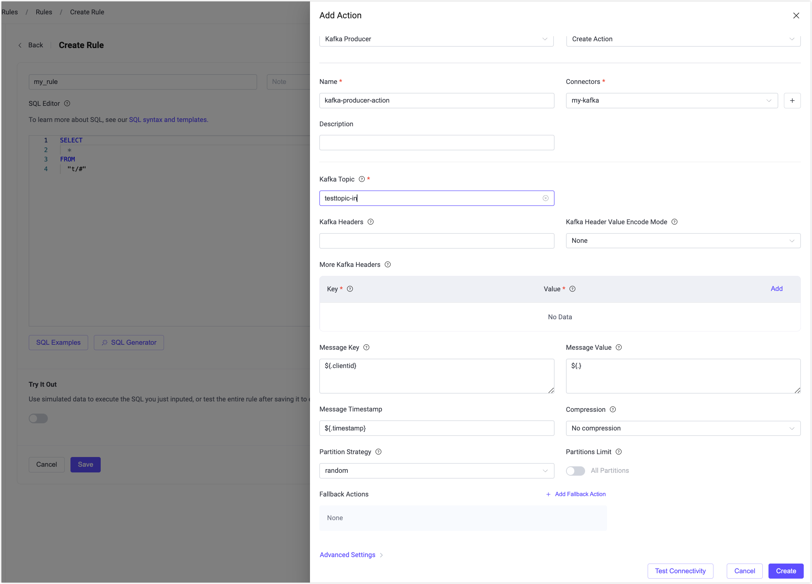
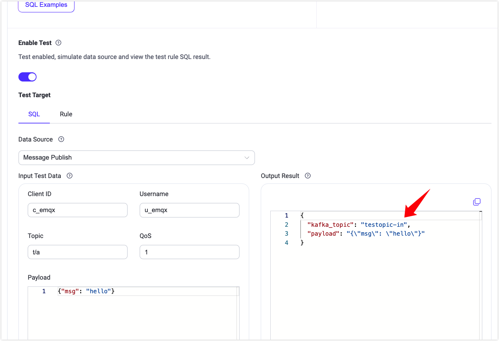
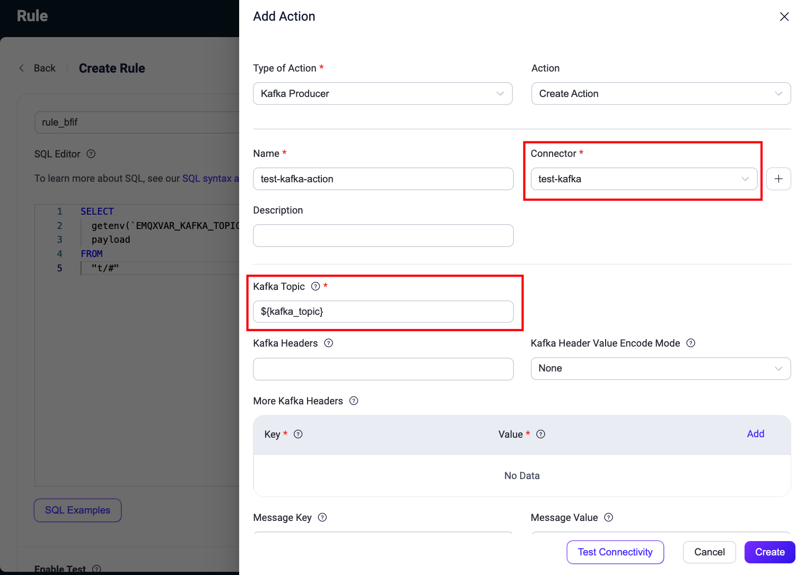
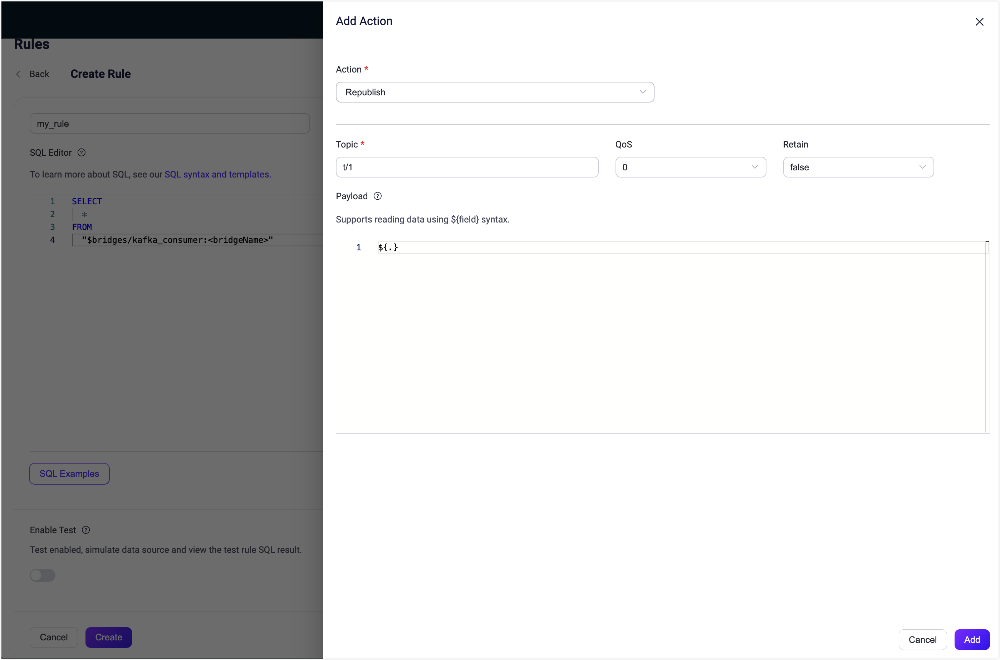

# Apache KafkaへのMQTTデータストリーミング

[Apache Kafka](https://kafka.apache.org/)は、高スループットかつリアルタイムのデータ処理を目的とした、広く利用されているオープンソースの分散イベントストリーミングプラットフォームです。しかし、Kafkaクライアントは安定したネットワーク接続と高いシステムリソースを必要とするため、エッジIoT通信には適していません。IoTシナリオでは、デバイスが軽量なMQTTプロトコルを使用して、不安定なネットワーク上でも効率的にデータを送信することが一般的です。

EMQXはMQTTとKafka/[Confluent](https://www.confluent.io/)を統合し、IoTデバイスとバックエンドシステム間のシームレスなデータストリーミングを実現します。MQTTメッセージはKafkaトピックに取り込まれ、リアルタイム処理、保存、分析に活用される一方で、KafkaトピックからのデータはMQTTクライアントに配信され、タイムリーなアクションをトリガーできます。


本ページでは、EMQXとKafkaのデータ統合について紹介し、統合の作成と検証手順を段階的に解説します。

## 動作概要

Apache Kafkaとのデータ統合はEMQXの組み込み機能であり、MQTTベースのIoTデータをKafkaにストリーミングして下流処理や分析を可能にします。組み込みの[ルールエンジン](./rules.md)を活用することで、カスタムコードなしにデータのフィルタリング、変換、ルーティングが可能です。

以下の図は、自動車IoTシナリオにおける典型的なEMQX–Kafka統合アーキテクチャを示しています。


<!-- 将数据流入或流出 Apache Kafka 需要分别创建 Kafka Sink（向 Kafka 发送消息）和 Kafka Source（从 Kafka 接收消息）。以 Sink 为例，其工作流程如下： -->

Apache Kafkaへのデータの流入または流出には、Kafka Sink（Kafkaへメッセージを送信）またはKafka Source（Kafkaからメッセージを受信）を作成します。以下はKafka Sinkのワークフローです。

1. **メッセージ取り込み**: 車両に接続されたIoTデバイスはEMQXにMQTT接続を確立し、定期的に状態データを含むメッセージをパブリッシュします。EMQXがメッセージを受信すると、ルールエンジンでルールマッチングを開始します。
2. **ルールベース処理**: マッチしたルールは、定義された通りにペイロードのフィルタリング、変換、または拡充を行います。
3. **Kafkaへのデータ転送**: ルールエンジンで定義されたルールがKafkaへの転送アクションをトリガーします。Kafka Sinkを使用してMQTTトピックを事前定義されたKafkaトピックにマッピングし、処理済みのメッセージとデータをKafkaトピックに書き込みます。

Kafkaにデータが取り込まれた後は、以下のように複数の方法で消費および処理できます。

- バックエンドサービスがKafkaトピックからリアルタイムデータストリームを直接消費。
- Kafka Streamsを用いたリアルタイム集計、相関分析、解析。
- Kafka Connectを使い、MySQLやElasticsearchなどの外部システムへデータを転送し、保存やさらなる処理を実施。

## 特長とメリット

Apache Kafkaとのデータ統合は以下の特長とメリットを提供します。

- **信頼性の高い双方向IoTデータメッセージング**: EMQXは不安定なネットワーク環境下でもMQTTメッセージをKafkaに確実に転送し、バックエンドシステムからKafkaメッセージをMQTTクライアントに配信します。
- **ペイロード変換**: メッセージはKafkaに転送する前にSQLルールでフィルタリング、拡充、変換が可能です。
- **効果的なトピックマッピング**: MQTTトピックやユーザープロパティを柔軟にKafkaトピックやヘッダーにマッピングでき、1対1、1対多、ワイルドカードベースのマッピングに対応します。
- **柔軟なパーティション選択戦略**: MQTTトピックやクライアントに基づき、同一Kafkaパーティションへメッセージを転送可能です。
- **高スループット処理**: 同期・非同期のKafka書き込みをサポートし、レイテンシとスループットのバランスをワークロードに応じて調整できます。
- **ランタイムメトリクス**: 各SinkおよびSourceの総メッセージ数、成功/失敗数、現在のレートなどの実行時メトリクスを閲覧可能です。
- **動的設定**: ダッシュボードまたは設定ファイルからSinkおよびSourceの動的設定が可能です。

これらの機能により、効率的なデータ取り込みと管理を備えたスケーラブルでレジリエントなIoTデータプラットフォームの構築が可能となります。

## はじめる前に

このセクションでは、EMQXダッシュボードでKafka SinkおよびSourceを作成する前に必要な準備について説明します。

### 前提条件

- EMQXのデータ統合[ルール](./rules.md)の知識
- [データ統合](./data-bridges.md)の知識

### Kafkaサーバーのセットアップ

ここではmacOSを例にインストール手順を示します。以下のコマンドでKafkaをインストール・起動できます。

```bash
wget https://archive.apache.org/dist/kafka/3.3.1/kafka_2.13-3.3.1.tgz

tar -xzf  kafka_2.13-3.3.1.tgz

cd kafka_2.13-3.3.1

# KRaftモードでKafkaを起動
KAFKA_CLUSTER_ID="$(bin/kafka-storage.sh random-uuid)"

bin/kafka-storage.sh format -t $KAFKA_CLUSTER_ID -c config/kraft/server.properties

bin/kafka-server-start.sh config/kraft/server.properties
```

詳細な手順は[Kafkaドキュメントのクイックスタート](https://kafka.apache.org/41/getting-started/quickstart/)をご参照ください。

### Kafkaトピックの作成

EMQXでデータ統合を作成する前に、関連するKafkaトピックを作成してください。以下のコマンドでSink用の`testtopic-in`とSource用の`testtopic-out`の2つのトピックを作成します。

```bash
bin/kafka-topics.sh --create --topic testtopic-in --bootstrap-server localhost:9092

bin/kafka-topics.sh --create --topic testtopic-out --bootstrap-server localhost:9092
```

## Kafkaプロデューサーコネクターの作成

Kafka Sinkアクションを追加する前に、EMQXとKafka間の接続を確立するためにKafkaプロデューサーコネクターを作成します。

1. EMQXダッシュボードで **Integration** -> **Connector** を開きます。

2. 画面右上の **Create** をクリックし、コネクター選択ページで **Kafka Producer** を選択して **Next** をクリックします。

3. 名前と説明を入力します。例：`my-kafka`。名前はKafka Sinkとコネクターを紐付けるために使用され、クラスター内で一意である必要があります。

4. Kafka接続に必要なパラメータを設定します：
   - **Bootstrap Hosts**: `127.0.0.1:9092` を入力します。デモではEMQXとKafkaをローカルで実行している前提です。リモート環境の場合は適宜設定を調整してください。

   - **認証**: Kafkaクラスターの認証方式を選択します。以下の方式がサポートされています：

     - `None`: 認証なし。
     - `AWS IAM for MSK`: Amazon EC2上にデプロイされたEMQXがAmazon MSKクラスターに接続する場合に使用。
     - `OAuth`: OAuth 2.0ベースの認証で、OAuthまたはOIDCをサポートするKafkaクラスターに接続。
     - `Basic Auth`: ユーザー名とパスワードを使用。メカニズムは`plain`、`scram_sha_256`、`scram_sha_512`から選択。
     - `Kerberos`: Kerberos (GSSAPI)認証。Kerberosプリンシパルとキータブファイルの指定が必要。

     詳細は[認証方式](#authentication-method)を参照してください。

   - 暗号化接続を確立する場合は、**Enable TLS**のトグルをオンにします。TLS接続については[外部リソースアクセスのTLS](../network/overview.md#tls-for-external-resource-access)を参照してください。

   - **詳細設定**（任意）：[詳細設定](#advanced-configurations)を参照。

5. **Create**をクリックする前に、**Test Connection**でKafkaサーバーへの接続テストが可能です。

6. **Create**をクリックし、コネクターの作成を完了します。

作成後、コネクターは自動的にKafkaに接続します。次に、このコネクターを基にルールを作成し、Kafkaクラスターへのデータ転送を設定します。

### 認証方式

EMQXでKafkaコネクターを作成する際、Kafkaクラスターのセキュリティ設定に応じて以下の認証方式を選択できます。

- **None**: 認証なし。

- **MSK IAM**: Amazon EC2上にデプロイされたEMQXがAmazon MSKクラスターに接続する場合に使用。

  この方式は、EC2インスタンスのメタデータサービスを利用して、IAMポリシーに基づく認証トークンを生成します。

  ::: tip 重要

  MSK IAM認証は、EMQXがEC2インスタンス上で実行され、MSKクラスターに接続する場合のみサポートされます。これはEC2インスタンスメタデータサービスに依存しているためです。

  `iptables`や`nftables`でホストレベルのイグレスフィルタリングを行う場合、`169.254.169.254`へのアクセスをブロックしないでください。EMQXはMSK IAM認証に必要な認証情報を取得するためにインスタンスメタデータサービスにアクセスする必要があります。同様の例外は、S3、S3 Tables、DynamoDB、KinesisなどのAWSベースの他のコネクターにも適用されます。[ルールエンジンポリシーとファイアウォールルールによるSSRF緩和](../deploy/cluster/security.md#mitigate-ssrf-with-rule-engine-policy-and-firewall-rules)を参照してください。

  :::

- **OAuth**: OAuth 2.0ベースの認証で、OAuthまたはOIDCをサポートするKafkaクラスター（Confluent CloudやOAuth有効なセルフマネージドKafkaなど）に接続します。

  EMQXはOAuth 2.0クライアントとして動作し、OAuth認可サーバーから定期的にアクセストークンを取得し、SASL/OAUTHBEARERメカニズムでKafkaブローカーに認証します。

  必須項目：

  - **OAuth Grant Type**: アクセストークン取得に使用するOAuth 2.0のグラントタイプ（現在は`client_credentials`のみ対応）。
  - **OAuth Token Endpoint URI**: トークン取得先のOAuth/OIDCプロバイダーのエンドポイント。
  - **OAuth Client ID**: OAuth認可サーバーに登録されたクライアントID。
  - **OAuth Client Secret**: トークン取得時に使用するクライアントシークレット。
  - **OAuth Request Scope**: （任意）トークンリクエストに含めるスコープ。
  - **SASL Extensions**: （高度な設定、任意）Confluent Cloudなど一部Kafkaプロバイダーが要求するメタデータ（例：`logicalCluster`、`identityPoolId`）をSASL拡張として送信。

  Confluent CloudにおけるOAuth/OIDC認証の詳細は[公式ドキュメント](https://docs.confluent.io/cloud/current/security/authenticate/workload-identities/identity-providers/oauth/overview.html)を参照してください。

- **Basic Auth**: ユーザー名とパスワードによる認証。

  必須項目：
  - **Mechanism**: `plain`、`scram_sha_256`、`scram_sha_512`から選択。
  - **Username**と**Password**: Kafkaクラスター認証用の資格情報。

- **Kerberos**: Kerberos GSSAPI認証。

  必須項目：
  - **Kerberos Principal**: 認証に使用するKerberosプリンシパル。
  - **Kerberos Keytab File**: 非対話認証用のキータブファイルパス。

  ::: tip 重要

  キータブファイルはすべてのEMQXノードで同一パスに配置し、EMQXサービスユーザーが読み取り権限を持つ必要があります。

  :::

## Kafka Sinkを用いたルール作成

このセクションでは、MQTTトピック`t/#`のメッセージを処理し、Kafka Sinkを使ってKafkaの`testtopic-in`トピックに送信するルールの作成方法を示します。

1. EMQXダッシュボードで **Integration** -> **Rules** を開きます。

2. 画面右上の **Create** をクリックします。

3. ルールIDを入力します。例：`my_rule`

4. **SQL Editor**に以下のステートメントを入力します。これはトピック`t/#`のMQTTメッセージをKafkaに転送する例です。

   注意：独自のSQL文を指定する場合は、Sinkで必要なすべてのフィールドが`SELECT`句に含まれていることを確認してください。

   ```sql
   SELECT
     *
   FROM
     "t/#"
   ```

   ::: tip

   初心者の方は、**SQL Examples**や**Try It Out**をクリックしてSQLルールを学習・テストできます。

   :::

   ::: tip

   EMQX v5.7.2からルールSQL内で環境変数を読み取る機能が追加されました。詳細は[ルールSQLで環境変数を使用する](#use-environment-variables)を参照してください。

   :::

5. **Create Rule**ページで + **Add Action** をクリックし、ルールの出力を定義します。

6. **Type of Action**ドロップダウンから`Kafka Producer`を選択します。

   **Action**ドロップダウンはデフォルトの`Create Action`のままにします。

   > 既存のSinkを選択することも可能ですが、本例では新規作成します。

7. **Name**と任意で**Description**を入力します。

8. **Connector**ドロップダウンから先ほど作成した`my-kafka`コネクターを選択します。必要に応じて新規作成も可能です。[Kafkaプロデューサーコネクターの作成](#create-a-kafka-producer-connector)を参照してください。

9. Sinkのデータ送信方法を設定します：

      - **Kafka Topic**: メッセージを送信するKafkaトピック。`testtopic-in`を入力します。EMQX v5.7.2以降は動的トピック設定もサポートしています。[変数テンプレートの使用](#use-variable-templates)を参照。
      - **Kafka Headers**: Kafkaメッセージに付加する任意のキー・バリュー形式のメタデータ。ヘッダー値はオブジェクトとして解決される必要があります。エンコード方法は**Kafka Header Value Encode Type**で選択可能。複数ヘッダーは**Add**で追加。
      - **Message Key**: Kafkaメッセージのキー。パーティション分散やメッセージ順序付けに使用。静的文字列または`${.clientid}`などのプレースホルダーを含められます。
      - **Message Value**: Kafkaメッセージのペイロード。テンプレートから生成され、静的文字列または`${.}`などのプレースホルダーを使ってルールコンテキストから動的に生成可能。テンプレートが`NULL`（例：参照フィールドが存在しない場合）になると、空文字列ではなくKafkaの`NULL`値が送信されます。
      - **Message Timestamp**: Kafkaメッセージのタイムスタンプ。固定値または`${timestamp}`などのプレースホルダーで動的に設定可能。
      - **Partition Strategy**: メッセージをKafkaパーティションに分配する方法を選択。
      - **Partitions Limit**: プロデューサーがメッセージを送信する最大パーティション数を制限。有効時は指定数のパーティション間のみで分配。
      - **Compression**: Kafkaメッセージの圧縮/解凍に使用するアルゴリズムを指定。

10. **フォールバックアクション**（任意）：メッセージ配信失敗時の信頼性向上のため、1つ以上のフォールバックアクションを定義可能です。詳細は[フォールバックアクション](./data-bridges.md#fallback-actions)を参照してください。

11. **詳細設定**（任意）：[詳細設定](#advanced-configuration)を参照。

12. **Create**をクリックしてSinkの作成を完了します。作成後、**Create Rule**ページに戻り、新規Sinkがルールアクションに追加されます。

13. **Create**をクリックしてルール作成を完了します。



これでルールが正常に作成され、**Integration** -> **Rules**ページで新規ルールを確認でき、**Actions(Sink)**タブで新規KafkaプロデューサーSinkも確認できます。

また、**Integration** -> **Flow Designer**でトポロジーを表示可能です。トポロジーを通じて、トピック`t/#`のメッセージがルール`my_rule`で解析されKafkaに送信・保存されている様子を直感的に把握できます。

### Kafkaの動的トピック設定

EMQX v5.7.2以降、KafkaプロデューサーSink設定で環境変数や変数テンプレートを用いてKafkaトピックを動的に設定できます。本節ではこれら2つのユースケースを紹介します。

#### 環境変数の使用

EMQX v5.7.2では、ルールSQL処理中に[環境変数](../configuration/configuration.md#environment-variables)から値を動的に取得してフィールドに設定する機能が追加されました。この機能はルールエンジンの組み込みSQL関数[getenv](../data-integration/rule-sql-builtin-functions.md#system-function)を利用し、EMQXの環境変数を取得します。取得した値はSQL処理結果に設定されます。

この機能の応用例として、Kafka SinkルールアクションのKafkaトピック設定にルール出力結果のフィールドを参照してトピックを設定できます。以下はそのデモです。

::: tip 注意

ルールエンジンで使用する環境変数名は、他のシステム環境変数の漏洩を防ぐために固定プレフィックス`EMQXVAR_`を付ける必要があります。例えば、`getenv`関数で`KAFKA_TOPIC`を読み取る場合、環境変数名は`EMQXVAR_KAFKA_TOPIC`と設定してください。

:::

1. Kafkaを起動し、`testtopic-in`トピックを事前作成します。[はじめる前に](#before-you-start)を参照。

2. EMQXを起動し、環境変数を設定します。zipインストールの場合は起動時に直接指定可能です。例：Kafkaトピック`testtopic-in`を環境変数`EMQXVAR_KAFKA_TOPIC`に設定。

   ```bash
   EMQXVAR_KAFKA_TOPIC=testtopic-in bin/emqx start
   ```

3. コネクターを作成します。[Kafkaプロデューサーコネクターの作成](#create-a-kafka-producer-connector)を参照。

4. Kafka Sinkルールを設定し、**SQL Editor**に以下を入力します。

   ```sql
   SELECT
     getenv('KAFKA_TOPIC') as kafka_topic,
     payload
   FROM
     "t/#"
   ```

   

5. SQLテストを有効化し、環境変数`testtopic-in`が正常に取得できることを確認します。

   

6. KafkaプロデューサーSinkにアクションを追加します。ルールの右側**Action Outputs**で**Add Action**をクリック。

   - **Connector**: 先ほど作成したコネクター`test-kafka`を選択。
   - **Kafka Topic**: SQLルール出力に基づき、変数テンプレート形式`${kafka_topic}`で設定。

   

7. [Kafka Sinkを用いたルール作成](#create-a-rule-with-kafka-sink)を参照し、追加設定を完了して**Create**をクリックしルール作成を完了。

8. [Kafkaプロデューサールールのテスト](#test-kafka-producer-rule)の手順に従い、Kafkaにメッセージを送信します。

   ```bash
   mqttx pub -h 127.0.0.1 -p 1883 -i pub -t t/Connection -q 1 -m 'payload string'
   ```

   Kafkaトピック`testtopic-in`でメッセージを受信できるはずです。

   ```bash
   bin/kafka-console-consumer.sh --bootstrap-server 127.0.0.1:9092 \
     --topic testtopic-in
   
   {"payload":"payload string","kafka_topic":"testtopic-in"}
   {"payload":"payload string","kafka_topic":"testtopic-in"}
   ```

#### 変数テンプレートの使用

**Kafka Topic**フィールドに静的なトピック名を設定する以外に、変数テンプレートを使用して動的にトピック名を生成することも可能です。これにより、メッセージ内容に基づいたKafkaトピックの構築が可能となり、柔軟なメッセージ処理と振り分けが実現します。例えば、`device-${payload.device}`のように指定すると、特定デバイスからのメッセージを`device-1`などデバイスIDをサフィックスに持つトピックに簡単に送信できます。

この例では、Kafkaに送信するメッセージペイロードに`device`キーが含まれている必要があります。以下は例です。

```json
{
    "topic": "t/devices/data",
    "payload": {
        "device": "1",
        "temperature": 25.6,
        "humidity": 60.2
    }
}
```

このキーが存在しない場合、トピックのレンダリングに失敗し、回復不能なメッセージドロップが発生します。

また、Kafka側で`device-1`、`device-2`などレンダリングされるすべてのトピックを事前作成しておく必要があります。存在しないトピック名が生成されると、同様にメッセージは回復不能なエラーでドロップされます。

## Kafkaプロデューサールールのテスト

Kafkaプロデューサールールが期待通り動作するかをテストするために、[MQTTX](https://mqttx.app/en)を使ってEMQXにMQTTメッセージをパブリッシュするクライアントをシミュレートできます。

1. MQTTXでトピック`t/1`にメッセージを送信します。

```bash
mqttx pub -i emqx_c -t t/1 -m '{ "msg": "Hello Kafka" }'
```

2. **Actions(Sink)**ページでSink名をクリックし、統計情報を確認します。Sinkの稼働状況に新規の受信メッセージ数と送信メッセージ数が1件ずつ増えているはずです。

3. 以下のコマンドで`testtopic-in`トピックにメッセージが書き込まれているか確認します。

   ```bash
   bin/kafka-console-consumer.sh --bootstrap-server 127.0.0.1:9092  --topic testtopic-in
   ```

<!--TODO 5.4 refactor-->

## Kafkaコンシューマーコネクターの作成

Kafka Sourceアクションを追加する前に、EMQXとKafka間の接続を確立するKafkaコンシューマーコネクターを作成します。

1. EMQXダッシュボードで **Integration** -> **Connector** を開きます。

2. 画面右上の **Create** をクリックします。

3. **Create Connector**ページで **Kafka Consumer** を選択し、**Next**をクリックします。

4. ソースの名前を入力します。英数字の組み合わせで、例：`my-kafka-source`。

5. ソースの接続情報を入力します。
   - **Bootstrap Hosts**: `127.0.0.1:9092` を入力します。デモはローカル実行前提です。リモート環境の場合は適宜調整してください。

   - **認証**: Kafkaクラスターの認証方式を選択します。以下がサポートされています：

     - `None`: 認証なし。
     - `authentication_msk_iam`: EC2上のEMQXがAWS MSKクラスターに接続する場合に使用。
     - `OAuth`: [OAuth 2.0](https://oauth.net/2/)認証。
     - `Basic Auth`: **Mechanism**（`plain`、`scram_sha_256`、`scram_sha_512`）の選択と**Username**、**Password**の入力が必要。
     - `Kerberos`: **Kerberos Principal**と**Kerberos Keytab File**の指定が必要。

     詳細は[認証方式](#authentication-method)を参照。

   - 暗号化接続を確立する場合は**Enable TLS**をオンにします。詳細は**外部リソースアクセスのTLS**を参照。

   - **詳細設定**（任意）：[詳細設定](#advanced-configuration)を参照。

6. **Create**をクリックする前に、**Test Connection**でKafkaサーバーへの接続テストが可能です。

11. **Create**をクリックします。関連するルールの作成オプションが表示されます。[KafkaコンシューマーSourceを用いたルール作成](#create-a-rule-with-kafka-consumer-source)を参照してください。

## KafkaコンシューマーSourceを用いたルール作成

このセクションでは、設定済みのKafkaコンシューマーSourceから転送されたメッセージをEMQXでさらに処理し、MQTTトピックに再パブリッシュするルールの作成方法を示します。

### ルールSQLの作成

1. EMQXダッシュボードで **Integration** -> **Rules** を開きます。

2. 画面右上の **Create** をクリックします。

3. ルールIDを入力します。例：`my_rule`

4. Kafkaソース`$bridges/kafka_consumer:<sourceName>`から変換されたメッセージをEMQXに転送する場合、**SQL Editor**に以下を入力します。

   注意：独自のSQL文を指定する場合は、後の再パブリッシュアクションで必要なすべてのフィールドが`SELECT`句に含まれていることを確認してください。Kafka Sourceの`SELECT`句では`ts_type`、`topic`、`ts`、`event`、`headers`、`key`、`metadata`、`value`、`timestamp`、`offset`、`node`などのフィールドが利用可能です。

   ```sql
   SELECT
     *
   FROM
     "$bridges/kafka_consumer:<sourceName>"
   ```

   注意：初心者の方は**SQL Examples**や**Enable Test**をクリックしてSQLルールを学習・テストできます。

### KafkaコンシューマーSourceをデータ入力に追加

1. ルール作成ページ右側の**Data Inputs**タブを選択し、**Add Input**をクリック。

2. **Input Type**ドロップダウンから**Kafka Consumer**を選択。**Source**ドロップダウンはデフォルトの`Create Source`のままか、既存のKafkaコンシューマーSourceを選択可能。本例では新規作成してルールに追加。

3. ソースの名前と説明を入力。

4. **Connector**ドロップダウンから先ほど作成した`my-kafka-consumer`コネクターを選択。隣のボタンから新規コネクター作成も可能。[Kafkaコンシューマーコネクターの作成](#create-a-kafka-consumer-connector)を参照。

5. 以下の項目を設定：

   - **Kafka Topic**: コンシューマーソースが購読するKafkaトピック。
   - **Group ID**: このソースのコンシューマーグループID。未指定の場合はソース名に基づき自動生成。
   - **Key Encoding Mode**と**Value Encoding Mode**: Kafkaメッセージのキーと値のエンコード方式を選択。

7. **Offset Reset Policy**: コンシューマーがKafkaトピックパーティションのどこから読み始めるかのポリシー。

   - `latest`: コンシューマー開始時点の最新オフセットから読み始め、開始前のメッセージはスキップ。
   - `earliest`: パーティションの先頭から読み始め、開始前のメッセージも含めてすべての履歴データを読む。

8. **詳細設定**（任意）：[詳細設定](#advanced-configuration)を参照。

9. **Create**をクリックする前に、**Test Connectivity**でKafkaサーバーへの接続テストが可能。

10. **Create**をクリックしてソース作成を完了。ルール作成ページの**Data Inputs**タブに新規ソースが表示されます。

### 再パブリッシュアクションの追加

1. **Action Outputs**タブを選択し、+ **Add Action**をクリックしてルールトリガー時のアクションを定義。

2. **Type of Action**ドロップダウンから**Republish**を選択。

3. **Topic**と**Payload**フィールドに再パブリッシュしたいメッセージのトピックとペイロードを入力。例：`t/1`と`${.}`。

   - **Topic**フィールドには`${}`を使って動的にMQTTトピックを指定可能。例：`t/${key}`（`${}`内のパラメータはSQLの`SELECT`句に含める必要あり）。

4. **Add**をクリックしてアクションをルールに追加。

5. ルール作成ページに戻り、**Save**をクリック。



## Kafka Sourceルールのテスト

Kafka Sourceとルールが期待通り動作するかをテストするために、[MQTTX](https://mqttx.app/)でEMQXのトピックをサブスクライブし、KafkaプロデューサーでKafkaトピックにデータを生成します。EMQXがKafkaからのデータをサブスクライブトピックに再パブリッシュするか確認します。

1. MQTTXでトピック`t/1`をサブスクライブします。

   ```bash
   mqttx sub -t t/1 -v
   ```

2. 新しいコマンドラインを開き、以下のコマンドでKafkaプロデューサーを起動。

   ```bash
   bin/kafka-console-producer --bootstrap-server 127.0.0.1:9092 --topic testtopic-out
   ```

   メッセージ入力待ちになります。

3. `{"msg": "Hello EMQX"}`を入力し、`testtopic-out`トピックにメッセージを生成してEnter。

4. MQTTXのサブスクリプションでKafkaからの以下のメッセージを受信できるはずです。

   ```json
   {
       "value": "{\"msg\": \"Hello EMQX\"}",
       "ts_type": "create",
       "ts": 1679665968238,
       "topic": "testtopic-out",
       "offset": 2,
       "key": "key",
       "headers": {
           "header_key": "header_value"
       }
   }
   ```

## 詳細設定

このセクションでは、データ統合のパフォーマンス最適化や特定シナリオに応じたカスタマイズのための詳細設定オプションを説明します。コネクター、Sink、Source作成時に**Advanced Settings**を展開し、以下の設定をビジネス要件に応じて調整可能です。

| 項目名                                  | 説明                                                         | 推奨値             |
| --------------------------------------- | ------------------------------------------------------------ | ------------------ |
| Allow Auto Topic Creation               | （プロデューサーコネクターのみ）有効にすると、クライアントがメタデータフェッチ要求時に存在しないKafkaトピックを自動作成可能。 | `disabled`         |
| Min Metadata Refresh Interval           | クライアントがKafkaブローカーやトピックのメタデータを更新する最小間隔。小さすぎるとKafkaサーバーへの負荷が増加。 | `3`秒              |
| Metadata Request Timeout                | ブリッジがKafkaからメタデータを要求する最大待機時間。             | `5`秒              |
| Connect Timeout                         | TCP接続確立の最大待機時間（認証時間含む）。                      | `5`秒              |
| Max Wait Time (Source)                  | Kafkaブローカーからのフェッチ応答を待つ最大時間。                 | `1`秒              |
| Fetch Bytes (Source)                    | Kafkaからのフェッチ要求で取得するバイト数。設定値がメッセージサイズ未満だとフェッチ性能に悪影響。 | `896` KB           |
| Max Batch Bytes (Sink)                  | Kafkaバッチ内で収集するメッセージの最大サイズ（バイト）。Kafkaブローカーのデフォルトは1MBだが、EMQXはメッセージエンコードのオーバーヘッドを考慮し若干小さめに設定。単一メッセージが上限超過の場合は別バッチで送信。 | `896` KB           |
| Offset Commit Interval (Source)         | コンシューマーグループごとにオフセットコミット要求を送る間隔。     | `5`秒              |
| Required Acks (Sink)                    | Kafkaパーティションリーダーがフォロワーから待つアックの種類：<br />`all_isr`: 全てのインシンクレプリカからのアック。<br />`leader_only`: リーダーのみ。<br />`none`: アック不要。 | `all_isr`          |
| Partition Count Refresh Interval (Source) | Kafkaプロデューサーがパーティション数増加を検知する間隔。増加検知後、`partition_strategy`に基づき新パーティションにメッセージを分配。 | `60`秒             |
| Max Inflight (Sink)                     | Kafkaプロデューサーがアック受信前に送信可能な最大バッチ数（パーティション単位）。大きいほどスループット向上。ただし1超過時はメッセージ順序が乱れるリスクあり。 | `10`               |
| Query Mode (Source)                     | 非同期/同期モードを選択し、メッセージ送信を最適化。非同期はKafka書き込みがMQTTパブリッシュをブロックしないが、クライアントがKafka到着前にメッセージを受信する可能性あり。 | `Async`            |
| Synchronous Query Timeout (Sink)        | 同期モード時の最大待機時間。メッセージ送信完了をタイムリーに保証。<br />`Sync`モード時のみ適用。 | `5`秒              |
| Buffer Mode (Sink)                      | メッセージ送信前のバッファリング方式。メモリバッファリングは送信速度向上。<br />`memory`: メモリ上にバッファ。EMQX再起動でメッセージ消失。<br />`disk`: ディスク上にバッファ。再起動後もメッセージ保持。<br />`hybrid`: 初期はメモリバッファ。一定容量超過時に段階的にディスクへオフロード。メモリモード同様、再起動でメッセージ消失。 | `memory`           |
| Per-partition Buffer Limit (Sink)       | Kafkaパーティションごとの最大バッファサイズ（バイト）。上限到達時は古いメッセージを破棄しバッファ空間を確保。メモリ使用量と性能のバランス調整に有効。 | `2` GB             |
| Segment File Bytes (Sink)               | バッファモードが`disk`または`hybrid`時に適用。メッセージ保存用セグメントファイルのサイズ。ディスクストレージ最適化に影響。 | `100` MB           |
| Memory Overload Protection (Sink)       | バッファモードが`memory`時に適用。メモリ圧迫時に古いバッファメッセージを自動破棄し、システム安定性を確保。Linuxのみ有効。 | `Enabled`          |
| Socket Send / Receive Buffer Size       | ソケットバッファサイズを管理しネットワーク送信性能を最適化。        | `1024` KB          |
| TCP Keepalive                         | Kafkaブリッジ接続のTCPキープアライブ設定。長時間のアイドル状態による接続切断を防止。値は`Idle, Interval, Probes`の3つの数値のカンマ区切り。<br />Idle: サーバーがキープアライブプローブを開始するまでのアイドル秒数（Linuxデフォルト7200秒）。<br />Interval: 各キープアライブプローブ間の秒数（Linuxデフォルト75秒）。<br />Probes: 応答なしと判断するまでの最大プローブ送信回数（Linuxデフォルト9回）。<br />例：`240,30,5`は240秒アイドル後にプローブ開始、30秒間隔で最大5回送信し応答なしなら接続切断。 | `none`             |
| Max Linger Time                       | パーティション単位のプロデューサーがバッチ収集のためにメッセージを待つ最大時間。デフォルト`0`は待機なし。メモリ以外のバッファモードで`5ms`に設定するとIOPSが大幅減少するがレイテンシ増加。 | `0`ミリ秒          |
| Max Linger Bytes                      | パーティション単位のプロデューサーがバッチ収集のためにメッセージを待つ最大バイト数。 | `10` MB            |
| Health Check Interval                 | コネクターの稼働状況チェック間隔。                              | `15`秒             |

## 参考情報

EMQXはApache Kafkaとのデータ統合に関して多数の学習リソースを提供しています。以下のリンクから詳細をご覧ください。

**ブログ:**

- [MQTTとKafkaでつなぐコネクテッドビークルのストリーミングデータパイプライン：3分ガイド](https://www.emqx.com/en/blog/building-connected-vehicle-streaming-data-pipelines-with-mqtt-and-kafka)
- [MQTTとKafka：IoTデータ統合を強化する](https://www.emqx.com/en/blog/mqtt-and-kafka)
- [MQTTパフォーマンスベンチマークテスト：EMQX-Kafka統合](https://www.emqx.com/en/resources/emqx-enterprise-performance-benchmark-testing-kafka-integration)

**ベンチマークレポート:**

- [EMQX Enterpriseパフォーマンスベンチマークテスト：Kafka統合](https://www.emqx.com/en/resources/emqx-enterprise-performance-benchmark-testing-kafka-integration)

**動画:**

- [EMQX Cloudルールエンジンを使ったデバイスデータのKafkaブリッジ](https://www.emqx.com/en/resources/bridge-device-data-to-kafka-using-the-emqx-cloud-rule-engine)（Cloudルールエンジンに関する動画で、将来的により適切な動画に差し替え予定）
