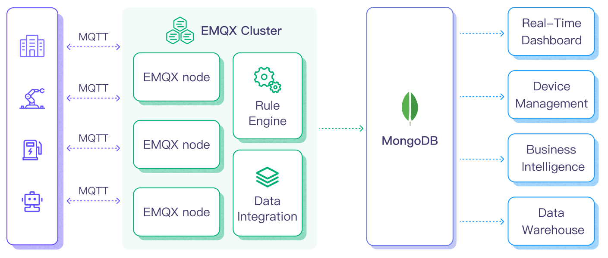

# MongoDBへのMQTTデータ取り込み

[MongoDB](https://www.mongodb.com/)は、スキーマ設計の柔軟性、スケーラビリティ、大量の構造化および半構造化データの保存能力で知られる主要なNoSQLデータベースです。EMQXとMongoDBを統合することで、ユーザーはMQTTメッセージやクライアントイベントを直接MongoDBに効率的に取り込むことができます。これにより、MongoDB内での長期的な時系列データの保存や高度なクエリ機能が可能になります。この統合は一方向のデータフローを保証し、EMQXからのMQTTメッセージがMongoDBデータベースに書き込まれます。この強力な組み合わせは、IoTデータを効果的に管理したい企業にとって堅実な基盤となります。

本ページでは、EMQXとMongoDB間のデータ統合について包括的に紹介し、データ統合の作成および検証に関する実践的な手順を提供します。

## 動作概要

<<<<<<< HEAD
MongoDBデータ統合は、MQTTベースのIoTデータとMongoDBの強力なデータ保存機能をつなぐためにEMQXに標準搭載された機能です。組み込みの[ルールエンジン](./rules.md)コンポーネントにより、EMQXからMongoDBへのデータ取り込みを簡素化し、複雑なコーディングを不要にします。
=======
MongoDBデータ統合は、MQTTベースのIoTデータとMongoDBの強力なデータ保存機能をつなぐためにEMQXに標準搭載された機能です。組み込みの[ルールエンジン](./rules.md)コンポーネントにより、EMQXからMongoDBへのデータ取り込みプロセスが簡素化され、複雑なコーディングを不要にします。
>>>>>>> origin/release-5.10

以下の図は、EMQXとMongoDB間のデータ統合の典型的なアーキテクチャを示しています。



MongoDBへのMQTTデータ取り込みは以下のように動作します：

<<<<<<< HEAD
1. **メッセージのパブリッシュと受信**：接続された車両、IIoTシステム、エネルギー管理プラットフォームなどのIoTデバイスは、MQTTプロトコルを介してEMQXに正常に接続し、特定のトピックにMQTTメッセージをパブリッシュします。EMQXがこれらのメッセージを受信すると、ルールエンジン内でマッチング処理を開始します。
2. **メッセージデータの処理**：メッセージが到着すると、ルールエンジンを通過し、EMQXで定義されたルールによって処理されます。ルールは事前定義された条件に基づき、MongoDBにルーティングすべきメッセージを判別します。ペイロード変換が指定されている場合は、データ形式の変換、特定情報のフィルタリング、ペイロードへの追加コンテキスト付加などの変換が適用されます。
3. **MongoDBへのデータ取り込み**：ルールエンジンがMongoDB保存対象のメッセージを特定すると、MongoDBへの転送アクションがトリガーされます。処理済みデータはMongoDBデータベースのコレクションにシームレスに書き込まれます。
4. **データの保存と活用**：データがMongoDBに保存されることで、企業はそのクエリ機能を活用して様々なユースケースに利用できます。例えば、接続車両分野では、車両の健康状態の把握、リアルタイム指標に基づくルート最適化、資産追跡などに活用できます。同様にIIoT環境では、機械の健康監視、メンテナンス予測、生産スケジュールの最適化に利用されます。

この統合システムを活用することで、電力・エネルギー分野の企業はグリッドの状態を継続的に監視し、需要予測や障害発生前の検知が可能になります。リアルタイムおよび履歴データから得られる価値は、運用効率の向上だけでなく、コスト削減や顧客体験の向上にもつながります。

## 特長と利点

MongoDBとのデータ統合は、効果的なデータ処理と保存を保証するために特化した多様な特長と利点を提供します：

- **IoTデータ管理の効率化**

  複雑な統合や面倒なデータ移行を排除し、IoTデータの取り込み、保存、処理、分析を一元的に行えます。データサイロを解消し、IoTデータの統合ビューを実現します。
=======
1. **メッセージのパブリッシュと受信**：接続された車両、IIoTシステム、エネルギー管理プラットフォームなどのIoTデバイスは、MQTTプロトコルを通じてEMQXに正常に接続し、特定のトピックにMQTTメッセージをパブリッシュします。EMQXがこれらのメッセージを受信すると、ルールエンジン内でマッチング処理を開始します。
2. **メッセージデータの処理**：メッセージが到着すると、ルールエンジンを通過し、EMQXで定義されたルールによって処理されます。ルールは事前定義された条件に基づき、どのメッセージをMongoDBにルーティングするかを決定します。ペイロード変換を指定するルールがある場合は、データ形式の変換、特定情報のフィルタリング、追加コンテキストによるペイロードの強化などの変換が適用されます。
3. **MongoDBへのデータ取り込み**：ルールエンジンがMongoDBへの保存対象メッセージを特定すると、MongoDBへの転送アクションがトリガーされます。処理済みデータはMongoDBデータベースのコレクションにシームレスに書き込まれます。
4. **データの保存と活用**：データがMongoDBに保存された後、企業はそのクエリ機能を活用して様々なユースケースに対応できます。例えば、接続車両分野では、保存されたデータを用いて車両の状態監視、リアルタイム指標に基づくルート最適化、資産追跡などが可能です。同様にIIoT環境では、機械の健康状態監視、メンテナンス予測、生産スケジュールの最適化などに利用されます。

この統合システムを利用することで、電力・エネルギー分野の企業はグリッドの状態を継続的に監視し、需要予測や潜在的な障害の早期発見が可能になります。リアルタイムおよび履歴データから得られる価値は、運用効率の向上だけでなく、コスト削減や顧客体験の向上にもつながります。

## 特長と利点

MongoDBとのデータ統合は、効果的なデータ処理と保存を実現するために設計された多彩な特長と利点を提供します：

- **IoTデータ管理の効率化**

  IoTデータの取り込み、保存、処理、分析を一元的に行え、複雑な統合や面倒なデータ移行を不要にします。データのサイロ化を解消し、IoTデータの統合ビューを実現します。
>>>>>>> origin/release-5.10
  
- **リアルタイムデータ処理**

  EMQXはリアルタイムデータストリームの処理に最適化されており、ソースシステムからMongoDBへの効率的かつ信頼性の高いデータ伝送を保証します。即時の洞察とアクションが求められるユースケースに理想的です。

- **柔軟なMongoDB接続オプション**

<<<<<<< HEAD
  単一のMongoDBインスタンスでもレプリカセットの堅牢性を活用する場合でも、ネイティブサポートを提供し、インフラ要件に応じて柔軟に対応可能です。
=======
  単一のMongoDBインスタンスでもレプリカセットでも、両方の構成にネイティブ対応しており、インフラ要件に応じて柔軟に適応可能です。
>>>>>>> origin/release-5.10

- **高性能とスケーラビリティ**

<<<<<<< HEAD
  EMQXの分散アーキテクチャとMongoDBのカラムナリーストレージ形式により、データ量の増加に伴うスムーズなスケーラビリティを実現します。大規模データセットでも一貫したパフォーマンスと応答性を維持し、IoT展開の拡大に合わせてストレージ能力を拡張可能です。

- **柔軟なデータ変換**

  EMQXの強力なSQLベースのルールエンジンにより、MongoDB保存前のデータ前処理が可能です。フィルタリング、ルーティング、集約、エンリッチメントなど多様な変換手法をサポートし、ニーズに応じたデータ整形を実現します。
=======
  EMQXの分散アーキテクチャとMongoDBのカラム型ストレージ形式により、データ量の増加に伴うシームレスなスケールアウトが可能です。大規模データセットでも一貫したパフォーマンスと応答性を維持します。IoT展開の拡大に合わせてデータ保存能力を容易に拡張できます。

- **柔軟なデータ変換**

  EMQXの強力なSQLベースのルールエンジンにより、MongoDBに保存する前にデータを前処理できます。フィルタリング、ルーティング、集約、強化など多様な変換機能をサポートし、ニーズに応じてデータを整形可能です。
>>>>>>> origin/release-5.10

- **NoSQL**

  MongoDBのスキーマレスアーキテクチャにより、多様なMQTTメッセージ構造を厳格なスキーマなしで容易に保存でき、IoTデータの動的な性質に対応します。

- **信頼性の高いデータ保存**

<<<<<<< HEAD
  EMQXルールエンジンがメッセージを処理・ルーティングした後、MongoDBに保存され、プラットフォームの実績ある信頼性によりデータ整合性と継続的な可用性が保証されます。

- **運用メトリクスと高度な分析**

  総メッセージ数、送信トラフィック率などのメトリクスを活用可能です。これらのメトリクスとMongoDBの強力なクエリ機能を組み合わせることで、データフローの監視、分析、最適化が可能となり、予測分析や異常検知などの価値ある洞察を得られます。
=======
  EMQXルールエンジンがメッセージを処理・ルーティングした後、MongoDBに保存され、プラットフォームの実績ある信頼性によりデータの整合性と継続的な可用性が保証されます。

- **運用メトリクスと高度な分析**

  総メッセージ数や送信トラフィックレートなどのメトリクスを取得可能です。これらのメトリクスとMongoDBの強力なクエリ機能を組み合わせて、データフローの監視、分析、最適化が行え、予測分析や異常検知などの高度な活用が可能になります。
>>>>>>> origin/release-5.10

- **最新MongoDBバージョン対応**

<<<<<<< HEAD
  データ統合は最新のMongoDBバージョンに対応しており、ユーザーは最新機能、最適化、セキュリティアップデートの恩恵を受けられます。

- **コスト効率**

  EMQXとMongoDBはともにオープンソースソリューションであり、商用ソリューションに比べてコスト効率が高いです。これにより、IoTプロジェクトの総所有コスト削減と投資収益率の向上に寄与します。

このMongoDBデータ統合は、デバイスから生成される膨大なデータを単に保存するだけでなく、将来的なクエリや分析に備えて準備することで、IoTインフラを強化します。セットアップの容易さと運用の卓越性は、IoTシステムの効率性と信頼性を大幅に向上させます。
=======
  最新のMongoDBバージョンに対応しており、ユーザーはデータベースプラットフォームの最新機能、最適化、セキュリティアップデートを享受できます。

- **コスト効率**

  EMQXとMongoDBは共にオープンソースソリューションであり、独自ソリューションと比べてコスト効率に優れています。これにより、IoTプロジェクトの総所有コストを削減し、投資対効果を向上させます。

このMongoDBデータ統合は、IoTインフラを強化し、デバイスから生成される膨大なデータを単に保存するだけでなく、将来的なクエリや分析に備えて準備します。セットアップの容易さと運用の優位性により、IoTシステムの効率性と信頼性を大幅に向上させます。
>>>>>>> origin/release-5.10

## はじめる前に

本節では、EMQXダッシュボードでMongoDBデータ統合を作成する前に必要な準備について説明します。

### 前提条件

- EMQXデータ統合の[ルール](./rules.md)に関する知識
- [データ統合](./data-bridges.md)に関する知識
- [MongoDB](https://www.mongodb.com/)に関する知識

### MongoDBサーバーのセットアップ

以下のコマンドを使用して、Docker経由でMongoDBをインストールし、Dockerイメージを起動し、ユーザーを作成できます。

```bash
# MongoDBのDockerイメージを起動し、パスワードをpublicに設定
docker run -d --name mongodb -p 27017:27017 mongo

# コンテナにアクセス
docker exec -it mongodb bash

<<<<<<< HEAD
# コンテナ内でMongoDBサーバーを起動（4.xバージョンでは `mongo` ではなく `mongosh` を使用）
=======
# コンテナ内のMongoDBサーバーに接続（4.x系の場合は`mongo`を使用）
>>>>>>> origin/release-5.10
mongosh

# ユーザー作成
use admin
db.createUser({ user: "admin", pwd: "public", roles: [ { role: "root", db: "admin" } ] })
```

### データベースの作成

以下のコマンドでMongoDBにデータベースとコレクションを作成できます。

```bash
# データベースemqx_dataを作成
use emqx_data

# コレクションemqx_messagesを作成
db.createCollection('emqx_messages')
```

## コネクターの作成

<<<<<<< HEAD
このセクションでは、MongoDB SinkをMongoDBサーバーに接続するためのコネクターの作成方法を示します。

以下の手順は、EMQXとMongoDBの両方をローカルマシンで実行していることを前提としています。MongoDBが別の場所にデプロイされている場合は、設定を適宜調整してください。

1. EMQXダッシュボードに入り、**Integration** -> **Connectors** をクリックします。
2. ページ右上の **Create** をクリックします。
3. **Create Connector** ページで **MongoDB** を選択し、**Next** をクリックします。
4. コネクターの名前を入力します。名前は大文字・小文字の英数字の組み合わせにしてください。例：`my_mongodb`
5. MongoDBサーバーの接続情報を設定します。必須項目（アスタリスク付き）を入力してください。

   - **MongoDB Mode**：実際のMongoDBのデプロイモードに応じて接続タイプを選択します。この例では `single` を選択します。
     - `single`：単一のスタンドアロンMongoDBインスタンス
     - `rs`：同じデータセットを維持する `mongod` プロセスのグループであるレプリカセット
=======
本節では、MongoDB SinkをMongoDBサーバーに接続するためのコネクター作成方法を説明します。

以下の手順は、EMQXとMongoDBをローカルマシンで実行していることを前提としています。MongoDBが別の環境にある場合は、設定を適宜調整してください。

1. EMQXダッシュボードに入り、**Integration** -> **Connectors**をクリックします。
2. ページ右上の**Create**をクリックします。
3. **Create Connector**ページで**MongoDB**を選択し、**Next**をクリックします。
4. コネクター名を入力します。名前は英数字の組み合わせとしてください（例：`my_mongodb`）。
5. MongoDBサーバーの接続情報を設定します。必須項目（＊印）を入力してください。

   - **MongoDB Mode**：実際のMongoDBの展開モードに応じて接続タイプを選択します。この例では`single`を選択します。
     - `single`：単一のMongoDBインスタンス
     - `rs`：同一データセットを維持する`mongod`プロセスのレプリカセット
>>>>>>> origin/release-5.10
     - `sharded`：MongoDBのシャーディングクラスター
   - **Server Host**：`127.0.0.1:27017` またはMongoDBサーバーがリモートの場合は実際のURLを入力
   - **Database Name**：`emqx_data` を入力
   - **Write Mode**：デフォルトの `unsafe` のまま
   - **Username**：`admin` を入力
   - **Password**：`public` を入力
   - **Auth Source**：ユーザー認証に使用するデータベース名を入力
<<<<<<< HEAD
   - **Use Legacy Protocol**：MongoDBのレガシー通信プロトコルを使用するかを設定（MongoDB 3.6で新しいワイヤープロトコルが導入され、レガシープロトコルは後方互換のために残されています）。`true`、`false`、`auto` のいずれかで設定可能。`auto`（デフォルト）では、EMQXがMongoDBのバージョンに基づき自動判別します。
   - **Srv Record**：デフォルトで無効。有効にすると、DNS SRVレコードを使用してMongoDBホストを自動検出し、レプリカセットやシャーディングクラスターへの接続が容易になります。
   - 暗号化接続を確立する場合は、**Enable TLS** のトグルをオンにします。TLS接続の詳細は[外部リソースアクセスのTLS](../network/overview.md/#tls-for-external-resource-access)を参照してください。
6. **フォールバックアクション（オプション）**：メッセージ配信失敗時の信頼性向上のため、1つ以上のフォールバックアクションを定義できます。詳細は[フォールバックアクション](./data-bridges.md#fallback-actions)を参照してください。
7. **詳細設定（オプション）**：詳細は[詳細設定](#advanced-configurations)を参照してください。
8. **Create**をクリックする前に、**Test Connectivity** をクリックしてコネクターがMongoDBサーバーに接続できるかテストできます。
9. ページ下部の **Create** ボタンをクリックしてコネクター作成を完了します。ポップアップダイアログで **Back to Connector List** または **Create Rule** を選択し、ルールとSinkの作成を続行できます。詳細は[ルールとMongoDB Sinkの作成](#create-a-rule-with-mongodb-sink)を参照してください。

## MongoDB Sinkを用いたルールの作成

このセクションでは、ソースMQTTトピック `t/#` からのメッセージを処理し、処理済みデータをMongoDBに保存するルールの作成方法をダッシュボードで説明します。
=======
   - **Use Legacy Protocol**：MongoDBの旧通信プロトコルを使用するかを設定（MongoDB 3.6で新ワイヤープロトコル導入、旧プロトコルは互換性維持のため残存）。`true`、`false`、`auto`のいずれかを選択可能。`auto`（デフォルト）ではMongoDBのバージョン検出に基づき自動判別します。
   - **Srv Record**：デフォルトで無効。有効にするとDNS SRVレコードを用いてMongoDBホストを自動検出し、レプリカセットやシャーディングクラスターへの接続が容易になります。
   - 暗号化接続を行う場合は、**Enable TLS**のトグルをオンにします。TLS接続の詳細は[外部リソースアクセスのTLS](../network/overview.md/#tls-for-external-resource-access)を参照してください。
6. **フォールバックアクション（任意）**：メッセージ配信失敗時の信頼性向上のため、1つ以上のフォールバックアクションを定義できます。詳細は[フォールバックアクション](./data-bridges.md#fallback-actions)を参照してください。
7. **詳細設定（任意）**：詳細は[高度な設定](#advanced-configurations)を参照してください。
8. **Create**をクリックする前に、**Test Connectivity**でMongoDBサーバーへの接続テストが可能です。
9. ページ下部の**Create**ボタンをクリックしてコネクター作成を完了します。ポップアップで**Back to Connector List**または**Create Rule**を選択できます。ルールとSinkの作成手順は[ルールとMongoDB Sinkの作成](#create-a-rule-with-mongodb-sink)を参照してください。

## MongoDB Sinkを用いたルールの作成

本節では、ダッシュボード上でMQTTトピック`t/#`からのメッセージを処理し、処理済みデータをMongoDBに保存するルールの作成方法を示します。
>>>>>>> origin/release-5.10

1. EMQXダッシュボードで **Integration** -> **Rules** をクリックします。

2. ページ右上の**Create**をクリックします。

<<<<<<< HEAD
3. ルールIDに `my_rule` を入力し、**SQL Editor** にルールを設定します。トピック `t/#` のMQTTメッセージをMongoDBに保存したい場合、以下のSQL構文を使用できます。

   注意：独自のSQL構文を指定する場合は、Sinkが必要とするすべてのフィールドを `SELECT` 部分に含めてください。
=======
3. ルールIDに`my_rule`を入力し、**SQL Editor**にルールを設定します。トピック`t/#`のMQTTメッセージをMongoDBに保存したい場合、以下のSQL文を使用できます。

   注意：独自のSQLを指定する場合は、Sinkが必要とするすべてのフィールドを`SELECT`句に含めてください。
>>>>>>> origin/release-5.10

   ```sql
   SELECT
     *
   FROM
     "t/#"
   ```

<<<<<<< HEAD
   例えば、`timestamp` を日時型として保存し、`payload` をJSON文字列として保存する場合は以下のSQL構文を使用できます：
=======
   例えば、`timestamp`を日時型として保存し、`payload`をJSON文字列として保存するには、以下のSQL文を使用します：
>>>>>>> origin/release-5.10

   ```sql
   SELECT
     *,
     mongo_date(timestamp) as timestamp,
     json_encode(payload) as payload
   FROM
     "t/#"
   ```

   注意：初心者の方は **SQL Examples** をクリックし、**Enable Test** を有効にしてSQLルールを学習・テストしてください。

<<<<<<< HEAD
4. + **Add Action** ボタンをクリックして、ルール発動時にトリガーされるアクションを定義します。このアクションにより、EMQXはルールで処理したデータをMongoDBに送信します。

5. **Type of Action** ドロップダウンリストから `MongoDB` を選択します。**Action** ドロップダウンはデフォルトの `Create Action` のままにします。既に作成済みのSinkがあれば選択可能ですが、この例では新規Sinkを作成します。

6. Sinkの名前を入力します。名前は大文字・小文字の英数字の組み合わせにしてください。

7. **Connector** ドロップダウンから `my_mongodb` を選択します。新規コネクターを作成する場合は、ドロップダウン横のボタンをクリックしてください。設定パラメータの詳細は[コネクターの作成](#create-a-connector)を参照してください。

8. **Collection** フィールドにデータを保存するコレクション名を入力します。プレースホルダー `${var_name}` を用いた動的設定も可能です。この例では `emqx_messages` と入力します。

9. **Payload template** を設定し、`clientid`、`topic`、`qos`、`timestamp`、`payload` をMongoDBに保存します。このテンプレートはMongoDBのinsertコマンドで実行され、サンプルコードは以下の通りです：
=======
4. + **Add Action**ボタンをクリックし、ルール発動時にトリガーされるアクションを定義します。このアクションにより、EMQXはルールで処理したデータをMongoDBに送信します。

5. **Type of Action**ドロップダウンから`MongoDB`を選択します。**Action**はデフォルトの`Create Action`のままにします。既に作成済みのSinkを選択することも可能ですが、本例では新規にSinkを作成します。

6. Sinkの名前を入力します。英数字の組み合わせにしてください。

7. **Connector**ドロップダウンから`my_mongodb`を選択します。新規コネクター作成はドロップダウン横のボタンから可能です。設定パラメータは[コネクターの作成](#create-a-connector)を参照してください。

8. **Collection**欄にデータ保存先のコレクション名を入力します。`${var_name}`のプレースホルダーによる動的設定もサポートしています。本例では`emqx_messages`を入力します。

9. **Payload template**を設定し、`clientid`、`topic`、`qos`、`timestamp`、`payload`をMongoDBに保存します。このテンプレートはMongoDBのinsertコマンドで実行され、サンプルコードは以下の通りです：
>>>>>>> origin/release-5.10

   ```json
   {
     "clientid": "${clientid}",
     "topic": "${topic}",
     "qos": ${qos},
     "timestamp": ${timestamp},
     "payload": ${payload}
   }
   ```

   ペイロードテンプレート設定時の注意点：

<<<<<<< HEAD
   - すべての `key` はダブルクォーテーション `"` で囲む必要があります。
=======
   - すべての`key`はダブルクォーテーション`"`で囲む必要があります。
>>>>>>> origin/release-5.10
   - 値のデータ型の自動判別はサポートされていません：
     - 文字列は `"` で囲む必要があります。囲まないとエラーになります。
     - 数値などは囲まないでください。囲むと文字列として認識されます。
<<<<<<< HEAD
     - timestamp、date、time型は特別な処理がない場合、数値型または文字列型として扱われます。日付や時刻として保存するには、ルールSQLの[MongoDBタイム関数](./rule-sql-builtin-functions.md#mongodb-time-functions)を使用してください。（注：これらの関数の戻り値はMongoDBアクション専用で、他のアクションでは使用できません。）
   
   - 値がJSONオブジェクトの場合はネストされたオブジェクトが許可されます：
     - テンプレート内で値を `"` で囲んでネストすることはできません。実行エラーになります。
     - オブジェクトは自身の構造に従ってネストされて保存されます。

   - オブジェクトをJSON文字列として保存する場合は、ルールSQLの `json_encode` 関数で変換し、テンプレート内の対応する値は `"` で囲まないでください。

10. 詳細設定（オプション）：詳細は[詳細設定](#advanced-configurations)を参照してください。

11. **Create** をクリックする前に、**Test Connectivity** をクリックしてSinkがMongoDBサーバーに接続可能かテストできます。

12. **Create** ボタンをクリックしてSink設定を完了します。新しいSinkが **Action Outputs** に追加されます。

13. **Create Rule** ページに戻り、設定内容を確認後、**Create** ボタンをクリックしてルールを生成します。
=======
     - timestamp、date、time型は特別な処理がない場合、数値または文字列として扱われます。日付や時刻として保存するには、ルールSQLの[MongoDBタイム関数](./rule-sql-builtin-functions.md#mongodb-time-functions)を使用してください。（これらの関数の戻り値はMongoDBアクションでのみ有効で、他のアクションでは使用できません。）
   - 値がJSONオブジェクトの場合はネストされたオブジェクトを許容します：
     - テンプレート内で値を`"`で囲んでネストすることはできません。実行エラーになります。
     - オブジェクトは自身の構造に従ってネスト保存されます。
   - オブジェクトをJSON文字列として保存したい場合は、ルールSQLの`json_encode`関数で変換し、テンプレート内の対応する値は`"`で囲まないでください。

10. 詳細設定（任意）：詳細は[高度な設定](#advanced-configurations)を参照してください。

11. **Create**をクリックする前に、**Test Connectivity**でSinkがMongoDBサーバーに接続できるかテスト可能です。

12. **Create**ボタンをクリックしてSink設定を完了します。新しいSinkが**Action Outputs**に追加されます。

13. **Create Rule**ページに戻り、設定内容を確認して**Create**をクリックしルールを生成します。
>>>>>>> origin/release-5.10

これでルールが正常に作成され、**Rule**ページに新しいルールが表示されます。**Actions(Sink)**タブをクリックすると、新規MongoDB Sinkが確認できます。

<<<<<<< HEAD
また、**Integration** -> **Flow Designer** をクリックするとトポロジーが表示され、トピック `t/#` のメッセージがルール `my_rule` によって解析されMongoDBに送信・保存されている様子が確認できます。

## ルールのテスト

ルールとSinkが期待通りに動作するかをテストするために、[MQTTX](https://mqttx.app/)を使ってクライアントをシミュレートし、EMQXにMQTTメッセージをパブリッシュできます。

1. MQTTXを使ってトピック `t/1` にメッセージを送信します：
=======
また、**Integration** -> **Flow Designer**を開くとトポロジーが表示され、トピック`t/#`のメッセージがルール`my_rule`で解析されMongoDBに送信・保存されている様子が確認できます。

## ルールのテスト

ルールとSinkが期待通りに動作するかテストするために、[MQTTX](https://mqttx.app/)を使ってクライアントをシミュレートし、EMQXにMQTTメッセージをパブリッシュできます。

1. MQTTXでトピック`t/1`にメッセージを送信します：
>>>>>>> origin/release-5.10

   ```bash
   mqttx pub -i emqx_c -t t/1 -m '{ "msg": "hello MongoDB" }'
   ```

2. Sinkの稼働状況を確認し、「Matched」が1件、「Sent Successfully」が1件増えていることを確認します。

3. メッセージがコレクション`emqx_messages`に書き込まれているか確認します：

   ```
   > db.emqx_messages.find().pretty()
   {
       "_id" : ObjectId("63db7059df489d01ed000009"),
       "clientid" : "emqx_c",
       "payload" : {
         "msg" : "hello MongoDB"
       },
       "qos" : 0,
       "timestamp" : NumberLong("1675325529070"),
       "topic" : "t/1"
   }
   ```

   ルール設定で2番目のSQL文を使用した場合、返される情報は以下のようになります：

   ```
   > db.emqx_messages.find().pretty()
   {
       "_id" : ObjectId("63db7535df489d01ed000013"),
       "clientid" : "emqx_c",
       "payload" : "{ \"msg\": \"hello MongoDB\" }",
       "qos" : 0,
       "timestamp" : ISODate("2023-02-02T08:33:36.715Z"),
       "topic" : "t/1"
   }
   ```

## 高度な設定

<<<<<<< HEAD
このセクションでは、EMQX MongoDBコネクターおよびSinkの高度な設定オプションについて紹介します。コネクターやSinkの設定時に **Advanced Settings** を展開し、以下のパラメータをニーズに合わせて調整できます。

| **項目**                     | **説明**                                                      | **推奨値**            |
| ---------------------------- | ------------------------------------------------------------- | --------------------- |
| **Connect Timeout**          | EMQXがMongoDBへの接続確立を試みる際のタイムアウト時間。         | 30秒                  |
| **Socket Timeout**           | MongoDBとのソケット通信でデータ送受信を試みる際のタイムアウト時間。 | 30秒                  |
| **Max Overflow Workers**     | 既存のワーカーが全て占有されている場合に追加で作成可能なワーカー数。負荷急増時の同時接続数増加に重要。 | 0                     |
| **Wait Queue Timeout**       | MongoDB接続が利用可能になるまでワーカーがアイドル状態で待機可能な最大時間。 | 10秒                  |
| **Heartbeat Period**         | ドライバーがMongoDBの状態をチェックする間隔。ハートビート信号の送信頻度を制御。 | 200秒                 |
| **Minimum Heartbeat Period** | ハートビート間の最短間隔。MongoDB状態チェックの過剰な頻度を防ぎ、効率的な通信を確保。 | 200秒                 |
=======
本節では、EMQX MongoDBコネクターおよびSinkの高度な設定オプションを紹介します。コネクターおよびSink設定時に**Advanced Settings**を展開し、以下のパラメータをニーズに合わせて調整してください。

| **項目**                     | **説明**                                                     | **推奨値**           |
| ---------------------------- | ------------------------------------------------------------ | --------------------- |
| **Connect Timeout**          | MongoDBへの接続確立を試みる際にEMQXが待機する最大時間。タイムアウト時間。 | 30秒                  |
| **Socket Timeout**           | MongoDBとのソケット通信でデータ送受信を試みる際の最大待機時間。タイムアウト時間。 | 30秒                  |
| **Max Overflow Workers**     | 既存ワーカーがすべて使用中の場合に追加で作成可能なワーカー数。負荷急増時のMongoDBへの同時接続数増加に重要。 | 0                     |
| **Wait Queue Timeout**       | MongoDB接続の利用可能待ちでワーカーがアイドル状態で待機可能な最大時間。 | 10秒                  |
| **Heartbeat Period**         | ドライバーがMongoDB展開状態をチェックする間隔。連続チェック間の時間を指定し、MongoDBの稼働状態確認頻度を制御。 | 200秒                 |
| **Minimum Heartbeat Period** | ハートビート間の最短許容間隔。ドライバーがMongoDB状態を過度に頻繁にチェックしないようにするための設定。 | 200秒                 |
>>>>>>> origin/release-5.10

## さらに詳しく

以下のリンクもご参照ください：

**ブログ**：

[MQTTとMongoDB：IoTデータ管理のためのシームレスなシナジーの構築](https://www.emqx.com/en/blog/mqtt-and-mongodb-crafting-seamless-synergy-for-iot-data-mangement)

**レポート**：

[MQTTパフォーマンスベンチマークテスト：EMQX-MongoDB統合](https://www.emqx.com/en/blog/mqtt-performance-benchmark-testing-emqx-mongodb-integration)

**動画**：

https://www.youtube.com/watch?v=c2M-rlkkT5o
