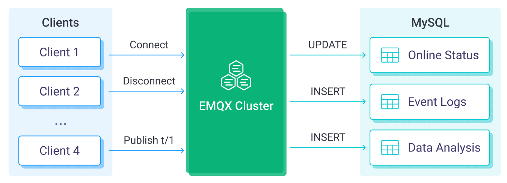

# MySQLへのMQTTデータ取り込み

[MySQL](https://www.mysql.com/)は、高い信頼性と安定性を持つ広く利用されているリレーショナルデータベースであり、迅速にインストール、設定、利用が可能です。MySQLデータ統合により、MQTTメッセージを効率的にMySQLデータベースに保存できるほか、イベントトリガーを通じてMySQL内のデータのリアルタイム更新や削除もサポートします。MySQLデータ統合を活用することで、メッセージの保存、デバイスのオンライン／オフライン状態更新、デバイスの動作記録などの機能を簡単に実装し、柔軟なIoTデータストレージおよびデバイス管理機能を実現できます。

本ページでは、EMQXとMySQL間のデータ統合について、実践的な作成および検証手順を紹介します。

## 動作概要

MySQLデータ統合はEMQXの標準機能であり、シンプルな設定で複雑なビジネス開発を可能にします。典型的なIoTアプリケーションにおいて、EMQXはIoTプラットフォームとしてデバイスの接続とメッセージの転送を担当し、MySQLはデータストレージプラットフォームとしてデバイスの状態やメタデータ、メッセージデータの保存およびデータ分析を担います。



EMQXはルールエンジンとSinkを通じてデバイスイベントやデータをMySQLに転送します。アプリケーションはMySQL内のデータを読み取り、デバイスの状態を感知し、デバイスのオンライン・オフライン記録を取得し、デバイスデータを分析できます。具体的なワークフローは以下の通りです。

- **IoTデバイスがEMQXに接続**：IoTデバイスがMQTTプロトコルを通じて正常に接続されると、オンラインイベントがトリガーされます。イベントにはデバイスID、送信元IPアドレスなどの情報が含まれます。
- **メッセージのパブリッシュと受信**：デバイスは特定のトピックにテレメトリや状態データをパブリッシュします。EMQXはこれらのメッセージを受信すると、ルールエンジン内でマッチング処理を開始します。
- **ルールエンジンによるメッセージ処理**：組み込みのルールエンジンにより、特定のソースからのメッセージやイベントをトピックマッチングに基づいて処理します。ルールエンジンは対応するルールをマッチさせ、データ形式の変換、特定情報のフィルタリング、メッセージへのコンテキスト情報の付加などを行います。
- **MySQLへの書き込み**：ルールがトリガーされると、メッセージをMySQLに書き込みます。SQLテンプレートを活用し、ルール処理結果からデータを抽出してSQLを構築し、MySQLに送信して実行します。これにより、メッセージの特定フィールドをデータベースの対応するテーブルやカラムに書き込んだり更新したりできます。

イベントおよびメッセージデータがMySQLに書き込まれた後は、MySQLに接続してデータを読み取り、以下のような柔軟なアプリケーション開発が可能です。

- Grafanaなどの可視化ツールに接続し、データに基づくグラフを生成してデータ変化を表示する。
- デバイス管理システムに接続し、デバイス一覧や状態を確認、異常なデバイス動作を検知して潜在的な問題を迅速に解消する。

## 特長と利点

MySQLとのデータ統合により、以下の特長と利点をビジネスにもたらします。

- **柔軟なイベント処理**：EMQXルールエンジンを通じてMySQLがデバイスのライフサイクルイベントを処理でき、IoTアプリケーション実装に必要な各種管理・監視タスクの開発が大幅に容易になります。イベントデータを分析することで、デバイスの故障や異常動作、傾向変化を即座に検知し、適切な対策を講じられます。
- **メッセージ変換**：メッセージはEMQXルールを通じて多様な処理・変換が可能であり、MySQLへの保存や利用がより便利になります。
- **柔軟なデータ操作**：MySQL Sinkが提供するSQLテンプレートにより、特定フィールドのデータをMySQLの対応テーブル・カラムに簡単に書き込み・更新でき、柔軟なデータ保存・管理を実現します。
- **ビジネスプロセス統合**：デバイスデータをMySQLの豊富なエコシステムアプリケーションと連携でき、ERP、CRM、その他カスタムビジネスシステムとの統合による高度な業務プロセスや自動化を実現します。
- **ランタイムメトリクス**：各Sinkの総メッセージ数、成功／失敗数、現在の処理レートなどのランタイムメトリクスの閲覧をサポートします。

柔軟なイベント処理、多様なメッセージ変換、柔軟なデータ操作、リアルタイムの監視・分析機能により、効率的で信頼性が高くスケーラブルなIoTアプリケーションを構築し、ビジネスの意思決定や最適化に役立てられます。

## はじめる前に

本節では、EMQXダッシュボードでMySQLデータ統合を作成する前に必要な準備、MySQLサーバーのインストールやデータテーブルの作成について説明します。

### 前提条件

- EMQXデータ統合の[ルール](./rules.md)に関する知識
- [データ統合](./data-bridges.md)に関する知識

### MySQLサーバーのインストール

Dockerを利用してMySQLサーバーをインストールし、コンテナを起動します。

```bash
# MySQL Dockerイメージを起動し、パスワードをpublicに設定
docker run --name mysql -p 3306:3306 -e MYSQL_ROOT_PASSWORD=public -d mysql

# コンテナにアクセス
docker exec -it mysql bash

# コンテナ内でMySQLサーバーに接続し、パスワードを入力
mysql -u root -p

# データベースを作成し選択
CREATE DATABASE emqx_data CHARACTER SET utf8mb4;
use emqx_data;
```

### データテーブルの作成

1. 以下のSQL文を使用して、MySQLデータベース内に`emqx_messages`テーブルを作成します。このテーブルは、各メッセージのクライアントID、トピック、ペイロード、作成日時を保存します。

   ```sql
   CREATE TABLE emqx_messages (
     id INT AUTO_INCREMENT PRIMARY KEY,
     clientid VARCHAR(255),
     topic VARCHAR(255),
     payload TEXT,
     created_at TIMESTAMP DEFAULT CURRENT_TIMESTAMP
   );
   ```

**注意**：バイナリペイロードが必要な場合は、カラムを"BLOB"として宣言してください。

2. 以下のSQL文を使用して、MySQLデータベース内に`emqx_client_events`テーブルを作成します。このテーブルは、各イベントのクライアントID、イベントタイプ、作成日時を保存します。

   ```sql
   CREATE TABLE emqx_client_events (
     id INT AUTO_INCREMENT PRIMARY KEY,
     clientid VARCHAR(255),
     event VARCHAR(255),
     created_at TIMESTAMP DEFAULT CURRENT_TIMESTAMP
   );
   ```

## コネクターの作成

本節では、SinkをMySQLサーバーに接続するためのコネクターの作成方法を説明します。

以下の手順は、EMQXとMySQLをローカルマシンで実行していることを前提としています。MySQLやEMQXがリモートで稼働している場合は、設定を適宜調整してください。

1. EMQXダッシュボードにアクセスし、**Integration** -> **Connectors** をクリックします。
2. ページ右上の **Create** をクリックします。
3. **Create Connector** ページで **MySQL** を選択し、**Next** をクリックします。
4. **Configuration** ステップで以下の情報を設定します。
   - **Connector name**：コネクター名を入力します。英数字の組み合わせで、例：`my_mysql`
   - **Server Host**：`127.0.0.1:3306` またはMySQLサーバーがリモートの場合は実際のホスト名を入力
   - **Database Name**：`emqx_data`
   - **Username**：`root`
   - **Password**：`public`
5. 高度な設定（任意）：[高度な設定](#advanced-configurations)を参照してください。
6. **Create**をクリックする前に、**Test Connectivity** をクリックしてコネクターがMySQLサーバーに接続できるかテストできます。
7. ページ下部の **Create** ボタンをクリックしてコネクターの作成を完了します。ポップアップダイアログで **Back to Connector List** をクリックするか、**Create Rule** をクリックしてSinkを用いたルールの作成を続行できます。詳細は[メッセージ保存用MySQL Sinkのルール作成](#create-a-rule-with-mysql-sink-for-message-storage)および[イベント記録用MySQL Sinkのルール作成](#create-a-rule-with-mysql-sink-for-events-recording)を参照してください。

## メッセージ保存用MySQL Sinkのルール作成

本節では、ダッシュボードでMQTTのソーストピック `t/#` からのメッセージを処理し、処理済みデータを設定済みSinkを介してMySQLの`emqx_messages`テーブルに保存するルールの作成方法を示します。

EMQXとMySQLをローカルマシンで実行していることを前提としています。リモート環境の場合は設定を調整してください。

1. EMQXダッシュボードで **Integration** -> **Rules** をクリックします。

2. ページ右上の **Create** をクリックします。

3. ルールIDに `my_rule` を入力し、**SQL Editor** に以下の文を設定します。これはトピック `t/#` 配下のMQTTメッセージをMySQLに保存することを意味します。

   注意：独自のSQL構文を指定する場合は、Sinkで必要なすべてのフィールドを`SELECT`句に含めていることを確認してください。

   ```sql
   SELECT
     *
   FROM
     "t/#"
   ```

   ::: tip

   初心者の方は、**SQL Examples** と **Enable Test** をクリックしてSQLルールを学習・テストしてください。

   :::

4. + **Add Action** ボタンをクリックし、ルールでトリガーされるアクションを定義します。このアクションにより、EMQXはルールで処理したデータをMySQLに送信します。

5. **Type of Action** のドロップダウンリストから `MySQL` を選択します。**Action** はデフォルトの `Create Action` のままにします。既に作成済みのSinkがあれば選択可能です。本デモでは新規Sinkを作成します。

6. Sinkの名前を入力します。英数字の組み合わせで指定してください。

7. **Connector** ドロップダウンから先ほど作成した `my_mysql` を選択します。ドロップダウン横のボタンから新規コネクター作成も可能です。設定パラメータは[コネクター作成](#create-a-connector)を参照してください。

8. 使用する機能に応じて**SQLテンプレート**を設定します。

   注意：これは事前処理済みのSQLであるため、フィールドは引用符で囲まず、文末にセミコロンを付けないでください。

   ```sql
   INSERT INTO emqx_messages(clientid, topic, payload, created_at) VALUES(
     ${clientid},
     ${topic},
     ${payload},
     FROM_UNIXTIME(${timestamp}/1000)
   )
   ```

   SQLテンプレート内でプレースホルダー変数が未定義の場合、**SQLテンプレート**上部の **Undefined Vars as Null** スイッチを切り替えてルールエンジンの動作を指定できます。

   - **無効**（デフォルト）：ルールエンジンは文字列 `undefined` をデータベースに挿入します。
   - **有効**：変数が未定義の場合、ルールエンジンは `NULL` をデータベースに挿入します。

     ::: tip

     可能な限りこのオプションは有効にしてください。無効化は後方互換性確保のためのみ推奨されます。

     :::

9. **フォールバックアクション（任意）**：メッセージ配信失敗時の信頼性向上のため、1つ以上のフォールバックアクションを定義できます。これらはプライマリSinkの処理失敗時にトリガーされます。詳細は[フォールバックアクション](./data-bridges.md#fallback-actions)を参照してください。

10. **高度な設定（任意）**：[高度な設定](#advanced-configurations)を参照してください。

11. **Create** ボタンをクリックしてSinkの設定を完了します。新しいSinkが**Action Outputs**に追加されます。

12. **Create Rule** ページに戻り、設定内容を確認します。**Create** ボタンをクリックしてルールを生成します。

これでルールの作成が完了しました。**Integration** -> **Rules** ページで新規作成したルールを確認できます。**Actions(Sink)** タブをクリックすると、新しいMySQL Sinkが表示されます。

また、**Integration** -> **Flow Designer** をクリックするとトポロジーが表示され、トピック `t/#` 配下のメッセージがMySQLに送信・保存されていることが確認できます。

## イベント記録用MySQL Sinkのルール作成

本節では、クライアントのオンライン／オフライン状態を記録し、イベントデータを設定済みSinkを介してMySQLの`emqx_client_events`テーブルに保存するルールの作成方法を示します。

ルール作成手順は[メッセージ保存用MySQL Sinkのルール作成](#メッセージ保存用mysql-sinkのルール作成)とほぼ同様ですが、SQLルール構文とSQLテンプレートが異なります。

オンライン／オフライン状態記録用のルールは、**SQL Editor**に以下の文を入力してください。

```sql
SELECT
  *
FROM
  "$events/client_connected", "$events/client_disconnected"
```

クライアイベントデータをテーブルに挿入するSQLテンプレートは以下の通りです。

```sql
INSERT INTO emqx_client_events(clientid, event, created_at) VALUES (
  ${clientid},
  ${event},
  FROM_UNIXTIME(${timestamp}/1000)
)
```

## ルールのテスト

MQTTXを使用してトピック `t/1` にメッセージを送信し、オンライン／オフラインイベントをトリガーします。

```bash
mqttx pub -i emqx_c -t t/1 -m '{ "msg": "hello MySQL" }'
```

2つのSinkの稼働状況を確認すると、新規の受信メッセージと送信メッセージが1件ずつ、イベントレコードが2件あるはずです。

`emqx_messages`テーブルにデータが書き込まれているか確認します。

```bash
mysql> select * from emqx_messages;
+----+----------+-------+--------------------------+---------------------+
| id | clientid | topic | payload                  | created_at          |
+----+----------+-------+--------------------------+---------------------+
|  1 | emqx_c   | t/1   | { "msg": "hello MySQL" } | 2022-12-09 08:44:07 |
+----+----------+-------+--------------------------+---------------------+
1 row in set (0.01 sec)
```

`emqx_client_events`テーブルにデータが書き込まれているか確認します。

```bash
mysql> select * from emqx_client_events;
+----+----------+---------------------+---------------------+
| id | clientid | event               | created_at          |
+----+----------+---------------------+---------------------+
|  1 | emqx_c   | client.connected    | 2022-12-09 08:44:07 |
|  2 | emqx_c   | client.disconnected | 2022-12-09 08:44:07 |
+----+----------+---------------------+---------------------+
2 rows in set (0.00 sec)
```

## 高度な設定

本節では、MySQLコネクターおよびSinkの高度な設定オプションについて詳述します。ダッシュボードでコネクターやSinkを設定する際、**Advanced Settings** に移動して以下のパラメータをニーズに合わせて調整してください。

| **項目**                  | **説明**                                                                                     | **推奨値**           |
| ------------------------- | -------------------------------------------------------------------------------------------- | --------------------- |
| **Connection Pool Size**  | MySQLサービスとの接続プール内で維持可能な同時接続数を指定します。このオプションは、EMQXとMySQL間のアクティブな接続数を制限または増加させることで、アプリケーションのスケーラビリティとパフォーマンス管理に役立ちます。<br/>**注意**：適切な接続プールサイズはシステムリソース、ネットワークレイテンシ、アプリケーションの特定ワークロードなどに依存します。大きすぎるとリソース枯渇の恐れがあり、小さすぎるとスループットが制限されます。 | `8`                   |
| **Start Timeout**         | コネクターが自動起動したリソース（例：MySQLのデータベースインスタンス）が正常状態になるまで待機する最大時間（秒）を指定します。この設定により、接続先リソースが完全に稼働しデータ取引の準備が整うまでコネクターが操作を進めないようにします。 | `5` 秒                |
| **Buffer Pool Size**      | EMQXとMySQL間の送信（egress）タイプのSinkでデータフロー管理に割り当てるバッファワーカープロセス数を指定します。これらのワーカーは、データを一時的に保持しターゲットサービスへ送信する役割を担います。送信専用Sinkに関連し、受信（ingress）専用Sinkには「0」を設定可能です。 | `16`                  |
| **Request TTL**           | バッファに入ったリクエストが有効とみなされる最大期間（秒）を指定します。リクエストがバッファに入った時点からカウントが始まり、TTLを超えてバッファに滞留するか、MySQLからの応答やアックがタイムリーに得られない場合、リクエストは期限切れと見なされます。 | `45` 秒               |
| **Health Check Interval** | コネクターがMySQL接続の自動ヘルスチェックを行う間隔（秒）を指定します。 | `15` 秒               |
| **Max Buffer Queue Size** | コネクター内の各バッファワーカーがバッファリング可能な最大バイト数を指定します。バッファワーカーはMySQLへの送信前にデータを一時保管し、データフローを効率化します。システム性能やデータ転送要件に応じて調整してください。 | `256` MB              |
| **Max Batch Size**        | EMQXからMySQLへ単一転送操作で送信するデータバッチの最大サイズを指定します。サイズ調整によりデータ転送の効率とパフォーマンスを最適化できます。<br />「1」に設定すると、データレコードはバッチ化されず個別に送信されます。 | `1`                   |
| **Query Mode**            | メッセージ送信要件に応じて `asynchronous` または `synchronous` のクエリモードを選択できます。非同期モードではMySQLへの書き込みがMQTTメッセージパブリッシュ処理をブロックしませんが、クライアントがMySQLに到達する前にメッセージを受信する可能性があります。 | `Async`               |
| **Inflight Window**       | 「インフライトクエリ」とは、開始されたがまだ応答やアックを受け取っていないクエリを指します。コネクターがMySQLと通信する際に同時に存在可能なインフライトクエリの最大数を制御します。<br/>**Query Mode** が `async` の場合、このパラメータは特に重要です。同一MQTTクライアントからのメッセージを厳密に順序処理する必要がある場合は、この値を1に設定してください。 | `100`                 |

## さらに詳しく

以下のリンクから詳細情報をご覧いただけます。

[MQTTパフォーマンスベンチマークテスト：EMQX-MySQL統合](https://www.emqx.com/en/blog/mqtt-performance-benchmark-testing-emqx-mysql-integration)
