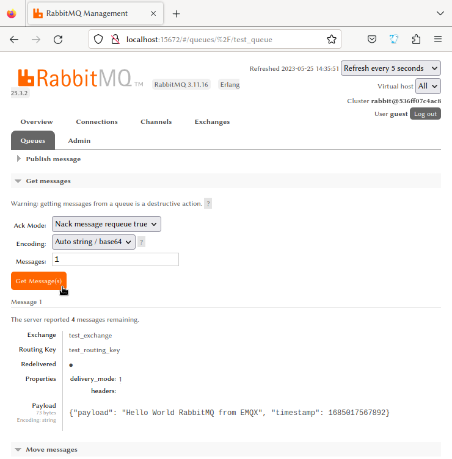
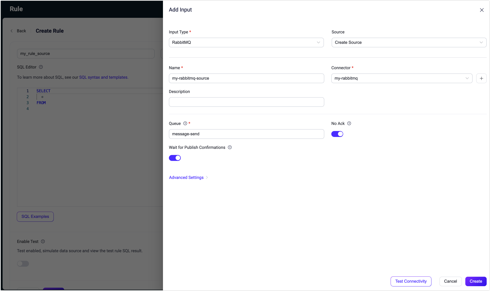

# RabbitMQへのMQTTデータ取り込み

<<<<<<< HEAD
[RabbitMQ](https://www.rabbitmq.com/)は、Advanced Message Queuing Protocol（AMQP）を実装した広く使われているオープンソースのメッセージブローカーです。分散システム間のメッセージングにおいて堅牢でスケーラブルなプラットフォームを提供します。EMQXはRabbitMQとの統合をサポートしており、MQTTメッセージやイベントをRabbitMQに転送できます。また、RabbitMQサーバーからデータを取得し、EMQXの特定のトピックにパブリッシュすることも可能で、RabbitMQからMQTTへのメッセージ配信を実現します。

本ページでは、EMQXとRabbitMQ間のデータ統合について詳細に解説し、データ統合の作成および検証手順を実践的に説明します。
=======
[RabbitMQ](https://www.rabbitmq.com/)は、Advanced Message Queuing Protocol（AMQP）を実装した広く使われているオープンソースのメッセージブローカーです。分散システム間のメッセージングにおいて堅牢でスケーラブルなプラットフォームを提供します。EMQXはRabbitMQとの統合をサポートしており、MQTTメッセージやイベントをRabbitMQに転送することが可能です。また、RabbitMQサーバーからデータを消費し、EMQXの特定のトピックにパブリッシュすることもでき、RabbitMQからMQTTへのメッセージ配信を実現します。

本ページでは、EMQXとRabbitMQ間のデータ統合について詳細に解説し、データ統合の作成および検証に関する実践的な手順を提供します。
>>>>>>> origin/release-6.1

## 動作概要

RabbitMQデータ統合は、MQTTベースのIoTデータとRabbitMQの強力なメッセージキュー処理機能を橋渡しするためにEMQXに標準搭載された機能です。組み込みの[ルールエンジン](./rules.md)コンポーネントにより、EMQXからRabbitMQへのデータ取り込みを簡素化し、複雑なコーディングを不要にします。

<<<<<<< HEAD
RabbitMQ Sinkを例にとると、以下の図はEMQXとRabbitMQ間の典型的なデータ統合アーキテクチャを示しています。
=======
RabbitMQ Sinkを例にとると、以下の図はEMQXとRabbitMQ間の典型的なデータ統合アーキテクチャを示しています：
>>>>>>> origin/release-6.1


MQTTデータをRabbitMQに取り込む流れは以下の通りです。

<<<<<<< HEAD
1. **メッセージのパブリッシュと受信**：産業用IoTデバイスはMQTTプロトコルを介してEMQXに正常に接続し、リアルタイムのMQTTデータをEMQXにパブリッシュします。EMQXがこれらのメッセージを受信すると、ルールエンジン内でマッチング処理を開始します。
2. **メッセージデータの処理**：メッセージが到着するとルールエンジンを通過し、EMQXで定義されたルールにより処理されます。ルールは事前定義された条件に基づき、RabbitMQへルーティングすべきメッセージを判別します。ペイロード変換が指定されている場合は、データフォーマットの変換、特定情報のフィルタリング、ペイロードの付加情報による拡充などが適用されます。
3. **RabbitMQへのメッセージ取り込み**：ルールによる処理が完了すると、RabbitMQへメッセージを転送するアクションがトリガーされます。処理済みのメッセージはシームレスにRabbitMQに書き込まれます。
4. **データの永続化と活用**：RabbitMQはメッセージをキューに格納し、適切なコンシューマーに配信します。メッセージは他のアプリケーションやサービスによって消費され、データ分析、可視化、保存などのさらなる処理に利用されます。
=======
1. **メッセージのパブリッシュと受信**：産業用IoTデバイスはMQTTプロトコルを通じてEMQXに正常に接続し、リアルタイムのMQTTデータをEMQXにパブリッシュします。EMQXがこれらのメッセージを受信すると、ルールエンジン内でマッチング処理を開始します。
2. **メッセージデータの処理**：メッセージが到着すると、ルールエンジンを通過し、EMQXで定義されたルールによって処理されます。ルールは事前定義された条件に基づき、RabbitMQにルーティングすべきメッセージを判別します。ペイロード変換が指定されている場合は、データ形式の変換、特定情報のフィルタリング、ペイロードの付加的なコンテキストによる強化などの変換が適用されます。
3. **RabbitMQへのメッセージ取り込み**：ルールによる処理が完了すると、RabbitMQへのメッセージ転送アクションがトリガーされます。処理済みのメッセージはシームレスにRabbitMQに書き込まれます。
4. **データの永続化と活用**：RabbitMQはメッセージをキューに保存し、適切なコンシューマーに配信します。メッセージは他のアプリケーションやサービスによって消費され、データ分析、可視化、保存などのさらなる処理に利用されます。
>>>>>>> origin/release-6.1

## 特徴と利点

<<<<<<< HEAD
RabbitMQとのデータ統合は以下の特長とメリットをもたらします。

- **信頼性の高いIoTデータメッセージ配信**：EMQXはデバイスからクラウドへの信頼性の高い接続とメッセージ配信を保証し、RabbitMQはメッセージの永続化と異なるサービス間での信頼性の高い配信を担い、各プロセスでのデータ信頼性を確保します。
- **MQTTメッセージの変換**：ルールエンジンを用いてMQTTメッセージのフィルタリングや変換が可能です。メッセージはRabbitMQに送信される前にデータ抽出、フィルタリング、拡充、変換を受けられます。
- **柔軟なメッセージマッピング**：RabbitMQデータ統合はMQTTトピックとRabbitMQのルーティングキーおよびエクスチェンジの柔軟なマッピングをサポートし、MQTTとRabbitMQ間のシームレスな統合を実現します。
- **高可用性とクラスター対応**：EMQXとRabbitMQは共に高可用なメッセージブローカークラスターの構築をサポートし、ノード障害時にもサービス継続を保証します。クラスター機能を活用することで優れたスケーラビリティも実現します。
- **高スループット環境での処理能力**：RabbitMQデータ統合は同期・非同期の両方の書き込みモードをサポートし、シナリオに応じてレイテンシとスループットのバランスを柔軟に調整できます。

## はじめる前に

このセクションでは、RabbitMQデータ統合を作成する前に必要な準備について説明します。RabbitMQサーバーの起動方法やテスト用のエクスチェンジおよびキューの作成方法を含みます。
=======
RabbitMQとのデータ統合は、以下の特徴とメリットをビジネスにもたらします：

- **信頼性の高いIoTデータメッセージ配信**：EMQXはデバイスからクラウドへの信頼性の高い接続とメッセージ配信を保証し、RabbitMQはメッセージの永続化と異なるサービス間での信頼性の高い配信を担い、全体のデータ信頼性を確保します。
- **MQTTメッセージの変換**：ルールエンジンを利用して、EMQXはMQTTメッセージのフィルタリングや変換を行えます。データ抽出、フィルタリング、強化、変換を経てRabbitMQに送信可能です。
- **柔軟なメッセージマッピング**：RabbitMQデータ統合はMQTTトピックとRabbitMQのルーティングキーおよびエクスチェンジの柔軟なマッピングをサポートし、MQTTとRabbitMQ間のシームレスな統合を実現します。
- **高可用性およびクラスター対応**：EMQXとRabbitMQは共に高可用なメッセージブローカークラスターの構築をサポートし、ノード障害時にもサービス継続を保証します。クラスター機能により優れたスケーラビリティも提供します。
- **高スループットシナリオでの処理能力**：RabbitMQデータ統合は同期および非同期の書き込みモードをサポートし、レイテンシとスループットのバランスをシナリオに応じて柔軟に調整可能です。

## はじめる前に

このセクションでは、RabbitMQデータ統合の作成を開始する前に必要な準備について説明します。RabbitMQサーバーの作成方法やテスト用のエクスチェンジ・キューの作成方法も含みます。
>>>>>>> origin/release-6.1

### 前提条件

- EMQXデータ統合の[ルール](./rules.md)に関する知識
<<<<<<< HEAD
- [データ統合](./data-bridges.md)および[再パブリッシュアクション](./rule-get-started.md#add-republish-action)に関する知識
=======
- [データ統合](./data-bridges.md)および[リパブリッシュアクション](./rule-get-started.md#add-republish-action)に関する知識
>>>>>>> origin/release-6.1
- UNIXターミナルおよびコマンドの基本知識

### RabbitMQサーバーの起動

ここでは[Docker](https://www.docker.com/)を使用してRabbitMQサーバーを起動する方法を紹介します。

<<<<<<< HEAD
以下のコマンドを実行すると、管理プラグインが有効なRabbitMQサーバーが起動します。管理プラグインによりWebインターフェースでRabbitMQを監視できます。
=======
管理プラグインを有効にしたRabbitMQサーバーを起動するには、以下のコマンドを実行してください。管理プラグインによりWebインターフェースでRabbitMQを確認できます。
>>>>>>> origin/release-6.1

```bash
docker run -it --rm --name rabbitmq -p 127.0.0.1:5672:5672 -p 127.0.0.1:15672:15672 rabbitmq:3.11-management
```

<<<<<<< HEAD
詳細は[Docker HubのRabbitMQページ](https://hub.docker.com/_/rabbitmq)をご参照ください。

### メッセージ受信用のエクスチェンジとキューの作成

RabbitMQサーバー起動後、RabbitMQ管理Webインターフェースを使って、EMQXから転送されるメッセージ受信用のテスト用エクスチェンジとキューを作成できます。既にテスト用のエクスチェンジとキューがある場合はこのセクションをスキップしてください。
=======
詳細は[Docker HubのRabbitMQのドキュメント](https://hub.docker.com/_/rabbitmq)をご覧ください。

### メッセージ受信用のエクスチェンジとキューの作成

RabbitMQサーバー起動後、RabbitMQ管理Webインターフェースを使って、EMQXから転送されるメッセージ受信用のテスト用エクスチェンジとキューを作成できます。既にテスト用のエクスチェンジとキューがある場合はこのセクションはスキップ可能です。
>>>>>>> origin/release-6.1

1. ブラウザで http://localhost:15672/ にアクセスし、RabbitMQ管理Webインターフェースを開きます。ログイン画面で以下のデフォルト認証情報を入力し、**Login**をクリックします。
   - **Username**: `guest`
   - **Password**: `guest`
<<<<<<< HEAD
2. 上部メニューの**Exchanges**タブをクリックします。**Add a new exchange**を展開し、以下の情報を入力します。
   * **Name**: `test_exchange`
   * **Type**: ドロップダウンリストから`direct`を選択
   * **Durability**: `Durable`を選択し、RabbitMQサーバー再起動後もエクスチェンジが残るように設定
   * **Auto delete**: `No`
   * **Internal**: `No`
   * **Arguments**: 空欄のまま
3. **Add exchange**ボタンをクリックしてテスト用エクスチェンジを作成します。
4. 上部メニューの**Queues**タブをクリックします。**Add a new queue**を展開し、以下の情報を入力します。
   * **Type**: `Default for virtual host`
   * **Name**: `test_queue`
   * **Durability**: `Durable`を選択し、キューを永続化
   * **Arguments**: 空欄のまま
5. **Add queue**ボタンをクリックしてテスト用キューを作成します。新しい`test_queue`が**All queues**セクションに表示されます。
6. キュー名`test_queue`をクリックして詳細ページを開きます。**Bindings**を展開し、**Add binding to this queue**セクションに以下を入力します。
   * **From exchange**: `test_exchange`
   * **Routing key**: `test_routing_key`
   * **Arguments**: 空欄のまま
7. **Bind**ボタンをクリックし、`test_queue`を`test_exchange`に指定ルーティングキーでバインドします。
=======
2. 上部メニューの**Exchanges**タブをクリックし、**Add a new exchange**を展開して以下を入力します：
   * **Name**: `test_exchange` と入力
   * **Type**: ドロップダウンから `direct` を選択
   * **Durability**: `Durable` を選択し、RabbitMQサーバー再起動後もエクスチェンジが存在するように設定
   * **Auto delete**: `No`
   * **Internal**: `No`
   * **Arguments**: 空欄のまま
3. **Add exchange**ボタンをクリックしてエクスチェンジを作成します。
4. 上部メニューの**Queues**タブをクリックし、**Add a new queue**を展開して以下を入力します：
   * **Type**: `Default for virtual host`
   * **Name**: `test_queue` と入力
   * **Durability**: `Durable` を選択し、キューを永続化
   * **Arguments**: 空欄のまま
5. **Add queue**ボタンをクリックしてキューを作成します。新しい`test_queue`が**All queues**セクションに表示されます。
6. キュー名の**test_queue**をクリックして詳細ページを開き、**Bindings**を展開します。**Add binding to this queue**セクションに以下を入力します：
   * **From exchange**: `test_exchange` と入力
   * **Routing key**: `test_routing_key` と入力
   * **Arguments**: 空欄のまま
7. **Bind**ボタンをクリックし、`test_queue`を`test_exchange`に指定したルーティングキーでバインドします。
>>>>>>> origin/release-6.1

### メッセージ送信用のキュー作成

RabbitMQ管理Webインターフェースを使って、RabbitMQメッセージ送信用のキューを作成できます。

1. RabbitMQ管理Webインターフェースにログインします。
2. 上部メニューの**Queues**タブをクリックし、**Add a new queue**を展開して以下を入力します。
   * **Type**: `Default for virtual host`
<<<<<<< HEAD
   * **Name**: `message-send`
   * **Durability**: `Durable`を選択し、キューを永続化
   * **Arguments**: 空欄のまま
3. **Add queue**ボタンをクリックしてキューを作成します。新しい`message-send`が**All queues**に表示されます。
=======
   * **Name**: `message-send` と入力
   * **Durability**: `Durable` を選択し、キューを永続化
   * **Arguments**: 空欄のまま
3. **Add queue**ボタンをクリックしてキューを作成します。新しい`message-send`が**All queues**セクションに表示されます。
>>>>>>> origin/release-6.1

## コネクターの作成

このセクションでは、Rabbit Sink/SourceをRabbitMQサーバーに接続するためのコネクター作成方法を説明します。

<<<<<<< HEAD
以下の手順はEMQXとRabbitMQを同一マシンで実行していることを前提としています。RabbitMQが別環境にある場合は適宜設定を調整してください。
=======
以下の手順はEMQXとRabbitMQをローカルマシンで実行していることを前提としています。RabbitMQが別の場所にある場合は設定を適宜調整してください。
>>>>>>> origin/release-6.1

1. ダッシュボードに入り、**Integration** -> **Connectors**をクリックします。
2. 画面右上の**Create**をクリックします。
3. **Create Connector**ページで**RabbitMQ**を選択し、**Next**をクリックします。
<<<<<<< HEAD
4. コネクター名を入力します。英数字の組み合わせで、例：`my_rabbitmq`
5. 接続情報を入力します。
   - **Server**: RabbitMQサーバーがローカルの場合は`localhost`、リモートの場合は実際のホスト名/IPを入力
   - **Port**: デフォルトは`5672`、異なる場合は適宜入力
   - **Username**: `guest`
   - **Password**: `guest`
   - **Virtual Host**: RabbitMQの仮想ホスト。デフォルトは`/`
   - 暗号化接続を行う場合は**Enable TLS**をオンにします。TLS接続の詳細は[外部リソースアクセスのTLS](../network/overview.md/#tls-for-external-resource-access)を参照してください。
6. **Create**をクリックする前に、**Test Connectivity**をクリックしてコネクターがRabbitMQサーバーに接続可能かテストできます。
7. 画面下部の**Create**ボタンをクリックしてコネクター作成を完了します。ポップアップで**Back to Connector List**または**Create Rule**を選択できます。
   - **Action Outputs**: RabbitMQ Sinkを使ったルール作成。RabbitMQへの転送データを指定します。[RabbitMQ Sinkでルールを作成](#create-a-rule-with-rabbitmq-sink)の手順も参照してください。
   - **Data Inputs**: RabbitMQ Sourceを使ったルール作成。[RabbitMQ Sourceでルールを作成](#create-a-rule-with-rabbitmq-source)の手順も参照してください。

## RabbitMQ Sinkを使ったルール作成

このセクションでは、ダッシュボードでMQTTのソーストピック`t/#`からのメッセージを処理し、処理結果をRabbitMQのキュー`test_queue`に転送するSink付きルールの作成方法を説明します。

### SQLを定義したルール作成

1. EMQXダッシュボードで、**Integration -> Rules**をクリックします。
2. 画面右上の**Create**をクリックします。
3. ルールIDを入力します。例：`my_rule`
4. SQLエディタに以下の文を入力します。トピックパターン`t/#`にマッチするMQTTメッセージを転送します。
=======
4. コネクター名を入力します。大文字・小文字の英数字の組み合わせで、例：`my_rabbitmq`。
5. 接続情報を入力します。
   - **Server**: RabbitMQサーバーがローカルなら`localhost`、リモートなら実際のホスト名/IPを入力
   - **Port**: デフォルトは`5672`、異なる場合は実際のポートを入力
   - **Username**: `guest`
   - **Password**: `guest`
   - **Virtual Host**: RabbitMQの仮想ホスト、デフォルトは`/`
   - 暗号化接続を確立したい場合は**Enable TLS**トグルをオンにします。TLS接続の詳細は[外部リソースアクセスのTLS](../network/overview.md/#tls-for-external-resource-access)を参照してください。
6. **Create**をクリックする前に、**Test Connectivity**をクリックしてコネクターがRabbitMQサーバーに接続可能かテストできます。
7. 画面下部の**Create**ボタンをクリックしてコネクター作成を完了します。ポップアップダイアログで**Back to Connector List**または**Create Rule**を選択可能です。**Create Rule**を選択すると以下のオプションがあります：
   - **Action Outputs**：RabbitMQ Sinkを使ったルール作成でRabbitMQへ転送するデータを指定。詳細は[Create a Rule with RabbitMQ Sink](#create-a-rule-with-rabbitmq-sink)を参照。
   - **Data Inputs**：RabbitMQ Sourceを使ったルール作成。詳細は[Create a Rule with RabbitMQ Source](#create-a-rule-with-rabbitmq-source)を参照。

## RabbitMQ Sinkを使ったルールの作成

このセクションでは、ダッシュボードでMQTTのソーストピック`t/#`からメッセージを処理し、処理済みデータを設定済みのRabbitMQキュー`test_queue`に転送するルールの作成方法を説明します。

### SQLを定義したルールの作成

1. EMQXダッシュボードで、**Integration -> Rules**をクリックします。
2. 画面右上の**Create**をクリックします。
3. ルールIDを入力します。例：`my_rule`。
4. SQLエディターに以下のステートメントを入力します。これはトピックパターン`t/#`にマッチするMQTTメッセージを転送します。
>>>>>>> origin/release-6.1

   ```sql
   SELECT
     payload,
     now_timestamp() as timestamp
   FROM
     "t/#"
   ```

   ::: tip

<<<<<<< HEAD
   初心者の方は**SQL Examples**をクリックし、**Enable Test**を有効にしてSQLルールの学習とテストが可能です。

   :::

5. ルールにアクションを追加し、Sinkを設定します。詳細は[ルールにRabbitMQ Sinkを追加](#add-rabbitmq-sink)を参照してください。
6. アクション追加後、**Action Outputs**セクションに新しいSinkが表示されます。**Create Rule**ページの**Save**ボタンをクリックしてルール作成を完了します。

これでルールが正常に作成されました。**Rules**ページで新規ルールを確認でき、**Actions (Sink)**タブに新しいRabbitMQ Sinkが表示されます。

また、**Integration** -> **Flow Designer**でトポロジーを確認できます。トポロジーでは、トピック`t/#`のメッセージがルール`my_rule`で解析され、RabbitMQに書き込まれる流れが視覚的に表示されます。

### RabbitMQ Sinkの追加

このセクションでは、処理結果をRabbitMQに書き込むためのSinkをルールに追加する方法を説明します。

1. **Create Rule**ページの**Action Outputs**セクションで**Add Action**をクリックし、ルールでトリガーされるアクションを定義します。このアクションにより、EMQXはルールで処理したデータをRabbitMQに送信します。
2. **Type of Action**ドロップダウンリストから`RabbitMQ`を選択します。**Action**ドロップダウンはデフォルトの`Create Action`のままにします。既存のSinkを選択することも可能ですが、ここでは新規作成します。
3. Sinkの名前を入力します。英数字の組み合わせで入力してください。
4. **Connector**ドロップダウンから先ほど作成した`my_rabbitmq`を選択します。新規コネクターを作成する場合は、ドロップダウン横のボタンから作成できます。設定パラメータは[コネクターの作成](#create-a-connector)を参照してください。
5. Sinkの設定を以下のように行います。

   * **Exchange**: 事前に作成した`test_exchange`を入力します。メッセージはこのエクスチェンジにパブリッシュされます。

       ::: tip 注意

       RabbitMQにエクスチェンジが存在していることを確認してください。存在しない場合、アクションは一時的に動作しなくなり、定期的に接続再試行を行います。

       :::

   * **Routing Key**: 事前に作成した`test_routing_key`を入力します。RabbitMQでメッセージをパブリッシュする際のルーティングキーです。

       ::: tip

       エクスチェンジとルーティングキーはテンプレート値として設定可能で、プレースホルダーを使い受信したMQTTメッセージのペイロードから動的に値を抽出しルーティングを動的に行えます。

       例：ルーティングキーをペイロードのフィールド`akey`に基づいて動的に設定する場合、`${payload.akey}`と設定します。これによりペイロードの`akey`フィールドの値がルーティングキーとして使われます。

       **注意**：バッチモードでは、エクスチェンジとルーティングキーのテンプレート値はバッチ内のすべてのメッセージで一定である必要があります。これにより一貫したルーティングが保証され、バッチ処理時の競合を避けられます。

       :::

   * **Virtual Host**: RabbitMQの仮想ホスト。デフォルトは`/`です。

   * **Message Delivery Mode**ドロップダウンで`non_persistent`または`persistent`を選択します。

     * `non_persistent`（デフォルト）：メッセージはディスクに永続化されず、RabbitMQの再起動やクラッシュ時に失われる可能性があります。

     * `persistent`：メッセージはディスクに永続化され、RabbitMQの再起動やクラッシュ時にもメッセージが保持されます。

       ::: tip

       RabbitMQのキューとエクスチェンジも永続化設定にする必要があります。そうしないとRabbitMQ再起動時にメッセージが失われる可能性があります。詳細はRabbitMQの[ドキュメント](https://www.rabbitmq.com/documentation.html)をご参照ください。

       :::

   * **Wait for Publish Confirmations**：デフォルトで有効。RabbitMQへのメッセージパブリッシュ成功を確認します。

     ::: tip

     このオプションを有効にすると、RabbitMQブローカーはメッセージの受領を確認してから成功とみなすため、メッセージ配信の信頼性が向上します。

     :::

   * **Headers Template**および**Properties Template**：テンプレートを使ってRabbitMQのカスタムヘッダーおよびプロパティを定義します。詳細は[ヘッダーとプロパティテンプレートの設定](#set-headers-and-properties-templates)を参照してください。

   * **Payload Template**：デフォルトは空文字列で、メッセージペイロードはJSON形式のテキストとしてRabbitMQにそのまま転送されます。

     プレースホルダーを使い、受信したMQTTメッセージのデータを動的に含めるカスタムペイロードフォーマットも定義可能です。例えば、MQTTメッセージのペイロードとタイムスタンプをRabbitMQメッセージに含めたい場合、以下のテンプレートを使います。
=======
   初心者の方は**SQL Examples**をクリックし、**Enable Test**を有効にしてSQLルールを学習・テストできます。

   :::

5. ルールにアクションを追加し、Sinkを設定します。詳細は[Add RabbitMQ Sink to the Rule](#add-rabbitmq-sink-to-the-rule)を参照してください。
6. アクション追加後、**Action Outputs**セクションに新しいSinkが表示されます。**Create Rule**ページの**Save**ボタンをクリックしてルール作成を完了します。

これでルールが正常に作成されました。**Rules**ページで新規ルールを確認でき、**Actions (Sink)**タブで新しいRabbitMQ Sinkも確認できます。

また、**Integration** -> **Flow Designer**をクリックするとトポロジーを視覚的に確認できます。トポロジーはトピック`t/#`のメッセージがルール`my_rule`で解析され、RabbitMQに書き込まれる流れを示します。

### RabbitMQ Sinkの追加

このセクションでは、処理結果をRabbitMQに書き込むためにルールにSinkを追加する方法を説明します。

1. **Create Rule**ページで、**Action Outputs**セクションの**Add Action**をクリックし、ルールでトリガーされるアクションを定義します。このアクションにより、EMQXはルールで処理したデータをRabbitMQに送信します。
2. **Type of Action**ドロップダウンリストから`RabbitMQ`を選択します。**Action**ドロップダウンはデフォルトの`Create Action`のままにします。既に作成済みのSinkがあれば選択可能ですが、ここでは新規Sinkを作成します。
3. Sinkの名前を入力します。大文字・小文字の英数字の組み合わせで指定してください。
4. **Connector**ドロップダウンから`my_rabbitmq`を選択します。新規コネクターを作成する場合はドロップダウン横のボタンから作成可能です。設定パラメータは[Create a Connector](#create-a-connector)を参照してください。
5. Sinkの設定を以下のように行います：

   * **Exchange**: 事前に作成した`test_exchange`を入力します。ここにメッセージがパブリッシュされます。

       ::: tip 注意

       RabbitMQにエクスチェンジが存在することを確認してください。存在しない場合、アクションは一時的に動作しなくなり、定期的に再接続を試みます。

       :::

   * **Routing Key**: 事前に作成した`test_routing_key`を入力します。RabbitMQのメッセージパブリッシュ用ルーティングキーです。

       ::: tip

       エクスチェンジとルーティングキーはテンプレート値として設定可能で、プレースホルダーを使い受信したMQTTメッセージのペイロードから動的に値を抽出しルーティングできます。

       例：ルーティングキーをペイロード内のフィールドに基づいて動的に設定する場合、`${payload.akey}`と設定します。これによりペイロードの`akey`フィールドの値がルーティングキーとして使われます。

       **注意**：バッチモードでは、エクスチェンジとルーティングキーのテンプレート値はバッチ内の全メッセージで一定でなければなりません。これにより一貫したルーティングが保証され、バッチ処理時の競合を防ぎます。

       :::

   * **Virtual Host**: RabbitMQの仮想ホストを入力します。デフォルトは`/`です。

   * **Message Delivery Mode**ドロップダウンで`non_persistent`または`persistent`を選択します：

     * `non_persistent`（デフォルト）：メッセージはディスクに永続化されず、RabbitMQの再起動やクラッシュ時に失われる可能性があります。

     * `persistent`：メッセージはディスクに永続化され、RabbitMQの再起動やクラッシュ時にも耐久性があります。

       ::: tip

       RabbitMQのキューとエクスチェンジも永続化設定にする必要がある場合があります。詳細はRabbitMQの[ドキュメント](https://www.rabbitmq.com/documentation.html)を参照してください。

       :::

   * **Wait for Publish Confirmations**：デフォルトで有効。メッセージがRabbitMQに正常にパブリッシュされたことを確認します。

     ::: tip

     このオプションを有効にすると、RabbitMQブローカーはメッセージ受領をアック（ACK）してからパブリッシュ成功とみなすため、メッセージ配信の信頼性が向上します。

     :::

   * **Headers Template**および**Properties Template**：テンプレートを使ってRabbitMQのカスタムヘッダーおよびプロパティを定義できます。詳細は[Set Headers and Properties Templates](#set-headers-and-properties-templates)を参照してください。

   * **Payload Template**：デフォルトは空文字列で、メッセージペイロードはJSON形式のテキストとしてRabbitMQにそのまま転送されます。

     プレースホルダーを使い、受信したMQTTメッセージのデータを動的に含めるカスタムペイロードフォーマットも定義可能です。例えば、MQTTメッセージのペイロードとタイムスタンプをRabbitMQメッセージに含めたい場合、以下のテンプレートを使えます：
>>>>>>> origin/release-6.1

     ```json
      {"payload": "${payload}", "timestamp": ${timestamp}}
     ```

     このテンプレートは、受信したMQTTメッセージのペイロードとタイムスタンプを含むJSON形式のメッセージを生成します。`${payload}`と`${timestamp}`はプレースホルダーで、実際の値に置き換えられます。

<<<<<<< HEAD
6. **フォールバックアクション（任意）**：メッセージ配信失敗時の信頼性向上のため、1つ以上のフォールバックアクションを定義できます。詳細は[フォールバックアクション](./data-bridges.md#fallback-actions)を参照してください。
7. **詳細設定（任意）**：

   - **Publish Confirmation Timeout**：デフォルトは30秒。パブリッシュ確認のタイムアウト時間です。
   - 必要に応じて**sync**または**async**クエリモードを選択します。詳細は[Sinkの機能](./data-bridges.md#features-of-sink)を参照してください。

8. **Create**をクリックする前に、**Test Connectivity**をクリックしてSinkがRabbitMQサーバーに接続可能かテストできます。
9. **Create**ボタンをクリックしてSink設定を完了します。作成成功後、ルール作成ページに戻り、新しいSinkが**Action Outputs**に追加されます。

#### ヘッダーとプロパティテンプレートの設定

EMQX 6.0以降、RabbitMQ Sinkアクション作成時にカスタムのRabbitMQヘッダーおよびプロパティを定義可能です。これにより、メッセージに直接メタデータを付与し、RabbitMQ内でのメッセージ互換性やルーティングの柔軟性を向上させます。

これらのフィールドはルールSQLの結果変数（例：`${payload.device_id}`）を用いたテンプレートが可能です。ヘッダーとプロパティのテンプレートは任意で、空欄の場合はメッセージに追加のメタデータは付与されません。

##### ヘッダーテンプレートの設定方法

RabbitMQヘッダーとして1つ以上のキー・バリューを追加できます。これらはユーザー定義のカスタムメタデータで、RabbitMQのコンシューマーが解釈可能です。

- **Key**：ヘッダー名。文字列で指定します。
- **Value**：キーに対応する値。静的文字列またはテンプレート変数が使用可能です。
=======
6. **フォールバックアクション（任意）**：メッセージ配信失敗時の信頼性向上のために、1つ以上のフォールバックアクションを定義可能です。詳細は[Fallback Actions](./data-bridges.md#fallback-actions)を参照してください。
7. **詳細設定（任意）**：

   - **Publish Confirmation Timeout**：デフォルトは30秒。パブリッシュ確認のタイムアウト時間で、ブローカーのアックを待つ最大時間です。
   - 必要に応じて**sync**または**async**クエリモードを選択可能です。詳細は[Features of Sink](./data-bridges.md#features-of-sink)を参照してください。

8. **Create**をクリックする前に、**Test Connectivity**をクリックしてSinkがRabbitMQサーバーに接続可能かテストできます。
9. **Create**ボタンをクリックしてSinkの設定を完了します。作成成功後、ルール作成ページに戻り、新しいSinkが**Action Outputs**に追加されます。

#### HeadersおよびPropertiesテンプレートの設定

EMQX 6.0以降、RabbitMQ Sinkアクション作成時にカスタムのRabbitMQヘッダーおよびプロパティを定義可能です。これにより、メッセージにメタデータを直接付加し、RabbitMQ内での互換性やルーティングの柔軟性が向上します。

これらのフィールドはルールSQLの結果変数（例：`${payload.device_id}`）を使ってテンプレート化できます。ヘッダーおよびプロパティのテンプレートは任意で、空欄の場合は追加メタデータは付加されません。

##### Headersテンプレートの設定方法

1つ以上のキー・バリューのペアをRabbitMQヘッダーとして追加できます。これらはユーザー定義のメタデータで、RabbitMQのコンシューマーが解釈可能です。

- **Key**：ヘッダー名。文字列で指定。
- **Value**：キーに対応する値。静的文字列またはテンプレート変数を使用可能。
>>>>>>> origin/release-6.1

例：MQTTペイロードのデバイスIDを含める場合

| Key         | Value                  |
| ----------- | ---------------------- |
| `device_id` | `${payload.device_id}` |

<<<<<<< HEAD
##### プロパティテンプレートの設定方法

RabbitMQは標準的なメッセージプロパティセットをサポートしています。EMQXではこれらを定義可能で、コンテンツタイプや相関IDなどのメッセージレベルのメタデータを付与できます。

- **Key**：以下の有効なプロパティキーから選択（無効なキーは無視されます）。
- **Value**：静的値またはテンプレート変数を設定可能。
=======
##### Propertiesテンプレートの設定方法

RabbitMQは標準のメッセージプロパティセットをサポートしています。EMQXではこれらを定義し、コンテンツタイプや相関IDなどのメッセージレベルのメタデータを提供可能です。

- **Key**：以下の有効なプロパティキーから選択（無効なキーは無視されます）。
- **Value**：静的値またはテンプレート変数を設定。
>>>>>>> origin/release-6.1

有効なプロパティキー：

- `content_type`
- `content_encoding`
- `priority`
- `correlation_id`
- `reply_to`
- `expiration`
- `message_id`
- `timestamp`
- `type`
- `user_id`
- `app_id`
- `cluster_id`

例：コンテンツタイプとアプリケーションIDを指定する場合

| Key            | Value              |
| -------------- | ------------------ |
| `content_type` | `application/json` |
| `app_id`       | `my_iot_app`       |

##### 利用例

<<<<<<< HEAD
MQTTメッセージのペイロードが以下の場合：
=======
MQTTメッセージペイロードが以下の場合：
>>>>>>> origin/release-6.1

```json
{
  "device_id": "sensor-123",
  "status": "ok"
}
```

<<<<<<< HEAD
以下の設定を行うとします。

- ヘダーにMQTTペイロードの`device_id`を設定
- プロパティに静的値の`app_id`を設定
=======
以下の設定を行うとします：

- ヘッダー`device_id`をMQTTペイロードから設定
- プロパティ`app_id`を静的値で設定
>>>>>>> origin/release-6.1

設定例：

**Headers Template**:

| Key         | Value                  |
| ----------- | ---------------------- |
| `device_id` | `${payload.device_id}` |

**Properties Template**:

| Key      | Value    |
| -------- | -------- |
| `app_id` | `my_app` |

<<<<<<< HEAD
この設定により、RabbitMQに転送されるすべてのメッセージに以下が含まれます。

- コンシューマーロジック用のカスタムメタデータ（ヘッダー）
- メッセージ処理やデバッグ用の標準メタデータ（プロパティ）

## RabbitMQ Sink付きルールのテスト

EMQXダッシュボードに内蔵されたWebSocketクライアントを使って、ルールとSinkの動作をテストできます。

1. ダッシュボードの左ナビゲーションメニューで**Diagnose** -> **WebSocket Client**をクリックします。
2. 現在のEMQXインスタンスへの接続情報を入力します。
   - ローカルでEMQXを実行している場合はデフォルト値を使用可能です。
   - 認証設定を変更している場合は、ユーザー名やパスワードを入力してください。
3. **Connect**をクリックしてEMQXインスタンスに接続します。
4. ページ下部のパブリッシュエリアに以下を入力します。
=======
この設定により、RabbitMQに転送されるすべてのメッセージには以下が含まれます：

- コンシューマー向けのカスタムメタデータ（Headers）
- メッセージ処理やデバッグ用の標準メタデータ（Properties）

## RabbitMQ Sinkを使ったルールのテスト

EMQXダッシュボード内蔵のWebSocketクライアントを使ってルールとSinkのテストが可能です。

1. ダッシュボード左のナビゲーションメニューから**Diagnose** -> **WebSocket Client**をクリックします。
2. 現在のEMQXインスタンスへの接続情報を入力します。
   - ローカルでEMQXを実行している場合はデフォルト値を使用可能です。
   - 認証設定を変更している場合はユーザー名・パスワードの入力が必要です。
3. **Connect**をクリックしてクライアントをEMQXに接続します。
4. ページ下部のパブリッシュエリアで以下を入力します：
>>>>>>> origin/release-6.1
   * **Topic**: `t/test`
   * **Payload**: `Hello World RabbitMQ from EMQX`
   * **QoS**: `2`
5. **Publish**をクリックしてメッセージを送信します。

<<<<<<< HEAD
   Sinkとルールが正常に作成されていれば、指定したエクスチェンジに指定ルーティングキーでメッセージがパブリッシュされているはずです。
=======
   Sinkとルールが正常に作成されていれば、指定したルーティングキーでRabbitMQサーバーの指定エクスチェンジにメッセージがパブリッシュされているはずです。
>>>>>>> origin/release-6.1

6. http://localhost:15672 のRabbitMQ管理コンソールにアクセスし、**Queues**セクションに移動します。

   ::: tip

<<<<<<< HEAD
   デフォルト設定のままなら、ユーザー名とパスワードは共に`guest`を使用してください。

   :::

7. メッセージが適切なキューにルーティングされていることを確認します。キューをクリックし、**Get Message(s)**ボタンを押すと詳細なメッセージ内容が表示されます。



## RabbitMQ Sourceを使ったルール作成

このセクションでは、RabbitMQキューからEMQXへデータを転送するルールの作成方法を説明します。RabbitMQ Sourceとメッセージ再パブリッシュアクションの両方を作成し、RabbitMQサービスからメッセージを消費してEMQXに転送します。
=======
   デフォルト設定の場合、ユーザー名・パスワードともに`guest`を使用してください。

   :::

7. メッセージが適切なキューにルーティングされていることを確認します。キューをクリックし、**Get Message(s)**ボタンを押すと詳細なメッセージ内容を確認できます。


## RabbitMQ Sourceを使ったルールの作成

このセクションでは、RabbitMQキューからEMQXへデータを転送するルールの作成方法を説明します。RabbitMQ Sourceとメッセージリパブリッシュアクションの両方を作成し、RabbitMQサービスからメッセージを消費してEMQXに転送します。
>>>>>>> origin/release-6.1

1. ダッシュボードの**Integration** -> **Rules**ページに移動します。
2. 画面右上の**Create**をクリックします。
3. ルールIDに`my_rule_source`を入力します。
<<<<<<< HEAD
4. ルールをトリガーするソース（Data Inputs）を設定します。画面右側の**Data Inputs**タブをクリックし、デフォルトの`Messages`入力を削除してから**Add Input**をクリックし、RabbitMQ Sourceを作成します。
5. **Add Input**ポップアップで、**Input Type**ドロップダウンから`RabbitMQ`を選択します。**Source**ドロップダウンはデフォルトの`Create Source`のままにします。この例では新規Sourceを作成しルールに追加します。
6. Sourceの**Name**と（任意の）**Description**を入力します。名前は英数字の組み合わせで、例：`my-rabbitmq-source`
7. **Connector**ドロップダウンから先ほど作成した`my-rabbitmq`を選択します。新規コネクターを作成する場合はドロップダウン横のボタンから作成可能です。設定パラメータは[コネクターの作成](#create-a-connector)を参照してください。
8. RabbitMQからEMQXへメッセージを消費するためのSource情報を設定します。

   - **Queue**：RabbitMQで事前に作成したキュー名`message-send`を入力
   - **No Ack**：状況に応じて選択。`no_ack`モードでRabbitMQからメッセージを消費するかどうかを指定します。`no_ack`を有効にすると、RabbitMQはメッセージをコンシューマーの処理完了を待たずに即座にキューから削除します。
   - **Wait for Publish Confirmations**：メッセージパブリッシャーのアックを使用する際にRabbitMQの確認を待つかどうかを指定します。

9. 詳細設定（任意）：デフォルト値を使用します。
10. **Create**ボタンをクリックしてSource作成を完了し、ルールのデータ入力に追加します。同時にルールSQLは以下のように変更されます。
=======
4. ルールをトリガーするソース（Data Inputs）を設定します。画面右側の**Data Inputs**タブをクリックし、デフォルトの`Messages`入力を削除後、**Add Input**をクリックしてRabbitMQ Sourceを作成します。
5. **Add Input**ポップアップで、**Input Type**ドロップダウンから`RabbitMQ`を選択します。**Source**ドロップダウンはデフォルトの`Create Source`のままにします。この例では新規Sourceを作成しルールに追加します。
6. Sourceの**Name**と（任意で）**Description**を入力します。名前は大文字・小文字の英数字の組み合わせで、例：`my-rabbitmq-source`。
7. **Connector**ドロップダウンから先ほど作成した`my-rabbitmq`コネクターを選択します。新規コネクター作成はドロップダウン横のボタンから可能です。設定パラメータは[Create a Connector](#create-a-connector)を参照してください。
8. RabbitMQからEMQXへメッセージを消費するためのSource情報を設定します：

   - **Queue**：RabbitMQで作成済みの`message-send`キュー名を入力
   - **No Ack**：RabbitMQの`no_ack`モードでメッセージを消費するか選択。`no_ack`有効時は、RabbitMQはメッセージを消費者からのアックを待たず即座にキューから削除します。
   - **Wait for Publish Confirmations**：メッセージパブリッシャーのアックを利用する場合、RabbitMQの確認を待つか指定

9. 詳細設定（任意）：デフォルト値を使用
10. **Create**ボタンをクリックしてSourceを作成し、ルールのデータ入力に追加します。同時にルールSQLは以下のように変更されます：
>>>>>>> origin/release-6.1

    ```sql
    SELECT
    *
    FROM
    "$bridges/rabbitmq:my-rabbitmq-source"
    ```

<<<<<<< HEAD
    ルールSQLはRabbitMQ Sourceから以下のフィールドにアクセスでき、必要に応じてデータ処理用にSQLを調整可能です。ここではデフォルトSQLを使用します。

    | フィールド名 | 説明                                                         |
    | :----------- | :----------------------------------------------------------- |
    | payload      | RabbitMQメッセージの内容                                     |
    | event        | イベントトピック。形式は`$bridges/rabbitmq:<source name>`   |
    | metadata     | ルールID情報                                                 |
    | timestamp    | メッセージがEMQXに到着したタイムスタンプ                     |
    | node         | メッセージが到着したEMQXノード名                             |
    | queue        | メッセージを消費したキュー名                                 |
    | exchange     | メッセージがルーティングされたエクスチェンジ                 |
    | routing_key  | エクスチェンジからキューへのルーティングに使われたルーティングキー |

ここまででRabbitMQ Sourceの作成は完了しましたが、購読したデータは直接EMQXにパブリッシュされません。次に、SourceのメッセージをEMQXに転送するためのメッセージ再パブリッシュアクションを作成します。
=======
    ルールSQLはRabbitMQ Sourceから以下のフィールドにアクセス可能で、SQLを調整してデータ処理が可能です。ここではデフォルトSQLを使用します。

    | フィールド名   | 説明                                                       |
    | :------------ | :---------------------------------------------------------- |
    | payload       | RabbitMQメッセージの内容                                   |
    | event         | イベントトピック。形式は`$bridges/rabbitmq:<source name>` |
    | metadata      | ルールID情報                                               |
    | timestamp     | メッセージがEMQXに到着したタイムスタンプ                   |
    | node          | メッセージが到着したEMQXノード名                           |
    | queue         | メッセージを消費したキュー名                               |
    | exchange      | メッセージがルーティングされたエクスチェンジ               |
    | routing_key   | エクスチェンジからキューへのルーティングに使われたルーティングキー |

ここまででRabbitMQ Sourceの作成は完了しましたが、購読したデータはまだEMQXに直接パブリッシュされません。次に、SourceのメッセージをEMQXに転送するためのメッセージリパブリッシュアクションを作成します。
>>>>>>> origin/release-6.1



### ルールに再パブリッシュアクションを追加

<<<<<<< HEAD
このセクションでは、RabbitMQ Sourceから消費したメッセージをEMQXトピック`t/1`にパブリッシュするための再パブリッシュアクション追加方法を説明します。

1. 画面右側の**Action Output**タブを選択し、**Add Action**ボタンをクリックします。**Type of Action**ドロップダウンから`Republish`アクションを選択します。
2. メッセージ再パブリッシュの設定を入力します。

   - **Topic**：MQTTにパブリッシュするトピック。ここでは`t/1`を入力します。
   - **QoS**：`0`、`1`、`2`、`${qos}`のいずれかを選択、または他のフィールドからQoSを設定するためのプレースホルダーを入力可能です。`${qos}`を選択すると元のメッセージのQoSに従います。
   - **Retain**：`true`または`false`を選択します。メッセージをリテインメッセージとしてパブリッシュするかどうかを決定します。プレースホルダーを使い他のフィールドからリテインフラグを設定することも可能です。この例では`false`を選択します。
   - **Payload**：転送するメッセージペイロードのテンプレートを設定します。デフォルトは空欄でルールの出力結果をそのまま転送します。ここでは`${payload}`を入力し、ペイロードのみを転送することを示します。
   - **MQTT 5.0 メッセージプロパティ**：デフォルトで無効。詳細設定は[再パブリッシュアクションの追加](./rule-get-started.md#add-republish-action)を参照してください。

3. **Create**をクリックしてアクション作成を完了します。成功するとルール作成ページに戻り、再パブリッシュアクションが**Action Outputs**タブに追加されます。
4. ルール作成ページで**Create**ボタンをクリックし、ルール全体の作成を完了します。

これでルールが正常に作成されました。**Rules**ページで新規ルールを確認でき、**Sources**タブに新しいRabbitMQ Sourceが表示されます。

また、**Integrate** -> **Flow Designer**でトポロジーを確認できます。トポロジーを通じて、RabbitMQ Sourceからのメッセージが再パブリッシュによりトピック`t/1`にパブリッシュされる様子を直感的に把握できます。
=======
このセクションでは、RabbitMQ Sourceから消費したメッセージを転送し、EMQXトピック`t/1`にパブリッシュするためのリパブリッシュアクションの追加方法を説明します。

1. 画面右側の**Action Output**タブを選択し、**Add Action**ボタンをクリックします。**Type of Action**ドロップダウンから`Republish`アクションを選択します。
2. メッセージリパブリッシュの設定を入力します：

   - **Topic**：MQTTにパブリッシュするトピック。ここでは`t/1`を入力。
   - **QoS**：`0`、`1`、`2`、`${qos}`のいずれかを選択、またはプレースホルダーを入力して他のフィールドからQoSを設定可能。`${qos}`を選択すると元のメッセージのQoSに従います。
   - **Retain**：`true`または`false`を選択。メッセージをリテインメッセージとしてパブリッシュするかどうかを決定。プレースホルダーも利用可能。ここでは`false`を選択。
   - **Payload**：転送するメッセージペイロードのテンプレート。空欄の場合はルールの出力結果をそのまま転送。ここでは`${payload}`を入力し、ペイロードのみ転送。
   - **MQTT 5.0 Message Properties**：デフォルトで無効。詳細設定は[Add Republish Action](./rule-get-started.md#add-republish-action)を参照。
3. **Create**をクリックしてアクション作成を完了します。成功するとルール作成ページに戻り、リパブリッシュアクションが**Action Outputs**タブに追加されます。
4. ルール作成ページで**Create**ボタンをクリックし、ルール全体の作成を完了します。

これでルールが正常に作成されました。**Rules**ページで新規ルールを確認でき、**Sources**タブでRabbitMQ Sourceも確認できます。

また、**Integrate** -> **Flow Designer**をクリックするとトポロジーを視覚的に確認でき、RabbitMQ Sourceからのメッセージがリパブリッシュを通じて`t/1`にパブリッシュされる様子が直感的に把握できます。

## RabbitMQ Sourceを使ったルールのテスト
>>>>>>> origin/release-6.1

## RabbitMQ Source付きルールのテスト

1. [MQTTX CLI](https://mqttx.app/cli)を使い、トピック`t/1`をサブスクライブします。

   ```bash
   mqttx sub -t t/1
   ```

<<<<<<< HEAD
2. 以下のコマンドでRabbitMQにメッセージを送信できます。
=======
2. 以下のコマンドでRabbitMQにメッセージを送信できます：
>>>>>>> origin/release-6.1

   ```bash
   rabbitmqadmin --username=guest --password=guest \
        publish routing_key=message-send \
        payload="{ \"msg\": \"Hello EMQX\"}"
   ```

   - `publish`はメッセージをパブリッシュするコマンドです。
   - `routing_key=message-send`はメッセージのルーティングキーを設定します。この例ではキュー名をルーティングキーとして使用しています。
<<<<<<< HEAD
   - `payload="{ \"msg\": \"Hello EMQX\"}"`はメッセージの内容を設定します。

   または、RabbitMQ管理インターフェースからもメッセージをパブリッシュ可能です。

   1. 上部メニューの**Queues**タブをクリックします。
   2. **Name**列の`message-send`をクリックし詳細ページを開きます。
   3. **Publish message**を展開し、**Payload**ボックスに`"Hello EMQX"`と入力して**Publish message**ボタンをクリックします。
=======
   - `payload="{ \"msg\": \"Hello EMQX\"}"`はメッセージ内容を設定します。

   または、RabbitMQ管理インターフェースからもメッセージをパブリッシュ可能です：

   1. 上部メニューの**Queues**タブをクリック。
   2. **Name**列の**message-send**をクリックし詳細ページを開く。
   3. **Publish message**を展開し、**Payload**欄に`"Hello EMQX"`と入力し、**Publish message**ボタンをクリック。
>>>>>>> origin/release-6.1

3. MQTTXに以下のような出力が表示されます。

   ```bash
   [2024-2-23] [16:59:28] › payload: {"payload":{"msg":"Hello EMQX"},"event":"$bridges/rabbitmq:my-rabbitmq-source","metadata":{"rule_id":"rule_0ly1"},"timestamp":1708678768449,"node":"emqx@127.0.0.1"}
   ```
