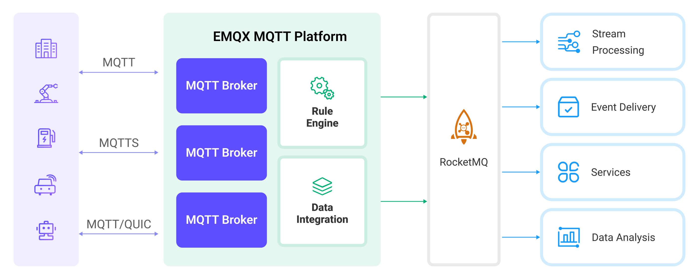

# Bridge MQTT Data into RocketMQ

EMQXは[RocketMQ](https://rocketmq.apache.org/)へのデータブリッジをサポートしており、MQTTメッセージやクライアントイベントをRocketMQに転送できます。例えば、RocketMQを利用してデバイスからのセンサーデータやログデータを収集することが可能です。

本ページでは、EMQXとRocketMQ間のデータ統合について詳細に解説し、データ統合の作成および検証方法を実践的に説明します。

::: tip 注意

Alibaba Cloudが提供するRocketMQサービスを利用する場合、本データ統合はバッチモードをサポートしていません。

:::

## 動作概要

RocketMQデータ統合は、EMQXに標準搭載された機能であり、EMQXのリアルタイムデータキャプチャおよび送信機能とRocketMQの強力なメッセージキュー処理機能を組み合わせています。組み込みの[ルールエンジン](./rules.md)コンポーネントにより、EMQXからRocketMQへのデータ取り込みが簡素化され、複雑なコーディングを不要にします。

以下の図は、EMQXとRocketMQ間の典型的なデータ統合アーキテクチャを示しています。



MQTTデータをRocketMQに取り込む流れは以下の通りです：

1. **メッセージのパブリッシュと受信**：産業用IoTデバイスはMQTTプロトコルを介してEMQXに正常に接続し、リアルタイムのMQTTデータをEMQXにパブリッシュします。EMQXがメッセージを受信すると、ルールエンジン内でマッチング処理を開始します。  
2. **メッセージデータの処理**：メッセージが到着するとルールエンジンを通過し、EMQXで定義されたルールにより処理されます。ルールは事前に定義された条件に基づき、RocketMQにルーティングすべきメッセージを判定します。ペイロード変換が指定されている場合は、データ形式の変換、特定情報のフィルタリング、追加コンテキストによるペイロードの強化などが適用されます。
3. **RocketMQへのデータ取り込み**：ルールによる処理が完了すると、メッセージをRocketMQに転送するアクションがトリガーされます。処理済みデータはシームレスにRocketMQに書き込まれます。
4. **データの保存と活用**：データがRocketMQに保存された後、企業はそのクエリ機能を活用して様々なユースケースに対応できます。例えば金融業界では、RocketMQを信頼性の高い高性能メッセージキューとして利用し、決済端末や取引システムからのデータを管理します。メッセージをデータ分析や規制プラットフォームに連携させ、リスク管理、不正検知防止、法令遵守などの要件を満たします。

## 特長とメリット

RocketMQとのデータ統合は、以下の特長と利点をビジネスにもたらします：

- **信頼性の高いIoTデータメッセージ配信**：EMQXはMQTTメッセージを信頼性高くバッチ送信でき、IoTデバイスとRocketMQおよびアプリケーションシステムの統合を実現します。
- **MQTTメッセージの変換**：ルールエンジンを活用し、EMQXはMQTTメッセージの抽出、フィルタリング、強化、変換を行い、RocketMQ送信前にデータを最適化します。
- **クラウドネイティブな弾力的スケーリング**：EMQXとRocketMQは共にクラウドネイティブアーキテクチャ上に構築されており、Kubernetes（K8s）に対応し、クラウドネイティブエコシステムと統合可能です。ビジネスの急速な成長に合わせて無限かつ弾力的にスケールアウトできます。
- **柔軟なトピックマッピング**：RocketMQデータ統合はMQTTトピックとRocketMQトピックの柔軟なマッピングをサポートし、RocketMQメッセージ内のキー（Key）や値（Value）の設定を簡単に行えます。
- **高スループットシナリオでの処理能力**：RocketMQデータ統合は同期・非同期の両書き込みモードをサポートし、用途に応じてレイテンシとスループットのバランスを柔軟に調整可能です。

## はじめる前に

本節では、RocketMQデータ統合の作成を開始する前に必要な準備、特にRocketMQサーバーのセットアップ方法について説明します。

### 前提条件

- EMQXデータ統合の[ルール](./rules.md)に関する知識
- [データ統合](./data-bridges.md)に関する知識

### RocketMQのインストール

1. RocketMQをセットアップするためのdocker-composeファイル`rocketmq.yaml`を準備します。

```yaml
version: '3.9'

services:
  mqnamesrv:
    image: apache/rocketmq:4.9.4
    container_name: rocketmq_namesrv
    ports:
      - 9876:9876
    volumes:
      - ./rocketmq/logs:/opt/logs
      - ./rocketmq/store:/opt/store
    command: ./mqnamesrv

  mqbroker:
    image: apache/rocketmq:4.9.4
    container_name: rocketmq_broker
    ports:
      - 10909:10909
      - 10911:10911
    volumes:
      - ./rocketmq/logs:/opt/logs
      - ./rocketmq/store:/opt/store
      - ./rocketmq/conf/broker.conf:/etc/rocketmq/broker.conf
    environment:
        NAMESRV_ADDR: "rocketmq_namesrv:9876"
        JAVA_OPTS: " -Duser.home=/opt"
        JAVA_OPT_EXT: "-server -Xms1024m -Xmx1024m -Xmn1024m"
    command: ./mqbroker -c /etc/rocketmq/broker.conf
    depends_on:
      - mqnamesrv
```

2. RocketMQの実行に必要なフォルダと設定を準備します。

```bash
mkdir rocketmq
mkdir rocketmq/logs
mkdir rocketmq/store
mkdir rocketmq/conf
```

3. 以下の内容を`rocketmq/conf/broker.conf`に保存します。

```bash
brokerClusterName=DefaultCluster
brokerName=broker-a
brokerId=0

brokerIP1=change me to your real IP address

defaultTopicQueueNums=4
autoCreateTopicEnable=true
autoCreateSubscriptionGroup=true

listenPort=10911
deleteWhen=04

fileReservedTime=120
mapedFileSizeCommitLog=1073741824
mapedFileSizeConsumeQueue=300000
diskMaxUsedSpaceRatio=100
maxMessageSize=65536

brokerRole=ASYNC_MASTER

flushDiskType=ASYNC_FLUSH
```

4. サーバーを起動します。

```bash
docker-compose -f rocketmq.yaml up
```

5. コンシューマーを起動します。

```
docker run --rm -e NAMESRV_ADDR=host.docker.internal:9876 apache/rocketmq:4.9.4 ./tools.sh org.apache.rocketmq.example.quickstart.Consumer
```
::: tip

Linux環境では、`host.docker.internal`を実際のIPアドレスに変更してください。

:::

## コネクターの作成

本節では、SinkをRocketMQサーバーに接続するためのコネクター作成方法を説明します。

以下の手順は、EMQXとRocketMQをローカルマシンで実行している場合を想定しています。リモート環境で実行している場合は設定を適宜調整してください。

1. EMQXダッシュボードに入り、**Integration** -> **Connectors**をクリックします。
2. ページ右上の**Create**をクリックします。
3. **Create Connector**ページで**RocketMQ**を選択し、**Next**をクリックします。
4. **Configuration**ステップで以下の情報を設定します：
   - **Connector name**：コネクター名を入力します。英数字の組み合わせで、例：`my_rocketmq`。
   - **Servers**：`127.0.0.1:9876`を入力します。
   - **Namespace**：RocketMQサービスにネームスペース設定がない場合は空欄のままにします。
   - **AccessKey**、**SecretKey**、**Secret Token**：RocketMQサービスの設定に応じて空欄のままか適宜入力します。
   - その他はデフォルトのままにします。
5. 詳細設定（任意）：詳細は[Sinkの特長](./data-bridges.md#features-of-sink)を参照してください。
6. **Create**をクリックする前に、**Test Connectivity**をクリックしてコネクターがRocketMQサーバーに接続できるか確認できます。
7. ページ下部の**Create**ボタンをクリックしてコネクター作成を完了します。ポップアップで**Back to Connector List**をクリックするか、**Create Rule**をクリックしてSinkを使ったルール作成に進めます。詳細は[メッセージ保存用RocketMQ Sinkのルール作成](#create-a-rule-with-rocketmq-sink-for-message-storage)および[イベント記録用RocketMQ Sinkのルール作成](#create-a-rule-with-rocketmq-sink-for-events-recording)を参照してください。

## メッセージ保存用RocketMQ Sinkのルール作成

本節では、ソースMQTTトピック`t/#`からのメッセージを処理し、処理済みデータを設定済みSink経由でRocketMQトピック`TopicTest`に転送するルールをダッシュボード上で作成する手順を説明します。

1. EMQXダッシュボードで**Integration** -> **Rules**をクリックします。

2. ページ右上の**Create**をクリックします。

3. ルールIDに`my_rule`を入力し、メッセージ保存用ルールとして以下のSQL文を**SQL Editor**に入力します。これはトピック`t/#`配下のMQTTメッセージをRocketMQに保存することを意味します。

   注意：独自のSQL構文を指定する場合は、Sinkが必要とする全てのフィールドを`SELECT`句に含めてください。

   ```sql
   SELECT 
     *
   FROM
     "t/#"
   ```

   ::: tip

   初心者の方は**SQL Examples**と**Enable Test**を利用してSQLルールの学習とテストが可能です。

   :::

4. + **Add Action**ボタンをクリックし、ルールでトリガーされるアクションを定義します。このアクションにより、EMQXはルールで処理したデータをRocketMQに送信します。

5. **Type of Action**ドロップダウンから`RocketMQ`を選択します。**Action**はデフォルトの`Create Action`のままにします。既存のSinkを選択することも可能ですが、本例では新規Sinkを作成します。

6. Sink名を入力します。英数字の組み合わせで指定してください。

7. **Connector**ドロップダウンから先に作成した`my_rocketmq`を選択します。新規コネクターを作成する場合はドロップダウン横のボタンをクリックします。設定パラメータの詳細は[コネクターの作成](#create-a-connector)を参照してください。

8. **RocketMQ Topic**欄に`TopicTest`を入力します。

9. **Template**はデフォルトで空欄のままにします。

   ::: tip

   ここを空欄にするとメッセージ全体がRocketMQに転送されます。実際にはJSONテンプレートデータです。

   :::

10. **フォールバックアクション（任意）**：メッセージ配信失敗時の信頼性向上のため、1つ以上のフォールバックアクションを定義できます。詳細は[フォールバックアクション](./data-bridges.md#fallback-actions)を参照してください。

11. 詳細設定（任意）：詳細は[Sinkの特長](./data-bridges.md#features-of-sink)を参照してください。

12. **Create**をクリックする前に**Test Connectivity**を押してSinkがRocketMQサーバーに接続可能か確認できます。

13. **Create**ボタンをクリックしてSink設定を完了します。新しいSinkが**Action Outputs**に追加されます。

14. **Create Rule**ページに戻り、設定内容を確認して**Create**をクリックしルールを生成します。

これでRocketMQ Sink用のルールが正常に作成されました。**Integration** -> **Rules**ページで新規ルールを確認できます。**Actions(Sink)**タブをクリックすると新しいRocketMQ Sinkが表示されます。

また、**Integration** -> **Flow Designer**を開くとトポロジーが表示され、トピック`t/#`配下のメッセージがルール`my_rule`で解析され、RocketMQに送信・保存されていることが確認できます。

## イベント記録用RocketMQ Sinkのルール作成

本節では、クライアントのオンライン／オフライン状態を記録し、イベントデータを設定済みSink経由でRocketMQトピック`TestTopic`に転送するルールの作成方法を説明します。

ルール作成手順は[メッセージ保存用RocketMQ Sinkのルール作成](#create-a-rule-with-rocketmq-sink-for-message-storage)とほぼ同様ですが、SQLルール構文が異なります。

オンライン／オフライン状態記録用のSQLルール構文は以下の通りです：

```sql
SELECT
  *
FROM 
  "$events/client_connected", "$events/client_disconnected"
```

::: tip

便宜上、オンライン／オフラインイベント受信用に`TopicTest`トピックを再利用します。

:::

## ルールのテスト

MQTTXを使ってトピック`t/1`にメッセージを送信し、オンライン／オフラインイベントをトリガーします。

```bash
mqttx pub -i emqx_c -t t/1 -m '{ "msg": "hello RocketMQ" }'
```

Sinkの稼働状況を確認すると、新規の受信メッセージと送信メッセージが1件ずつあるはずです。

データが`TopicTest`トピックに転送されているか確認してください。

以下のようなデータがコンシューマーにより出力されます。

```bash
ConsumeMessageThread_please_rename_unique_group_name_4_1 Receive New Messages: [MessageExt [brokerName=broker-a, queueId=3, storeSize=581, queueOffset=0, sysFlag=0, bornTimestamp=1679037578889, bornHost=/172.26.83.106:43920, storeTimestamp=1679037578891, storeHost=/172.26.83.106:10911, msgId=AC1A536A00002A9F000000000000060E, commitLogOffset=1550, bodyCRC=7414108, reconsumeTimes=0, preparedTransactionOffset=0, toString()=Message{topic='TopicTest', flag=0, properties={MIN_OFFSET=0, MAX_OFFSET=8, CONSUME_START_TIME=1679037605342, CLUSTER=DefaultCluster}, body=[...], transactionId='null'}]]
ConsumeMessageThread_please_rename_unique_group_name_4_2 Receive New Messages: [MessageExt [brokerName=broker-a, queueId=3, storeSize=511, queueOffset=1, sysFlag=0, bornTimestamp=1679037580174, bornHost=/172.26.83.106:43920, storeTimestamp=1679037580176, storeHost=/172.26.83.106:10911, msgId=AC1A536A00002A9F0000000000000E61, commitLogOffset=3681, bodyCRC=1604860416, reconsumeTimes=0, preparedTransactionOffset=0, toString()=Message{topic='TopicTest', flag=0, properties={MIN_OFFSET=0, MAX_OFFSET=8, CONSUME_START_TIME=1679037605342, CLUSTER=DefaultCluster}, body=[...], transactionId='null'}]]
ConsumeMessageThread_please_rename_unique_group_name_4_3 Receive New Messages: [MessageExt [brokerName=broker-a, queueId=3, storeSize=458, queueOffset=2, sysFlag=0, bornTimestamp=1679037584933, bornHost=/172.26.83.106:43920, storeTimestamp=1679037584934, storeHost=/172.26.83.106:10911, msgId=AC1A536A00002A9F000000000000166E, commitLogOffset=5742, bodyCRC=383397630, reconsumeTimes=0, preparedTransactionOffset=0, toString()=Message{topic='TopicTest', flag=0, properties={MIN_OFFSET=0, MAX_OFFSET=8, CONSUME_START_TIME=1679037605342, CLUSTER=DefaultCluster}, body=[...], transactionId='null'}]]
```
