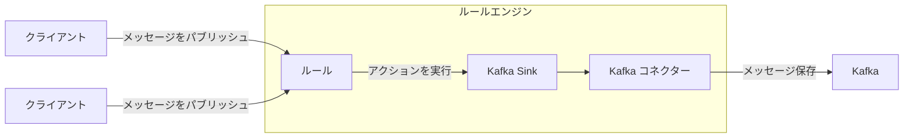
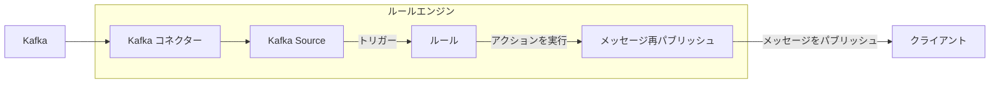
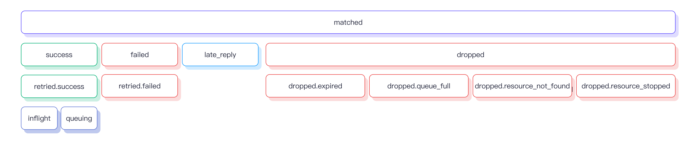

# データ統合

EMQXは、MQTTプロトコルを通じてIoTデバイスを接続し、リアルタイムでメッセージを送受信するMQTTメッセージングプラットフォームです。これを基盤として、EMQXのデータ統合は外部データシステムとの接続を導入し、デバイスと他のビジネスシステムとのシームレスな統合を可能にします。

<<<<<<< HEAD
データ統合では、SinkとSourceコンポーネントを用いて外部データシステムと接続します。SinkはMySQL、Kafka、HTTPサービスなどの外部データシステムへメッセージを送信するために使用され、SourceはMQTT、Kafka、GCP PubSubなどの外部データシステムからメッセージを受信するために使用されます。

この仕組みにより、EMQXは単なるIoTデバイス間のメッセージ送信を超え、デバイスが生成するデータをビジネス全体のエコシステムに有機的に統合します。これにより、IoTアプリケーションの適用シナリオが広がり、デバイスとビジネスシステム間の相互作用が豊かで多様になります。
=======
データ統合はSinkおよびSourceコンポーネントを用いて外部データシステムと接続します。SinkはMySQL、Kafka、HTTPサービスなどの外部データシステムへメッセージを送信するために使用され、SourceはMQTT、Kafka、GCP PubSubなどの外部データシステムからメッセージを受信するために使用されます。

この仕組みにより、EMQXは単なるIoTデバイス間のメッセージ送信を超えて、デバイス生成データを業務全体のエコシステムに有機的に統合します。これにより、IoTアプリケーションの適用シナリオが広がり、デバイスと業務システム間のやり取りが豊かで多様になります。
>>>>>>> origin/release-6.1

::: tip 注意

- EMQX v5.4.0以降、従来のデータブリッジはデータフローの方向に応じて分割され、SinkとSourceに名称変更されました。

- 現時点でEMQXがSourceとして対応している外部データシステムは以下の通りです：

  - MQTTサービス
  - Kafka
  - GCP PubSub

:::

<<<<<<< HEAD
本ページでは、SinkとSourceの動作原理、対応する外部データシステム、主要機能、管理方法について包括的に解説します。

## 動作原理

EMQXのデータ統合は標準機能として提供されています。MQTTメッセージングプラットフォームとして、EMQXはMQTTプロトコル経由でIoTデバイスからデータを受信します。内蔵のルールエンジンの助けを借りて、受信したデータはルールエンジンに設定されたルールによって処理されます。ルールは処理済みデータを設定されたSink/Sourceを通じて外部データシステムに転送するアクションをトリガーします。Dashboardの[ルール](./rule-get-started.md)や[Flowデザイナー](../flow-designer/introduction.md)を使えば、コーディング不要で簡単にルールの作成、アクションの紐付け、Sink/Sourceの作成が可能です。
=======
本ページでは、SinkとSourceの動作原理、対応する外部データシステム、主要機能、管理方法などを包括的に解説します。

## 動作原理

EMQXのデータ統合は標準機能として提供されています。MQTTメッセージングプラットフォームとして、EMQXはMQTTプロトコルを介してIoTデバイスからデータを受信します。組み込みのルールエンジンの助けを借りて、受信したデータはルールエンジンで設定されたルールにより処理されます。ルールは処理済みデータを設定されたSink/Sourceを通じて外部データシステムに転送するアクションをトリガーします。Dashboard上の[ルール](./rule-get-started.md)や[Flowデザイナー](../flow-designer/introduction.md)を使って、コーディング不要で簡単にルール作成、アクション設定、Sink/Source作成が可能です。
>>>>>>> origin/release-6.1

### 組み込みルールエンジン

<<<<<<< HEAD
様々なIoTデバイスやシステムからのデータソースは、多種多様なデータ型やフォーマットを持ちます。EMQXはSQLベースの強力な内蔵ルールエンジンを備えており、データ処理と配信の中核コンポーネントです。ルールエンジンは条件判定、文字列操作、データ型変換、圧縮／解凍など幅広い機能を持ち、複雑なデータの柔軟な処理を可能にします。

クライアントが特定のイベントをトリガーしたり、メッセージがEMQXに到達した際、ルールエンジンは事前定義されたルールに従いリアルタイムでデータを処理します。データ抽出、フィルタリング、付加情報の付与、フォーマット変換などの操作を行い、処理済みデータを指定されたSinkへ転送します。
=======
多様なIoTデバイスやシステムからのデータソースは、様々なデータ型やフォーマットを持ちます。EMQXはSQLベースの強力な組み込みルールエンジンを搭載しており、データ処理と配信の中核を担います。ルールエンジンは条件判定、文字列操作、データ型変換、圧縮・解凍など多彩な機能を備え、複雑なデータの柔軟な処理を可能にします。

クライアントが特定イベントをトリガーしたり、メッセージがEMQXに到達すると、ルールエンジンは事前定義されたルールに基づきリアルタイムでデータを処理します。データ抽出、フィルタリング、強化、フォーマット変換などを行い、処理済みデータを指定されたSinkに転送します。
>>>>>>> origin/release-6.1

ルールエンジンの詳細な動作については[ルールエンジン](./rules.md)章をご参照ください。

### Sink

<<<<<<< HEAD
Sinkはルールの[アクション](./rules.md)として追加されるデータ出力コンポーネントです。デバイスがイベントをトリガーしたり、メッセージがEMQXに到着すると、システムは対応するルールをマッチングして実行し、データのフィルタリングや処理を行います。ルールエンジンで処理されたデータは指定されたSinkへ転送されます。Sink内では`${var}`や`${.var}`構文を用いてデータから変数を抽出し、SQL文やデータテンプレートを動的に生成するなどの処理を設定できます。その後、対応する[コネクター](./connector.md)を介して外部データシステムへデータを送信し、メッセージの保存、データ更新、イベント通知などの操作を実現します。
=======
Sinkはルールの[アクション](./rules.md)に追加されるデータ出力コンポーネントです。デバイスがイベントをトリガーしたりメッセージがEMQXに到達すると、システムは対応するルールをマッチング・実行し、データをフィルタリング・処理します。ルールエンジンで処理されたデータは指定されたSinkに転送されます。Sinkでは`${var}`や`${.var}`構文を用いてデータから変数を抽出し、SQL文やデータテンプレートを動的に生成するなど、データの取り扱い方法を設定可能です。その後、対応する[コネクター](./connector.md)を通じて外部データシステムにデータを送信し、メッセージの保存、データ更新、イベント通知などの操作を実現します。
>>>>>>> origin/release-6.1



Sinkでサポートされる変数抽出構文は以下の通りです：

<<<<<<< HEAD
- `${var}`：ルールの出力結果から変数を抽出する構文です。例：`${topic}`。ネストした変数を抽出する場合はドット`.`を使います。例：`${payload.temp}`。抽出対象の変数が出力結果に含まれない場合は文字列`undefined`が返されます。
- `${.}`, `${.var}`：`${.}`はルールの全出力結果を含むJSON文字列を抽出し、`${.var}`は`${var}`と同義です。
=======
- `${var}`：ルールの出力結果から変数を抽出する構文です。例：`${topic}`。ネストした変数を抽出したい場合はドット`.`を使います。例：`${payload.temp}`。抽出対象の変数が出力結果に含まれない場合は文字列`undefined`が返されます。
- `${.}`, `${.var}`：`${.}`はルールの全出力結果を含むJSON文字列を抽出し、`${.var}`は`${var}`と同じ意味です。
>>>>>>> origin/release-6.1

### Source

Sourceはデータ入力コンポーネントであり、ルールの[データソース](./rule-sql-events-and-fields.md)として機能し、ルールSQLで選択されます。

<<<<<<< HEAD
SourceはMQTTやKafkaなどの外部データシステムからメッセージをサブスクライブまたはコンシュームします。コネクターを通じて新しいメッセージが到着すると、ルールエンジンは対応するルールをマッチングして実行し、データのフィルタリングや処理を行います。処理済みデータは指定されたEMQXトピックにパブリッシュされ、クラウドコマンドの配信などが可能になります。
=======
SourceはMQTTやKafkaなどの外部データシステムからメッセージをサブスクライブまたはコンシュームします。コネクター経由で新しいメッセージが到着すると、ルールエンジンは対応するルールをマッチング・実行し、データをフィルタリング・処理します。処理済みデータは指定されたEMQXトピックにパブリッシュされ、クラウドコマンド配信などの操作を可能にします。
>>>>>>> origin/release-6.1



## 対応統合

EMQXは以下の種類のデータシステムとのデータ統合をサポートしています：

**デフォルト**

- [MQTT](./data-bridge-mqtt.md)
- [Webhook](./webhook.md)/[HTTPServer](./data-bridge-webhook.md)

**クラウド**

- [Amazon Kinesis](./data-bridge-kinesis.md)
- [Azure EventHub](./data-bridge-azure-event-hub.md)
- [Azure Event Grid](./azure-event-grid.md)
- [GCP PubSub](./data-bridge-gcp-pubsub.md)

**TSDB**

- [Apache IoTDB](./data-bridge-iotdb.md)
- [InfluxDB](./data-bridge-influxdb.md)
- [OpenTSDB](./data-bridge-opents.md)
- [TimescaleDB](./data-bridge-timescale.md)
- [Datalayers](./data-bridge-datalayers.md)
- [Timestream for InfluxDB](./timestream-for-influxdb.md)

**SQL**

- [Cassandra](./data-bridge-cassa.md)
- [Microsoft SQL Server](./data-bridge-sqlserver.md)
- [MySQL](./data-bridge-mysql.md)
- [Oracle](./data-bridge-oracle.md)
- [PostgreSQL](./data-bridge-pgsql.md)
- [Lindorm](./lindorm.md)
- [Doris](./apache-doris.md)
- [AlloyDB](./alloydb.md)
- [CockroachDB](./cockroachdb.md)
- [Redshift](./redshift.md)
<<<<<<< HEAD
- [QuasarDB](./quasardb.md)
=======
>>>>>>> origin/release-6.1

**NoSQL**

- [ClickHouse](./data-bridge-clickhouse.md)
- [Couchbase](./data-bridge-couchbase.md)
- [DynamoDB](./data-bridge-dynamo.md)
- [Greptime](./data-bridge-greptimedb.md)
- [MongoDB](./data-bridge-mongodb.md)
- [Redis](./data-bridge-redis.md)
- [TDengine](./data-bridge-tdengine.md)
- [Elasticsearch](./elasticsearch.md)
- [EMQX Tables](./emqx-tables.md)

**メッセージキュー**

- [Apache Kafka/Confluent](./data-bridge-kafka.md)
- [Pulsar](./data-bridge-pulsar.md)
- [RabbitMQ](./data-bridge-rabbitmq.md)
- [RocketMQ](./data-bridge-rocketmq.md)

**その他**

- [SysKeeper](./syskeeper.md)
- [Amazon S3](./s3.md)
- [Amazon S3 Tables](./s3-tables.md)
- [Azure Blob Storage](./azure-blob-storage.md)
- [Snowflake](./snowflake.md)
- [Disk Log](./disk-log.md)
- [BigQuery](./bigquery.md)
- [Databricks](./databricks.md)

## Sinkの特徴

<<<<<<< HEAD
Sinkは以下の機能により、使い勝手を向上させるとともに、データ統合の性能と信頼性を高めます。すべてのSinkがこれらの機能を完全に実装しているわけではありません。各Sinkの対応状況はそれぞれのドキュメントをご確認ください。

### 非同期リクエストモード

非同期リクエストモードは、メッセージのパブリッシュ・サブスクライブ処理がSinkの実行速度に影響されないよう設計されています。ただし、非同期モードを有効にすると、サブスクライバーはメッセージを受信しているが、外部データシステムへの書き込みがまだ完了していない場合があります。

EMQXはデータ処理効率を高めるため、デフォルトで非同期リクエストモードを有効にしています。メッセージの配信タイミングに厳密な要件がある場合は、非同期リクエストモードを無効にしてください。

`max_inflight`パラメータも非同期リクエストにおけるメッセージ順序に影響します。一部のSinkにこのパラメータがあり、非同期モード時に同一MQTTクライアントからのメッセージを厳密に順序通り処理する必要がある場合は、この値を1に設定する必要があります。

### バッチモード

バッチモードは複数のデータエントリをまとめて外部データ統合システムに書き込む機能です。バッチモードを有効にすると、EMQXは各リクエストのデータ（単一エントリ）を一時的に蓄積し、一定時間経過または一定数のデータが蓄積された後にまとめて書き込みます（いずれも設定可能）。

**利点：**

- 書き込み効率の向上：単一メッセージ書き込みに比べ、データベースシステムがメッセージをキャッシュや前処理できるため、書き込み効率が改善されます。
- ネットワークレイテンシの低減：バッチ書き込みによりネットワーク送信回数が減少し、レイテンシが低減します。

**課題：**

書き込み遅延：設定された時間や件数に達するまでデータの書き込みが遅延します。これらの設定はパラメータで調整可能です。

### バッファキュー

バッファキューはSinkのフォールトトレランス機能の一部であり、データ安全性向上のため有効化が推奨されます。
=======
Sinkは以下の機能により利便性を高め、データ統合のパフォーマンスと信頼性を向上させます。すべてのSinkがこれらの機能を完全に実装しているわけではありません。各Sinkの対応状況はそれぞれのドキュメントをご参照ください。

### 非同期リクエストモード

非同期リクエストモードは、メッセージのパブリッシュ・サブスクライブ処理がSinkの実行速度に影響されないよう設計されています。ただし、非同期リクエストモードを有効にすると、サブスクライバーがメッセージを受信しても、まだ外部データシステムに書き込まれていない場合があります。

EMQXはデータ処理効率を高めるため、非同期リクエストモードをデフォルトで有効にしています。メッセージの配信タイミングに厳密な要件がある場合は、非同期リクエストモードを無効にしてください。

`max_inflight`パラメータも非同期リクエスト時のメッセージ順序に影響します。一部のSinkにこのパラメータがあり、非同期モードで同一MQTTクライアントからのメッセージを厳密に順序通りに処理する必要がある場合は、この値を1に設定してください。

### バッチモード

バッチモードは複数のデータエントリをまとめて外部データ統合システムに書き込む機能です。バッチモードが有効な場合、EMQXは各リクエストのデータ（単一エントリ）を一時的に蓄積し、一定時間経過または一定数のデータが蓄積された後にまとめてターゲットデータシステムに書き込みます（いずれも設定可能）。

**利点：**

- 書き込み効率の向上：単一メッセージ書き込みに比べ、データベースシステムがメッセージをキャッシュや前処理できるため、書き込み効率が向上します。
- ネットワークレイテンシの削減：バッチ書き込みによりネットワーク送信回数が減り、レイテンシが低減します。

**課題：**

書き込み遅延：設定された時間またはエントリ数に達するまでデータの書き込みが遅延します。これらの設定はパラメータで調整可能です。

### バッファキュー

バッファキューはSinkの一定レベルのフォールトトレランスを提供し、データ安全性向上のため有効化が推奨されます。
>>>>>>> origin/release-6.1

各リソース接続（MQTT接続ではありません）にはバッファキューの長さ（容量サイズ）があり、この長さを超えたデータはFIFO原則に従い破棄されます。

#### バッファファイルの場所

<<<<<<< HEAD
Kafka Sinkの場合、ディスクキャッシュファイルは`data/kafka`に保存され、その他のSinkでは`data/bufs`に保存されます。

実運用では、`data`ディレクトリを高性能ディスクにマウントすることでスループットを向上させることが可能です。
=======
Kafka Sinkの場合、ディスクキャッシュファイルは`data/kafka`にあります。その他のSinkは`data/bufs`にあります。

実運用では、`data`ディレクトリを高性能ディスクにマウントしてスループットを向上させることが可能です。
>>>>>>> origin/release-6.1

### プリペアドステートメント

MySQLやPostgreSQLなどのSQLデータベースでは、SQLテンプレートが事前処理され、フィールド変数を明示的に指定する必要がありません。

<<<<<<< HEAD
SQLを直接実行する場合、topicとpayloadは文字列型、qosは整数型としてシングルクォートで明示的に指定する必要があります：
=======
SQLを直接実行する場合、トピックとペイロードは文字列型としてシングルクォートで囲み、QoSは整数型として指定します：
>>>>>>> origin/release-6.1

```sql
INSERT INTO msg(topic, qos, payload) VALUES('${topic}', ${qos}, '${payload}');
```

しかし、プリペアドステートメント対応Sinkでは、SQLテンプレートは**クォートなし**で記述する必要があります：

```sql
INSERT INTO msg(topic, qos, payload) VALUES(${topic}, ${qos}, ${payload});
```

<<<<<<< HEAD
プリペアドステートメントはフィールド型を自動推論するだけでなく、SQLインジェクションを防止しセキュリティを強化します。

### フォールバックアクション

EMQX 5.9.0以降、任意のアクションに対してフォールバックアクションを定義できます。フォールバックアクションは、プライマリアクションがメッセージ処理に失敗した場合にトリガーされます。これにより、メッセージを別のSinkや再パブリッシュアクションなどのセカンダリターゲットに転送し、データの信頼性と可観測性を向上させます。

フォールバックアクションの用途例：

- 失敗したメッセージをバックアップデータシステム（例：別のSink）に転送
- 失敗メッセージを監視トピックに再パブリッシュし、トラブルシューティングやアラートに活用
- プライマリアクションの一時的な問題によるデータ損失を最小化
=======
プリペアドステートメントはフィールド型を自動推論するほか、SQLインジェクションを防止しセキュリティを強化します。

### フォールバックアクション

EMQX 5.9.0以降、任意のアクションに対してフォールバックアクションを定義可能です。プライマリアクションがメッセージ処理に失敗した場合、これらのフォールバックアクションがトリガーされます。これにより、メッセージを別のSinkや再パブリッシュアクションなどのセカンダリターゲットにリダイレクトし、データの信頼性と可観測性を向上させます。

フォールバックアクションの用途例：

- 失敗したメッセージをバックアップデータシステム（別のSinkなど）に転送
- 失敗したメッセージを監視トピックに再パブリッシュしトラブルシューティングやアラートに活用
- プライマリアクションの一時的障害時のデータ損失を最小化
>>>>>>> origin/release-6.1

#### 主要な特徴

- フォールバックアクションはプライマリアクションがメッセージ処理に失敗した場合のみトリガーされます。失敗には配信エラー、バッファオーバーフロー、リクエストTTL切れが含まれます。
- フォールバックアクションは自身の設定に関わらず常に非同期リクエストモードで動作します。
<<<<<<< HEAD
- 定義されたすべてのフォールバックアクションは同時にトリガーされます。EMQXは順次実行や最初の成功で停止しません。
- フォールバックアクションは通常のアクションと同じバッファリング機構を共有し、リクエストTTLまたはバッファオーバーフローまで再試行されます。
- フォールバックアクションはさらに別のフォールバックアクションをトリガーしません。フォールバックアクション自体が失敗しても、そのフォールバックは実行されません。
- フォールバックアクションによるメッセージ処理は、プライマリアクションやそれをトリガーしたルールのメトリクスに影響を与えません。
=======
- 定義されたすべてのフォールバックアクションは同時にトリガーされます。EMQXは順次試行や最初の成功で停止しません。
- フォールバックアクションは通常のアクションと同じバッファリング機構を共有し、リクエストTTLまたはバッファオーバーフローまでリトライされます。
- フォールバックアクションはさらに別のフォールバックアクションをトリガーしません。フォールバックアクション自身が失敗しても、そのフォールバックはトリガーされません。
- フォールバックアクションによるメッセージ処理はプライマリアクションや元のルールのメトリクスに影響を与えません。
>>>>>>> origin/release-6.1

#### フォールバックアクションの定義例

HTTPアクション`my_http`に対してフォールバックアクションを定義し、既存のMQTTアクション`fallback`を使用する例です。

```hcl
actions {
  http {
    my_http {
      fallback_actions = [
        {kind = reference, type = mqtt, name = fallback},
        {
          kind = republish,
          args = {
            topic = "fallback/republish/topic"
            qos = 1
            payload = "${payload}"
          }
        }
      ]
      # その他の設定は省略
    }
  }
  mqtt {
    fallback {
      fallback_actions = [
        {kind = reference, type = mqtt, name = another_fallback}
      ]
      # その他の設定は省略
    }
  }
}
```

この例では：

- HTTPアクション`my_http`が失敗した場合、メッセージは
<<<<<<< HEAD
  - MQTTアクション`fallback`に転送され、
  - トピック`fallback/republish/topic`に再パブリッシュされます。
- `fallback`も失敗した場合、`fallback`内で定義されたフォールバックアクション`another_fallback`はトリガーされません。フォールバックアクションは再帰的な連鎖をサポートしません。
- もし`fallback`が別のルールでプライマリアクションとしてトリガーされ失敗した場合、その自身のフォールバック`another_fallback`が適用されます。
=======
  - MQTTアクション`fallback`に転送され
  - トピック`fallback/republish/topic`に再パブリッシュされます
- `fallback`も失敗した場合、`fallback`に定義されたフォールバックアクション`another_fallback`は**トリガーされません**。フォールバックアクションは再帰的なチェーンをサポートしません。
- ただし、`fallback`が別ルールのプライマリアクションとしてトリガーされ失敗した場合は、そのフォールバック`another_fallback`が適用されます。
>>>>>>> origin/release-6.1

## Sinkの状態と統計

<<<<<<< HEAD
Dashboard上でSinkの稼働状況や統計情報を確認し、Sinkが正常に動作しているか把握できます。
=======
Dashboard上でSinkの稼働状況や統計情報を確認し、正常に動作しているかを把握できます。
>>>>>>> origin/release-6.1

### 稼働状態

Sinkは以下の状態を持ちます：

<<<<<<< HEAD
- `connecting`：ヘルスプローブがまだ行われていない初期状態で、外部データシステムへの接続を試みている段階です。
- `connected`：Sinkが正常に接続され、正常稼働中です。ヘルスプローブが失敗した場合、失敗の程度に応じて`connecting`または`disconnected`状態に遷移することがあります。
- `disconnected`：ヘルスプローブに失敗し、非正常状態です。設定により自動的に再接続を試みる場合があります。
- `stopped`：手動でSinkが無効化されています。
- `inconsistent`：クラスター内のノード間でSinkの状態に不整合があります。
=======
- `connecting`：ヘルスプローブが行われる前の初期状態で、外部データシステムへの接続を試行中
- `connected`：Sinkが正常に接続され稼働中。ヘルスプローブ失敗時は障害の程度に応じて`connecting`または`disconnected`に遷移する場合あり
- `disconnected`：ヘルスプローブに失敗し非正常状態。設定により自動的に再接続を試みることがある
- `stopped`：手動で無効化された状態
- `inconsistent`：クラスター内ノード間でSink状態に不一致がある状態
>>>>>>> origin/release-6.1

### 稼働統計

EMQXはデータ統合の稼働統計を以下のカテゴリで提供します：

- Matched（カウンター）
- Sent Successfully（カウンター）
- Sent Failed（カウンター）
- Dropped（カウンター）
- Late Reply（カウンター）
- Inflight（ゲージ）
- Queuing（ゲージ）



#### Matched

<<<<<<< HEAD
`matched`はSinkにルーティングされたリクエスト／メッセージの数をカウントします。状態に関わらずカウントされます。各メッセージは最終的に他のメトリクスでカウントされるため、`matched = success + failed + inflight + queuing + late_reply + dropped`となります。

#### Sent Successfully

`success`は外部データシステムに正常に受信されたメッセージ数をカウントします。`retried.success`は`success`のサブカウントで、少なくとも1回再試行されたメッセージ数を追跡します。したがって、`retried.success <= success`です。

#### Sent Failed

`failed`は外部データシステムへの受信に失敗したメッセージ数をカウントします。`retried.failed`は`failed`のサブカウントで、少なくとも1回再試行されたメッセージ数を追跡します。したがって、`retried.failed <= failed`です。

#### Dropped

`dropped`は配信試行なしに破棄されたメッセージ数をカウントします。複数の具体的なカテゴリを含み、それぞれ破棄理由を示します。計算式は`dropped = dropped.expired + dropped.queue_full + dropped.resource_stopped + dropped.resource_not_found`です。

- `expired`：メッセージのTTLがキューイング中に到達し、送信される前に破棄された。
- `queue_full`：キューの最大サイズに達し、メモリオーバーフロー防止のため破棄された。
- `resource_stopped`：Sinkが停止中に送信を試みたメッセージ。
- `resource_not_found`：Sinkが存在しない状態で送信を試みたメッセージ。まれに発生し、Sink削除時の競合状態が原因。
=======
`matched`はSinkにルーティングされたリクエスト／メッセージの数をカウントします。状態に関わらずカウントされます。各メッセージは他のメトリクスで最終的にカウントされるため、`matched = success + failed + inflight + queuing + late_reply + dropped`の関係があります。

#### Sent Successfully

`success`は外部データシステムに正常に受信されたメッセージ数をカウントします。`retried.success`は`success`のサブカウントで、少なくとも1回再送されたメッセージ数を追跡します。したがって、`retried.success <= success`です。

#### Sent Failed

`failed`は外部データシステムへの受信に失敗したメッセージ数をカウントします。`retried.failed`は`failed`のサブカウントで、少なくとも1回再送されたメッセージ数を追跡します。したがって、`retried.failed <= failed`です。

#### Dropped

`dropped`は配信試行なしに破棄されたメッセージ数をカウントします。複数の具体的なカテゴリに分類され、それぞれ異なる破棄理由を示します。計算式は`dropped = dropped.expired + dropped.queue_full + dropped.resource_stopped + dropped.resource_not_found`です。

- `expired`：メッセージのTTLがキューイング中に切れたため破棄
- `queue_full`：最大キューサイズに達し、メモリオーバーフロー防止のため破棄
- `resource_stopped`：Sinkが停止中に配信を試みたメッセージ
- `resource_not_found`：Sinkが存在しない状態で配信を試みたメッセージ。稀に発生し、Sink削除時の競合状態が原因
>>>>>>> origin/release-6.1

#### Late Reply

`late_reply`はメッセージ送信を試みたものの、基盤ドライバーからの応答がメッセージTTL切れ後に受信された場合にインクリメントされます。

::: tip
<<<<<<< HEAD
`late_reply`はメッセージが成功したか失敗したかを示すものではありません。外部データシステムへの挿入に成功した可能性もあれば、失敗した可能性もあります。また、接続タイムアウトが発生した可能性もあります。
=======
`late_reply`はメッセージが成功したか失敗したかを示すものではありません。外部データシステムへの挿入成功、挿入失敗、接続タイムアウトなど不明な状態を表します。
>>>>>>> origin/release-6.1
:::

#### Inflight

`inflight`はバッファリング層に存在し、外部データシステムからの応答を待っているメッセージ数を示すゲージです。

#### Queuing

`queuing`はバッファリング層で受信済みだが、まだ外部データシステムに送信されていないメッセージ数を示すゲージです。
