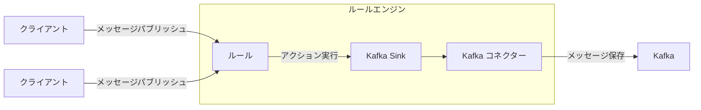
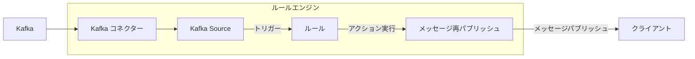

# データ統合

EMQXは、MQTTプロトコルを通じてIoTデバイスを接続し、リアルタイムでメッセージを送受信するMQTTメッセージングプラットフォームです。これを基盤として、EMQXのデータ統合は外部データシステムとの接続を導入し、デバイスと他の業務システムをシームレスに統合できるようにします。

データ統合はSinkとSourceコンポーネントを用いて外部データシステムと接続します。SinkはMySQL、Kafka、HTTPサービスなどの外部データシステムへメッセージを送信するために使用され、SourceはMQTT、Kafka、GCP PubSubなどの外部データシステムからメッセージを受信するために使用されます。

この仕組みにより、EMQXは単なるIoTデバイス間のメッセージ送信を超えて、デバイスが生成するデータを業務全体のエコシステムに有機的に統合します。これにより、IoTアプリケーションの適用シナリオが広がり、デバイスと業務システム間の連携がより豊かで多様になります。

::: tip 注意

- EMQX v5.4.0以降、従来のデータブリッジはデータフローの方向に応じて分割され、それぞれSinkとSourceに名称変更されました。

- 現時点でEMQXがSourceとして対応している外部データシステムは以下の通りです：

  - MQTTサービス
  - Kafka
  - GCP PubSub

:::

本ページでは、SinkとSourceの動作原理、対応外部データシステム、主な機能、管理方法について包括的に解説します。

## 動作原理

EMQXのデータ統合は標準機能として提供されています。MQTTメッセージングプラットフォームとして、EMQXはMQTTプロトコル経由でIoTデバイスからデータを受信します。内蔵のルールエンジンを活用し、受信したデータはルールエンジンに設定されたルールで処理されます。ルールは処理済みデータを設定されたSink/Sourceを通じて外部データシステムへ転送するアクションをトリガーします。ダッシュボード上の[ルール](./rule-get-started.md)や[Flowデザイナー](../flow-designer/introduction.md)を使って、コーディング不要でルール作成、アクション設定、Sink/Source作成が簡単に行えます。

### 内蔵ルールエンジン

さまざまなIoTデバイスやシステムからのデータソースは多種多様なデータ型やフォーマットを持ちます。EMQXはSQLベースの強力な内蔵ルールエンジンを備えており、データ処理と配信の中核を担います。ルールエンジンは条件判定、文字列操作、データ型変換、圧縮・解凍など多彩な機能を持ち、複雑なデータの柔軟な処理を可能にします。

クライアントが特定イベントをトリガーしたり、メッセージがEMQXに到達した際、ルールエンジンは事前定義されたルールに従ってリアルタイムにデータを処理します。データ抽出、フィルタリング、付加情報の追加、フォーマット変換などを行い、処理済みデータを指定されたSinkへ転送します。

ルールエンジンの詳細な動作は[ルールエンジン](./rules.md)章をご参照ください。

### Sink

Sinkはルールの[アクション](./rules.md)として追加されるデータ出力コンポーネントです。デバイスがイベントをトリガーしたりメッセージがEMQXに到着すると、システムは該当ルールをマッチングして実行し、データをフィルタリング・処理します。ルールエンジンで処理されたデータは指定されたSinkに転送されます。Sink内では`${var}`や`${.var}`構文を用いてデータから変数を抽出し、SQL文やデータテンプレートを動的に生成するなどの処理を設定可能です。その後、対応する[コネクター](./connector.md)を通じて外部データシステムにデータを送信し、メッセージの保存、データ更新、イベント通知などを実現します。



Sinkでサポートされる変数抽出構文は以下の通りです：

- `${var}`：ルールの出力結果から変数を抽出する構文です。例：`${topic}`。ネストした変数を抽出する場合はドット`.`を使い、`${payload.temp}`のように指定します。抽出対象の変数が出力結果に含まれない場合は文字列`undefined`が返されます。
- `${.}`, `${.var}`：`${.}`はルールの全出力結果を含むJSON文字列を抽出し、`${.var}`は`${var}`と同じ意味です。

### Source

Sourceはデータ入力コンポーネントであり、ルールの[データソース](./rule-sql-events-and-fields.md)として機能し、ルールSQLで選択されます。

SourceはMQTTやKafkaなどの外部データシステムからメッセージをサブスクライブまたはコンシュームします。コネクター経由で新しいメッセージが到着するとルールエンジンが該当ルールをマッチングして実行し、データをフィルタリング・処理します。処理済みデータは指定されたEMQXトピックにパブリッシュされ、クラウドコマンド配信などの操作が可能になります。



## 対応統合

EMQXは以下の種類のデータシステムとのデータ統合をサポートしています：

**デフォルト**

- [MQTT](./data-bridge-mqtt.md)
- [Webhook](./webhook.md)/[HTTPServer](./data-bridge-webhook.md)

**クラウド**

- [Amazon Kinesis](./data-bridge-kinesis.md)
- [Azure EventHub](./data-bridge-azure-event-hub.md)
- [Azure Event Grid](./azure-event-grid.md)
- [GCP PubSub](./data-bridge-gcp-pubsub.md)

**TSDB**

- [Apache IoTDB](./data-bridge-iotdb.md)
- [InfluxDB](./data-bridge-influxdb.md)
- [OpenTSDB](./data-bridge-opents.md)
- [TimescaleDB](./data-bridge-timescale.md)
- [Datalayers](./data-bridge-datalayers.md)
- [Timestream for InfluxDB](./timestream-for-influxdb.md)

**SQL**

- [Cassandra](./data-bridge-cassa.md)
- [Microsoft SQL Server](./data-bridge-sqlserver.md)
- [MySQL](./data-bridge-mysql.md)
- [Oracle](./data-bridge-oracle.md)
- [PostgreSQL](./data-bridge-pgsql.md)
- [Lindorm](./lindorm.md)
- [Doris](./apache-doris.md)
- [AlloyDB](./alloydb.md)
- [CockroachDB](./cockroachdb.md)
- [Redshift](./redshift.md)
- [QuasarDB](./quasardb.md)

**NoSQL**

- [ClickHouse](./data-bridge-clickhouse.md)
- [Couchbase](./data-bridge-couchbase.md)
- [DynamoDB](./data-bridge-dynamo.md)
- [Greptime](./data-bridge-greptimedb.md)
- [MongoDB](./data-bridge-mongodb.md)
- [Redis](./data-bridge-redis.md)
- [TDengine](./data-bridge-tdengine.md)
- [Elasticsearch](./elasticsearch.md)
- [EMQX Tables](./emqx-tables.md)

**メッセージキュー**

- [Apache Kafka/Confluent](./data-bridge-kafka.md)
- [Pulsar](./data-bridge-pulsar.md)
- [RabbitMQ](./data-bridge-rabbitmq.md)
- [RocketMQ](./data-bridge-rocketmq.md)

**その他**

- [SysKeeper](./syskeeper.md)
- [Amazon S3](./s3.md)
- [Amazon S3 Tables](./s3-tables.md)
- [Azure Blob Storage](./azure-blob-storage.md)
- [Snowflake](./snowflake.md)
- [Disk Log](./disk-log.md)
- [BigQuery](./bigquery.md)
- [Databricks](./databricks.md)

## Sinkの特徴

Sinkは以下の機能により利便性を高め、データ統合のパフォーマンスと信頼性を向上させます。すべてのSinkがこれらの機能を完全に実装しているわけではありません。詳細な対応状況は各Sinkのドキュメントをご参照ください。

### 非同期リクエストモード

非同期リクエストモードは、メッセージのパブリッシュ・サブスクライブ処理がSinkの実行速度に影響されないよう設計されています。ただし、非同期モードを有効にすると、サブスクライバーがメッセージを受信しても、外部データシステムへの書き込みがまだ完了していない場合があります。

データ処理効率向上のため、EMQXはデフォルトで非同期リクエストモードを有効にしています。メッセージの配信タイミングに厳密な要件がある場合は、非同期モードを無効にしてください。

`max_inflight`パラメータも非同期リクエストのメッセージ順序に影響します。一部のSinkに存在し、非同期モード時に同一MQTTクライアントからのメッセージを順序通りに処理する必要がある場合は、この値を1に設定する必要があります。

### バッチモード

バッチモードは複数のデータエントリをまとめて外部データ統合システムに書き込む機能です。バッチモード有効時、EMQXは各リクエストのデータ（単一エントリ）を一時的に蓄積し、一定時間経過または指定数のデータが溜まったタイミングでまとめて書き込みます（いずれも設定可能）。

**利点：**

- 書き込み効率の向上：単一メッセージ書き込みに比べ、データベースシステムがメッセージをキャッシュや前処理できるため効率が上がります。
- ネットワークレイテンシの低減：バッチ書き込みによりネットワーク送信回数が減り、レイテンシが低減します。

**課題：**

書き込み遅延：設定された時間または件数に達するまで書き込みが保留されるため、遅延が発生します。これらの設定はパラメータで調整可能です。

### バッファキュー

バッファキューはSinkの一定のフォールトトレランスを提供し、データ安全性向上のため有効化が推奨されます。

各リソース接続（MQTT接続ではありません）にはバッファキュー長（容量サイズ）があり、これを超えたデータはFIFO原則に従い破棄されます。

#### バッファファイルの場所

Kafka Sinkの場合、ディスクキャッシュファイルは`data/kafka`に保存されます。その他のSinkは`data/bufs`に保存されます。

実運用では`data`ディレクトリを高性能ディスクにマウントすることでスループット向上が可能です。

### プリペアドステートメント

MySQLやPostgreSQLなどのSQLデータベースでは、SQLテンプレートはフィールド変数を明示せずに事前処理実行されます。

直接SQLを実行する場合は、topicとpayloadを文字列型、qosをint型としてシングルクォートで明示的に指定する必要があります：

```sql
INSERT INTO msg(topic, qos, payload) VALUES('${topic}', ${qos}, '${payload}');
```

しかし、プリペアドステートメント対応Sinkでは、SQLテンプレートは必ずクォートなしで記述します：

```sql
INSERT INTO msg(topic, qos, payload) VALUES(${topic}, ${qos}, ${payload});
```

フィールド型の自動推論に加え、プリペアドステートメント技術はSQLインジェクション防止にも寄与します。

### フォールバックアクション

EMQX 5.9.0以降、任意のアクションに対してフォールバックアクションを定義可能です。これは、プライマリアクションがメッセージ処理に失敗した際にトリガーされる一連の代替アクションで、データの信頼性と可観測性を向上させます。メッセージを別のSinkや再パブリッシュアクションに転送できます。

フォールバックアクションの用途例：

- 失敗したメッセージをバックアップデータシステム（別のSinkなど）に転送
- 監視用トピックへ失敗メッセージを再パブリッシュし、トラブルシューティングやアラートに活用
- プライマリアクションの一時的な問題によるデータ損失を最小化

#### 主な特徴

- フォールバックアクションはプライマリアクションがメッセージ処理に失敗した場合のみトリガーされます。失敗には配信エラー、バッファオーバーフロー、リクエストTTL切れが含まれます。
- フォールバックアクションは自身の設定に関わらず常に非同期リクエストモードで動作します。
- 定義されたすべてのフォールバックアクションは同時にトリガーされます。EMQXは順次試行や最初の成功で停止しません。
- フォールバックアクションは通常アクションと同じバッファリング機構を共有し、リクエストTTLまたはバッファオーバーフローまでリトライします。
- フォールバックアクションはさらに別のフォールバックアクションをトリガーしません。フォールバックアクション自身が失敗しても、そのフォールバックは実行されません。
- フォールバックアクションによるメッセージ処理はプライマリアクションや元のルールのメトリクスに影響しません。

#### フォールバックアクションの定義例

HTTPアクション`my_http`に対してフォールバックアクションを定義し、既存のMQTTアクション`fallback`も利用する場合、以下のように設定します：

```hcl
actions {
  http {
    my_http {
      fallback_actions = [
        {kind = reference, type = mqtt, name = fallback},
        {
          kind = republish,
          args = {
            topic = "fallback/republish/topic"
            qos = 1
            payload = "${payload}"
          }
        }
      ]
      # 他の設定は省略
    }
  }
  mqtt {
    fallback {
      fallback_actions = [
        {kind = reference, type = mqtt, name = another_fallback}
      ]
      # 他の設定は省略
    }
  }
}
```

この例では：

- HTTPアクション`my_http`が失敗した場合、メッセージは：
  - MQTTアクション`fallback`に転送され
  - トピック`fallback/republish/topic`に再パブリッシュされます
- `fallback`が失敗しても、`fallback`内で定義されたフォールバックアクション`another_fallback`はトリガーされません。フォールバックアクションの再帰的チェーンはサポートされていません。
- ただし、`fallback`が別のルールのプライマリアクションとしてトリガーされ失敗した場合は、そのフォールバック`another_fallback`が適用されます。

## Sinkのステータスと統計情報

ダッシュボード上でSinkの稼働状況や統計情報を確認し、正常に動作しているか把握できます。

### 稼働ステータス

Sinkは以下のステータスを持ちます：

- `connecting`：ヘルスプローブが行われる前の初期状態で、外部データシステムへの接続を試みている状態
- `connected`：Sinkが正常に接続され稼働中。ヘルスプローブ失敗時は障害の程度に応じて`connecting`または`disconnected`に遷移する可能性あり
- `disconnected`：ヘルスプローブに失敗し非正常状態。設定により定期的に自動再接続を試みる場合あり
- `stopped`：手動で無効化された状態
- `inconsistent`：クラスター内のノード間でSinkの状態に不整合がある状態

### 稼働統計

EMQXはデータ統合の稼働統計を以下のカテゴリで提供します：

- Matched（カウンター）
- Sent Successfully（カウンター）
- Sent Failed（カウンター）
- Dropped（カウンター）
- Late Reply（カウンター）
- Inflight（ゲージ）
- Queuing（ゲージ）


#### Matched

`matched`統計はSinkにルーティングされたリクエスト／メッセージの総数をカウントします。状態に関わらず集計されます。各メッセージは他のメトリクスで最終的にカウントされるため、`matched = success + failed + inflight + queuing + late_reply + dropped`となります。

#### Sent Successfully

`success`統計は外部データシステムに正常に受信されたメッセージ数をカウントします。`retried.success`は`success`のサブカウントで、少なくとも1回配信リトライされたメッセージ数を追跡します。従って`retried.success <= success`です。

#### Sent Failed

`failed`統計は外部データシステムへの受信に失敗したメッセージ数をカウントします。`retried.failed`は`failed`のサブカウントで、少なくとも1回配信リトライされたメッセージ数を追跡します。従って`retried.failed <= failed`です。

#### Dropped

`dropped`統計は配信試行なしで破棄されたメッセージ数をカウントします。複数の具体的なカテゴリがあり、それぞれ破棄理由を示します。計算式は`dropped = dropped.expired + dropped.queue_full + dropped.resource_stopped + dropped.resource_not_found`です。

- `expired`：メッセージのTTLがキューイング中に期限切れとなった
- `queue_full`：最大キューサイズに達し、メモリオーバーフロー防止のため破棄された
- `resource_stopped`：Sinkが停止中に配信を試みたメッセージ
- `resource_not_found`：Sinkが存在しない状態で配信を試みたメッセージ。稀に発生し、Sink削除時の競合状態が原因

#### Late Reply

`late_reply`統計はメッセージ送信を試みたが、基盤ドライバーからの応答がメッセージTTL切れ後に届いた場合にインクリメントされます。

::: tip
`late_reply`はメッセージの送信成功・失敗を示すものではありません。外部データシステムへの挿入成功、失敗、あるいは接続タイムアウトなど不明な状態を表します。
:::

#### Inflight

`inflight`統計はバッファリング層内で現在送信中で外部データシステムの応答待ちのメッセージ数を示すゲージです。

#### Queuing

`queuing`はバッファリング層で受信済みだがまだ外部データシステムに送信されていないメッセージ数を示すゲージです。
