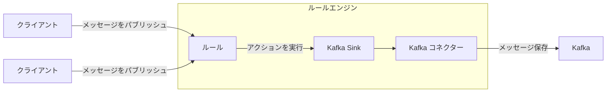
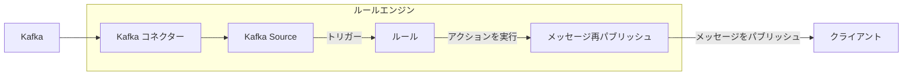

# データ統合

EMQXは、MQTTプロトコルを介してIoTデバイスを接続し、リアルタイムでメッセージを送信するMQTTメッセージングプラットフォームです。これを基盤として、EMQXのデータ統合は外部データシステムとの接続を導入し、デバイスと他の業務システムとのシームレスな統合を可能にします。

データ統合は、SinkおよびSourceコンポーネントを使用して外部データシステムと接続します。SinkはMySQL、Kafka、HTTPサービスなどの外部データシステムへメッセージを送信するために使用され、SourceはMQTT、Kafka、GCP PubSubなどの外部データシステムからメッセージを受信するために使用されます。

この仕組みにより、EMQXは単なるIoTデバイス間のメッセージ送信を超えて、デバイス生成データを業務全体のエコシステムに有機的に統合します。これにより、IoTアプリケーションの適用シナリオが拡大し、デバイスと業務システム間の連携が豊かで多様になります。

::: tip 注意

- EMQX v5.4.0以降、従来のデータブリッジはデータフローの方向に応じて分割され、SinkおよびSourceに名称変更されました。

- 現時点でEMQXがSourceとしてサポートする外部データシステムは以下の通りです：

  - MQTTサービス
  - Kafka
  - GCP PubSub

:::

本ページでは、SinkおよびSourceの動作原理、対応する外部データシステム、主な機能、管理方法について包括的に解説します。

## 動作原理

EMQXのデータ統合は標準機能として提供されています。MQTTメッセージングプラットフォームとして、EMQXはMQTTプロトコルを介してIoTデバイスからデータを受信します。内蔵のルールエンジンの助けを借りて、受信したデータはルールエンジンで設定されたルールにより処理されます。ルールは処理済みデータを設定されたSink/Sourceを通じて外部データシステムへ転送するアクションをトリガーします。Dashboard上の[ルール](./rule-get-started.md)や[Flowデザイナー](../flow-designer/introduction.md)を使って、コーディング不要で簡単にルール作成、アクションの紐付け、Sink/Sourceの作成が可能です。

### 内蔵ルールエンジン

様々なIoTデバイスやシステムからのデータソースは、多種多様なデータ型やフォーマットを持ちます。EMQXはSQLルールベースの強力な内蔵ルールエンジンを備えており、データ処理と配信の中核コンポーネントです。条件判定、文字列操作、データ型変換、圧縮/解凍など幅広い機能を持ち、複雑なデータを柔軟に扱えます。

クライアントが特定イベントをトリガーしたりメッセージがEMQXに到達すると、ルールエンジンは事前定義されたルールに従いリアルタイムでデータを処理します。データ抽出、フィルタリング、付加情報付与、フォーマット変換などを行い、処理済みデータを指定されたSinkへ転送します。

ルールエンジンの詳細な動作は[ルールエンジン](./rules.md)章をご参照ください。

### Sink

Sinkはルールの[アクション](./rules.md)に追加されるデータ出力コンポーネントです。デバイスがイベントをトリガーしたりメッセージがEMQXに届くと、システムは該当ルールをマッチングして実行し、データをフィルタリング・処理します。ルールエンジンで処理されたデータは指定されたSinkに転送されます。Sink内では`${var}`や`${.var}`構文を用いてデータから変数を抽出し、SQL文やデータテンプレートを動的に生成するなどの処理を設定できます。その後、対応する[コネクター](./connector.md)を通じて外部データシステムへデータを送信し、メッセージ保存、データ更新、イベント通知などの操作を実現します。



Sinkでサポートされる変数抽出構文は以下の通りです：

- `${var}`：ルールの出力結果から変数を抽出する構文です。例：`${topic}`。ネストした変数を抽出したい場合はドット`.`を使用します。例：`${payload.temp}`。抽出対象の変数が出力結果に含まれない場合は文字列`undefined`が返されます。
- `${.}`, `${.var}`：`${.}`はルールの出力結果全体を含むJSON文字列を抽出し、`${.var}`は`${var}`と同じ意味です。

### Source

Sourceはデータ入力コンポーネントであり、ルールの[データソース](./rule-sql-events-and-fields.md)として機能し、ルールのSQLで選択されます。

SourceはMQTTやKafkaなどの外部データシステムからメッセージをサブスクライブまたはコンシュームします。コネクターを通じて新しいメッセージが到着すると、ルールエンジンは該当するルールをマッチングして実行し、データをフィルタリング・処理します。処理後のデータは指定されたEMQXトピックにパブリッシュされ、クラウドコマンド配信などの操作が可能になります。



## 対応する統合

EMQXは以下の種類のデータシステムとのデータ統合をサポートしています：

**デフォルト**

- [MQTT](./data-bridge-mqtt.md)
- [Webhook](./webhook.md)/[HTTPServer](./data-bridge-webhook.md)

**クラウド**

- [Amazon Kinesis](./data-bridge-kinesis.md)
- [Azure EventHub](./data-bridge-azure-event-hub.md)
- [GCP PubSub](./data-bridge-gcp-pubsub.md)

**TSDB**

- [Apache IoTDB](./data-bridge-iotdb.md)
- [InfluxDB](./data-bridge-influxdb.md)
- [OpenTSDB](./data-bridge-opents.md)
- [TimescaleDB](./data-bridge-timescale.md)
- [Datalayers](./data-bridge-datalayers.md)

**SQL**

- [Cassandra](./data-bridge-cassa.md)
- [Microsoft SQL Server](./data-bridge-sqlserver.md)
- [MySQL](./data-bridge-mysql.md)
- [Oracle](./data-bridge-oracle.md)
- [PostgreSQL](./data-bridge-pgsql.md)
- [Lindorm](./lindorm.md)
- [Doris](./apache-doris.md)
- [AlloyDB](./alloydb.md)
- [CockroachDB](./cockroachdb.md)
- [Redshift](./redshift.md)

**NoSQL**

- [ClickHouse](./data-bridge-clickhouse.md)
- [Couchbase](./data-bridge-couchbase.md)
- [DynamoDB](./data-bridge-dynamo.md)
- [Greptime](./data-bridge-greptimedb.md)
- [MongoDB](./data-bridge-mongodb.md)
- [Redis](./data-bridge-redis.md)
- [TDengine](./data-bridge-tdengine.md)
- [Elasticsearch](./elasticsearch.md)

**メッセージキュー**

- [Apache Kafka/Confluent](./data-bridge-kafka.md)
- [Pulsar](./data-bridge-pulsar.md)
- [RabbitMQ](./data-bridge-rabbitmq.md)
- [RocketMQ](./data-bridge-rocketmq.md)

**その他**

- [SysKeeper](./syskeeper.md)
- [Amazon S3](./s3.md)
- [Amazon S3 Tables](./s3-tables.md)
- [Azure Blob Storage](./azure-blob-storage.md)
- [Snowflake](./snowflake.md)
- [Disk Log](./disk-log.md)
- [BigQuery](./bigquery.md)
- [Databricks](./databricks.md)

## Sinkの特徴

Sinkは以下の機能により利便性を高め、データ統合のパフォーマンスと信頼性を向上させます。すべてのSinkがこれらの機能を完全に実装しているわけではありません。各Sinkの対応状況はそれぞれのドキュメントをご参照ください。

### 非同期リクエストモード

非同期リクエストモードは、メッセージのパブリッシュ・サブスクライブ処理がSinkの実行速度に影響されるのを防ぐために設計されています。ただし、非同期リクエストモードを有効にすると、サブスクライバーがメッセージを受信しても外部データシステムへの書き込みがまだ完了していない場合があります。

データ処理効率を高めるため、EMQXはデフォルトで非同期リクエストモードを有効にしています。メッセージの配信タイミングに厳密な要件がある場合は、非同期リクエストモードを無効にしてください。

`max_inflight`パラメータも非同期リクエストのメッセージ順序に影響します。一部のSinkにこのパラメータがあり、非同期モード時に同一MQTTクライアントからのメッセージを順序通りに処理する必要がある場合は、この値を1に設定する必要があります。

### バッチモード

バッチモードは複数のデータエントリをまとめて外部データ統合システムに書き込むことを可能にします。バッチモードが有効な場合、EMQXは各リクエストのデータ（単一エントリ）を一時的に蓄積し、一定時間経過または一定数のデータが蓄積された後にまとめてターゲットのデータシステムへ書き込みます（いずれも設定可能）。

**利点：**

- 書き込み効率の向上：単一メッセージ書き込みに比べ、バッチモードではデータベースシステムがメッセージをキャッシュまたは前処理できるため、書き込み効率が向上します。
- ネットワークレイテンシの低減：バッチ書き込みによりネットワーク送信回数が減り、レイテンシが低減します。

**課題：**

書き込み遅延：設定された時間またはエントリ数に達するまでデータの書き込みが遅延します。これらの設定はパラメータで調整可能です。

### バッファキュー

バッファキューはSinkに一定のフォールトトレランスを提供し、データ安全性向上のために有効化が推奨されます。

各リソース接続（MQTT接続ではありません）にはバッファキュー長（容量サイズ）があり、この長さを超えたデータはFIFO原則に従い破棄されます。

#### バッファファイルの場所

Kafka Sinkの場合、ディスクキャッシュファイルは`data/kafka`に格納されます。その他のSinkでは`data/bufs`に格納されます。

実運用では`data`ディレクトリを高性能ディスクにマウントすることでスループットを向上させることが可能です。

### プリペアドステートメント

MySQL、PostgreSQLなどのSQLデータベースでは、SQLテンプレートはフィールド変数を明示的に指定せずにプリプロセス実行されます。

SQLを直接実行する場合は、topicとpayloadを文字列型、qosを整数型としてシングルクォートで明示的に指定する必要があります：

```sql
INSERT INTO msg(topic, qos, payload) VALUES('${topic}', ${qos}, '${payload}');
```

しかし、プリペアドステートメント対応のSinkでは、SQLテンプレートは**クォートなし**のプリペアドステートメントを使用しなければなりません：

```sql
INSERT INTO msg(topic, qos, payload) VALUES(${topic}, ${qos}, ${payload});
```

これによりフィールド型の自動推論が可能となり、SQLインジェクション防止によるセキュリティ強化も実現します。

### フォールバックアクション

EMQX 5.9.0以降、任意のアクションに対してフォールバックアクションを定義できます。これは、プライマリアクションがメッセージ処理に失敗した際にトリガーされる一連の代替アクションです。これにより、メッセージを別のSinkや再パブリッシュアクションにリダイレクトし、データの信頼性と可観測性を向上させます。

フォールバックアクションの用途例：

- 失敗したメッセージをバックアップデータシステム（別のSinkなど）に転送
- 監視トピックへの失敗メッセージ再パブリッシュによるトラブルシューティングやアラート
- プライマリアクションの一時的な問題によるデータ損失の最小化

#### 主な特徴

- フォールバックアクションはプライマリアクションがメッセージ処理に失敗した場合のみトリガーされます。失敗には配信エラー、バッファオーバーフロー、リクエストTTL切れが含まれます。
- フォールバックアクションは自身の設定に関わらず常に非同期リクエストモードで動作します。
- 定義されたすべてのフォールバックアクションは同時にトリガーされます。EMQXは順番に試行したり最初の成功で停止したりしません。
- フォールバックアクションは通常のアクションと同じバッファリング機構を共有し、メッセージはリクエストTTLまたはバッファオーバーフローまでリトライされます。
- フォールバックアクションはさらに別のフォールバックアクションをトリガーしません。フォールバックアクション自身が失敗しても、そのフォールバックは実行されません。
- フォールバックアクションによるメッセージ処理は、プライマリアクションやそれをトリガーしたルールのメトリクスに影響を与えません。

#### フォールバックアクションの定義例

HTTPアクション`my_http`に対してフォールバックアクションを定義し、既存のMQTTアクション`fallback`を利用する例です。

```hcl
actions {
  http {
    my_http {
      fallback_actions = [
        {kind = reference, type = mqtt, name = fallback},
        {
          kind = republish,
          args = {
            topic = "fallback/republish/topic"
            qos = 1
            payload = "${payload}"
          }
        }
      ]
      # その他の設定は省略
    }
  }
  mqtt {
    fallback {
      fallback_actions = [
        {kind = reference, type = mqtt, name = another_fallback}
      ]
      # その他の設定は省略
    }
  }
}
```

この例では：

- HTTPアクション`my_http`が失敗した場合、メッセージは以下に処理されます：
  - MQTTアクション`fallback`に転送
  - トピック`fallback/republish/topic`に再パブリッシュ
- `fallback`も失敗した場合、`fallback`に定義されたフォールバックアクション`another_fallback`は**トリガーされません**。フォールバックアクションは再帰的な連鎖をサポートしません。
- ただし、`fallback`が別ルールのプライマリアクションとしてトリガーされ失敗した場合は、そのフォールバック`another_fallback`が適用されます。

## Sinkの状態と統計情報

Dashboard上でSinkの稼働状態や統計情報を確認し、正常に動作しているかを把握できます。

### 稼働状態

Sinkは以下の状態を持ちます：

- `connecting`：ヘルスプローブが行われる前の初期状態で、外部データシステムへの接続を試行中。
- `connected`：Sinkが正常に接続され、正常稼働中。ヘルスプローブ失敗時は障害の程度により`connecting`または`disconnected`に遷移する可能性あり。
- `disconnected`：ヘルスプローブに失敗し異常状態。設定に応じて自動的に再接続を試みる場合あり。
- `stopped`：手動で無効化された状態。
- `inconsistent`：クラスターのノード間でSinkの状態に不整合がある状態。

### 稼働統計

EMQXはデータ統合の稼働統計を以下のカテゴリで提供します：

- Matched（カウンター）
- Sent Successfully（カウンター）
- Sent Failed（カウンター）
- Dropped（カウンター）
- Late Reply（カウンター）
- Inflight（ゲージ）
- Queuing（ゲージ）


#### Matched

`matched`はSinkにルーティングされたリクエスト／メッセージ数をカウントします。状態に関わらずカウントされます。各メッセージは他のメトリクスで最終的に計上されるため、計算式は以下の通りです：

`matched = success + failed + inflight + queuing + late_reply + dropped`

#### Sent Successfully

`success`は外部データシステムに正常に受信されたメッセージ数をカウントします。`retried.success`は`success`のサブカウントで、少なくとも1回再送されたメッセージ数を追跡します。したがって、`retried.success <= success`です。

#### Sent Failed

`failed`は外部データシステムへの受信に失敗したメッセージ数をカウントします。`retried.failed`は`failed`のサブカウントで、少なくとも1回再送されたメッセージ数を追跡します。したがって、`retried.failed <= failed`です。

#### Dropped

`dropped`は配信試行なしに破棄されたメッセージ数をカウントします。複数の具体的なカテゴリに分かれており、それぞれ破棄理由を示します。計算式は以下の通りです：

`dropped = dropped.expired + dropped.queue_full + dropped.resource_stopped + dropped.resource_not_found`

- `expired`：キューイング中にメッセージのTTLが切れた。
- `queue_full`：キューの最大サイズに達し、メモリオーバーフロー防止のため破棄された。
- `resource_stopped`：Sinkが停止中に配信を試みたメッセージ。
- `resource_not_found`：Sinkが存在しない状態で配信を試みたメッセージ。稀に発生し、Sink削除時の競合状態が原因。

#### Late Reply

`late_reply`はメッセージ配信を試みたが、基盤ドライバーからの応答がメッセージTTL切れ後に届いた場合にインクリメントされます。

::: tip
`late_reply`はメッセージが成功したか失敗したかを示すものではありません。状態は不明で、外部データシステムへの挿入成功、失敗、または接続タイムアウトなどが考えられます。
:::

#### Inflight

`inflight`はバッファリング層内で現在処理中（外部データシステムの応答待ち）のメッセージ数を示すゲージです。

#### Queuing

`queuing`はバッファリング層で受信済みだがまだ外部データシステムへ送信されていないメッセージ数を示すゲージです。
