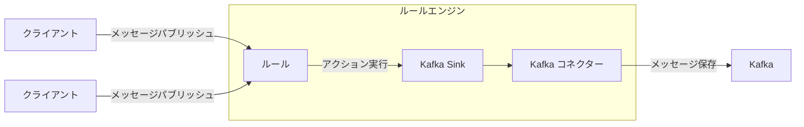
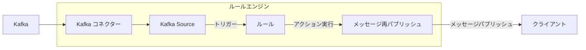

# データ統合

EMQXは、MQTTプロトコルを通じてIoTデバイスを接続し、リアルタイムでメッセージを送信するMQTTメッセージングプラットフォームです。これを基盤として、EMQXのデータ統合は外部データシステムとの接続を導入し、デバイスと他のビジネスシステムとのシームレスな統合を可能にします。

データ統合は、SinkおよびSourceコンポーネントを使用して外部データシステムと接続します。SinkはMySQL、Kafka、HTTPサービスなどの外部データシステムへメッセージを送信するために使用され、SourceはMQTT、Kafka、GCP PubSubなどの外部データシステムからメッセージを受信するために使用されます。

このプロセスにより、EMQXは単なるIoTデバイス間のメッセージ送信を超え、デバイス生成データをビジネスエコシステム全体に有機的に統合できます。これにより、IoTアプリケーションの適用シナリオが拡大し、デバイスとビジネスシステム間の相互作用が豊かで多様になります。

::: tip 注意

- EMQX v5.4.0以降、従来のデータブリッジはデータフローの方向に応じて分割され、SinkおよびSourceに名称変更されました。

- 現時点でEMQXは以下の外部データシステムをSourceとしてサポートしています：

  - MQTTサービス
  - Kafka
  - GCP PubSub

:::

本ページでは、SinkおよびSourceの動作原理、対応する外部データシステム、主要機能、管理方法について包括的に解説します。

## 動作原理

EMQXのデータ統合は標準機能として提供されています。MQTTメッセージングプラットフォームとして、EMQXはMQTTプロトコルを介してIoTデバイスからデータを受信します。組み込みのルールエンジンの助けを借りて、受信したデータはルールエンジンに設定されたルールによって処理されます。ルールは処理済みデータを設定されたSink/Sourceを通じて外部データシステムに転送するアクションをトリガーします。ダッシュボード上の[ルール](./rule-get-started.md)や[Flowデザイナー](../flow-designer/introduction.md)を使って、コーディング不要で簡単にルール作成、アクションの紐付け、Sink/Sourceの作成が可能です。

### 組み込みルールエンジン

さまざまなIoTデバイスやシステムからのデータソースは、多種多様なデータ型やフォーマットを持ちます。EMQXはSQLルールをベースとした強力な組み込みルールエンジンを備えており、これはデータ処理と配信の中核コンポーネントです。ルールエンジンは条件判定、文字列操作、データ型変換、圧縮・解凍など幅広い機能を持ち、複雑なデータを柔軟に扱えます。

クライアントが特定のイベントをトリガーしたり、メッセージがEMQXに到達した際、ルールエンジンは事前定義されたルールに従ってリアルタイムにデータを処理します。データ抽出、フィルタリング、付加情報の追加、フォーマット変換などの操作を行い、処理済みデータを指定されたSinkへ転送します。

ルールエンジンの詳細な動作については[ルールエンジン](./rules.md)章をご覧ください。

### Sink

Sinkはルールの[アクション](./rules.md)に追加されるデータ出力コンポーネントです。デバイスがイベントをトリガーしたりメッセージがEMQXに到着すると、システムは対応するルールをマッチングして実行し、データをフィルタリング・処理します。ルールエンジンで処理されたデータは指定されたSinkに転送されます。Sinkでは、`${var}`や`${.var}`構文を使ってデータから変数を抽出し、動的にSQL文やデータテンプレートを生成するなど、データの取り扱い方法を設定できます。その後、対応する[コネクター](./connector.md)を通じて外部データシステムに送信され、メッセージの保存、データ更新、イベント通知などの操作が可能になります。



Sinkでサポートされる変数抽出構文は以下の通りです：

- `${var}`：ルールの出力結果から変数を抽出する構文です。例：`${topic}`。ネストした変数を抽出したい場合はドット`.`を使います。例：`${payload.temp}`。抽出対象の変数が出力結果に含まれない場合は文字列`undefined`が返されます。
- `${.}`, `${.var}`：`${.}`はルールの全出力結果を含むJSON文字列を抽出し、`${.var}`は`${var}`と同義です。

### Source

Sourceはデータ入力コンポーネントであり、ルールの[データソース](./rule-sql-events-and-fields.md)として機能し、ルールSQLを通じて選択されます。

SourceはMQTTやKafkaなどの外部データシステムからメッセージをサブスクライブまたはコンシュームします。コネクターを通じて新しいメッセージが到着すると、ルールエンジンは対応するルールをマッチングして実行し、データをフィルタリング・処理します。処理済みデータは指定されたEMQXトピックにパブリッシュされ、クラウドコマンド配信などの操作が可能になります。



## 対応統合

EMQXは以下の種類のデータシステムとのデータ統合をサポートしています：

**デフォルト**

- [MQTT](./data-bridge-mqtt.md)
- [Webhook](./webhook.md)/[HTTPServer](./data-bridge-webhook.md)

**クラウド**

- [Amazon Kinesis](./data-bridge-kinesis.md)
- [Azure EventHub](./data-bridge-azure-event-hub.md)
- [Azure Event Grid](./azure-event-grid.md)
- [GCP PubSub](./data-bridge-gcp-pubsub.md)

**TSDB**

- [Apache IoTDB](./data-bridge-iotdb.md)
- [InfluxDB](./data-bridge-influxdb.md)
- [OpenTSDB](./data-bridge-opents.md)
- [TimescaleDB](./data-bridge-timescale.md)
- [Datalayers](./data-bridge-datalayers.md)
- [Timestream for InfluxDB](./timestream-for-influxdb.md)

**SQL**

- [Cassandra](./data-bridge-cassa.md)
- [Microsoft SQL Server](./data-bridge-sqlserver.md)
- [MySQL](./data-bridge-mysql.md)
- [Oracle](./data-bridge-oracle.md)
- [PostgreSQL](./data-bridge-pgsql.md)
- [Lindorm](./lindorm.md)
- [Doris](./apache-doris.md)
- [AlloyDB](./alloydb.md)
- [CockroachDB](./cockroachdb.md)
- [Redshift](./redshift.md)
- [QuasarDB](./quasardb.md)

**NoSQL**

- [ClickHouse](./data-bridge-clickhouse.md)
- [Couchbase](./data-bridge-couchbase.md)
- [DynamoDB](./data-bridge-dynamo.md)
- [Greptime](./data-bridge-greptimedb.md)
- [MongoDB](./data-bridge-mongodb.md)
- [Redis](./data-bridge-redis.md)
- [TDengine](./data-bridge-tdengine.md)
- [Elasticsearch](./elasticsearch.md)
- [EMQX Tables](./emqx-tables.md)
- [Bigtable](./bigtable.md)

**メッセージキュー**

- [Apache Kafka/Confluent](./data-bridge-kafka.md)
- [Pulsar](./data-bridge-pulsar.md)
- [RabbitMQ](./data-bridge-rabbitmq.md)
- [RocketMQ](./data-bridge-rocketmq.md)

**その他**

- [SysKeeper](./syskeeper.md)
- [Amazon S3](./s3.md)
- [Amazon S3 Tables](./s3-tables.md)
- [Azure Blob Storage](./azure-blob-storage.md)
- [Snowflake](./snowflake.md)
- [Disk Log](./disk-log.md)
- [BigQuery](./bigquery.md)
- [Databricks](./databricks.md)

## Sinkの特徴

Sinkは以下の機能により利便性を高め、データ統合の性能と信頼性を向上させます。すべてのSinkがこれらの機能を完全に実装しているわけではありません。詳細な対応状況は各Sinkのドキュメントをご参照ください。

### 非同期リクエストモード

非同期リクエストモードは、メッセージのパブリッシュ・サブスクライブ処理がSinkの実行速度に影響されるのを防ぐために設計されています。ただし、非同期リクエストモードを有効にすると、サブスクライバーがメッセージを受信していても、外部データシステムへの書き込みがまだ完了していない場合があります。

EMQXではデータ処理効率を高めるため、非同期リクエストモードがデフォルトで有効になっています。メッセージの配信タイミングに厳密な要件がある場合は、非同期リクエストモードを無効にしてください。

`max_inflight`パラメータも非同期リクエスト時のメッセージ順序に影響します。いくつかのSinkにこのパラメータがあり、非同期モードで同一MQTTクライアントからのメッセージを順序通りに処理する必要がある場合、この値を1に設定する必要があります。

### バッチモード

バッチモードは複数のデータエントリをまとめて外部データ統合システムに書き込むことを可能にします。バッチモードが有効な場合、EMQXは各リクエストのデータ（単一エントリ）を一時的に蓄積し、一定時間経過または一定数のデータが蓄積された後にまとめてターゲットデータシステムに書き込みます（両方とも設定可能）。

**利点：**

- 書き込み効率の向上：単一メッセージ書き込みと比較し、バッチモードではデータベースシステムがメッセージをキャッシュまたは前処理できるため、書き込み効率が向上します。
- ネットワークレイテンシの削減：バッチ書き込みによりネットワーク送信回数が減り、レイテンシが低減します。

**課題：**

データ書き込みの遅延：設定された時間またはエントリ数に達するまでデータの書き込みが保留されるため遅延が発生します。これらの設定はパラメータで調整可能です。

### バッファキュー

バッファキューはSinkに一定のフォールトトレランスを提供し、データ安全性向上のため有効化が推奨されます。

各リソース接続（MQTT接続ではありません）にはバッファキュー長（容量サイズ）があり、この長さを超えたデータはFIFO原則に従い破棄されます。

#### バッファファイルの場所

Kafka Sinkの場合、ディスクキャッシュファイルは`data/kafka`に保存され、その他のSinkは`data/bufs`に保存されます。

実運用では`data`ディレクトリを高性能ディスクにマウントしてスループットを向上させることが可能です。

### プリペアドステートメント

MySQL、PostgreSQLなどのSQLデータベースでは、SQLテンプレートがフィールド変数を明示的に指定せずに事前処理実行されます。

SQLを直接実行する場合、トピックとペイロードは文字列型、QoSは整数型としてシングルクォートで明示的に指定する必要があります：

```sql
INSERT INTO msg(topic, qos, payload) VALUES('${topic}', ${qos}, '${payload}');
```

しかし、プリペアドステートメントをサポートするSinkでは、SQLテンプレートは**クォートなし**で記述する必要があります：

```sql
INSERT INTO msg(topic, qos, payload) VALUES(${topic}, ${qos}, ${payload});
```

プリペアドステートメント技術はフィールド型の自動推論に加え、SQLインジェクション防止によるセキュリティ強化も実現します。

### フォールバックアクション

EMQX 5.9.0以降、任意のアクションに対してフォールバックアクションを定義できます。プライマリアクションがメッセージ処理に失敗した場合、これらのフォールバックアクションがトリガーされます。この仕組みにより、メッセージを別のSinkや再パブリッシュアクションなどの二次ターゲットに転送し、データの信頼性と可観測性を向上させます。

フォールバックアクションの用途例：

- 失敗したメッセージをバックアップデータシステム（別のSinkなど）に転送
- 失敗メッセージを監視用トピックに再パブリッシュしトラブルシューティングやアラートに活用
- プライマリアクションの一時的障害時のデータ損失を最小化

#### 主な特徴

- フォールバックアクションはプライマリアクションがメッセージ処理に失敗した場合のみトリガーされます。失敗には配信エラー、バッファオーバーフロー、リクエストTTL切れが含まれます。
- フォールバックアクションは自身の設定に関わらず常に非同期リクエストモードで動作します。
- 定義されたすべてのフォールバックアクションは同時にトリガーされ、EMQXは順番に試行したり最初の成功で停止したりしません。
- フォールバックアクションは通常のアクションと同じバッファリング機構を共有し、リクエストTTLまたはバッファオーバーフローまでメッセージを再試行します。
- フォールバックアクションはさらに別のフォールバックアクションをトリガーしません。フォールバックアクション自身が失敗しても、その設定されたフォールバックアクションはトリガーされません。
- フォールバックアクションによるメッセージ処理は、プライマリアクションやそれをトリガーした元のルールのメトリクスに影響を与えません。

#### フォールバックアクションの定義例

HTTPアクション`my_http`に対してフォールバックアクションを定義し、既存のMQTTアクション`fallback`を利用する場合の設定例です：

```hcl
actions {
  http {
    my_http {
      fallback_actions = [
        {kind = reference, type = mqtt, name = fallback},
        {
          kind = republish,
          args = {
            topic = "fallback/republish/topic"
            qos = 1
            payload = "${payload}"
          }
        }
      ]
      # その他の設定は省略
    }
  }
  mqtt {
    fallback {
      fallback_actions = [
        {kind = reference, type = mqtt, name = another_fallback}
      ]
      # その他の設定は省略
    }
  }
}
```

この例では：

- HTTPアクション`my_http`が失敗した場合、メッセージは
  - MQTTアクション`fallback`に転送され
  - トピック`fallback/republish/topic`に再パブリッシュされます
- `fallback`も失敗した場合、`fallback`に定義されたフォールバックアクション`another_fallback`は**トリガーされません**。フォールバックアクションは再帰的なチェーンをサポートしません。
- もし`fallback`が別のルールのプライマリアクションとしてトリガーされ失敗した場合、そのフォールバック（`another_fallback`）が適用されます。

## Sinkの状態と統計

ダッシュボード上でSinkの稼働状態や統計情報を確認し、正常に動作しているかを把握できます。

### 稼働状態

Sinkは以下の状態を持ちます：

- `connecting`：ヘルスプローブがまだ行われておらず、外部データシステムへの接続を試みている初期状態。
- `connected`：Sinkが正常に接続され稼働中。ヘルスプローブが失敗した場合、障害の程度に応じて`connecting`または`disconnected`に遷移することがあります。
- `disconnected`：ヘルスプローブに失敗し非正常状態。設定により自動的に再接続を試みる場合があります。
- `stopped`：手動で無効化された状態。
- `inconsistent`：クラスターのノード間でSinkの状態に不一致がある状態。

### 稼働統計

EMQXはデータ統合の稼働統計を以下のカテゴリで提供します：

- Matched（カウンター）
- Sent Successfully（カウンター）
- Sent Failed（カウンター）
- Dropped（カウンター）
- Late Reply（カウンター）
- Inflight（ゲージ）
- Queuing（ゲージ）


#### Matched

`matched`はSinkにルーティングされたリクエスト／メッセージの総数をカウントします。各メッセージは最終的に他のメトリクスで計上されるため、`matched = success + failed + inflight + queuing + late_reply + dropped`で計算されます。

#### Sent Successfully

`success`は外部データシステムに正常に受信されたメッセージ数をカウントします。`retried.success`は配信が少なくとも1回再試行されたメッセージ数のサブカウントであり、`retried.success <= success`となります。

#### Sent Failed

`failed`は外部データシステムへの受信に失敗したメッセージ数をカウントします。`retried.failed`は配信が少なくとも1回再試行された失敗メッセージ数のサブカウントであり、`retried.failed <= failed`となります。

#### Dropped

`dropped`は配信試行されずに破棄されたメッセージ数をカウントします。複数の具体的なカテゴリが含まれ、それぞれ破棄理由を示します。計算式は`dropped = dropped.expired + dropped.queue_full + dropped.resource_stopped + dropped.resource_not_found`です。

- `expired`：キューイング中にメッセージのTTLが切れたため破棄。
- `queue_full`：最大キューサイズに達し、メモリオーバーフロー防止のため破棄。
- `resource_stopped`：Sinkが停止中に配信を試みたメッセージ。
- `resource_not_found`：Sinkが見つからない状態で配信を試みたメッセージ。稀に発生し、Sink削除時の競合状態が原因。

#### Late Reply

`late_reply`はメッセージの送信試行はされたものの、基盤ドライバーからの応答がメッセージTTL切れ後に返された場合にインクリメントされます。

::: tip
`late_reply`はメッセージの送信成功・失敗を示すものではなく、不明な状態です。外部データシステムへの挿入に成功している可能性もあれば、失敗や接続タイムアウトの可能性もあります。
:::

#### Inflight

`inflight`はバッファリング層で現在送信中で外部データシステムからの応答待ちのメッセージ数を示すゲージです。

#### Queuing

`queuing`はバッファリング層で受信済みだがまだ外部データシステムに送信されていないメッセージ数を示すゲージです。
