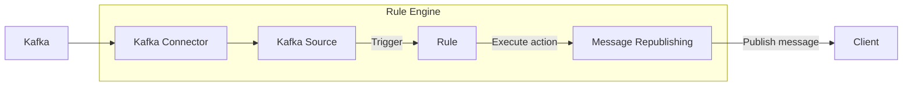

# データ統合

EMQXは、MQTTプロトコルを通じてIoTデバイスを接続し、リアルタイムでメッセージを送受信するMQTTメッセージングプラットフォームです。これを基盤として、EMQXのデータ統合は外部データシステムとの接続を導入し、デバイスと他のビジネスシステムをシームレスに統合できるようにします。

データ統合はSinkとSourceコンポーネントを使用して外部データシステムと接続します。SinkはMySQL、Kafka、HTTPサービスなどの外部データシステムへメッセージを送信するために使われ、SourceはMQTT、Kafka、GCP PubSubなどの外部データシステムからメッセージを受信するために使われます。

この仕組みにより、EMQXは単なるIoTデバイス間のメッセージ送信を超え、デバイス生成データをビジネスエコシステム全体に有機的に統合します。IoTアプリケーションの適用シナリオを広げ、デバイスとビジネスシステム間の相互作用を豊かで多様にします。

::: tip 注意

- EMQX v5.4.0以降、従来のデータブリッジはデータフローの方向に応じて分割され、SinkとSourceに名称変更されました。

- 現時点でEMQXがSourceとしてサポートする外部データシステムは以下の通りです：

  - MQTTサービス
  - Kafka
  - GCP PubSub

:::

本ページでは、SinkとSourceの動作原理、対応する外部データシステム、主な機能、管理方法について包括的に解説します。

## 動作原理

EMQXのデータ統合は標準機能として提供されています。MQTTメッセージングプラットフォームとして、EMQXはMQTTプロトコル経由でIoTデバイスからデータを受信します。組み込みのルールエンジンの助けを借りて、受信したデータはルールエンジンに設定されたルールによって処理されます。ルールは処理済みデータを設定されたSink/Sourceを通じて外部データシステムに転送するアクションをトリガーします。Dashboard上の[Rules](./rule-get-started.md)や[Flow Designer](../flow-designer/introduction.md)を使えば、コーディング不要で簡単にルール作成、アクションの紐付け、Sink/Sourceの作成が可能です。

### 組み込みルールエンジン

IoTデバイスやシステムからのデータソースは多様なデータ型やフォーマットを持ちます。EMQXはSQLルールベースの強力な組み込みルールエンジンを備えており、データ処理と配信の中核コンポーネントです。条件判定、文字列操作、データ型変換、圧縮・解凍など幅広い機能を持ち、複雑なデータを柔軟に扱えます。

クライアントが特定イベントをトリガーしたりメッセージがEMQXに届くと、ルールエンジンは事前定義されたルールに基づきリアルタイムでデータを処理します。データ抽出、フィルタリング、付加情報追加、フォーマット変換などを行い、処理後のデータを指定されたSinkに転送します。

ルールエンジンの詳細な動作については[Rule Engine](./rules.md)章をご参照ください。

### Sink

Sinkはルールの[アクション](./rules.md)に追加されるデータ出力コンポーネントです。デバイスがイベントをトリガーしたりメッセージがEMQXに届くと、システムは対応するルールをマッチングして実行し、データをフィルタリング・処理します。ルールエンジンで処理されたデータは指定されたSinkに転送されます。Sink内では`${var}`や`${.var}`構文を使ってデータから変数を抽出し、SQL文やデータテンプレートを動的に生成するなどの処理を設定できます。その後、対応する[コネクター](./connector.md)を通じて外部データシステムへデータを送信し、メッセージ保存、データ更新、イベント通知などの操作を実現します。

```mermaid
graph LR
  A[Client] -->|Publish message| B[Rule]
  A1[Client] --> |Publish message| B

  subgraph Rule Engine
    B -->  |Execute action| C[Kafka Sink] --> D[Kafka Connector]
  end

D -->|Message storage| E[Kafka]
```



Sinkでサポートされる変数抽出構文は以下の通りです：

- `${var}`：ルールの出力結果から変数を抽出する構文です。例：`${topic}`。ネストした変数を抽出したい場合はドット`.`を使い、`${payload.temp}`のように記述します。抽出対象の変数が出力結果に含まれない場合は文字列`undefined`が返されます。
- `${.}`, `${.var}`：`${.}`はルールの全出力結果を含むJSON文字列を抽出し、`${.var}`は`${var}`と同じ意味です。

### Source

Sourceはデータ入力コンポーネントであり、ルールの[データソース](./rule-sql-events-and-fields.md)として機能し、ルールSQLから選択されます。

SourceはMQTTやKafkaなどの外部データシステムからメッセージをサブスクライブまたはコンシュームします。コネクター経由で新しいメッセージが届くと、ルールエンジンが対応するルールをマッチングして実行し、データをフィルタリング・処理します。処理後のデータは指定されたEMQXトピックにパブリッシュされ、クラウドコマンド配信などの操作が可能になります。



## 対応統合

EMQXは以下の種類のデータシステムとのデータ統合をサポートしています：

**デフォルト**

- [MQTT](./data-bridge-mqtt.md)
- [Webhook](./webhook.md)/[HTTPServer](./data-bridge-webhook.md)

**クラウド**

- [Amazon Kinesis](./data-bridge-kinesis.md)
- [Azure EventHub](./data-bridge-azure-event-hub.md)
- [GCP PubSub](./data-bridge-gcp-pubsub.md)

**TSDB**

- [Apache IoTDB](./data-bridge-iotdb.md)
- [InfluxDB](./data-bridge-influxdb.md)
- [OpenTSDB](./data-bridge-opents.md)
- [TimescaleDB](./data-bridge-timescale.md)
- [Datalayers](./data-bridge-datalayers.md)

**SQL**

- [Cassandra](./data-bridge-cassa.md)
- [Microsoft SQL Server](./data-bridge-sqlserver.md)
- [MySQL](./data-bridge-mysql.md)
- [Oracle](./data-bridge-oracle.md)
- [PostgreSQL](./data-bridge-pgsql.md)
- [Lindorm](./lindorm)

**NoSQL**

- [ClickHouse](./data-bridge-clickhouse.md)
- [Couchbase](./data-bridge-couchbase.md)
- [DynamoDB](./data-bridge-dynamo.md)
- [Greptime](./data-bridge-greptimedb.md)
- [MongoDB](./data-bridge-mongodb.md)
- [Redis](./data-bridge-redis.md)
- [TDengine](./data-bridge-tdengine.md)
- [Elasticsearch](./elasticsearch.md)

**メッセージキュー**

- [Apache Kafka/Confluent](./data-bridge-kafka.md)
- [HStreamDB](./data-bridge-hstreamdb.md)
- [Pulsar](./data-bridge-pulsar.md)
- [RabbitMQ](./data-bridge-rabbitmq.md)
- [RocketMQ](./data-bridge-rocketmq.md)

**その他**

- [SysKeeper](./syskeeper.md)
- [Amazon S3](./s3.md)
- [Azure Blob Storage](./azure-blob-storage.md)
- [Snowflake](./snowflake.md)
- [Disk Log](./disk-log.md)

## Sinkの特徴

Sinkは以下の機能により使いやすさを向上させ、データ統合のパフォーマンスと信頼性をさらに高めます。すべてのSinkがこれらの機能を完全に実装しているわけではありません。対応状況は各Sinkのドキュメントをご参照ください。

### 非同期リクエストモード

非同期リクエストモードは、Sinkの実行速度によってメッセージのパブリッシュ・サブスクライブ処理が影響を受けるのを防ぐために設計されています。ただし、非同期リクエストモードを有効にすると、サブスクライバーがメッセージを受信していても、まだ外部データシステムに書き込まれていないケースが発生する可能性があります。

データ処理効率を高めるため、EMQXはデフォルトで非同期リクエストモードを有効にしています。メッセージの配信タイミングをサブスクライバーや外部データシステムに対して厳密に管理したい場合は、非同期リクエストモードを無効にしてください。

`max_inflight`パラメータも非同期リクエスト時のメッセージ順序に影響します。一部のSinkにこのパラメータがあり、非同期モードで同一MQTTクライアントからのメッセージを厳密に順序通り処理する必要がある場合は、この値を1に設定する必要があります。

### バッチモード

バッチモードは複数のデータエントリをまとめて外部データ統合システムに書き込むことを可能にします。バッチモードが有効な場合、EMQXは各リクエストのデータ（単一エントリ）を一時的に保存し、一定時間経過または一定数のデータエントリが蓄積された後にまとめてターゲットデータシステムに書き込みます（いずれも設定可能）。

**利点：**

- 書き込み効率の向上：単一メッセージ書き込みに比べ、データベースシステムがメッセージをキャッシュや事前処理できるため、書き込み効率が向上します。
- ネットワークレイテンシの削減：バッチ書き込みはネットワーク送信回数を減らし、レイテンシを低減します。

**課題：**

書き込み遅延：設定された時間またはエントリ数に達するまでデータの書き込みが遅延します。これらの設定はパラメータで調整可能です。

### バッファキュー

バッファキューはSinkの一定のフォールトトレランスを提供し、データ安全性向上のために有効化を推奨します。

各リソース接続（MQTT接続ではありません）にはバッファキュー長（容量サイズ）があり、これを超えたデータはFIFO原則に従い破棄されます。

#### バッファファイルの場所

Kafka Sinkの場合、ディスクキャッシュファイルは`data/kafka`にあり、その他のSinkは`data/bufs`にあります。

実際の運用では、`data`ディレクトリを高性能ディスクにマウントしてスループットを向上させることが可能です。

### プリペアドステートメント

MySQLやPostgreSQLなどのSQLデータベースでは、SQLテンプレートはフィールド変数を明示的に指定せずに事前処理実行されます。

SQLを直接実行する場合、topicとpayloadは文字列型、qosは整数型としてシングルクォートで明示的に指定する必要があります：

```sql
INSERT INTO msg(topic, qos, payload) VALUES('${topic}', ${qos}, '${payload}');
```

しかし、プリペアドステートメント対応のSinkでは、SQLテンプレートは**クォートなし**のプリペアドステートメントを**必ず**使用します：

```sql
INSERT INTO msg(topic, qos, payload) VALUES(${topic}, ${qos}, ${payload});
```

フィールド型の自動推論に加え、プリペアドステートメント技術はSQLインジェクションを防止し、セキュリティを強化します。

### フォールバックアクション

EMQX 5.9.0以降、任意のアクションに対してフォールバックアクションのセットを定義できます。プライマリアクションがメッセージ処理に失敗した場合にフォールバックアクションがトリガーされます。この仕組みにより、メッセージを別のSinkや再パブリッシュアクションなどの二次ターゲットにリダイレクトでき、データ信頼性と可観測性が向上します。

フォールバックアクションは以下の用途に利用可能です：

- 失敗したメッセージをバックアップデータシステム（例：別のSink）に転送
- 失敗メッセージを監視トピックに再パブリッシュしてトラブルシューティングやアラートに活用
- プライマリアクションの一時的な問題によるデータ損失を最小化

#### 主な特徴

- フォールバックアクションはプライマリアクションがメッセージ処理に失敗した場合のみトリガーされます。失敗には配信エラー、バッファオーバーフロー、リクエストTTL切れが含まれます。
- フォールバックアクションは自身の設定に関わらず常に非同期リクエストモードで動作します。
- 定義されたすべてのフォールバックアクションは同時にトリガーされ、EMQXは順次実行や最初の成功で停止しません。
- フォールバックアクションは通常のアクションと同じバッファリング機構を共有し、リクエストTTLまたはバッファオーバーフローまでメッセージをリトライします。
- フォールバックアクションはさらに別のフォールバックアクションをトリガーしません。フォールバックアクション自身が失敗しても、そのフォールバックは起動しません。
- フォールバックアクションによるメッセージ処理はプライマリアクションや元のルールのメトリクスに影響を与えません。

#### フォールバックアクションの定義例

HTTPアクション`my_http`に対してフォールバックアクションを定義するとします。既存のMQTTアクション`fallback`もあります。

以下のようにフォールバックロジックを設定できます：

```hcl
actions {
  http {
    my_http {
      fallback_actions = [
        {kind = reference, type = mqtt, name = fallback},
        {
          kind = republish,
          args = {
            topic = "fallback/republish/topic"
            qos = 1
            payload = "${payload}"
          }
        }
      ]
      # その他の設定は省略
    }
  }
  mqtt {
    fallback {
      fallback_actions = [
        {kind = reference, type = mqtt, name = another_fallback}
      ]
      # その他の設定は省略
    }
  }
}
```

この例では：

- HTTPアクション`my_http`が失敗した場合、メッセージは：
  - MQTTアクション`fallback`に転送され、
  - トピック`fallback/republish/topic`に再パブリッシュされます。
- `fallback`が失敗しても、`fallback`内で定義されたフォールバックアクション`another_fallback`は**トリガーされません**。フォールバックアクションは再帰的な連鎖をサポートしません。
- `fallback`が別ルールのプライマリアクションとしてトリガーされ失敗した場合は、そのフォールバック`another_fallback`が適用されます。

## Sinkのステータスと統計情報

Dashboard上でSinkの稼働状況や統計情報を確認し、正常に動作しているか把握できます。

### 稼働ステータス

Sinkは以下のステータスを持ちます：

- `connecting`：ヘルスプローブが行われる前の初期状態で、外部データシステムへの接続を試みている状態。
- `connected`：Sinkが正常に接続され、正常稼働中。ヘルスプローブが失敗すると、障害の程度に応じて`connecting`または`disconnected`に遷移する場合があります。
- `disconnected`：ヘルスプローブに失敗し、非正常状態。設定に応じて自動的に再接続を試みることがあります。
- `stopped`：手動で無効化された状態。
- `inconsistent`：クラスター内のノード間でSinkの状態に不一致がある状態。

### 稼働統計

EMQXはデータ統合の稼働統計を以下のカテゴリで提供します：

- Matched（カウンター）
- Sent Successfully（カウンター）
- Sent Failed（カウンター）
- Dropped（カウンター）
- Late Reply（カウンター）
- Inflight（ゲージ）
- Queuing（ゲージ）


#### Matched

`matched`はSinkにルーティングされたリクエスト／メッセージ数をカウントします。状態に関係なくカウントされます。各メッセージは最終的に他のメトリクスで計上されるため、`matched = success + failed + inflight + queuing + late_reply + dropped`となります。

#### Sent Successfully

`success`は外部データシステムに正常に受信されたメッセージ数をカウントします。`retried.success`は`success`のサブカウントで、少なくとも1回配信リトライされたメッセージ数を追跡します。したがって、`retried.success <= success`です。

#### Sent Failed

`failed`は外部データシステムへの受信に失敗したメッセージ数をカウントします。`retried.failed`は`failed`のサブカウントで、少なくとも1回配信リトライされたメッセージ数を追跡します。したがって、`retried.failed <= failed`です。

#### Dropped

`dropped`は配信試行なしに破棄されたメッセージ数をカウントします。複数の具体的なカテゴリに分かれ、それぞれ破棄理由を示します。計算式は`dropped = dropped.expired + dropped.queue_full + dropped.resource_stopped + dropped.resource_not_found`です。

- `expired`：メッセージのTTLがキューイング中に到達し、送信される前に破棄された。
- `queue_full`：最大キューサイズに達し、メモリオーバーフロー防止のため破棄された。
- `resource_stopped`：Sinkが停止中に配信を試みたメッセージ。
- `resource_not_found`：Sinkが存在しない状態で配信を試みたメッセージ。稀に発生し、Sink削除時の競合状態が原因。

#### Late Reply

`late_reply`はメッセージ送信を試みたが、基盤ドライバーからの応答がメッセージTTL切れ後に受信された場合にインクリメントされます。

::: tip
`late_reply`はメッセージの送信成功・失敗を示すものではありません。外部データシステムへの挿入に成功した可能性もあれば、失敗した可能性もあり、接続タイムアウトなどのケースも含みます。
:::

#### Inflight

`inflight`はバッファリング層で現在送信中で外部データシステムからの応答待ちのメッセージ数を示すゲージです。

#### Queuing

`queuing`はバッファリング層で受信済みだがまだ外部データシステムに送信されていないメッセージ数を示すゲージです。
