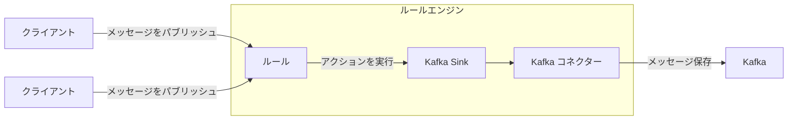
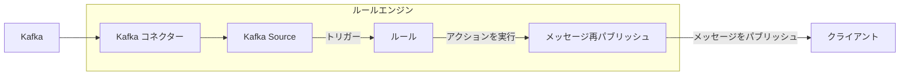

# データ統合

EMQXは、MQTTプロトコルを通じてIoTデバイスを接続し、リアルタイムでメッセージを送受信するMQTTメッセージングプラットフォームです。これを基盤として、EMQXのデータ統合は外部データシステムとの接続を導入し、デバイスと他の業務システムとのシームレスな連携を可能にします。

データ統合は、SinkおよびSourceコンポーネントを用いて外部データシステムと接続します。SinkはMySQL、Kafka、HTTPサービスなどの外部データシステムへメッセージを送信するために使用され、一方SourceはMQTT、Kafka、GCP PubSubなどの外部データシステムからメッセージを受信するために使用されます。

この仕組みにより、EMQXは単なるIoTデバイス間のメッセージ送信を超えて、デバイスが生成するデータを業務全体のエコシステムに有機的に統合します。これにより、IoTアプリケーションの適用シナリオが広がり、デバイスと業務システム間の連携がより豊かで多様になります。

::: tip 注意

- EMQX v5.4.0以降、従来のデータブリッジはデータフローの方向に応じて分割され、SinkおよびSourceに名称変更されました。

- 現時点でEMQXがSourceとしてサポートする外部データシステムは以下の通りです：

  - MQTTサービス
  - Kafka
  - GCP PubSub

:::

本ページでは、SinkおよびSourceの概要、動作原理、対応する外部データシステム、主な機能、管理方法について包括的に解説します。

## 動作原理

EMQXのデータ統合は標準機能として提供されています。MQTTメッセージングプラットフォームとして、EMQXはMQTTプロトコルを介してIoTデバイスからデータを受信します。組み込みのルールエンジンを用いて、受信したデータはルールエンジンに設定されたルールにより処理されます。ルールは処理済みデータを設定されたSink/Sourceを通じて外部データシステムに転送するアクションをトリガーします。Dashboard上の[ルール](./rule-get-started.md)や[Flowデザイナー](../flow-designer/introduction.md)を使って、コーディング不要で簡単にルール作成、アクションの紐付け、Sink/Sourceの作成が可能です。

### 組み込みルールエンジン

様々なIoTデバイスやシステムからのデータソースは多様なデータ型やフォーマットを持ちます。EMQXはSQLベースの強力な組み込みルールエンジンを備えており、これはデータ処理と配信の中核コンポーネントです。ルールエンジンは条件判定、文字列操作、データ型変換、圧縮・解凍など多彩な機能を持ち、複雑なデータの柔軟な処理を可能にします。

クライアントが特定のイベントをトリガーしたり、メッセージがEMQXに到達した際、ルールエンジンは事前定義されたルールに従いリアルタイムでデータを処理します。データの抽出、フィルタリング、付加情報の追加、フォーマット変換などを行い、処理済みデータを指定されたSinkに転送します。

ルールエンジンの詳細な動作については[ルールエンジン](./rules.md)章をご参照ください。

### Sink

Sinkはルールの[アクション](./rules.md)として追加されるデータ出力コンポーネントです。デバイスがイベントをトリガーしたりメッセージがEMQXに到着すると、システムは該当ルールをマッチングして実行し、データをフィルタリング・処理します。ルールエンジンで処理されたデータは指定されたSinkに転送されます。Sinkでは、`${var}`や`${.var}`構文を用いてデータから変数を抽出し、動的にSQL文やデータテンプレートを生成するなど、データの取り扱い方法を設定可能です。その後、対応する[コネクター](./connector.md)を通じて外部データシステムへデータを送信し、メッセージの保存、データ更新、イベント通知などの操作を実現します。



Sinkでサポートされる変数抽出構文は以下の通りです：

- `${var}`：ルールの出力結果から変数を抽出する構文です。例えば`${topic}`。ネストした変数を抽出したい場合はドット`.`を用い、`${payload.temp}`のように記述します。抽出対象の変数が出力結果に含まれない場合は文字列`undefined`が返されます。
- `${.}`, `${.var}`：`${.}`はルールの全出力結果を含むJSON文字列を抽出し、`${.var}`は`${var}`と同じ意味を持ちます。

### Source

Sourceはデータ入力コンポーネントであり、ルールの[データソース](./rule-sql-events-and-fields.md)として機能し、ルールSQLで選択されます。

SourceはMQTTやKafkaなどの外部データシステムからメッセージをサブスクライブまたはコンシュームします。コネクターを通じて新しいメッセージが到着すると、ルールエンジンは該当ルールをマッチングして実行し、データをフィルタリング・処理します。処理済みデータは指定されたEMQXトピックにパブリッシュされ、クラウドコマンドの配信などに利用可能です。



## 対応する統合先

EMQXは以下の種類のデータシステムとのデータ統合をサポートしています：

**デフォルト**

- [MQTT](./data-bridge-mqtt.md)
- [Webhook](./webhook.md)/[HTTPServer](./data-bridge-webhook.md)

**クラウド**

- [Amazon Kinesis](./data-bridge-kinesis.md)
- [Azure EventHub](./data-bridge-azure-event-hub.md)
- [Azure Event Grid](./azure-event-grid.md)
- [GCP PubSub](./data-bridge-gcp-pubsub.md)

**TSDB**

- [Apache IoTDB](./data-bridge-iotdb.md)
- [InfluxDB](./data-bridge-influxdb.md)
- [OpenTSDB](./data-bridge-opents.md)
- [TimescaleDB](./data-bridge-timescale.md)
- [Datalayers](./data-bridge-datalayers.md)
- [Timestream for InfluxDB](./timestream-for-influxdb.md)

**SQL**

- [Cassandra](./data-bridge-cassa.md)
- [Microsoft SQL Server](./data-bridge-sqlserver.md)
- [MySQL](./data-bridge-mysql.md)
- [Oracle](./data-bridge-oracle.md)
- [PostgreSQL](./data-bridge-pgsql.md)
- [Lindorm](./lindorm.md)
- [Doris](./apache-doris.md)
- [AlloyDB](./alloydb.md)
- [CockroachDB](./cockroachdb.md)
- [Redshift](./redshift.md)
- [QuasarDB](./quasardb.md)

**NoSQL**

- [ClickHouse](./data-bridge-clickhouse.md)
- [Couchbase](./data-bridge-couchbase.md)
- [DynamoDB](./data-bridge-dynamo.md)
- [Greptime](./data-bridge-greptimedb.md)
- [MongoDB](./data-bridge-mongodb.md)
- [Redis](./data-bridge-redis.md)
- [TDengine](./data-bridge-tdengine.md)
- [Elasticsearch](./elasticsearch.md)
- [EMQX Tables](./emqx-tables.md)

**メッセージキュー**

- [Apache Kafka/Confluent](./data-bridge-kafka.md)
- [Pulsar](./data-bridge-pulsar.md)
- [RabbitMQ](./data-bridge-rabbitmq.md)
- [RocketMQ](./data-bridge-rocketmq.md)

**その他**

- [SysKeeper](./syskeeper.md)
- [Amazon S3](./s3.md)
- [Amazon S3 Tables](./s3-tables.md)
- [Azure Blob Storage](./azure-blob-storage.md)
- [Snowflake](./snowflake.md)
- [Disk Log](./disk-log.md)
- [BigQuery](./bigquery.md)
- [Databricks](./databricks.md)

## Sinkの特徴

Sinkは以下の機能により使い勝手を向上させ、データ統合のパフォーマンスと信頼性をさらに高めます。すべてのSinkがこれらの機能を完全に実装しているわけではありませんので、詳細な対応状況は各Sinkのドキュメントをご確認ください。

### 非同期リクエストモード

非同期リクエストモードは、メッセージのパブリッシュ・サブスクライブ処理がSinkの実行速度に影響されるのを防ぐために設計されています。ただし、非同期リクエストモードを有効にすると、サブスクライバーはメッセージを受信しているが、まだ外部データシステムに書き込まれていないケースが発生する可能性があります。

データ処理効率を高めるため、EMQXはデフォルトで非同期リクエストモードを有効にしています。メッセージの配信タイミングに厳密な要件がある場合は、非同期リクエストモードを無効にしてください。

`max_inflight`パラメータも非同期リクエストにおけるメッセージ順序に影響します。一部のSinkにこのパラメータがあり、非同期モード時に同一MQTTクライアントからのメッセージを厳密に順序通り処理する必要がある場合は、この値を1に設定する必要があります。

### バッチモード

バッチモードは複数のデータをまとめて外部データ統合システムに書き込む機能です。バッチモードを有効にすると、EMQXは各リクエストのデータ（単一エントリ）を一時的に蓄積し、一定時間経過または一定数のデータが蓄積された後にまとめてターゲットデータシステムに書き込みます（いずれも設定可能）。

**メリット：**

- 書き込み効率の向上：単一メッセージ書き込みに比べ、データベースシステムがメッセージをキャッシュまたは前処理できるため、書き込み効率が向上します。
- ネットワークレイテンシの低減：バッチ書き込みによりネットワーク送信回数が減り、レイテンシが低減します。

**課題：**

データ書き込みの遅延：設定された時間またはエントリ数に達するまでデータの書き込みが遅延します。これらの設定はパラメータで調整可能です。

### バッファキュー

バッファキューはSinkに一定のフォールトトレランスを提供し、データ安全性向上のため有効化が推奨されます。

各リソース接続（MQTT接続ではありません）にはバッファキュー長（容量サイズ）があり、これを超えるデータはFIFO原則に従い破棄されます。

#### バッファファイルの場所

Kafka Sinkの場合、ディスクキャッシュファイルは`data/kafka`にあります。その他のSinkは`data/bufs`にあります。

実運用では、`data`ディレクトリを高性能ディスクにマウントしてスループットを向上させることが可能です。

### プリペアドステートメント

MySQLやPostgreSQLなどのSQLデータベースでは、SQLテンプレートはフィールド変数を明示的に指定せずに事前処理実行されます。

直接SQLを実行する場合、トピックとペイロードは文字列型として、QoSは整数型としてシングルクォートで明示的に指定する必要があります：

```sql
INSERT INTO msg(topic, qos, payload) VALUES('${topic}', ${qos}, '${payload}');
```

しかし、プリペアドステートメント対応Sinkでは、SQLテンプレートは**クォートなし**のプリペアドステートメントを使用する必要があります：

```sql
INSERT INTO msg(topic, qos, payload) VALUES(${topic}, ${qos}, ${payload});
```

これによりフィールド型の自動推論が可能となり、さらにSQLインジェクション防止によるセキュリティ強化も実現します。

### フォールバックアクション

EMQX 5.9.0以降、任意のアクションに対してフォールバックアクションのセットを定義可能です。プライマリアクションがメッセージ処理に失敗した場合にフォールバックアクションがトリガーされます。これにより、メッセージを別のSinkや再パブリッシュアクションなどの二次ターゲットに転送でき、データの信頼性と可観測性を向上させます。

フォールバックアクションの用途例：

- 失敗したメッセージをバックアップデータシステム（別のSinkなど）へ転送
- 監視用トピックへの再パブリッシュによるトラブルシューティングやアラート
- プライマリアクションの一時的な問題によるデータ損失の最小化

#### 主な特徴

- フォールバックアクションはプライマリアクションがメッセージ処理に失敗した場合のみトリガーされます。失敗には配信エラー、バッファオーバーフロー、リクエストTTL切れが含まれます。
- 常に非同期リクエストモードで動作し、自身の設定に関わらず非同期となります。
- 定義されたすべてのフォールバックアクションは同時にトリガーされ、順次試行や最初の成功で停止はしません。
- フォールバックアクションは通常アクションと同じバッファリング機構を共有し、リクエストTTLまたはバッファオーバーフローまで再試行されます。
- フォールバックアクションはさらに別のフォールバックアクションをトリガーしません。フォールバックアクション自身が失敗しても、その設定されたフォールバックはトリガーされません。
- フォールバックアクションによるメッセージ処理は、プライマリアクションやそれをトリガーした元のルールのメトリクスに影響を与えません。

#### フォールバックアクションの定義例

HTTPアクション`my_http`に対してフォールバックアクションを定義するとします。既存のMQTTアクション`fallback`もあります。

以下のようにフォールバックロジックを設定可能です：

```hcl
actions {
  http {
    my_http {
      fallback_actions = [
        {kind = reference, type = mqtt, name = fallback},
        {
          kind = republish,
          args = {
            topic = "fallback/republish/topic"
            qos = 1
            payload = "${payload}"
          }
        }
      ]
      # その他の設定は省略
    }
  }
  mqtt {
    fallback {
      fallback_actions = [
        {kind = reference, type = mqtt, name = another_fallback}
      ]
      # その他の設定は省略
    }
  }
}
```

この例では：

- HTTPアクション`my_http`が失敗した場合、メッセージは：
  - MQTTアクション`fallback`に転送され、
  - トピック`fallback/republish/topic`に再パブリッシュされます。
- `fallback`も失敗した場合、`fallback`に定義されたフォールバックアクション`another_fallback`は**トリガーされません**。フォールバックアクションは再帰的なチェーンをサポートしません。
- ただし、もし`fallback`が別ルールのプライマリアクションとしてトリガーされ失敗した場合は、そのフォールバック`another_fallback`が適用されます。

## Sinkの状態と統計情報

Dashboard上でSinkの稼働状況や統計情報を確認でき、Sinkが正常に動作しているか把握可能です。

### 稼働状態

Sinkは以下の状態を持ちます：

- `connecting`：ヘルスプローブが行われる前の初期状態で、まだ外部データシステムへの接続を試行中です。
- `connected`：Sinkが正常に接続され稼働中です。ヘルスプローブが失敗した場合、障害の程度に応じて`connecting`または`disconnected`に遷移することがあります。
- `disconnected`：ヘルスプローブに失敗し不健康な状態です。設定により自動的に再接続を試みる場合があります。
- `stopped`：Sinkが手動で無効化されています。
- `inconsistent`：クラスター内のノード間でSinkの状態に不整合があります。

### 稼働統計

EMQXはデータ統合に関する以下の統計情報を提供します：

- Matched（カウンター）
- Sent Successfully（カウンター）
- Sent Failed（カウンター）
- Dropped（カウンター）
- Late Reply（カウンター）
- Inflight（ゲージ）
- Queuing（ゲージ）


#### Matched

`matched`はSinkにルーティングされたリクエスト／メッセージ数をカウントします。状態に関わらずカウントされます。各メッセージは他のメトリクスで最終的に集計されるため、`matched = success + failed + inflight + queuing + late_reply + dropped`となります。

#### Sent Successfully

`success`は外部データシステムに正常に受信されたメッセージ数をカウントします。`retried.success`は`success`のサブカウントで、少なくとも1回再試行されたメッセージ数を追跡します。したがって、`retried.success <= success`です。

#### Sent Failed

`failed`は外部データシステムへの受信に失敗したメッセージ数をカウントします。`retried.failed`は`failed`のサブカウントで、少なくとも1回再試行されたメッセージ数を追跡します。したがって、`retried.failed <= failed`です。

#### Dropped

`dropped`は配信試行なしに破棄されたメッセージ数をカウントします。複数の具体的なカテゴリに分かれており、それぞれ破棄理由を示します。計算式は`dropped = dropped.expired + dropped.queue_full + dropped.resource_stopped + dropped.resource_not_found`です。

- `expired`：キューイング中にメッセージのTTLが切れたため破棄。
- `queue_full`：最大キューサイズに達し、メモリオーバーフロー防止のため破棄。
- `resource_stopped`：Sinkが停止中に配信を試みたメッセージ。
- `resource_not_found`：Sinkが存在しない状態で配信を試みたメッセージ。まれに発生し、Sink削除時の競合状態が原因。

#### Late Reply

`late_reply`はメッセージ配信を試みたが、基盤ドライバーからの応答がメッセージTTL切れ後に返ってきた場合にインクリメントされます。

::: tip
`late_reply`はメッセージの送信成功・失敗を示すものではありません。外部データシステムへの挿入成功、失敗、あるいは接続タイムアウトなど不明な状態を示します。
:::

#### Inflight

`inflight`はバッファリングレイヤー内で現在送信待ちのメッセージ数を示します。

#### Queuing

`queuing`はバッファリングレイヤーで受信済みだが、まだ外部データシステムに送信されていないメッセージ数を示します。
