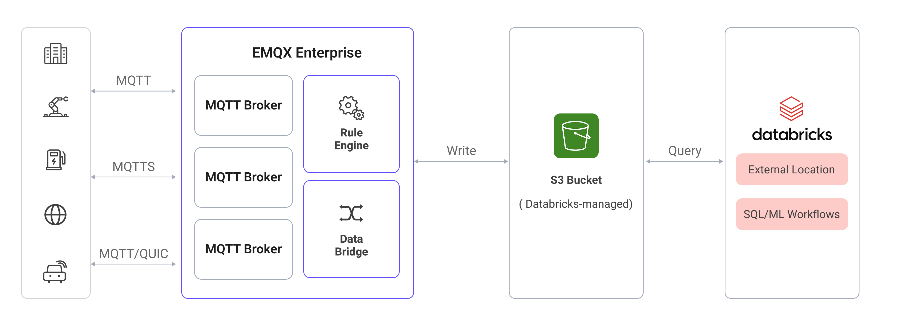

# DatabricksへのMQTTデータ取り込み

[Databricks](https://www.databricks.com/)は、Apache Sparkを基盤とした統合データ分析プラットフォームであり、大規模なデータエンジニアリング、機械学習、協調分析を目的としています。EMQXは、Databricksが管理するAmazon S3バケットにMQTTデータを書き込み、Databricksが外部ロケーションを通じて直接クエリを実行できる形でDatabricksと連携します。

本ページでは、EMQXとDatabricks間のデータ統合について詳しく解説し、コネクターおよびSinkの作成方法を実践的にご案内します。

## 動作の仕組み

EMQXにおけるDatabricksデータ統合は、Amazon S3統合をベースに構築されています。EMQXはMQTTデータをDatabricksが管理するS3バケットに書き込み、Databricksは外部ロケーションを介してこのバケットにアクセスし、保存されたデータに対して直接SQLクエリを実行します。



具体的なワークフローは以下の通りです：

1. **デバイスのEMQXへの接続**：IoTデバイスはMQTTプロトコルで正常に接続されるとオンラインイベントをトリガーします。このイベントにはデバイスID、送信元IPアドレスなどのプロパティ情報が含まれます。
2. **デバイスのメッセージパブリッシュと受信**：デバイスは特定のトピックを通じてテレメトリやステータスデータをパブリッシュします。EMQXはこれらのメッセージを受信し、ルールエンジン内で比較処理を行います。
3. **ルールエンジンによるメッセージ処理**：組み込みのルールエンジンは、トピックマッチングに基づき特定のソースからのメッセージやイベントを処理します。対応するルールをマッチングし、データフォーマット変換、特定情報のフィルタリング、コンテキスト情報によるメッセージの付加などを行います。
4. **Amazon S3への書き込み**：ルールはAmazon S3 Sinkをトリガーし、処理済みデータをDatabricksワークスペースに紐づくS3バケットへ書き込みます。
5. **DatabricksによるS3からの読み込み**：Databricksは外部ロケーションを通じてS3バケット内のデータを直接クエリし、リアルタイム分析や機械学習ワークフローを実現します。

## 特長とメリット

EMQXのDatabricksデータ統合を利用することで、以下のような特長と利点が得られます：

- **メッセージ変換**：EMQXルール内でメッセージを高度に処理・変換してからS3に書き込むため、後続の保存や分析が容易になります。
- **柔軟なデータ操作**：Amazon S3 Sinkにより、特定のデータフィールドをDatabricks管理のS3バケットに簡単に書き込め、動的なオブジェクトキー設定にも対応します。
- **統合分析プラットフォーム**：EMQXとDatabricksの統合により、IoTデータが即座にSQL分析、機械学習、データエンジニアリングパイプラインで活用可能になります。
- **低コストの長期保存**：S3を基盤ストレージとして利用することで、高可用性かつ信頼性の高い、コスト効率に優れた大規模IoTワークロード向けのデータ保存が可能です。

## はじめる前に

このセクションでは、EMQXでDatabricks向けのAmazon S3コネクターおよびSinkを作成する前に必要な準備を紹介します。

### 前提条件

以下の内容を理解していることを確認してください：

#### EMQXの概念：

- [ルールエンジン](./rules.md)：MQTTメッセージからデータを抽出・変換するロジックを定義するルールの仕組みを理解する。
- [データ統合](./data-bridges.md)：EMQXのコネクターとSinkの概念を理解する。

#### Databricksの概念：

- **ワークスペース**：Databricksの資産にアクセスするための環境。
- **外部ロケーション**：外部のS3パスをマッピングし、そこに保存されたデータをSQLで直接クエリ可能にするDatabricksの機能。
- **ストレージ認証情報**：外部ストレージの読み書き権限を付与するDatabricksのアクセス認証情報。

### AWS MarketplaceでのDatabricksセットアップ

ここでは、AWS MarketplaceでDatabricksをサブスクライブする例を用いてデプロイ方法を説明します。

1. [AWS Marketplace](https://aws.amazon.com/marketplace/)でDatabricksをサブスクライブします。Databricksアカウントとワークスペースの作成画面に案内されます。

2. サブスクライブ後、ワークスペースを作成します。リージョンとストレージオプションを選択し、**Create**をクリックします。

   

   ワークスペース作成後、**Workspaces**一覧に表示されます。ワークスペースに自動プロビジョニングされたS3バケット名（例：`databricks-workspace-stack-142ec-bucket`）を控えてください。このバケットにEMQXのMQTTデータを保存します。

   

3. ワークスペースを開き、**Catalog** -> **External locations**に移動して、EMQXがデータを書き込むS3パスを指す外部ロケーションを作成します。

   

   **Create location**をクリックし、**Storage type**を`S3`に設定、**URL**に`s3://databricks-workspace-stack-142ec-bucket/emqx-iot-data-new`を入力し、**Storage credential**を選択します。

   

4. S3バケットへの読み書き権限を持つIAMユーザーまたはロールのAWSアクセス認証情報（Access Key IDとSecret Access Key）を取得します。これらはEMQXコネクターの設定に使用します。

DatabricksワークスペースとS3バケットの設定が完了したら、EMQXでコネクターとSinkの作成準備が整いました。

## コネクターの作成

Amazon S3 Sinkを追加する前に、対応するコネクターを作成します。

1. ダッシュボードの**Integration** -> **Connectors**ページに移動します。
2. 右上の**Create**ボタンをクリックします。
3. コネクタータイプで**Amazon S3**を選択し、**Next**をクリックします。
4. コネクター名を入力します。名前は英数字で始まり、英数字、ハイフン、アンダースコアを含めることができます。ここでは例として`my-databricks`と入力します。
5. 接続情報を入力します：
   - **Host**：DatabricksワークスペースがデプロイされているAWSリージョンのS3エンドポイントを`s3.{region}.amazonaws.com`形式で入力します。
   - **Port**：`443`を入力します。
   - **Access Key ID**と**Secret Access Key**：[AWS MarketplaceでのDatabricksセットアップ](#aws-marketplaceでのdatabricksセットアップ)で取得した認証情報を入力します。
6. その他の設定はデフォルト値のままにします。
7. **Create**をクリックする前に、**Test Connectivity**をクリックしてEMQXがS3サービスに接続できるか確認できます。
8. **Create**ボタンをクリックしてコネクターの作成を完了します。作成成功のダイアログが表示され、ルールを今すぐ作成するか尋ねられます。**Create Rule**をクリックすると、コネクターが事前選択された状態でルール作成画面に進みます。**Back To Connector List**をクリックするとリストに戻り、後でルールを作成できます。

## Amazon S3 Sinkを使ったルールの作成

このセクションでは、EMQXでMQTTトピック`t/#`からのメッセージを処理し、処理結果をDatabricks管理のS3バケットに書き込むルールの作成方法を示します。

1. 前のステップで**Create Rule**をクリックした場合、**Add Action**パネルが自動で開き、**Type of Action**が`Amazon S3`、コネクターが事前選択されています。ステップ5へ進んでください。そうでなければ、ダッシュボードの**Integration** -> **Rules**ページに移動し、右上の**Create**をクリックします。

2. ルールIDを入力し、SQLエディターに以下のルールSQLを入力します：

   ```sql
   SELECT
     *
   FROM
       "t/#"
   ```

   ::: tip

   初心者の方は、**SQL Examples**をクリックし、**Enable Test**を有効にしてSQLルールを学習・テストできます。

   :::

3. 右側の**+ Add Action**をクリックし、**Add Action**パネルで**Type of Action**ドロップダウンから`Amazon S3`を選択し、**Action**はデフォルトの`Create Action`のままにします。

4. **Connectors**ドロップダウンから先ほど作成した`my-databricks`コネクターを選択します。ドロップダウン横の作成ボタンをクリックするとポップアップで新規コネクターを素早く作成可能です。必要な設定パラメータは[コネクターの作成](#コネクターの作成)を参照してください。

5. Sinkの名前と任意の説明を入力します。

6. **Bucket**に`databricks-workspace-stack-142ec-bucket`を入力します。このフィールドは`${var}`形式のプレースホルダーもサポートしますが、対応するバケットがS3に存在することを確認してください。

7. 必要に応じて**ACL**を選択し、アップロードされるオブジェクトのアクセス権限を指定します。

8. **Upload Method**を選択します：

   - **Direct Upload**：ルールがトリガーされるたびに、プリセットのオブジェクトキーと内容に従ってデータを直接S3にアップロードします。バイナリや大きなテキストデータの保存に適しています。
   - **Aggregated Upload**：複数のルールトリガー結果を1つのファイル（例：CSVファイル）にまとめてS3にアップロードします。構造化データの保存に適し、ファイル数削減や書き込み効率向上に寄与します。

   選択した方法によって設定項目が異なります。以下のタブから該当する方法の設定を行ってください：

   :::: tabs type

   ::: tab Direct Upload

   Direct Uploadでは以下の項目を設定します：

   - **Object Key**：バケット内のアップロード先オブジェクトの場所を定義します。`${var}`形式のプレースホルダーをサポートし、`/`でディレクトリ指定も可能です。ここでは`emqx-iot-data-new/${clientid}_${timestamp}.json`と入力します。`${clientid}`はクライアントID、`${timestamp}`はメッセージのタイムスタンプです。
   - **Object Content**：デフォルトはすべてのフィールドを含むJSONテキスト形式です。`${var}`形式のプレースホルダーをサポートします。ここでは`${payload}`を入力し、メッセージ本文をオブジェクト内容として使用します。

   :::

   ::: tab Aggregate Upload

   Aggregate Uploadでは以下のパラメータを設定します：

   - **Object Key**：オブジェクトの保存パスを指定します。以下の変数が利用可能です：

     - **`${action}`**：アクション名（必須）。
     - **`${node}`**：アップロードを実行するEMQXノード名（必須）。
     - **`${datetime.{format}}`**：集約開始日時。`{format}`でフォーマットを指定（必須）：
       - **`${datetime.rfc3339utc}`**：UTC形式のRFC3339日時。
       - **`${datetime.rfc3339}`**：ローカルタイムゾーン形式のRFC3339日時。
       - **`${datetime.unix}`**：Unixタイムスタンプ。
     - **`${datetime_until.{format}}`**：集約終了日時。フォーマットは上記と同様。
     - **`${sequence}`**：同一時間間隔内の集約アップロードのシーケンス番号（必須）。

   - **Aggregation Type**：現在はCSVとJSON Linesをサポート。
     - `CSV`：データをカンマ区切りのCSV形式でS3に書き込みます。
     - `JSON Lines`：データを[JSON Lines](https://jsonlines.org/)形式でS3に書き込みます。

   - **Column Order**（Aggregation Typeが`CSV`の場合のみ適用）：ルール結果のカラム順序をドロップダウンで調整します。

   - **Max Records**：最大レコード数に達すると、1ファイルの集約が完了しアップロードされます。

   - **Time Interval**：時間間隔に達すると、最大レコード数に達していなくても1ファイルの集約が完了しアップロードされます。

   :::

   ::::

9. **フォールバックアクション（任意）**：メッセージ配信失敗時の信頼性向上のため、1つ以上のフォールバックアクションを定義できます。詳細は[フォールバックアクション](./data-bridges.md#fallback-actions)を参照してください。

10. **Advanced Settings**を展開し、必要に応じて詳細設定を行います（任意）。詳細は[高度な設定](#advanced-settings)を参照してください。

11. 残りの設定はデフォルト値のままにします。**Create**をクリックする前に、**Test Connectivity**をクリックしてSinkがS3サービスに接続できるか確認できます。

12. **Create**ボタンをクリックしてSinkの作成を完了します。作成成功後、ルール作成画面に戻り、新しいSinkがルールアクションに追加されます。

13. ルール作成画面で**Save**をクリックし、ルール作成プロセスを完了します。

これでルールが正常に作成されました。**Rules**ページで新規ルールを確認でき、**Actions (Sink)**タブで新しいAmazon S3 Sinkを確認できます。

## ルールのテスト

MQTTXを使ってトピック`t/1`にメッセージをパブリッシュします：

```bash
mqttx pub -i emqx_c -t t/1 -m '{ "msg": "hello Databricks" }'
```

数件メッセージを送信した後、Databricksワークスペースで**Workspace**を右クリックし、**Create** -> **Notebook**を選択して新しいノートブックを作成します。


ノートブック内で外部ロケーションに対してSQLクエリを実行し、データが正常に取り込まれていることを確認します：

```sql
SELECT * FROM json.`s3://databricks-workspace-stack-142ec-bucket/emqx-iot-data-new/`
```


## 高度な設定

このセクションでは、Amazon S3 Sinkの高度な設定オプションについて説明します。ダッシュボードでSinkを設定する際、**Advanced Settings**を展開して用途に応じて以下のパラメータを調整できます。

| 項目名                           | 説明                                                         | デフォルト値    |
| -------------------------------- | ------------------------------------------------------------ | --------------- |
| **Buffer Pool Size**             | EMQXとS3間のデータフローを管理するバッファワーカープロセス数を指定します。 | `16`            |
| **Request TTL**                  | バッファに入ったリクエストが有効とみなされる最大時間（秒）を指定します。 | `45`            |
| **Health Check Interval**        | SinkがS3との接続状態を自動的にヘルスチェックする間隔（秒）を指定します。 | `15`秒          |
| **Health Check Interval Jitter** | 複数ノードが同時にヘルスチェックを開始する確率を下げるため、基本間隔に加える一様ランダム遅延（ミリ秒）です。 | `0`ミリ秒       |
| **Health Check Timeout**         | コネクターがS3との接続状態を自動的にヘルスチェックする際のタイムアウト時間を指定します。 | `60`秒          |
| **Max Buffer Queue Size**        | S3 Sinkの各バッファワーカープロセスがバッファリング可能な最大バイト数を指定します。 | `256` MB        |
| **Query Mode**                   | メッセージ送信の最適化のため、同期（synchronous）または非同期（asynchronous）リクエストモードを選択できます。 | `Asynchronous`  |
| **In-flight Window**             | SinkとS3間の通信時に同時に存在可能なインフライトキューリクエストの最大数を制御します。 | `100`           |
| **Min Part Size**                | 集約完了後のパートアップロードの最小チャンクサイズを指定します。 | `5MB`           |
| **Max Part Size**                | パートアップロードの最大チャンクサイズを指定します。 | `5GB`           |
