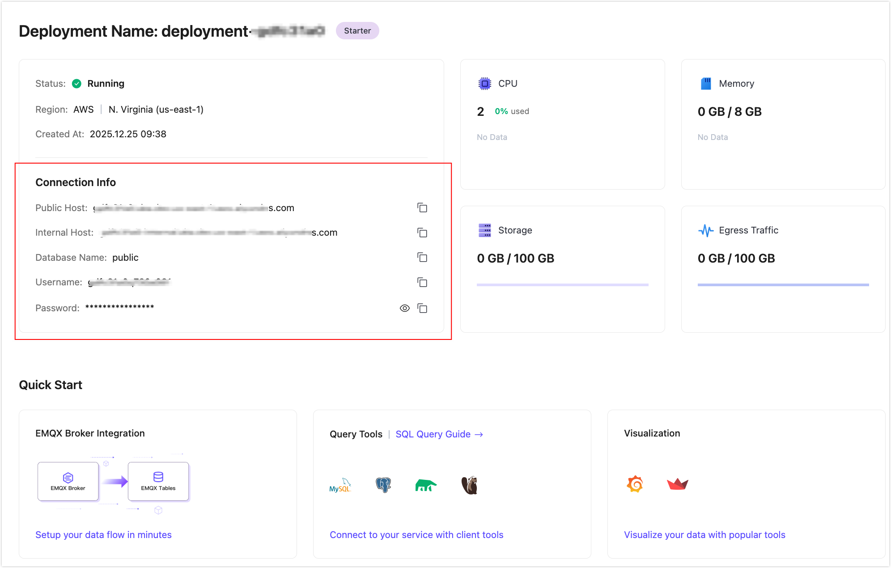
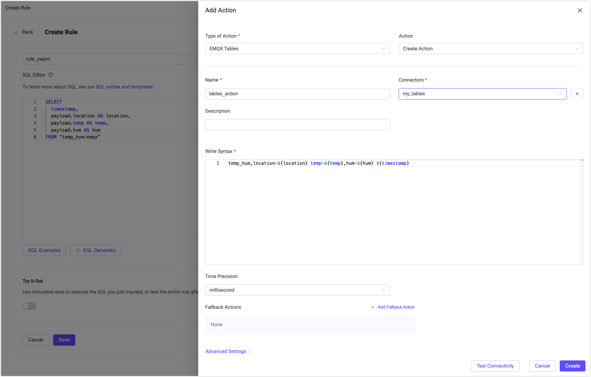

# EMQX TablesへのMQTTデータ取り込み

EMQX Tablesは、[EMQX Cloud](https://docs.emqx.com/en/cloud/latest/)に組み込まれたネイティブでフルマネージドの時系列データストレージサービスです。高スループットかつ低レイテンシでのMQTTデータの取り込みと分析に最適化されており、IoTユースケースに理想的です。

GreptimeDBを基盤とするEMQX Tablesは、EMQXブローカーとシームレスに統合され、InfluxDB Line Protocolをサポートしているため、テレメトリーデータの効率的な保存、クエリ、および可視化が可能です。詳細は[EMQX Tablesの概要](https://docs.emqx.com/en/cloud/latest/emqx_tables/emqx_tables_overview.html)をご覧ください。

EMQX Enterprise 6.1以降では、EMQX TablesコネクターとSinkが提供されており、オンプレミスのEMQX Enterprise環境からEMQX Cloud上のEMQX TablesへMQTTデータを安全に書き込み、集中クエリおよび処理を行うことができます。


本ページでは、EMQX EnterpriseからEMQX CloudのEMQX TablesへMQTTデータを取り込む手順を以下の流れで説明します。

- EMQX EnterpriseとEMQX Tables間のネットワーク接続の確立
- EMQX Tablesコネクターの作成
- EMQX Tablesアクションを含むルールの作成
- データ取り込みとクエリ結果のテスト

## 前提条件

開始前に以下の条件を満たしていることを確認してください。

- EMQX Enterpriseバージョン6.1以降がオンプレミスまたはプライベート環境にデプロイされていること。

- [EMQX Cloudコンソール](https://accounts.emqx.com/signin?continue=https://cloud-intl.emqx.com/console/)でEMQX Tablesのデプロイメントが作成され稼働していること。

  - EMQX Tablesの作成方法は[EMQX Tablesデプロイメントの作成](https://docs.emqx.com/en/cloud/latest/emqx_tables/emqx_tables_create_deployment.html)を参照してください。
  - **Deployment Overview**ページで接続情報を取得してください。

  

- EMQX EnterpriseのデプロイメントからEMQX Tablesのエンドポイントへネットワーク経由で到達可能であること（パブリックエンドポイントまたはプライベート接続環境により異なります）。

- 以下の内容に習熟していること：
  - [EMQXルール](./rules.md)
  - [データ統合](./data-bridges.md)
  - [InfluxDB Line Protocol](https://docs.influxdata.com/influxdb/v2.5/reference/syntax/line-protocol/)

## EMQX Tablesコネクターの作成

データを書き込む前に、EMQX Enterprise側でEMQX Tablesへのコネクターを作成します。

1. EMQX Enterpriseダッシュボードで、**データ統合** -> **コネクター**に移動します。

2. **+ 新規コネクター**をクリックし、**EMQX Tables**を選択します。

3. **コネクター作成**ページで以下の設定を行います。

   - **コネクター名**：コネクターの一意な名前を入力します。
   
   - **説明**（任意）：識別用の簡単な説明を追加します。
   
   - **サーバーホスト**：`<host>:<port>`形式でEMQX Tablesサービスのアドレスを入力します。例：`tables.example.emqx.com:4001`
   
   - **データベース**：EMQX Tables内の対象データベース名を指定します。例：`public`
   
     ::: tip
     
     EMQX Tablesデプロイメント作成時にデフォルトで`public`データベースが作成されます。カスタムデータベースを作成したい場合は[カスタムデータベースの作成](https://docs.emqx.com/en/cloud/latest/emqx_tables/emqx_tables_quick_start.html#create-a-custom-database)を参照してください。
   
     :::
   
   - **ユーザー名**：EMQX Tablesデプロイメントで提供されたユーザー名を入力します。
   
   - **パスワード**：対応するパスワードを入力します。
   
   - **TLSを有効化**：EMQX Tablesへの接続時にTLS暗号化を使用する場合は有効にします。本番環境ではTLSの使用を推奨します。
   
   - **詳細設定**（任意）：接続プールサイズ、タイムアウト、リトライ動作などの詳細オプションを必要に応じて設定します。
   
4. **接続テスト**をクリックし、接続可能か検証します。EMQX Tablesサービスに接続できれば成功メッセージが表示されます。

5. **作成**をクリックしてコネクターを作成完了します。

このコネクターはルールやアクション定義時に利用可能です。

## EMQX Tablesへのデータ取り込み用ルールの作成

次に、どのMQTTメッセージをEMQX Tablesに書き込むか、またどのように保存するかを指定するルールを作成します。

### SQLルールの定義

1. **データ統合** -> **ルール**に移動します。

2. **+ 作成**をクリックします。

3. **SQLエディター**でルールロジックを定義します。例として、クライアントが`temp_hum/emqx`トピックに温度と湿度データをパブリッシュした際にトリガーされるルールは以下の通りです。

   ```sql
   SELECT
     timestamp,
     payload.location AS location,
     payload.temp AS temp,
     payload.hum AS hum
   FROM "temp_hum/emqx"
   ```

   ::: tip

   EMQXルールが初めての場合は、**Try It Out**をクリックしてSQLルールをインタラクティブに学習・テストできます。

   :::

4. **+ アクション追加**をクリックしてルールにアクションを追加します。

### EMQX Tablesアクションの追加

SQLルールを定義した後、ルールがトリガーされた際に選択されたデータをEMQX Tablesに書き込むアクションを追加します。

1. **アクションタイプ**で**EMQX Tables**を選択します。

2. **アクション**は**アクションを作成**のままにします。

3. 以下の項目を設定します。

   - **名前**：アクションの名前を入力します。

   - **コネクター**：先ほど作成したEMQX Tablesコネクターを選択します。

   - **説明**（任意）：このアクションの説明を追加します。

   - **書き込み構文**：EMQX Tablesにデータを書き込むためのInfluxDB Line Protocol形式を定義します。

     書き込み構文内のプレースホルダー（例：`${location}`, `${temp}`）はSQLルールで選択したフィールド名に対応している必要があります。ルールがトリガーされると、EMQXはこれらのプレースホルダーをSQLクエリの結果で置換します。

     行プロトコルの先頭にあるmeasurementがテーブル名となります。データが初めて正常に書き込まれると自動的にテーブルが作成されます。

     例：

     ```pgsql
     temp_hum,location=${location} temp=${temp},hum=${hum} ${timestamp}
     ```

     この例では：

     - `temp_hum`がmeasurementでテーブル名として使用されます。
     - `location`はタグとして書き込まれます。
     - `temp`と`hum`はフィールドとして書き込まれます。
     - `${timestamp}`はルールエンジンによって生成されたタイムスタンプを提供します。

     > 注意：
     >
     > - 符号付き整数値を書き込む場合は、プレースホルダーの後に`i`を付けます（例：`${payload.int}i`）。
     > - 符号なし整数値の場合は`u`を付けます（例：`${payload.int}u`）。
     > - サフィックスを付けない場合、整数値はデフォルトで符号付き整数として解釈され、小数点を含む値は浮動小数点数として解釈されます。
     > - 値が負の可能性がある場合や符号付き整数として保存する必要がある場合は`i`を使用し、非負の値で符号なし整数として保存したい場合は`u`を使用してください（例：カウンター、ID、単調増加メトリクスなど）。

   - **時間精度**：タイムスタンプの時間精度を選択します。デフォルトは`millisecond`です。

   - **フォールバックアクション**（任意）：このアクションが失敗した場合に実行するフォールバックアクションを設定できます。デフォルトでは設定されていません。詳細は[フォールバックアクション](./data-bridges.md#fallback-actions)を参照してください。

   - **詳細設定**（任意）：バッチ処理やリトライポリシーなどの高度な動作を必要に応じて設定します。

   

4. **作成**をクリックしてアクションを保存します。

5. **ルール作成**ページで**保存**をクリックし、ルールを保存します。

## ルールのテストとデータのクエリ

[MQTTX](https://mqttx.app/)などのクライアントツールを使って温度・湿度データの送信をシミュレートすることを推奨します。簡単なデモとしては、ダッシュボード内の組み込み診断ツールを利用することも可能です。

### Websocketクライアントでテストデータをパブリッシュ

1. EMQX Enterpriseダッシュボードの左メニューから**診断ツール** -> **Websocketクライアント**をクリックします。

2. ユーザー名/パスワード認証または自動生成認証でシミュレートクライアントとして接続します。

3. **パブリッシュ**セクションで以下の設定でメッセージをパブリッシュします。

   - **トピック**：`temp_hum/emqx`
   
   - **ペイロード**：
   
     ```json
     {
       "temp": 27.5,
       "hum": 41.8,
       "location": "Prague"
     }
     ```
   


このメッセージによりルールがトリガーされ、EMQX Tablesに書き込まれます。

### EMQX Tablesでデータをクエリ

1. EMQX Cloudコンソールにログインします。

2. EMQX Tablesのデプロイメントに移動します。

3. **データエクスプローラー**をクリックします。

4. 以下のSQLクエリを実行します。

   ```sql
   SELECT * FROM "temp_hum"
   ```

クエリ結果に新しく取り込まれたレコードが表示されるはずです。


## ルール統計の確認

実行時の動作やパフォーマンスを確認するには：

1. EMQX Enterpriseダッシュボードに戻ります。
2. **データ統合** -> **ルール**に移動します。
3. 作成したルールIDをクリックします。

ルールおよび関連するEMQX Tablesアクションの成功・失敗回数などの実行統計を確認できます。


