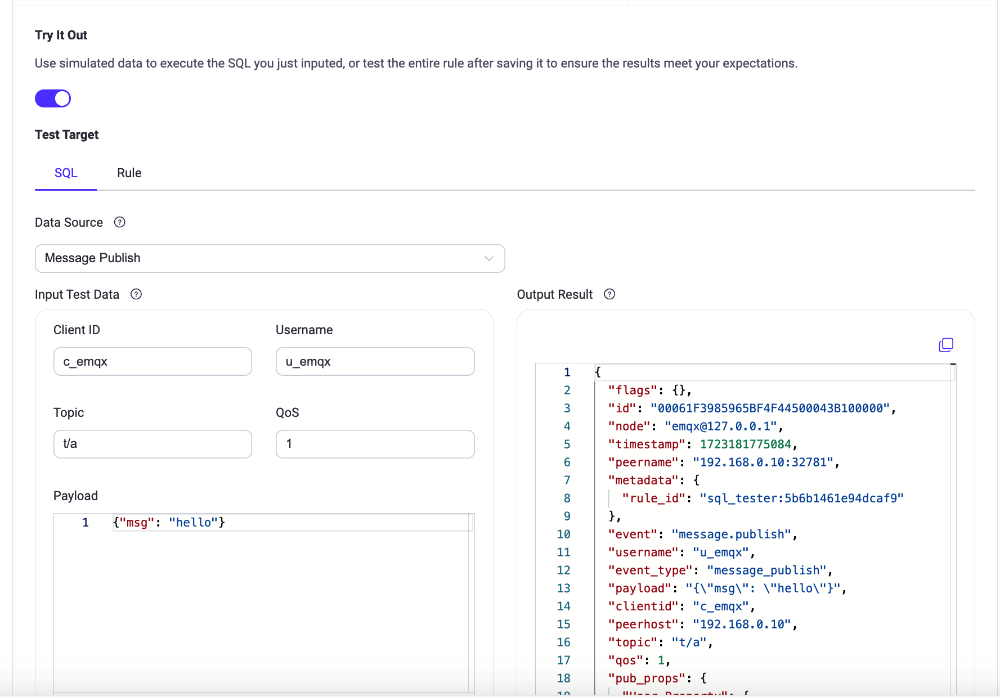
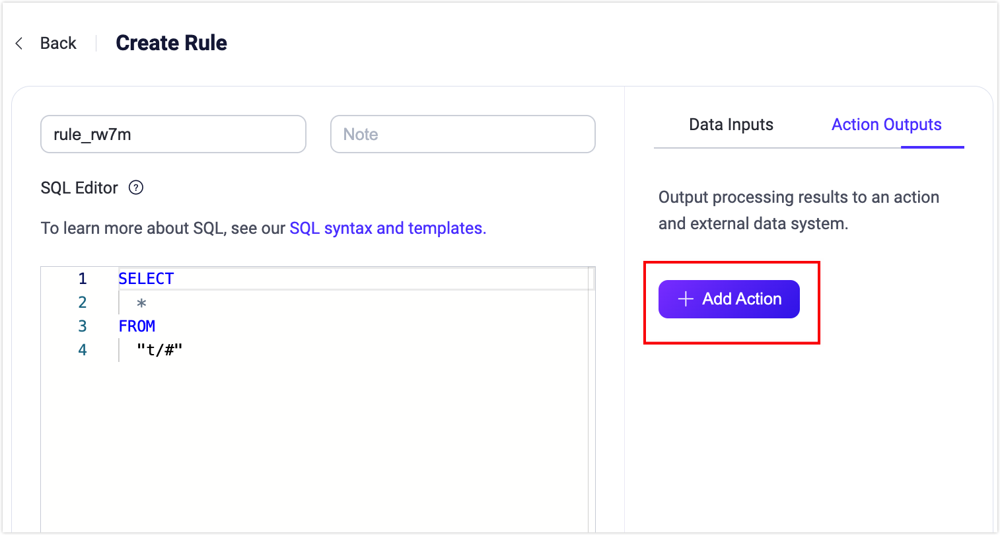
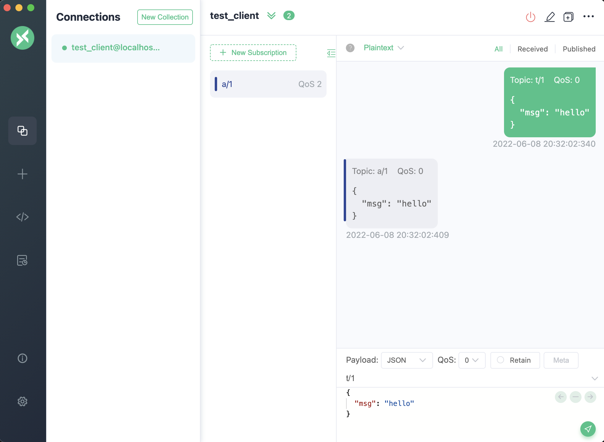
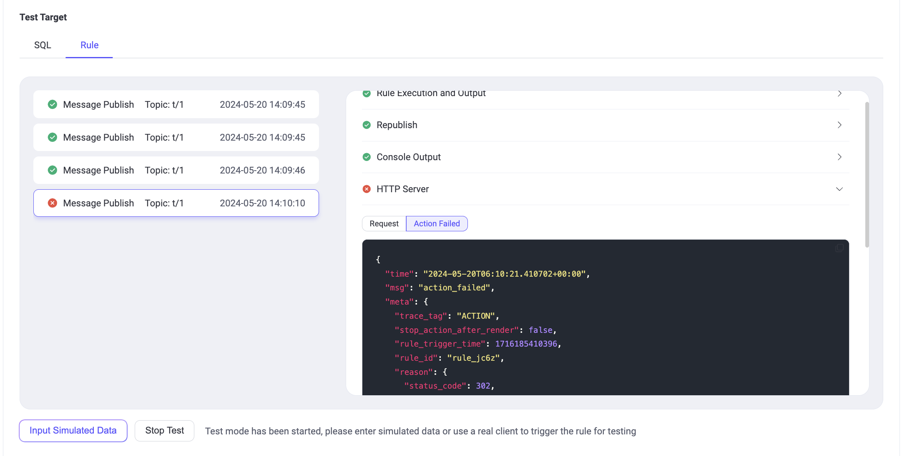
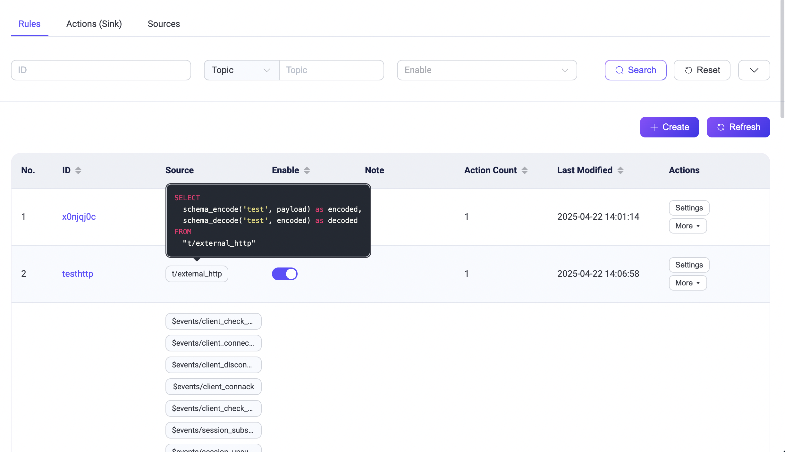
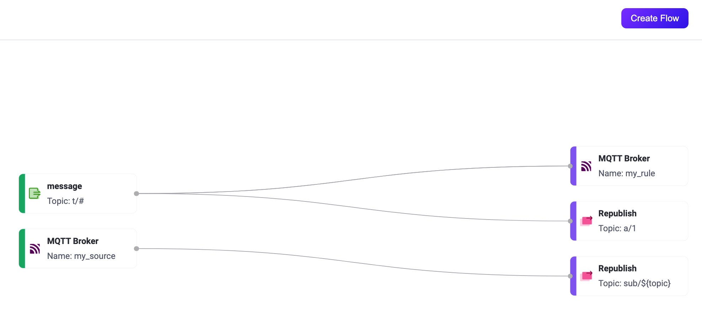

# ルールの作成

このページでは、EMQX ダッシュボードを使用してデータ処理のルールを作成し、ルールにアクションを追加する方法について説明します。また、ルールのテスト方法や作成後のルールの確認方法も紹介します。

本ページのデモでは、リパブリッシュアクションを例に取り、トピック `t/#` で受信したメッセージを処理し、トピック `a/1` にリパブリッシュするルールの作成方法を説明します。ただし、「結果をコンソールに出力する」や「Sinks を使った転送」についても [アクションの追加](#add-actions) で触れています。

## ルール SQL の定義

EMQX ダッシュボードにログインし、左側のナビゲーションメニューから **Integration** -> **Rules** をクリックします。

**Rules** ページで **Create** ボタンをクリックすると、**Create Rule** ページに遷移します。ここで、ルールのデータソースを定義し、フィルターされたメッセージに対して実行するアクションを決定します。

ルール名を入力し、将来の管理を容易にするためにメモを追加してください。**SQL Editor** では、ビジネスニーズに合わせてデータソースを追加するためのステートメントをカスタマイズできます。このチュートリアルでは、デフォルト設定のままにし、`"t/#"` パターンにマッチするトピック（例：`t/a`、`t/a/b`、`t/a/b/c` など）にあるすべてのメッセージを選択して返す設定とします。

::: tip

このチュートリアルでは、メッセージのペイロードが JSON 形式であることを前提としています。もしペイロードが他の形式の場合は、[スキーマレジストリ](./schema-registry.md) を使ってデータ型を変換できます。

EMQX には豊富な SQL ステートメントのサンプルが組み込まれており、**SQL Editor** 下の **SQL Examples** ボタンから参照可能です。SQL の構文や使い方の詳細は [SQL Syntax](./rule-sql-syntax.md) をご覧ください。

:::


### SQL ジェネレーター

EMQX 5.10.0 以降、SQL Editor は AI を活用した自然言語による SQL ジェネレーターをサポートしています。この機能により、自然言語で意図を記述すると、システムが自動的に適切な SQL ステートメントを生成します。

SQL ジェネレーターはデフォルトで有効になっています。ダッシュボード右上の **Settings** メニューからトグルスイッチで無効化可能です。

利用方法は以下の通りです：

1. **Create Rule** ページの **SQL Editor** セクションに移動します。

2. エディタ下の **SQL Generator** ボタンをクリックし、**Generate SQL with AI** ダイアログを開きます。ダイアログ内で以下の項目を指定します：

   - **Task Description**（必須）：SQL に何をさせたいかを自然言語で記述します。
     
     例：
     *「MQTT メッセージのメタデータから `clientid` を抽出し、ペイロードから `device_id` と `temperature` を抽出する。トピック `sensors/temperature` のメッセージで温度が30度を超える場合のみ適用する。」*
      
   - **Related Topics**（任意）：`sensors/temperature` のようなトピックフィルターを指定します。

   - **Input Example (JSON)**（任意だが推奨）：AI がデータ構造を理解しやすいように、MQTT メッセージのペイロードのサンプルを提供します。
     例：

     ```json
     {
       "device_id": "sensor001",
       "temperature": 32.5,
       "unit": "C"
     }
     ```

   - **Output Example (JSON)**（任意）：期待する結果のフォーマットを指定します。
     例：

     ```json
     {
       "clientid": "client_a1b2c3",
       "device_id": "sensor001",
       "temperature": 32.5
     }
     ```
     
     ::: tip 
     
     入力／出力の例を含めることで、生成される SQL の精度が向上します。
     
     :::

3. **Generate** をクリックして生成された SQL のプレビューを表示します。

4. プレビュー画面では、

   - 生成された SQL を確認・手動編集可能です。
   - **Apply SQL** をクリックすると SQL Editor に挿入されます。
   - **Back to Form** をクリックすると入力内容を修正して再生成できます。

5. SQL Editor に挿入すると、SQL が自動的に表示され、確認・編集が可能です。

#### 生成例

上記のタスクと入力例を使うと、生成される SQL は以下のようになります：

```sql
SELECT
  clientid,
  payload.device_id AS device_id,
  payload.temperature AS temperature
FROM
  "sensors/temperature"
WHERE
  payload.temperature > 30
```

このルールは、`sensors/temperature` トピックのメッセージから `clientid`、`device_id`、`temperature` を抽出し、温度が30度を超える場合にのみ適用されます。

#### SQL ジェネレーターを使うべき場合

- EMQX の SQL 構文に不慣れな場合
- ルールのプロトタイプを素早く作成したい場合
- 構造化された JSON ペイロードを扱う場合

より詳細なカスタマイズや構文については、[Rule SQL Syntax](./rule-sql-syntax.md) を参照してください。

### SQL ステートメントのテスト

SQL ステートメントはシミュレーションデータを使って実行できます。アクションを追加してルールを作成する前に、SQL の実行結果が期待通りかどうかを検証可能です。これは任意のステップですが、EMQX ルールに慣れていない場合は推奨されます。ルール全体の実行をテストしたい場合は、[ルールのテスト](#test-rules) を参照してください。

SQL テストの手順は以下の通りです：

1. **Create Rule** ページで **Try It Out** のトグルスイッチをオンにして、SQL ステートメントのテストを有効化します。
2. SQL に合致する **Data Source** を選択し、ルールの指定ソース（FROM 句）と一致していることを確認します。
3. テストデータを入力します。データソースを選択すると、EMQX は **Client ID**、**Username**、**Topic**、**QoS**、**Payload** などのシミュレーション用デフォルト値を提供します。必要に応じて適切な値に変更してください。
4. **Run Test** ボタンをクリックしてテストを実行します。正常に動作すれば **Test Passed** のメッセージが表示されます。



SQL の処理結果は **Output Result** セクションに JSON 形式で表示されます。SQL 処理結果のすべてのフィールドは、後続のアクション（組み込みアクションや Sink）で `${key}` の形式で参照可能です。フィールドの詳細は [SQL Data Sources and Fields](./rule-sql-events-and-fields.md) をご覧ください。

このデモではペイロードが JSON 形式であることを前提としていますが、実際には [スキーマレジストリ](./schema-registry.md) を使って他の形式のメッセージも扱えます。

次に、**Create Rule** ページ右側の **Add Action** ボタンをクリックして、ルールにさまざまなタイプのアクションを追加できます。

## アクションの追加

**Create Rule** ページで右側の **Add Action** ボタンをクリックすると、**Add Action** ページが表示されます。**Action** ドロップダウンリストから、リパブリッシュ、コンソール出力、データブリッジを使った転送の3種類のアクションを選択できます。



### リパブリッシュアクションの追加

このセクションでは、トピック `t/#` で受信した元のメッセージを別のトピック `a/1` にリパブリッシュするアクションの追加方法を説明します。

**Add Action** ページで、**Type of Action** ドロップダウンメニューから **Republish** を選択し、以下の設定を行ってから **Add** ボタンをクリックして確定します：

- **Topic**：転送先のトピックを設定します。ここでは例として `"a/1"` を指定します。

- **QoS**：リパブリッシュするメッセージの QoS を設定します。例では `"0"`。

- **Retain**：このメッセージをリテインメッセージとして転送するかどうかを設定します。このチュートリアルではデフォルトの **false** のままにします。

- **Payload**：`${payload}` と入力し、リパブリッシュするメッセージのペイロードは元のメッセージと同じで変更しないことを示します。

- **MQTT 5.0 メッセージプロパティ**：トグルスイッチをクリックしてユーザープロパティや MQTT プロパティを必要に応じて設定します。これにより、リパブリッシュメッセージに対して豊富なメタデータを付加できます。

  - **Payload Format Indicator**：メッセージのペイロードが特定の形式であるかを示す値を入力します。`false` の場合は未定義のバイト列とみなされ、`true` の場合は UTF-8 エンコードされた文字データであることを示します。これにより MQTT クライアントやサーバーがメッセージ内容を効率的に解析できます。

  - **Message Expiry Interval**：メッセージが配信されなかった場合に無効とみなすまでの有効期限（秒）を指定します。

  - **Content Type**：リパブリッシュメッセージのペイロードのタイプやフォーマット（MIME タイプ）を指定します。例：`text/plain`（テキストファイル）、`audio/aac`（音声ファイル）、`application/json`（JSON 形式のアプリケーションメッセージ）。

  - **Response Topic**：応答メッセージをパブリッシュする特定の MQTT トピックを指定します。例：`response/my_device`。

  - **Correlation Data**：応答メッセージと元のリクエストメッセージを関連付けるための一意の識別子やデータを入力します。例：リクエストIDやトランザクションIDなど。

- **Direct Dispatch**：トグルスイッチでダイレクトディスパッチの有効・無効を切り替えます。有効にすると、メッセージが直接サブスクライバーに配信され、追加のルール発動や同一ルールの再帰的な起動を防止します。

**Create Rule** ページ下部の **Create** ボタンをクリックしてルール作成を完了します。このルールは **Rule** ページに新しいエントリとして追加されます。

::: tip
リパブリッシュアクションは元のメッセージの配信を妨げません。例えば、トピック `"t/1"` のメッセージはルールにより `"a/1"` にリパブリッシュされますが、同時に `"t/1"` にサブスクライブしているクライアントにも元のメッセージが配信されます。
:::

### コンソール出力アクションの追加

::: tip
コンソール出力アクションはデバッグ目的でのみ使用してください。本番環境で使用するとパフォーマンス問題を引き起こす可能性があります。
:::

コンソール出力アクションはルールの出力結果を確認するために使います。結果メッセージはコンソールまたはログファイルに出力されます。

- EMQX が `console` または `foreground` モードで起動された場合（Docker 環境ではデフォルトで `foreground`）、出力はコンソールに送られます。
- systemd 経由で起動された場合は、出力はジャーナルシステムに保存され、`journalctl` コマンドで確認できます。

出力は以下の形式です：

```bash
[rule action] rule_id1
    Action Data: #{key1 => val1}
    Envs: #{key1 => val1, key2 => val2}
```

ここで、

- `[rule action]` はリパブリッシュアクションが発動したルールの ID です。
- `Action Data` はルールの出力結果で、アクション実行時に渡されるデータやパラメータ（リパブリッシュアクション設定時のペイロード部分）を示します。
- `Envs` はリパブリッシュ時に設定される環境変数で、データソースやアクション実行に関連する内部情報を含みます。

### Sinks を使った転送アクションの追加

処理結果を Sinks を使って転送するアクションも追加可能です。ダッシュボードの **Type of Action** ドロップダウンリストから対象の Sink を選択するだけです。EMQX の各 Sink の詳細は [データ統合](./data-bridges.md) を参照してください。

## ルールのテスト

ルールエンジンはルールのテスト機能を提供しており、シミュレーションデータや実際のクライアントデータを使ってルールをトリガーし、ルール SQL を実行し、追加したすべてのアクションを実行して各ステップの結果を取得できます。

ルールをテストすることで、ルールが期待通りに動作するか検証でき、問題の早期発見と解決が可能です。これにより開発効率が向上し、本番環境での失敗を防止できます。

### テスト手順

1. **Try It Out** スイッチをオンにし、テスト対象として **Rule** を選択します。テスト開始前にルールを保存しておく必要があります。
2. **Start Test** ボタンをクリックしてテストを開始します。ブラウザは現在のルールがトリガーされるのを待ち、テスト結果を受け取ります。
3. ルールをトリガーしてテストします。以下の2つの方法が利用可能です：
   - **シミュレーションデータを使う**：**Input Simulated Data** ボタンをクリックし、ポップアップで SQL に合致する **Data Source** を選択し、ルールの指定ソース（FROM 句）と一致していることを確認します。EMQX は **Client ID**、**Username**、**Topic**、**QoS**、**Payload** などのデフォルト値を提供します。必要に応じて変更し、**Submit Test** ボタンを押して一度だけルールをトリガーします。
   - **実際のデバイスデータを使う**：現在のページを開いたままにし、実際のクライアントや MQTT クライアントツールで EMQX に接続し、対応するイベントを発生させてテストします。
4. テスト結果を確認します。ルールがトリガーされると、ダッシュボードに実行結果が出力され、各ステップの詳細な実行結果が表示されます。

### テスト例

[MQTTX](https://mqttx.app/) を使ってリパブリッシュアクションのルールをテストできます。クライアントを1つ作成し、そのクライアントで `a/1` トピックをサブスクライブし、`t/1` メッセージを送信します。ダイアログボックスに、このメッセージが `a/1` トピックにリパブリッシュされたことが表示されます。

MQTTX クライアントツールと EMQX の接続方法の詳細は [MQTTX - はじめに](https://mqttx.app/docs/get-started) を参照してください。



対応して、ダッシュボードのテストインターフェースにはルール全体の実行結果が表示され、以下の内容が含まれます：

- 左側にはルールの実行記録が表示されます。ルールがトリガーされるたびに記録が生成され、クリックすると対応するメッセージやイベントの詳細に切り替わります。
- 右側には選択したルールのアクション一覧が表示され、クリックでアクションの実行結果やログを展開して確認できます。

ルール SQL やアクションの実行に失敗した場合は、そのルール記録全体が失敗としてマークされます。記録を選択すると、対応するアクションのエラー情報を確認でき、トラブルシューティングに役立ちます。



上記の例では、ルールは4回トリガーされ、そのうち3回は完全に成功しました。4回目は **HTTP Server** アクションの実行失敗により失敗し、エラー原因はステータスコード 302 のレスポンスでした。

ルールテストのさらなる活用方法はブログ [データ統合の安定性向上：EMQX プラットフォーム E2E ルールテストガイド](https://www.emqx.com/en/blog/emqx-platform-e2e-rule-testing-guide) をご覧ください。

## ルールの確認

**Rules** ページには、作成したすべてのルールが一覧表示されます。

一覧の各エントリには、ルール ID、関連するソース、有効状態、アクション数などの基本情報が表示されます。ソースにマウスオーバーすると対応する SQL ステートメントの詳細が表示されます。ルールの設定を変更するには、**Actions** 列の **Settings** をクリックします。**More** ボタンからはルールの複製や削除も可能です。



また、[Flowデザイナー](../flow-designer/introduction.md) から **Integration** -> **Flow Designer** に移動してルールを確認することもできます。**Rules** ページで作成したルールと Flowデザイナーで作成したルールは完全に相互運用可能です。

ルールの統計情報やアクション実行情報を確認するには、**Rules** ページのルール ID または **Flows** ページのルール名をクリックします。



::: tip

ルールアクションを更新したりデータソースを再定義した場合、以下のページに表示される統計情報はリセットされ、新たに集計が開始されます。

:::


### ルールの検索

ルールが多数ある場合は、フィルター機能を使って目的のルールを絞り込み表示できます。ルール ID、受信メッセージのトピックやワイルドカード、有効状態、ルールメモ、ルールに関連付けられたアクションやソースでフィルター可能です。


### アクション（Sink）とソースの表示

**Rule** ページの **Actions (Sink)** タブと **Sources** タブには、作成済みのすべてのアクション（Sink）とソースが表示されます。名前、接続状態、関連ルール、有効状態、作成日時、最終更新日時などの重要な情報が確認でき、列名横の矢印をクリックして並び替えも可能です。

**Enable** 列のトグルスイッチをクリックすると、Sink やソースの有効・無効を切り替えられます。**Associated Rules** 列の **View Rules** をクリックすると、その Sink やソースが含まれるルール一覧が表示され、データ統合設定の管理が容易になります。

**Action** 列からは Sink やソースの再接続や設定変更が可能です。**More** からは Sink やソースの削除や、それを使った新規ルール作成も行えます。

多数の Sink やソースがある場合は、フィルター機能で名前、状態、有効状態などで絞り込み表示できます。


Sink やソースの統計情報やレート指標を確認するには、名前をクリックしてください。


